# JII Governance Reform Curriculum Japanese manuscript (fully revised version)

## Curriculum top page

**SOURCE URL:** https://jpinv.com/governance/

### Japan’s governance reform: the policy framework and IR practice

Why has the capital efficiency of Japanese companies remained sluggish for so long, and what kind of institutional reforms have been implemented? This course is a step-by-step guide to organizing the knowledge necessary for IR practice while following primary sources.

### Understand each rule in the context of the wider reform

Each theme is based on the systems and issues covered in the previous theme. You can read from the beginning or start with the issues you face in your practice.

- **Total 5 themes:** Reforms organized from the 1990s to the present in chronological order
- **Total 27 articles:** Links to primary sources are included in each article.
- **Free access:** For IR personnel, analysts, board secretariat, and listing preparation personnel

### 5 themes

The site is structured in a way that allows you to see the chronology and connections between systems, from the origins of reform to ongoing institutional discussions.

1. **Origins of reform (1990s-2014/4 articles):** Covers the slump in capital efficiency, corporate governance before reform, Abenomics, and the Stewardship Code.
2. **The Era of the Code (2015-2021/5 articles):** Organizes the Corporate Governance Code and its revisions, corporate governance reports, and various guidelines from the Ministry of Economy, Trade and Industry.
3. **Review of market segments (2022-2025/5 articles):** Covers reorganization to Prime Standard Growth, tradable shares, transitional measures, and TOPIX reform.
4. **Reforms related to capital efficiency (March 2023 - present / 5 articles):** We will decipher the TSE requests, basic terminology of cost-of-capital management, list of companies disclosing information, and examples of disclosures that do not meet investors' expectations.
5. **Current issues (2024-2027/8 articles):** Covers English disclosure, cross-shareholdings, listed subsidiaries, corporate acquisitions, SSBJ standards, board diversity, and collaborative engagement.

### IR toolbox

Primary materials for practical reference, such as the main text of the code, a list of disclosing companies, collections of good practices, and reports of councils and study groups, are organized into nine fields.

### Test your understanding in three questions

We have narrowed down the questions to three questions that are particularly important for understanding the course as a whole.

#### Q1/Origin of reform

In which document was the “ROE of 8%” often cited when talking about the capital efficiency of Japanese companies?

- stewardship code
- Ito report
- corporate governance code
- TSE request for March 2023

**解説:** The Ito Report published by the Ministry of Economy, Trade and Industry in August 2014 set out an ROE of above 8% as the first guideline for gaining recognition from global investors.

#### Q2/Capital efficiency

Which of the following is not required by TSE's “management with an awareness of cost of capital and stock price”?

- Analysis of cost of capital and return on capital
- Identifying issues
- Disclosure of initiatives and continuous updates
- Make a PBR of 1x or more a must-achieve goal

**解説:** PBR is not a target directly controlled by a company, but rather an evaluation given by the market of profitability and growth potential.

#### Q3/English disclosure

Regarding timely disclosure of companies listed on the prime market, when did simultaneous disclosure in Japanese and English become mandatory?

- April 1, 2025
- April 1, 2024
- January 1, 2026
- April 1, 2026

**解説:** The effective date is April 1, 2025.

### Choose a reading path

1. **Read from beginning to end:** Read themes 1 through 5 in order to get a complete picture of the reform. The estimated time required is 8 to 12 hours.
2. **Read from the topic you need:** Start reading articles that are close to the issue you are currently facing. Related articles are listed at the end of each article.
3. **Practical research:** Search the IR toolbox for necessary primary materials and related commentary.

### Can also be used for in-house training

The content is designed to suit the target audience and period, such as training for new personnel, in-house study sessions, and courses for listing preparation teams.

---

## IR toolbox

**SOURCE URL:** https://jpinv.com/governance/toolbox/

### IR Toolbox: Primary materials necessary for governance practices organized by field

We have organized the official materials referenced by IR personnel into nine categories, including codes, guidelines, list of disclosing companies, FAQs, reports of councils and study groups, and statistics. This is a collection of materials that can be used repeatedly in daily work and will be updated from time to time.

### About this toolbox

As core materials for the JII governance reform curriculum, we have indexed more than 50 materials published by JPX/TSE, Financial Services Agency, Ministry of Economy, Trade and Industry, SSBJ, Ministry of Justice, and GPIF.

The English version is also available in full (approximately 7,500 words).

### Areas covered

- **A. Codes** - Corporate Governance Code (2015/2018/2021), Stewardship Code (2014/2017/2020/2025), Asset Owner Principles (2024)
- **B. Market structure/listing system** - Prime/Standard/Growth standards, continued listing criteria, English disclosure rules, TOPIX calculation guidelines
- **C. List of disclosing companies** - List of disclosing companies whose management is conscious of cost of capital and stock prices (updated monthly), list of companies eligible for grace period for disclosure in English
- **D. Good examples/case studies** - Good examples of cost of capital disclosure, examples of dialogue with investors
- **E. Ministry of Economy, Trade and Industry guidelines** - CGS guidelines, group guidelines, fair M&A guidelines, Guidelines for Corporate Takeovers
- **F. Report of the Council/Study Group** - Financial Services Agency follow-up meeting, TSE follow-up meeting regarding market classification review
- **G. FAQ/Practical Materials** - Corporate Governance Report Writing Guidelines, English Disclosure Practice Handbook, Timely Disclosure Guidebook
- **H. Data/Statistics** - Corporate Governance Information Service, Corporate Governance White Paper
- **I. Materials for overseas investors** - English materials and English portal published by the Financial Services Agency, Ministry of Economy, Trade and Industry, and JPX

---

## テーマページ

### テーマ1：Origin of reform

**ページ見出し:** Starting point of reform

We will trace the background to the long period of stagnation in the capital efficiency of Japanese companies, and summarize the starting point for reforms that led to the Ito Report (August 2014) **ROE of 8%**, the “third arrow” of Abenomics, and the 2014 Stewardship Code.

**記事一覧の見出し:**

- Why 8% ROE became a benchmark for reform
- Who filled the void after the main bank?
- Why governance reform was included in the growth strategy
- How the Stewardship Code changed investors (2014/2017/2020/2025)

### テーマ2：code era

**ページ見出し:** code era

We will explain the 2015 **Corporate Governance Code** and its revisions in 2018 and 2021, along with the concept of "comply or explain" and how to read corporate governance reports. In addition, we will organize the role of the Ministry of Economy, Trade and Industry's CGS Guidelines, Group Guidelines, Fair M&A Guidelines, and Guidelines for Corporate Takeovers.

**記事一覧の見出し:**

- 2015 Corporate Governance Code - The basics of “comply or explain”
- The 2018 revision: Bringing cost of capital into the Code
- The 2021 revision: Prime Market, sustainability and diversity
- How to read a corporate governance report in 15 minutes
- Codes and guidelines: Their different roles and uses

### テーマ3：Review of market segments

**ページ見出し:** Review of market segments

Starting with the reorganization to Prime Standard Growth in April 2022, we trace the changes in the definition of **tradable shares**, the end of transitional measures, TOPIX reform, and growth market reform toward 2030.

**記事一覧の見出し:**

- From four market segments to three: The April 2022 restructuring
- Tradable-share ratio: How it encouraged cross-shareholding reductions
- Listing maintenance rules after transitional measures end
- TOPIX reform: Selecting constituents independently of market segments
- 2030 standards for growth markets: What “10 billion yen in 5 years” indicates

### テーマ4：Reforms related to capital efficiency

**ページ見出し:** Reforms related to capital efficiency

Let's decipher the March 31, 2023 TSE request, “Response to realize management that is conscious of cost of capital and stock prices.” It covers basic terminology such as WACC, ROIC, and equity spread, a list of companies that disclose monthly information, examples of disclosures that do not meet investors' expectations, and updates to requests in April 2026.

**記事一覧の見出し:**

- How to read PBR below 1: The real aim of the TSE request
- WACC, ROIC, equity spread - basic terminology for cost of capital management
- TSE’s disclosure list: The discipline created by public visibility
- 7 pitfalls to avoid when disclosing cost of capital
- From disclosure to implementation - April 2026 request update

### テーマ5：Current issues

**ページ見出し:** Ongoing issues

We will cover the mandatory English disclosure in April 2025, reduction of cross-shareholdings, review of listed subsidiaries, 2023 Guidelines for Corporate Takeovers, SSBJ standards, 30% female board member ratio by 2030, collaborative engagement after the third revision of the Stewardship Code, and meetings and study groups to consider the next system reform.

**記事一覧の見出し:**

- Simultaneous disclosure in Japanese and English is just the beginning - mandatory in April 2025
- Cross-shareholdings in their final phase: Review and disclosure by holding
- What the delisting of Toyota Industries revealed: Group reorganization of listed companies and protection of minority shareholders
- How to Handle Unsolicited Acquisitions - 2023 "Guidelines for Corporate Takeovers"
- SSBJ Standards in Practice: Key Points of Phased Application and Preparation
- To achieve “30% by 2030” - How to develop female executive candidates
- Collaborative engagement after the third revision of the Stewardship Code
- Tracking the next reforms: Governance councils and study groups

---

## 全27記事

---

# テーマ1：Origin of reform

---

## Why 8% ROE became a benchmark for reform

**SOURCE URL:** https://jpinv.com/governance/foundations/1.1-lost-decades-roe-gap/

**記事要約**

The August 2014 Ito Report reframed the low ROE of Japanese companies as not just a problem of the business cycle, but as a structural problem rooted in capital allocation and corporate governance. In this article, we will explain the background behind the report's recommendation for an ROE of above 8%, and how this figure became the common standard for subsequent capital efficiency reforms.

**本文**

> **Summary**
> - The Nikkei Stock Average closed at 38,915.87 yen on December 29, 1989, and it took 34 years and two months to surpass this level.
> - During that long period of stagnation, Japanese companies' ROE remained at a low level by international standards. The Ito report did not simply attribute the cause to economic conditions or demographic trends, but pointed to problems with corporate capital allocation and governance.
> - The report's “ROE of above 8%” has become a common starting point for companies and investors when discussing capital efficiency.

## 34 years to recover to 1989 high

On December 29, 1989, the Nikkei Stock Average closed at **38,915.87 yen** and the TOPIX closed at **2,881.37**. Both indexes then remained below this level for more than 30 years. The last time the Nikkei average exceeded its closing price at the end of 1989 was in February 2024. Around the same time, TOPIX finally approached its high price.

In the 1990s, the bursting of the bubble, the bad loan problem, and deflation were cited as the main causes of slumping stock prices. In the 2000s, there was a growing emphasis on demographic trends such as the decline in the working-age population. All are important factors, but they have common limitations. Rather than focusing on how Japanese companies' business performance and capital allocation affected market valuations, the explanation focused on the external environment surrounding the companies.

Around the end of 2012, when the second Abe administration was inaugurated, the Ministry of Economy, Trade and Industry became aware of a different problem. The reason behind the low rate of return of Japanese stocks is the low capital efficiency of Japanese companies. Funds pile up on balance sheets and go toward businesses and investments that don't generate sufficient profits, and cross-shareholdings and boards of directors made up mostly of insiders make it difficult to enforce discipline from the outside. Based on this diagnosis, what is needed is not just monetary and population policy reform, but also corporate governance and capital allocation reform.

## ROE gap in numbers

In 2014, international comparisons clearly showed the low profitability of Japanese companies.

|region|Average ROE (2004–2013)|Average ROIC (McKinsey)|Foreign stock ownership ratio (2014)|
| --- | --- | --- | --- |
|Japan|**Less than 5%**|**About 8%**|Approximately 30%|
|united states| 14–15% |**About 21%**| n/a |
|Europe (Stoxx 600)| 10–11% |**About 15%**| n/a |

Source: Ministry of Economy, Trade and Industry, “Ito Report” §1, §3 (2014); McKinsey & Co., *Closing Japan's valuation gap by changing corporate traditions*.

There are two major issues highlighted by the Ito report.

1. **Lack of awareness of cost of capital.** Only about 40% of listed companies answered that they were conscious of their cost of capital, and less than 10% actually disclosed it. Without understanding the cost of capital, it is not possible to compare the profitability of investments and business continuity using the same criteria.
2. **Internal management and explanations to investors were separated.** While ROE and shareholder value are explained to overseas investors, management is managed internally using other indicators such as sales, operating income, and personnel. Without a logic that connects the two, explanations aimed at the capital market will become divorced from the reality of management.

> “Japanese companies' ROE has fallen below 5%.Despite this, the cost of capital is significantly higher than that.This is a structural problem.”
> - Ministry of Economy, Trade and Industry, “Competitiveness and Incentives for Sustainable Growth - Building Desirable Relationships between Companies and Investors Project Final Report (Ito Report)” (August 2014)

Kunio Ito's awareness of the problem was also on the same point. Although Japanese companies have superior technology, patents, human resources, and positions in the world market, they have not been able to sufficiently translate these into profits that exceed the cost of capital. What the Ito report showed was this gap between technological capabilities and profitability.

## Why was it “8%”?

The Ito report did not arbitrarily decide on 8%. The project surveyed global investors from 2013 to 2014 to ascertain the cost of capital required for Japanese stocks. The responses were concentrated around 7%, and ROE of 8% was indicated as a guideline for exceeding the cost of capital expected by approximately 90% of the investors surveyed.

A representative passage from the report is as follows.

> “In order to be recognized by global investors, each company should commit to achieving an ROE of above 8% as a first step.”
> ― Ito Report §1.3

There are three points to keep in mind here.

- **8% is not the final goal, but a guideline to exceed first.** Higher standards may be required depending on the industry and business characteristics.
- **Based on global investors.** The starting point is whether or not a company is recognized as an investment target in the international capital market, rather than a comparison with the national average.
- **The aim is a sustained management commitment rather than a temporary result.** This does not mean that the rate of return exceeds 8% by chance during good times, but rather that the company consistently manages to exceed the cost of capital.

This standard has permeated subsequent policy and market practice. It has been used as a common yardstick when considering capital efficiency, including dialogue between institutional investors who have accepted the Stewardship Code, disclosure based on the Corporate Governance Code, GPIF's evaluation of asset managers, corporate analysis by securities companies, and even the Tokyo Stock Exchange request in March 2023.

## Two changes that supported the reform

The low ROE itself had been going on long before the publication of the Ito report. Nevertheless, the reason that awareness of the issue took hold as policy from 2013 to 2014 was because the shareholder structure and corporate supervision structure had changed significantly.

First, the presence of foreign investors has increased. Foreign ownership rose from a small percentage in the early 1980s to around 30% by 2014. The proportion of foreign investors in daily trading value has increased, and the price formation of Japanese stocks has come to be strongly influenced by international investment standards. Rather than being "fair" compared to the domestic average, questions are now being asked about whether the company is sufficiently profitable compared to overseas companies.

Second, supervision by main banks has weakened. Banks' ownership of listed stocks declined from over 20% in the 1980s to less than 5% in 2014. In the past, banks had three roles: shareholder, lender, and management monitor. As banks sell off their stocks and lending relationships change, a new issue has become who will take over their supervisory functions.

> **Column - Why was the problem difficult to see from within the company?** In major manufacturing companies, operating profit margins improved throughout the 2000s, and net interest-bearing debt decreased, so it appeared to managers that their financial standing was improving. However, if internal reserves accumulate more than the increase in profits, equity capital, which is the denominator of ROE, will expand. Even if the profit margin improves, if the increase in equity exceeds the increase, ROE will not increase. The 8% ROE standard and subsequent cost of capital disclosure made this problem visible.

## numbers changed the debate

Before the Ito report, companies with an ROE of 6% could be described as being “on par with the average Japanese companies.” After the announcement, it became necessary to explain why the same 6% did not reach the 8% indicated by the Ministry of Economy, Trade and Industry. Since it has become a standard set by Japan's industrial policy authorities, rather than an evaluation axis used only by foreign investors, it has gained more weight as a management issue.

It is also significant that the issuing entity was the Ministry of Economy, Trade and Industry. For Japanese companies, mainly in the manufacturing industry, the Ministry of Economy, Trade and Industry is a familiar government agency responsible for industrial policy. With the Ministry of Economy, Trade and Industry taking up capital efficiency as an issue of corporate competitiveness, it has become difficult to dismiss ROE as an issue only for the IR department.

The major developments since then can be categorized into the following three categories.

1. **The 2015 Corporate Governance Code** requires listed companies to use capital effectively and increase corporate value over the medium to long term.
2. **GPIF's stewardship activities** encouraged external asset managers to engage in dialogue about the capital efficiency of their portfolio companies. ROE of 8% became a level that was repeatedly referenced in those conversations.
3. **March 2023 TSE request** requires listed companies on the Prime Standard Market to analyze their cost of capital and return on capital at their board of directors, and disclose and implement improvement measures. The awareness of the issues expressed in the Ito Report has become concrete as ongoing management issues for each company.

From the Ito report in 2014 to the TSE request in 2023, the question at the heart of reform has remained consistent. Does the company generate more returns from the invested capital than is required for that capital? ROE of 8% became the first standard for management and investors to share this question.

## Implications that IR personnel should keep in mind

1. **Do not make 8% a uniform final goal.** What the Ito Report indicated was "above 8% as a minimum." If you aim for around 8% in your medium-term management plan, explain the relationship with your company's cost of equity and why that level is appropriate.
2. **Indicate the basis for calculating capital cost.** In addition to the numbers, explain the assumptions used and the differences in perception with investors. If a company only sets an ROE target without disclosing the cost of capital, it is difficult to judge whether it is at a level that allows it to create value.
3. **Connect internal KPIs and shareholder value.** Shows how daily management indicators such as operating profit margin, personnel productivity, and segment profit are linked to corporate value through ROE and ROIC.
4. **Explain ROE by breaking it down into factors.** The reasons for not achieving the target are shown separately for net profit margin, total asset turnover, and financial leverage. What investors are looking for is not an excuse for the numbers, but an understanding of the causes and improvement measures.
5. **Clarify criteria for capital allocation.** Explain the relationship between expected rate of return and cost of capital for capital investment, M&A, dividends, and share buybacks.

## Source/reference materials

- Ministry of Economy, Trade and Industry “Competitiveness and Incentives for Sustainable Growth - Building Desirable Relationships between Companies and Investors Project Final Report (Ito Report)” (August 2014, Japanese version portal): https://www.meti.go.jp/policy/economy/keiei_innovation/kigyoukaikei/itoreport.html
- Ministry of Economy, Trade and Industry “Ito Report 3.0 (SX version) Overview” (August 2022): https://www.meti.go.jp/press/2022/pdf/0831_003c.pdf
- Ministry of Economy, Trade and Industry “Ito Report 3.0 (SX version)” text (August 2022): https://www.meti.go.jp/policy/economy/keiei_innovation/kigyoukaikei/ito_review_3.0__sx_edition__released_august2022_en.pdf (English version)
- McKinsey & Co., *Closing Japan's valuation gap by changing corporate traditions* (English version):https://www.mckinsey.com/capabilities/strategy-and-corporate-finance/our-insights/closing-japans-valuation-gap-by-changing-corporate-traditions
- Nippon.com Nikkei Average Historical Data (English version): https://www.nippon.com/en/japan-data/h01927/

---

**Next article on this theme:** [1.2 Who filled the void after the main bank](/governance/foundations/1.2-pre-reform-architecture/)

**Related articles on other themes:**
- [2.2 Revised in 2018 - Turning point when cost of capital was specified in the code](/governance/cg-code/2.2-cg-code-2018-revision/)
- [4.1 How to read PBR below 1: The true aim of the TSE request](/governance/capital-efficiency/4.1-march-2023-request-anatomy/)
- [4.2 WACC/ROIC/Equity Spread--Basic terminology of cost of capital management](/governance/capital-efficiency/4.2-cost-of-capital-vocabulary/)

---

## Who filled the void after the main bank?

**SOURCE URL:** https://jpinv.com/governance/foundations/1.2-pre-reform-architecture/

**記事要約**

Postwar Japanese companies have been managed under a mutually supportive system of keiretsu, main banks, cross-shareholdings, boards of directors made up mostly of internal employees, and lifetime employment. However, as these conditions weakened from the 1990s onwards, the management oversight that the main banks were responsible for began to decline. This paper traces the circumstances that led to the introduction of the Stewardship Code, Corporate Governance Code, and GPIF's approach to investment managers to fill this void.

**本文**

> **Summary**
> - Postwar corporate governance was supported by five mechanisms: keiretsu, main banks, cross-shareholdings, boards of directors comprised mostly of internal employees, and lifetime employment.
> - At its peak in 1988, cross-shareholdings accounted for **over 50%** of TSE market capitalization, but by 2017 it had fallen below 10%. Bank shareholding also fell from over 20% to less than 5% over the same period.
> - After the main bank retreated, it became difficult to find an entity that would continuously supervise management. Two codes and GPIF stewardship activities have been put in place since 2014 to fill this gap.

## Five mechanisms that supported postwar governance

In Japanese companies in the 1970s and 1980s, five systems functioned while complementing each other. It is difficult to get a complete picture of corporate governance at the time just by looking at each system separately.

1. **Keiretsu** - A vertical trading network with horizontal corporate groups such as Mitsubishi, Mitsui, Sumitomo, Fuyo, Sanwa, and Daiichi Kangin Bank, and finished product manufacturers at the top. Horizontal keiretsu centered on city banks and *general trading companies*, and connected manufacturing industries, insurance companies, real estate companies, etc.
2. **Main bank system** - This is a system in which the banks that are the main lenders also hold stocks, continuously monitor management during normal times, and participate in restructuring in times of management crisis. Masahiko Aoki theorized that this system supports Japanese companies' ability to adjust.
3. **Cross-shareholding** -- A mechanism for mutually owning shares within a business relationship or corporate group. It played a role in securing stable shareholders and preventing changes in management rights and unsolicited acquisitions.
4. **Board of Directors and Audit & Supervisory Board System with Most Employees from within the company** - Boards of directors often have 20 to 40 members, the majority of whom are executives who have been promoted within the company. As a statutory supervisory body, auditors and the board of auditors were established separately from the directors.
5. **Lifetime employment and seniority-based pay** -- This became the basis for companies to be operated not just as an organization for shareholders, but as a community in which employees belong over the long term.

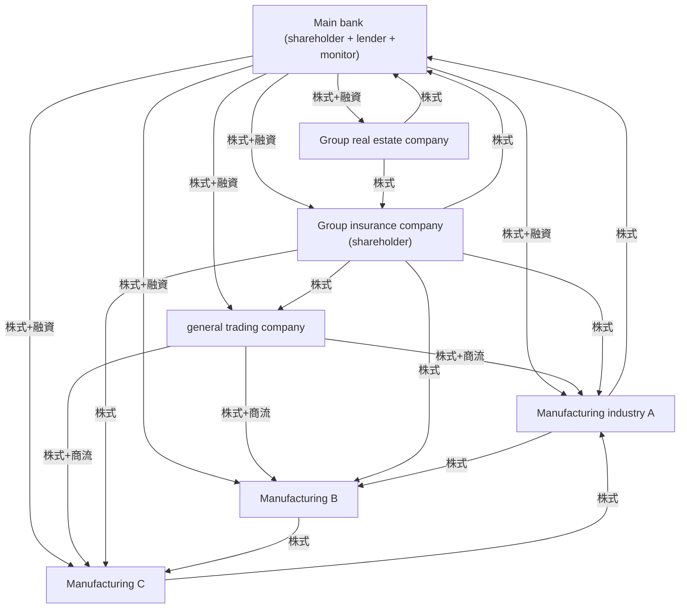

*Schematic diagram of cross-holding structure in horizontal series in the 1980s. Arrows indicate stock ownership relationships. The main bank played three roles simultaneously: shareholder, main lender, and de facto management monitor. *

## What did this system achieve and who did it prioritize?

This corporate governance emphasized long-term coordination of stakeholders surrounding the company rather than maximizing shareholder returns. It was easy to share information within the corporate group, and the main bank was able to provide support and start restructuring at an early stage of business deterioration. Lifetime employment has also become a basis for investing in company-specific skills, with the assumption that employees will work for a company for a long time.

On the other hand, profits and surplus funds were prioritized for stable interest payments to lenders, employment and wages for employees, and long-term relationships with business partners. Dividends to shareholders and return on equity came after that. As a result, there was less pressure to increase ROE, and a structure was created that made it easier for management to distance themselves from dispersed general shareholders.

> **Column - Complete the auditor system in one step.** Corporate auditors are statutory bodies that audit the execution of duties by directors, attend board meetings, and report to shareholders. However, they cannot participate in resolutions of the Board of Directors, appoint or dismiss executive officers, or decide on management strategies. In practice, there were many cases in which former internal executives or people from the main bank were appointed as auditors. Although the 2001 amendments to the Commercial Code stipulated that more than half of corporate auditors be outside corporate auditors and that their terms of office be four years, the authority structure that differs from that of directors continues to this day.

## Gradual demolition, 1990-2014

After the stock price peaked at the end of 1989, the five mechanisms did not disappear all at once, but gradually weakened through three trends.

**First wave - Bank capital deterioration (1990-2003).** The decline in land prices and stock prices forced banks to dispose of non-performing loans and rebuild their capital. The sale of stock holdings progressed, and cross-holdings among affiliated companies fell from about 25% in 1981 to about 20% in 1999. Banks' holdings in listed stocks decreased from over 20% in the 1980s to less than 5% in 2014. The influence that banks had as shareholders and their ability to supervise management were simultaneously weakened.

**Second wave - accounting and legal system reforms (1997-2008).** Mark-to-market valuation was introduced for cross-shareholdings in fiscal 2001, making it easier to show the risk of price fluctuations associated with holdings in financial statements. The 2001 amendment to the Commercial Code strengthened the auditor system, and the 2002 amendment (enacted in April 2003) made it possible to choose a “company with committees,” which has nomination, audit, and compensation committees. However, its adoption has been slow, and as of the end of 2016, only about 70 of the approximately 3,800 listed companies had adopted it. The internal control reporting system based on the Financial Instruments and Exchange Act, so-called **J-SOX**, was applied from fiscal years beginning on or after April 1, 2008.

**Third wave - increase in foreign investors (2003-2014).** Foreign ownership of stocks listed on the Tokyo Stock Exchange rose from a low level in the 1980s to approximately 30% in 2014. While banks sold their shares, foreign investors began exercising their voting rights, participating in shareholder meetings, and questioning profitability and board independence. It was in 2017 that the ratio of cross-shareholdings fell below 10% of the total on the TSE.

By arranging the numbers, you can see the direction of change.

|indicators|1988 peak|2014 (before Stewardship Code)|
| --- | --- | --- |
|Cross-holding ratio (compared to TSE market capitalization)|**More than 50%**|Approximately 15% (and decreasing)|
|Bank ownership ratio of listed stocks|**More than 20%**|**Less than 5%**|
|Foreign ownership ratio of TSE-listed stocks|Very little|**About 30%**|
|Companies in the TOPIX500 that have one or more independent outside directors| n/a |**Approx. 22%**|
|Listed companies that are “conscious of the cost of capital”| n/a |**About 40%**|
|Listed companies disclosing cost of capital| n/a |**Less than 10%**|

## Monitoring gap

The problem is that after the old system weakened, no entity quickly emerged to take over its role. The main bank has reduced its shareholding and has withdrawn its involvement in management. However, the number of independent outside directors is still small; as of 2013, only about 22% of TOPIX 500 companies had appointed at least one director. Even though domestic institutional investors own stocks, the practice of actively engaging in dialogue with investee companies has not been sufficiently developed. Foreign investors sought dialogue, but there was no system in place to support this role within Japan.

The Ito report stated that the typical tenure of a CEO at the time was **4 to 6 years**, and found it problematic that the timing of replacement was more likely to be decided based on seniority rather than performance. With a board of directors made up mostly of internal employees, auditors who do not have the right to elect or dismiss directors, and a shareholder structure with many stable shareholders, it has been difficult to create a system for replacing top management based on performance, except in cases of serious misconduct.

> "Until the early 2010s, corporate governance in Japan was a system in which the oversight function was carried out by one institution - the main bank. However, that institution had largely withdrawn from that role, and no other actor was authorized to take its place."
> ―Curtis Milhaupt, *On the (Fleeting) Existence of the Main Bank System and Other Japanese Economic Institutions* (Columbia University School of Law)

The reforms since 2013 can be seen as institutional improvements to fill this void. The 2014 Stewardship Code required institutional investors to engage in constructive dialogue with the companies in which they invest. The 2015 Corporate Governance Code required the board of directors of listed companies to appoint independent outside directors. The Ito Report provided a common language for discussing capital cost and capital efficiency. GPIF took on the role of disseminating these ideas into practice through its investment managers.

## From main bank to GPIF

The responsibility for management supervision did not immediately shift from the main bank to institutional investors. In between, there was a gap of about 15 years.

**Main bank (1950s-1990s).** In addition to being the primary lender, the bank also held approximately 3-5% of the equity in the investee companies and met regularly with management. Although they did not have legal veto power, they exerted significant influence over important business decisions through loans, stock ownership, and position within the corporate group.

**Interregnum (1990-2014).** Banks have reduced their equity holdings and loans, and have prioritized recovery and exit from non-performing debtors rather than long-term commitments. The appointment of independent outside directors has not yet become widespread, and dialogue with domestic institutional investors has been limited. Although foreign investors exercised their voting rights through overseas custodians, there were insufficient domestic systems to support continued lobbying of Japanese companies.

**GPIF and outsourced asset managers (2014-present).** GPIF announced its acceptance of the Japanese version of the Stewardship Code on May 30, 2014. Hiromichi Mizuno was appointed CIO in January 2015 and served until March 2020. GPIF outsources its domestic stocks to external management companies, so its efforts to reach out to companies are carried out through the outsourced management companies. GPIF's mechanism for assessing the stewardship activities of fiduciaries has provided a strong incentive to change dialogue and voting across the investment industry. By 2024, GPIF’s assets under management exceeded 240 trillion yen, an increase of 109 trillion yen since 2014.

The main banks of the 1980s and the institutional investors of the 2020s are very different in terms of organization and authority. Still, they all play a common role in continuing to ask, from outside the management team, “Are we making full use of the capital entrusted to us?”

## Three structures that still remain

The pre-reform system has not completely disappeared. The following three factors will also affect IR practices in 2026.

1. **Cross-held shares remain.** Although the market as a whole has shrunk, cross-shareholdings are still concentrated in insurance companies, megabanks, trading companies, etc. The 2021 Corporate Governance Code revision requires verification of the appropriateness of holding each individual stock and disclosure of the details.
2. **The majority are companies with a board of auditors.** As of 2024, the majority of listed companies will not be companies with an audit and supervisory committee or companies with a nominating committee, etc., but companies with a board of auditors. In dialogue with foreign investors, it is necessary to explain the difference in authority between auditors and directors and the reasons for choosing the current institutional design.
3. **The practice of emphasizing internal promotion and seniority continues.** Although lifetime employment itself is changing, there is still a strong tendency to select director candidates from within the company. The pool of outside director candidates is not wide enough, and there are only a limited number of cases in which management personnel move between different industries.

These issues will be revisited in themes 4 and 5, which deal with cross-shareholdings, listed subsidiaries, and board diversity.

## Implications that IR personnel should keep in mind

1. **Look at shareholder composition over time.** If the holding ratio of domestic financial institutions or business partner companies is high, check whether the holding constitutes cross-shareholdings and how it will affect the tradable-share ratio when sold.
2. **Be able to explain the performance of management supervision.** List cases where management was replaced for business performance or strategic reasons, cases where the board of directors revised or rejected important matters, and the role played by independent outside directors.
3. **Explain the auditor system accurately in English.** The official name is the "Audit & Supervisory Board," and auditors do not have voting rights on board resolutions. Be able to explain this difference in one sentence.
4. **Cross-shareholdings are explained for each stock.** “Maintaining business relationships” alone is not enough. Compare the benefits, risks, and cost of capital of holding the shares, and concretely show the reduction policy.
5. **Follow trends in foreign ownership ratio.** As the foreign ownership ratio increases, the issues raised in dialogue will change, such as capital efficiency, board independence, and cross-shareholdings. Manage based on long-term trends rather than single-year numbers.

## Source/reference materials

- Curtis J. Milhaupt, *On the (Fleeting) Existence of the Main Bank System and Other Japanese Economic Institutions*(Columbia University School of Law / SSRN, English version):https://papers.ssrn.com/sol3/papers.cfm?abstract_id=290283
- Hideki Kanda, *Japan's Audit & Supervisory Board Member System* (Japan Audit & Supervisory Board Members Association, August 2021, English version): https://www.kansa.or.jp/wp-content/uploads/2021/10/Japans-Audit-Supervisory-Board-Member-System.pdf
- Federal Reserve Bank of San Francisco "Japan's Cross-Shareholding Legacy" (August 2009, English version): https://www.frbsf.org/wp-content/uploads/August-2009-Japans-Cross-Shareholding-Legacy-the-Financial-Impact-on-Banks-august-09-FINAL.pdf
- Nomura Capital Markets Research Institute "Corporate Governance and Reform of Japan's Commercial Code" (2002, English version): https://www.nicmr.com/nicmr/english/report/repo/2002/2002sum01.pdf
- Financial Services Agency “Financial Instruments and Exchange Act” overview: https://www.fsa.go.jp/policy/fiel/index.html
- Ministry of Economy, Trade and Industry “Ito Report” (August 2014, Japanese version portal): https://www.meti.go.jp/policy/economy/keiei_innovation/kigyoukaikei/itoreport.html
- GPIF “About accepting the Japanese version of the Stewardship Code”: https://www.gpif.go.jp/investment/pdf/adoption_Japans_stewardship_code.pdf

---

**Previous article on this theme:** [1.1 Why "ROE 8%" became the standard for reform](/governance/foundations/1.1-lost-decades-roe-gap/)

**Next article on this theme:** [1.3 Why governance reform was incorporated into the growth strategy](/governance/foundations/1.3-abenomics-third-arrow/)

**Related articles on other themes:**
- [5.2 Final stage of cross-shareholdings - Verification and disclosure for each stock](/governance/frontier/5.2-cross-shareholdings-end-game/)
- [5.3 What the privatization of Toyota Industries showed: group reorganization of listed companies and protection of minority shareholders](/governance/frontier/5.3-listed-subsidiaries/)
- [2.5 Codes and guidelines: Their different roles and uses](/governance/cg-code/2.5-meti-guideline-family/)

---

## Why governance reform was included in the growth strategy

**SOURCE URL:** https://jpinv.com/governance/foundations/1.3-abenomics-third-arrow/

**記事要約**

The Japan Revitalization Strategy - JAPAN is BACK, approved by the Cabinet on June 14, 2013, positioned corporate governance reform not only as a matter of corporate legal affairs, but as a policy to enhance the growth potential of the Japanese economy. In this paper, we will summarize the circumstances that led to the Stewardship Code, the revised Companies Act, the Ito Report, and the Corporate Governance Code taking shape in a short period of time in response to this cabinet decision.

**本文**

> **Summary**
> - Shinzo Abe became Prime Minister on December 26, 2012, and established the Japan Economic Revitalization Headquarters and the Industrial Competitiveness Council to consider growth strategies.
> - The “third arrow” of Abenomics was materialized as “Japan Revitalization Strategy - JAPAN is BACK” on June 14, 2013. The strategy incorporated corporate governance reform into policies to increase the competitiveness and productivity of Japanese companies.
> - Starting from this policy, the 2014 Stewardship Code and Ito Report, the revision of the Companies Act, and the 2015 Corporate Governance Code were successively implemented.

## Political situation in December 2012

The Liberal Democratic Party returned to power in the December 2012 general election, and Shinzo Abe became Prime Minister for the second time. The administration had a stable seat in the House of Representatives, a Bank of Japan that was turning to aggressive monetary easing, and a clear awareness that Japan's economy could not be revived with conventional gradual policy measures.

This economic policy was later called **Abenomics**. Monetary policy, fiscal policy, and growth strategy are illustrated as “three arrows,” likened to the story of Motonari Mori.

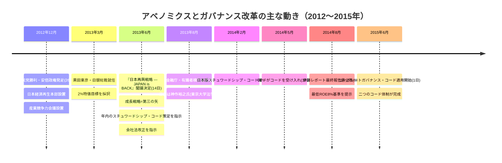

The roles of the three arrows can be summarized as follows.

|arrow|Content|Supervising agency|
| --- | --- | --- |
|First: Bold monetary policy|2% price target; quantitative and qualitative monetary easing; expansion of asset purchases|Bank of Japan (Kuroda)|
|Second: Flexible fiscal policy|supplementary budget; emergency economic measures|Ministry of Finance|
|Third: Growth strategy (structural reform)|Labor market deregulation; special zones; **corporate governance**; agricultural reform; TPP participation|Cabinet Office/Japan Economic Revitalization Headquarters|

While the first and second arrows were mainly policies to support demand, the third arrow is structural reform to increase supply capacity and productivity. With corporate governance clearly specified in this document, corporate governance has become a policy issue related to the growth potential of the Japanese economy, rather than just legal matters and preventing scandals.

## June 14, 2013 “Japan Revitalization Strategy”

“Japan Revitalization Strategy - JAPAN is BACK” was approved by the Cabinet on June 14, 2013. In addition to the main text, materials showing outcome indicators and processes were prepared, and deadlines were set for each policy with the responsible ministries and agencies. The substantive study was carried out by the Industrial Competitiveness Council, chaired by the prime minister and attended by cabinet ministers and members of the private sector.

Regarding governance reform, the strategy outlines the following four main points.

1. **Compile the Japanese version of the Stewardship Code within 2013.** The Financial Services Agency was in charge, and a short deadline of about six months was set after the Cabinet decision.
2. **Revise the Companies Act and require listed companies that do not appoint outside directors to explain their reasons.** The idea is to expose the decision not to appoint outside directors to market scrutiny due to the legal "obligation to explain."
3. **Considering the desired relationship between companies and investors.** Proceeded as a project of the Ministry of Economy, Trade and Industry and led to the Ito report in August 2014.
4. **Establish a corporate governance code.** The specific policies and deadlines were clarified in the revised version of the Japan Revitalization Strategy in June 2014.

British experience was consulted in the system design. In the UK, the Stewardship Code was introduced in 2010, and the 2012 Kay Review recommended that institutional investors should take responsibility for the long-term value creation of companies. Japan adopted this principle-based and "comply-or-explain" concept to suit its own market structure.

> “Principles for institutional investors to fulfill their fiduciary responsibilities by promoting medium- to long-term growth of companies through dialogue, etc.”
> - Description of the Japanese version of the Stewardship Code in the “Japan Revitalization Strategy”

## Why was governance positioned as growth policy?

Until then, corporate governance was thought to be primarily the domain of the Ministry of Justice, which has jurisdiction over the Companies Act, and the Financial Services Agency, which has jurisdiction over the Financial Instruments and Exchange Act. The Abe administration treated this as part of its growth strategy, along with monetary and fiscal policies. There were two ideas behind this.

**First, the idea is that improving capital efficiency increases the productivity of the economy as a whole.** If Japanese companies hold large amounts of capital at lower rates of return than foreign companies, there is ample scope for improving capital allocation. McKinsey's comparison of ROIC of approximately 8% in Japan, approximately 21% in the United States, and approximately 15% in Europe clearly demonstrates that improvements in corporate governance and capital allocation can lead to economic growth.

**Secondly, the idea is that not only companies but also investors' behavior needs to change.** Even if laws are amended, corporate behavior is unlikely to change unless shareholders engage in dialogue with management and continue to question capital allocation and the effectiveness of boards of directors. The UK's Stewardship Code provided an example of a system that positioned institutional investor dialogue as part of their fiduciary responsibility.

By combining the two, governance reform becomes not just a technical theory of corporate law, but a policy that increases corporate productivity and competitiveness. That is why the matter was not left solely to the relevant ministries, but instead was handled as a matter with the Prime Minister's Office setting a deadline and direction.

> **Column - Why did the Industrial Competitiveness Council play a central role?** In addition to ministers, business executives and experts participated in the Industrial Competitiveness Council. It is important that this was a forum where governance reform could be discussed not as an area of financial regulation, but as a policy to increase industrial competitiveness. The direction was set here, and the Financial Services Agency, Ministry of Economy, Trade and Industry, Ministry of Justice, and TSE incorporated it into their respective systems.

## Short-term battle of 6 to 18 months

The deadline set forth in the Japan Revitalization Strategy was extremely short for Japan's institutional reforms. The main movements are as follows.

- **August 2013** --- The Financial Services Agency establishes the "Expert Study Group on the Japanese Stewardship Code." The chairperson was Hiroyuki Kamisaku. The 17 members included stakeholders such as asset management companies, asset owners, voting advisory companies, relevant ministries and agencies, and the Tokyo Stock Exchange.
- **August 2013 to February 2014** --- Study meetings held 6 times. Public comments received 26 in Japanese and 19 in English.
- **February 26, 2014** -- The Japanese version of the Stewardship Code has been finalized.
- **May 30, 2014** -- GPIF announced acceptance of the code.
- **June 2014** -- The revised Companies Act was enacted, introducing a system that requires certain companies that do not have outside directors to explain the reasons for doing so.
- **June 24, 2014** -- The revised "Japan Revitalization Strategy" was approved by the Cabinet, and the policy to formulate the corporate governance code on a "comply or explain" basis was clearly stated.
- **August 6, 2014** -- The Ministry of Economy, Trade and Industry releases the Ito Report, suggesting "ROE of above 8% or more."
- **March 2015** -- The Financial Services Agency and Tokyo Stock Exchange's expert meeting published the draft Corporate Governance Code.
- **June 1, 2015** - Started applying the Corporate Governance Code.

In about 18 months, the principles of conduct for investors, the principles of conduct for listed companies, and the accountability obligations under the Companies Act regarding outside directors were completed. This is exceptionally fast, even compared to the 2001 corporate auditor system reform and the 2002 introduction of a company with committees, which required several years of consideration. This speed was supported by the cabinet decision specifying the responsible agency and deadline.

## Issues not included in the 2013 strategy

Although the “Japan Revitalization Strategy” set out a direction for reform, it did not include all of the current systems. The main unfinished matters that will lead to later reforms are as follows.

- **Standards for number of independent outside directors.** What we requested at the time was an explanation of the reasons for not appointing outside directors. Specific standards for independence and multiple appointment were strengthened in the 2015 Code and the 2018 and 2021 amendments.
- **tradable-share ratio.** Reforms linking market segments and shareholder structure will wait until the Prime Standard Growth restructuring in 2022.
- **Cost of capital disclosure.** The Ito Report showed awareness of the issue, the 2018 code revision clarified the cost of capital, and the March 2023 TSE request materialized continuous analysis, disclosure, and implementation.
- **Disclosure in English.** Simultaneous disclosure of important information on the prime market in Japanese and English became mandatory in April 2025.
- **Sustainability disclosure.** The revised Stewardship Code in 2020, the Corporate Governance Code in 2021, and the SSBJ Standards were developed in stages.

Although the later systems were established as separate documents, the basic idea of treating corporate governance as a growth policy continues from the 2013 Japan Revitalization Strategy.

## What the “Japan Revitalization Strategy” has left behind

The Japan Revitalization Strategy itself did not write the provisions of the code, nor did it decide on the numerical standards for ROE. Its role was to position corporate governance as a growth issue for Japan's economy, request relevant organizations to take concrete action, and set deadlines.

Increasing the productivity and competitiveness of Japanese companies will require changes in capital allocation and corporate governance. The Financial Services Agency, TSE, Ministry of Economy, Trade and Industry, and Ministry of Justice will promote reform through their respective systems. Once this policy was announced as a cabinet decision, subsequent codes, guidelines, and disclosure systems began to move forward.

## Implications that IR personnel should keep in mind

1. **When explaining the starting point of the reform, remember June 14, 2013.** When foreign investors ask, "Why did Japan's reforms accelerate from around 2014?", the most concise answer is "Japan Revitalization Strategy."
2. **Explain governance as a growth strategy.** Enhancing the composition of the board of directors and disclosure is not a formal system response, but is positioned as an initiative that will lead to improvements in capital allocation, productivity, and corporate value.
3. **Accurately understand the responsible agency.** The Stewardship Code is handled by the Financial Services Agency, the Corporate Governance Code is handled by the Financial Services Agency and the Tokyo Stock Exchange, the Ito Report and Corporate Governance Practical Guidelines are handled by the Ministry of Economy, Trade and Industry, the Companies Act is handled by the Ministry of Justice, the Listing Regulations are handled by the Tokyo Stock Exchange, and the Sustainability Disclosure Standards are handled by the SSBJ.
4. **Overlap your company's response in chronological order of system revisions.** If you organize what changes your company made and when, such as the first appointment of an independent outside director, the start of cost of capital disclosure, and the publication of a skills matrix, it will be easier to explain the progress of reforms in dialogue with investors.
5. **Read councils and government policies as leading indicators.** The trend of broad directions being expressed in government documents, concreted in codes and guidelines, and established through disclosure is being repeated in current reforms.

## Source/reference materials

- Cabinet Secretariat "Japan Revitalization Strategy - JAPAN is BACK" (June 14, 2013, documents, Japanese): https://www.cas.go.jp/jp/seisaku/seicho/kettei.html
- Cabinet Secretariat (Prime Minister's Office) "Three Arrows of Abenomics" Summary PDF (English version): https://japan.kantei.go.jp/letters/message/abenomics/TheThreeArrowsOfAbenomics_EN.pdf
- Cabinet Secretariat “About growth strategies to date” (Japanese): https://www.cas.go.jp/jp/seisaku/seicho/kettei.html
- Cabinet Office Economic and Fiscal Policy Council Reform Working Group: https://www5.cao.go.jp/keizai-shimon/kaigi/special/reform/wg1/index.html
- Financial Services Agency “Expert Study Group on Stewardship Code” (List of study groups): https://www.fsa.go.jp/singi/stewardship/index.html
- Financial Services Agency “Japanese Stewardship Code” 2014 edition main text: https://www.fsa.go.jp/news/25/singi/20140227-2/04.pdf
- Ministry of Economy, Trade and Industry “Ito Report” (August 2014, Japanese version portal): https://www.meti.go.jp/policy/economy/keiei_innovation/kigyoukaikei/itoreport.html

---

**Previous article on this topic:** [1.2 Who filled the void after the main bank](/governance/foundations/1.2-pre-reform-architecture/)

**Next article on this theme:** [1.4 Stewardship Code that changed the investor side (2014/2017/2020/2025)](/governance/foundations/1.4-stewardship-code-2014/)

**Related articles on other themes:**
- [2.1 2015 Corporate Governance Code - Basics of “comply or explain”](/governance/cg-code/2.1-cg-code-2015-primer/)
- [2.5 Codes and guidelines: Their different roles and uses](/governance/cg-code/2.5-meti-guideline-family/)
- [5.8 Tracking the next reforms: Governance councils and study groups](/governance/frontier/5.8-working-groups-landscape/)

---

## How the Stewardship Code changed investors (2014/2017/2020/2025)

**SOURCE URL:** https://jpinv.com/governance/foundations/1.4-stewardship-code-2014/

**記事要約**

The Japanese version of the Stewardship Code is a set of principles that requires institutional investors to deeply understand the companies in which they invest and encourage medium- to long-term improvements in corporate value through constructive dialogue and the exercise of voting rights. This article traces the process from its formulation in 2014 to its three revisions in 2017, 2020, and 2025, and summarizes how the responsibilities expected of investors have expanded.

**本文**

> **Summary**
> - The Japanese version of the Stewardship Code was compiled by the Financial Services Agency's Expert Committee chaired by Hiroyuki Kamisaku and finalized on February 26, 2014. Initially, it consisted of seven principles and was operated on a comply-or-explain basis.
> - The **2017 revision** strengthened the responsibilities of the management team of management companies, the supervision of management companies by asset owners, and the publication of voting results for individual companies and proposals.
> - The **2020 revision** added Principle 8 to consider sustainability, application to assets other than stocks, and service providers, and the **2025 revision** clarified the position of collaborative engagement.

## Role played by two codes

The Financial Services Agency has described the Stewardship Code and the Corporate Governance Code as the “two wheels” of governance reform. The former covers the behavior of institutional investors, and the latter covers the behavior of listed companies. Even if companies disclose sufficient information and the board of directors has effective oversight, dialogue will not deepen if shareholders only formally exercise their voting rights. On the other hand, even if investors actively engage in dialogue, reforms will be difficult to advance if companies do not have a mechanism to ensure accountability.

The Japanese version of the Stewardship Code was finalized approximately 16 months earlier than the Corporate Governance Code. There is also significance in the order in which the responsibility for dialogue is placed first on the investors side, and then principles are established for dealing with the listed companies. The Corporate Governance Code is covered in detail in [Theme 2.1](/governance/cg-code/2.1-cg-code-2015-primer/).

## Formulated in 2014

In August 2013, the Financial Services Agency established the “Expert Study Group on the Japanese Stewardship Code.” The meeting was chaired by Professor Hiroyuki Kamisaku of the Graduate School of Law and Politics, the University of Tokyo, and 17 people participated from asset management companies, asset owners, voting advisory companies, related ministries and agencies, the Tokyo Stock Exchange, and others.

The review meeting was held six times from August 2013 to February 2014. The code was finalized on February 26, 2014, based on 26 public comments in Japanese and 19 in English.

The Code defines stewardship responsibilities as follows:

> "Stewardship responsibility" refers to the responsibility of institutional investors to increase medium- to long-term investment returns for customers and beneficiaries (including ultimate beneficiaries; hereinafter the same applies) by promoting the improvement of the corporate value of the company concerned and its sustainable growth through constructive "purposeful dialogue" (dialogue) based on a deep understanding of the investee company and its business environment, as well as consideration of sustainability according to the investment strategy.

The following three points are important in this definition.

1. **The objective is medium- to long-term investment returns.** This approach does not only deal with short-term stock price fluctuations or individual shareholder meeting proposals.
2. **Dialogue is not a voluntary public relations activity.** Institutional investors are positioned as a responsibility to fulfill in order to increase the corporate value of investee companies and the interests of customers and beneficiaries.
3. **Dialogue requires a deep understanding of the company and its business environment.** In addition to applying uniform standards for exercising voting rights, investors are expected to make judgments based on an understanding of the company’s strategy, capital allocation and risks.

## Original 7 principles

The 2014 edition consists of seven principles and guidelines that embody each principle.

1. **Publication of policies** -- Develop and publish clear policies to fulfill stewardship responsibilities.
2. **Management of conflicts of interest** --- Identify conflicts of interest that should be managed and publish the management policy.
3. **Understanding the situation of investee companies** --- Accurately understand the issues facing sustainable growth.
4. **Purposeful dialogue** ---Share understanding with investee companies and strive to improve problems.
5. **Disclosure of voting policy and results** --- Make decisions that contribute to the sustainable growth of the company, without relying solely on formal criteria.
6. **Reporting to customers/beneficiaries** --- Regularly report on activities including the exercise of voting rights.
7. **Development of capabilities and systems** --- Equipped with the knowledge, human resources, and organization to understand the company and business environment and make appropriate decisions.

GPIF announced its acceptance of the code on May 30, 2014. The number of accepting institutions rose from 127 in mid-2015, 214 in December 2016, and 281 in May 2020 to **333** as of December 31, 2024.

> **Column - What is "comply or explain"?** The signatory institution will implement each principle or, if not, explain why. Although there is no immediate penalty for not implementing such measures, the validity of explanations will be evaluated by customers, beneficiaries, investee companies, and the market. It is not a uniform rule, but a system that allows each institution to implement methods according to its operational policy and scale while adhering to the principles.

## What did Japan adopt from the UK framework, and what did it change?

The direct reference for the Japanese version was the UK's 2010 Stewardship Code. The basic structure of the seven principles followed the British version, but the method of announcing jurisdiction and accepting organizations was designed to match the Japanese system.

|selection|UK Stewardship Code|Japan Stewardship Code|
| --- | --- | --- |
|Jurisdiction|Financial Reporting Council (FRC, independent regulator)|**Financial Services Agency** (Financial regulatory authority)|
|Assessment of signatory institutions|Tier list (after 2020: Tier 1 / Tier 2)|**Single public list**|
|Voting advisory company|Compatible with separate procedures at ESMA level|**From 2020 onwards, within the scope of the Code** (Principle 8)|
|Asset owner accountability|Mentioned but not central|**Emphasis since 2017 revision**|

With the Financial Services Agency in charge, the code is now more closely linked to financial administration and the supervision of asset management companies. On the other hand, the fact that accepting institutions are listed on a single public list without ranking them in terms of their merits or demerits reflects the public-facing approach adopted by the Japanese government.

Additionally, in Japan, many asset owners, including GPIF, outsource the actual management of their assets to external management companies. For this reason, it has become important for asset owners to clarify what they expect from their clients and how to evaluate them in order for the entire investment chain to function properly. The reason why service providers such as proxy voting advisory companies are included in the scope of the code is to ensure that entities that influence investment decisions are not left out of the chain.

## What has changed in the three revisions since its formulation?

|point of view|2014 (original version)|2017 (first revision)|2020 (second revision)|2025 (Third revision)|
| --- | --- | --- | --- | --- |
|number of principles| **7**| 7 |**8** |8 (Guidelines revised)|
|New principles| ― | ― |**Principle 8: Service provider** (proxy voting advisory firm, pension consultant)| ― |
|Voting rights disclosure|Assuming disclosure on a summary basis|**Promote publication of voting results for each individual company/proposal**|Reconfirmation/enhancement|Reconfirmation|
|Sustainability/ESG|Not specified|Added reference to material ESG factors|Clarify “sustainability (medium- to long-term sustainability including ESG factors)” in the definition of stewardship responsibilities|Inheriting the positioning of 2020|
|Target asset class|Japanese listed stocks|Japanese listed stocks|**Clarified that it is applicable to assets other than stocks such as bonds**|Inherited 2020 range|
|Asset owner accountability|Mentioned|**Strengthening expectations and supervision of subcontractors**|Further clarification|continuation|
|collaborative engagement|No special indication|No special indication|practical options|**Clarified positioning as a powerful dialogue method**|
|Confirmed date|February 26, 2014|May 29, 2017|March 24, 2020|June 26, 2025|
|Compliance deadline| ― |End of November 2017|End of September 2020|Estimated end of 2025|

### What changed in the 2017 revision?

The 2017 revision was finalized on **May 29, 2017** based on 18 Japanese and 11 English opinions.

There are three main changes.

1. **The responsibilities of the management company's management team were clarified.** Instead of leaving stewardship activities to the responsible department alone, management was asked to take responsibility for human resources, organization, and conflict of interest management.
2. **More detailed publication of voting results.** The revision called for disclosure by investee company and resolution, rather than only aggregate counts of votes for and against.
3. **Strengthened supervision of asset management companies by asset owners.** Asset owners were asked to specify the activities expected of their appointed managers and assess how those activities were carried out. GPIF reflected this idea in its evaluation of asset managers.

### What has changed in the 2020 revision?

In the second revision on **March 24, 2020**, the definition of stewardship responsibilities clearly includes consideration of sustainability according to operational strategy. ESG is no longer an incidental topic of dialogue, but has become a factor that influences corporate value and investment returns and must be considered in accordance with investment policy.

At the same time, the code no longer has only Japanese listed stocks in mind. It has been shown that institutional investors who hold other assets such as bonds can also apply if they are able to carry out activities consistent with the purpose of the Code. Additionally, **Principle 8** has been newly established, targeting service providers that support the investment chain, such as proxy voting advisory firms and pension consultants.

Signatory institutions were expected to update their published information in line with the revised content by the end of September 2020. The Financial Services Agency has also released a hidden version showing changes from the 2017 version: https://www.fsa.go.jp/news/r1/singi/20200324/02.pdf

### What has changed in the 2025 revision?

The third revision was finalized on **June 26, 2025**. One of the central points of discussion was **Collaborative Engagement**, in which multiple institutional investors work together to engage in dialogue with companies on common issues. While demonstrating that collaborative engagement can be a powerful means of fulfilling stewardship responsibilities, it was confirmed that each investor remains responsible for making their own decisions and managing conflicts of interest.

Details of the third revision are covered in [Theme 5.7](/governance/frontier/5.7-activism-engagement-2025/).

> "The growth and competitiveness of Japan's listed companies depends on two codes working in parallel: the Stewardship Code, which governs institutional investors, and the Corporate Governance Code, which governs listed companies. Both codes are the wheels of the wheel of capital market reform."
> - Continuing position statement of the Financial Services Agency's "Stewardship Code and Corporate Governance Code Follow-up Meeting" (translation)

## A mechanism to turn arbitrary acceptance into effective discipline

The Corporate Governance Code applies to companies listed on the Tokyo Stock Exchange. On the other hand, acceptance of the Stewardship Code is voluntary for institutional investors. However, the reason why it has become so widespread is because of the following mechanism.

1. **Publication of the list of accepting institutions.** The Financial Services Agency will announce the institutions that have announced acceptance of the code. If a management company or pension fund of a certain size is not listed, customers or beneficiaries will ask why.
2. **Contractor evaluation by asset owner.** Asset owners such as GPIF will incorporate stewardship activities into the selection and evaluation of management companies. In order to be entrusted with large funds, the quality of not only the acceptance of the code but also the actual dialogue and exercise of voting rights are tested.
3. **Ongoing verification by the Financial Services Agency.** Follow-up meetings and code revision review groups will address issues such as conflicts of interest, voting, and collaborative engagement, and update expectations.

Rather than imposing a uniform legal obligation, the principles-based framework combines public announcements of acceptance, explanations to clients and beneficiaries, evaluation of appointed managers and market scrutiny.

## Implications that IR personnel should keep in mind

1. **Verify that major shareholders have accepted the code.** List the acceptance status of top shareholders, stewardship policy, and important dialogue items. It becomes easier to understand the priorities of the dialogue and the background of the questions.
2. **Read activity reports and voting results of major asset management companies.** Each company publishes its policies, activity reports, and voting results for each individual company and proposal. Judgments about the company and comparisons with other companies in the same industry may be expressed.
3. **Prepare for the revised 2020 Sustainability Dialogue.** Be able to explain how climate, human rights, human capital, etc. affect corporate value and align with disclosures including SSBJ standards.
4. **Explain the differences between revision years to the board of directors.** Based on the 2014 version only, an issuer would miss the 2017 asset-owner responsibilities, the 2020 sustainability provisions and Principle 8, and 2025 collaborative engagement.
5. **Read the Financial Services Agency study committee materials in advance.** Pre-revision discussions reveal questions investors are likely to raise. Reflect the latest review status in explanatory materials to the board of directors and management committee.

## Source/reference materials

- Financial Services Agency “Principles for “Responsible Institutional Investors” “Japanese Stewardship Code” published (2014): https://www.fsa.go.jp/news/25/singi/20140227-2.html
- Financial Services Agency Japanese version of the Stewardship Code final text (February 2014, text PDF): https://www.fsa.go.jp/news/25/singi/20140227-2/04.pdf
- Financial Services Agency 2017 revised code released: https://www.fsa.go.jp/news/29/singi/20170529.html
- Financial Services Agency 2017 revised code text (PDF): https://www.fsa.go.jp/news/29/singi/20170529/01.pdf
- Financial Services Agency “Concerning the finalization of the “Japanese Stewardship Code” (revised version)” (March 24, 2020): https://www.fsa.go.jp/news/r1/singi/20200324.html
- Financial Services Agency 2020 revised code text (PDF): https://www.fsa.go.jp/news/r1/singi/20200324/01.pdf
- Financial Services Agency 2020 revised version code (with blackout): https://www.fsa.go.jp/news/r1/singi/20200324/02.pdf
- Finalization of the third revised version of the Financial Services Agency's "Japanese Stewardship Code" (June 26, 2025): https://www.fsa.go.jp/news/r6/singi/20250626.html
- Financial Services Agency “Expert Study Group on Stewardship Code”: https://www.fsa.go.jp/singi/stewardship/index.html
- Financial Services Agency “Stewardship Code and Corporate Governance Code Follow-up Meeting”: https://www.fsa.go.jp/singi/follow-up/index.html
- GPIF “About accepting the Japanese version of the Stewardship Code”: https://www.gpif.go.jp/investment/pdf/adoption_Japans_stewardship_code.pdf
- GPIF “2024–2025 Stewardship Activity Report”: https://www.gpif.go.jp/investment/Stewardship_Activities_Report_2024-2025.pdf

---

**Previous article on this theme:** [1.3 Why governance reform was incorporated into the growth strategy](/governance/foundations/1.3-abenomics-third-arrow/)

**Next article for this theme:** Theme 1 completed - Go to [Theme 2: The Age of Code](/governance/cg-code/) and start with [2.1 2015 Corporate Governance Code - The Basics of 'Comply or Explain'](/governance/cg-code/2.1-cg-code-2015-primer/).

**Related articles on other themes:**
- [2.1 2015 Corporate Governance Code - Basics of “comply or explain”](/governance/cg-code/2.1-cg-code-2015-primer/)
- [5.7 Collaborative engagement after the third revision of the Stewardship Code](/governance/frontier/5.7-activism-engagement-2025/)
- [5.5 SSBJ Standards in Practice - Key Points of Phased Application and Preparation](/governance/frontier/5.5-ssbj-sustainability/)
- [★ IR Toolbox - Primary materials necessary for governance practices organized by field](../../toolbox/ir-toolbox.j)

---

# テーマ2：code era

---

## 2015 Corporate Governance Code - The basics of “comply or explain”

**SOURCE URL:** https://jpinv.com/governance/cg-code/2.1-cg-code-2015-primer/

**記事要約**

The Corporate Governance Code, which went into effect in June 2015, sets out principles for listed companies regarding shareholder rights, information disclosure, board of directors' responsibilities, dialogue with shareholders, etc., and requires listed companies to explain the reasons for non-compliance. This article will summarize the structure of the 2015 edition, the five basic principles, and the concept of "comply or explain" from the perspective of IR practice.

**本文**

> **Key points**
> - Japan's first **Corporate Governance Code** was published on March 5, 2015, and became effective from June 1 of the same year. It is a principles-based soft law that is operated through the TSE's listing rules rather than laws.
> - The 2015 edition consisted of **5 basic principles, 30 principles, and 38 supplementary principles (73 items in total)**. Listed companies will implement each principle or, if not, explain why.
> - Principle 4.8 requires companies listed on the First and Second Sections of the Tokyo Stock Exchange to appoint **at least two independent outside directors**. This became an important standard for changing the Japanese board of directors, which used to be dominated by people from within the company.

## How the code was born

The 2015 Code is one of the corporate governance reforms positioned as the "third arrow" of Abenomics. The Japan Revitalization Strategy, revised in June 2014, set out a policy to formulate a corporate governance code in order to promote sustainable growth and increase corporate value over the medium to long term.

The aim was to increase the accountability and oversight of boards of directors and improve the capital efficiency of Japanese companies. In designing the system, rather than using American-style rules that uniformly prescribe detailed actions, a British-style approach was adopted that allows companies to explain their responses to principles while acknowledging the circumstances of each company.

It was formulated by the “Expert Council on the Formulation of the Corporate Governance Code,” a joint secretariat of the Financial Services Agency and the Tokyo Stock Exchange. The committee was chaired by Professor Kazuto Ikeo of Keio University, and the OECD also provided advice. The composition of the 12 members is as follows.

- Business world **4 people**
- Investor side **4 people**
- Legal researchers **1 person**
- Practicing lawyer **1 person**
- Accounting expert **1 person**
- Audit & Supervisory Board Association **1 person**

The structure was structured so that the opinions of investors were reflected in the same number of people, rather than biased only toward companies. The meeting began in August 2014, the draft was published in December 2014, solicited opinions, and the final draft was compiled in March 2015.

> **Column — Why adopt a principles-based approach?** If the same procedures were uniformly imposed on all listed companies with different industries, sizes, institutional designs, and shareholder compositions, red tape would likely increase. Therefore, the Code set out the principles of desirable corporate governance and adopted a principles-based approach in which each company chooses the implementation method according to its own circumstances. A company can remain within the Code’s framework without implementing a principle if it provides a reasonable explanation. The preamble to the Code states, “A principles-based approach will be adopted to enable effective corporate governance to be implemented in accordance with the circumstances of each company.”

## 5+30+38 structure

The 2015 Code consists of three tiers. The top level **Basic Principles** shows five ways of thinking that are common to listed companies. Below that, the **Principles** set out the responses required in each area, and the **Supplementary Principles** further specify disclosures and procedures.

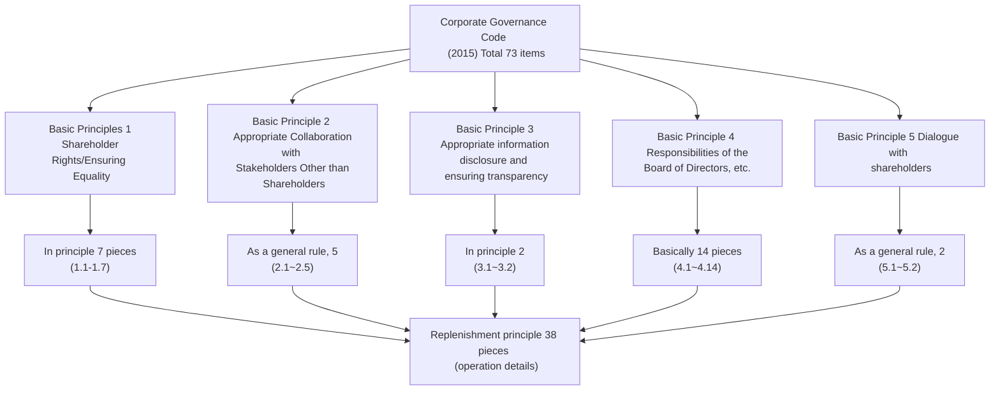

A sentence-by-sentence summary of the five basic principles is as follows:

| # |basic principles|Contents required of the board of directors|
| --- | --- | --- |
| 1 |Ensuring shareholder rights and equality|Protect the rights of shareholders, especially minority and foreign shareholders, and ensure substantive equality.|
| 2 |Appropriate collaboration with stakeholders other than shareholders|Respect the rights and positions of employees, customers, business partners, creditors, local communities, etc., and cooperate appropriately.|
| 3 |Ensuring appropriate information disclosure and transparency|In addition to the information required by law, we will disclose information that is useful for investment decisions in an accurate and easy-to-understand manner.|
| 4 |Responsibilities of the board of directors, etc.|Provide strategic direction, create an environment that supports appropriate risk-taking, and supervise management.|
| 5 |Dialogue with shareholders|Engage in constructive dialogue with shareholders even outside of general shareholders' meetings.|

In practice, the numbers assigned to principles and supplementary principles are important. For example, independent outside directors are placed in principle 4.8, and CEO succession planning is placed in supplementary principle 4.1.3. The corporate governance report also describes each company's response according to this number.

In 2015, all 73 items of companies listed on the First and Second Sections of the Tokyo Stock Exchange were subject to compliance or explain requirements. For companies listed on Mothers and JASDAQ, a simple application of only the five basic principles was allowed.

## What the 2015 Code Required

Basic Principle 5 stipulates the following regarding dialogue with shareholders.

> *"Listed companies should engage in constructive dialogue with shareholders outside of the general meeting of shareholders. In doing so, senior management and directors (including outside directors) should listen to the voices of shareholders through such dialogue, pay due attention to their interests and concerns, and..."*
> - Corporate Governance Code (2015 Edition) Basic Principle 5

This provision positioned dialogue with shareholders as the responsibility of management and the board of directors, rather than the sole responsibility of the IR department. Outside directors are also included in the dialogue, and investors' interests and concerns are required to be reflected in management.

Regarding the independence of the board of directors, Principle 4.8 indicates the specific number of board members.

> *"Listed companies should elect at least two or more independent outside directors...Irrespective of the above, listed companies that consider it necessary to elect at least one-third or more of independent outside directors, comprehensively considering the industry, size, business characteristics, organizational design, environment surrounding the company, etc., should disclose their policy for this purpose, regardless of the above."*
> - Corporate Governance Code (2015 Edition) Principle 4.8

The requirement for “two or more independent outside directors” became the starting point for systematically introducing outside perspectives into Japanese boards of directors, which were often composed only of internal directors.

## How Comply or Explain Works

The Code is not the Companies Act or the Financial Instruments and Exchange Act itself. It is applied through the TSE securities listing regulations and listing agreement. Each company's response will be disclosed in the **Corporate Governance Report** prescribed by the TSE. If there are any changes to important matters such as the composition of the board of directors or policies, the report will be updated from time to time.

For each principle, listed companies choose one of the following:

1. **Comply** - Explain how the principles are being implemented, along with specific systems, policies, and achievements.
2. **Explain the reasons for not implementing it** --- Explain why you chose a different method based on your company's circumstances and how that method will achieve the purpose of the principle.

Not implementing a Code principle does not, by itself, constitute a violation. What is important is the content of the explanation. Investors, proxy voting advisory firms, and exchanges evaluate whether explanations are specific, reasonable, and address the spirit of the principles. TSE's “Corporate Governance Information Service” allows you to search for each company's reports, making it possible to compare explanations of the same principles between companies.

> **Column - Code and company law are different things.** The Companies Act sets out legal minimum standards that companies must adhere to. The Corporate Governance Code is a soft law that requires listed companies to implement desirable corporate governance. Although failure to implement the Code itself does not directly lead to civil or criminal liability, failure to provide the necessary explanations could result in problems under listing rules. Furthermore, the quality of explanations has a direct impact on the exercise of voting rights and dialogue with investors.

## Applicability as of 2015

|Issuer classification (as of 2015)|Subject to Comply or Explain|
| --- | --- |
|TSE 1st section|Total 73 items (5 basic principles + 30 principles + 38 supplementary principles)|
|TSE 2nd section|Total 73 items|
|mothers|Basic principle 5 only|
| JASDAQ |Basic principle 5 only|

By applying all the principles to the first and second sections, and applying only the basic principles to emerging markets, we have struck a balance between the minimum standards required for listed companies and the burden commensurate with company size. The application relationship for each category will be reviewed in line with the market reorganization in April 2022.

## Implications for IR practice

1. **Use key principle numbers to explain.** Link the question to the relevant principle, such as supplementary principle 4.1.3 for CEO succession planning and principle 4.8 for independent outside directors. It becomes a common language both within the company and when communicating with investors.
2. **Regularly inspect the corporate governance report.** Confirm that there are no discrepancies in the description with IR materials and integrated reports, and that changes in the composition of the board of directors and committees are reflected.
3. **Write a detailed explanation of "implementation".** Investors cannot judge effectiveness just by saying that it is being implemented. Show the system, person in charge, frequency of meetings, and even the most recent results.
4. **If not implemented, provide reasons and alternatives.** Rather than simply stating that it is "under consideration," explain the current thinking, alternative methods that meet the purpose of the principle, and future prospects.
5. **Treat the report as a working document that will be updated.** This is not a document that is created only once a year. If there are any important changes, it will be updated as needed, and the latest version submitted to TSE will be the standard for external explanations.

## Source/reference materials

- Financial Services Agency - Expert Meeting on Corporate Governance Code: https://www.fsa.go.jp/singi/corporategovernance/index.html
- Financial Services Agency - Draft Corporate Governance Code (March 2015): https://www.fsa.go.jp/news/27/singi/20150305-1.html
- ECGI - English version text effective June 1, 2015 (English version): https://www.ecgi.global/sites/default/files/codes/documents/japan_cg_code_1jun15_en.pdf
- Japan Exchange Group - Corporate Governance: https://www.jpx.co.jp/equities/listing/cg/index.html
- Japan Exchange Group - Guidelines for writing a report on corporate governance: https://www.jpx.co.jp/equities/listing/cg/01.html
- Japan Exchange Group - Corporate Governance Information Service: https://www2.tse.or.jp/tseHpFront/CGK010010Action.do

## Related articles

**Next article on this theme:** 2.2 - 2018 revision - Turning point when cost of capital is clearly stated in the code

**Related articles on other themes:**
- 1.3 - [Why governance reform was included in the growth strategy](/governance/foundations/1.3-abenomics-third-arrow/)
- 1.4 - [Stewardship Code that changed the investor side (2014/2017/2020/2025)](/governance/foundations/1.4-stewardship-code-2014/)
- 3.1 - [From 4 categories to 3 categories - Market reorganization in April 2022](/governance/market-restructuring/3.1-four-segments-to-three/)

---

## The 2018 revision: Bringing cost of capital into the Code

**SOURCE URL:** https://jpinv.com/governance/cg-code/2.2-cg-code-2018-revision/

**記事要約**

The June 2018 revision marks a milestone in the Corporate Governance Code's progression from the “formalization stage” to the “stage of questioning the substance of management.” The cost of capital was specified in Principle 5.2, and cross-shareholdings were required to have a reduction policy and verification for each stock. CEO succession planning has become a matter for the board of directors to oversee, and corporate pension plans are also being asked to play their role as asset owners. The “Guidelines for Dialogue between Investors and Companies” that were released at the same time specified what companies and investors should discuss.

**本文**

> **Key points**
> - The 2018 revision was finalized on **June 1, 2018**. Principle 5.2 added the requirement to **accurately identify the company’s cost of capital**, formally making it part of listed companies’ business planning and accountability.
> - The role and disclosure standards for boards of directors have also been raised regarding cross-shareholdings (Principle 1.4), CEO succession planning (Supplementary Principle 4.1.3), and corporate pensions (Principle 2.6).
> - The “Guidelines for Investor-Company Dialogue”, which were released at the same time, are annexes to both codes and set out important matters that companies and institutional investors should discuss.

## From “form” to “substance”

The Expert Council, which was responsible for developing the 2015 Code, was subsequently succeeded by the **Stewardship Code and Corporate Governance Code Follow-up Council**, which is jointly secretariatized by the Financial Services Agency and the Tokyo Stock Exchange. What is important here is that the corporate governance code for companies and the stewardship code for investors are now being examined not as separate systems, but as a set of mechanisms that interact with each other.

After the introduction of the 2015 version, the appointment of independent outside directors and the submission of corporate governance reports became widely established. On the other hand, questions remain as to whether the substance of management, such as board discussions, capital allocation, and the appointment and dismissal of the CEO, has changed. At the time, the Financial Services Agency advocated the idea of deepening corporate governance reform “from form to substance.”

The 2018 revision reflected this awareness in the code text. Rather than adding many new items, they raised the required standards for issues that are directly linked to corporate value, such as cost of capital, cross-shareholdings, CEO succession planning, and corporate pensions.

> **Column: Why dialogue guidelines were necessary in 2018**
> The principles of the code alone do not tell us what companies and investors should discuss in actual meetings. Therefore, the Financial Services Agency has organized management strategies, capital policies, appointment and dismissal of CEOs, functions of the board of directors, cross-shareholdings, corporate pensions, and other matters to be prioritized through dialogue. The code indicates the principles of conduct for both companies and investors, and the dialogue guidelines play a role in linking discussions between the two parties.

## Four points at the center of the revision

The following four points had a particularly large practical impact in the 2018 revision.

|issue|2015 edition|What has changed in the 2018 edition|
| --- | --- | --- |
|**Capital cost**|Principle 5.2 required an explanation of business strategy and business plans, but the term “cost of capital” was not included.|**Revised Principle 5.2.** The revision required companies to understand their cost of capital accurately and explain their profit plans, capital policies, targets for profitability and capital efficiency, business portfolio, and specific plans for allocating management resources.|
|**Strategic holdings**|Principle 1.4 required disclosure of the holding policy and verification of its rationality by the board of directors.|**Reinforces principle 1.4.** Required to disclose holding policies, including reduction policies, and to verify annually whether the benefits and risks of each individual stock are commensurate with the cost of capital. **Supplementary Principle 1.4.1** stipulates that when a cross-shareholder proposes to sell, the sale must not be hindered by suggesting a reduction in transactions or otherwise.|
|**CEO succession plan**|Supplementary Principle 4.1.3 touched on succession planning, but the board's involvement was only briefly described.|**Revised supplementary principle 4.1.3.** Defined the ideal CEO image in light of management strategy, and clarified that the board of directors will take the initiative in supervising succession planning and candidate training.|
|**Corporate pension**|There was no mention of corporate pensions.|**Principle 2.6 newly established.** The revision called on sponsoring companies to provide support in terms of human resources and operations, such as the appointment and placement of specialized human resources, and to disclose their efforts so that corporate pensions can function as asset owners.|

Of these, the cost of capital was the one that had the greatest impact on later system development. Since 2018, eligible listed companies have been required to demonstrate that they develop business plans based on an understanding of their cost of capital, or to explain why they have not done so. The Tokyo Stock Exchange announced in March 2023, “Measures to realize management that is conscious of cost of capital and stock prices,” is not a policy that suddenly started. This can be seen as a re-examination of the expectations expressed in Principle 5.2 to companies as more specific management issues.

## Explanation required by Principle 5.2

Principle 5.2 of the 2018 edition calls for not only understanding the cost of capital, but also linking it to management decisions and explaining it in a way that shareholders can understand.

> *"When formulating and announcing business strategies and business plans, companies should accurately understand their company's cost of capital, and then present basic policies for profit plans and capital policies, as well as goals related to profitability, capital efficiency, etc., and provide clear explanations in terms and logic that are easy for shareholders to understand about what they will do in terms of reviewing their business portfolio and allocating management resources, including capital investment, research and development investment, human resources investment, etc., in order to achieve these goals."*
> - Corporate Governance Code (2018 Edition) Principle 5.2

The question here is not just to provide a single figure for the cost of capital. There is a need to explain how profit targets and capital policies are determined, and how they are reflected in business portfolios, capital investments, research and development, and human resources investments.

The same cost of capital concept was also used as a criterion for cross-shareholdings.

> *“Every year, the board of directors should specifically examine each cross-shareholding to determine whether the purpose of holding it is appropriate and whether the benefits and risks associated with holding it are commensurate with the cost of capital, verify whether the holding is appropriate, and disclose the details of such verification.”*
> - Corporate Governance Code (2018 Edition) Principle 1.4

As a result, it has become difficult to explain cross-shareholdings solely by the general theory that they are held because they are necessary to maintain business relationships. The board of directors is required to confirm the benefits and risks of holding each stock for each stock, and to make judgments that are conscious of comparisons with what it would be like to allocate that capital elsewhere.

## “Investor-Company Dialogue Guidelines”

The “Investor-Company Dialogue Guidelines” published in June 2018 are positioned as an annex to the Corporate Governance Code and the Stewardship Code. Although the guidelines themselves are not subject to a "comply or explain" policy, they indicate important matters that companies and investors should discuss in order to effectively implement both codes.

The main points at issue are as follows.

- Management decisions in response to changes in the business environment
- Investment strategy and financial management
- CEO selection/dismissal/development and board functions
- Cross-shareholdings
- Corporate pension as an asset owner

By having guidelines, it is now possible to not only check whether the principles are being followed, but also to delve into how those principles are functioning in management through dialogue. For example, in the case of cost of capital, the issue is not just whether there is a calculated value, but also how that level is used for investment decisions and business exits.

## Independence of the Board of Directors and the Nomination and Compensation Committee

The 2018 revision also raised expectations regarding board composition. Principle 4.8 maintains the existing standard of appointing at least two independent outside directors, while requiring companies to disclose their policy of appointing **one-third or more** of independent outside directors if deemed necessary based on industry, size, business characteristics, organizational design, etc.

Supplementary Principle 4.10.1 requires companies whose boards of directors do not have a majority of independent outside directors to establish a voluntary nomination committee, compensation committee, etc. whose main members are independent outside directors, and to obtain appropriate involvement and advice on important matters regarding nomination and compensation. This made it possible to create a system that increases the objectivity of CEO appointment and dismissal and executive compensation without changing the statutory institutional design.

## Response status of listed companies

When the Tokyo Stock Exchange compiled corporate governance reports as of the end of December 2018, on the First Section, **18.1%** of companies complied with all principles, and **85.3%** of companies complied with more than 90% of all principles. Compared to the July 2017 tally, this is a decrease of 13.4 points and 7.7 points, respectively.

This should be interpreted as a result of the revisions raising the required standards and adding new items that require explanations, rather than a regression in companies' efforts. In particular, the compliance rate for Supplementary Principle 4.10.1 regarding voluntary nomination and compensation committees whose main members are independent outside directors was only 52.1%. It can be seen that the 2018 revisions have presented companies with issues that are difficult to resolve with formal responses.

## Practical matters that IR personnel should keep in mind

1. **Link the description of the cost of capital to Principle 5.2.** When presenting WACC, ROIC, and equity spread, do not simply introduce financial indicators, but also explain business strategy, capital policy, and management resource allocation.
2. **The decision-making process for cross-shareholdings will be organized for each stock.** Align the reduction policy, annual review by the board of directors, and sales results for the current period. The standard phrase "maintaining business relationships" alone does not provide the explanation required by Principle 1.4.
3. **A succession plan should not be created just before a change occurs.** Document the qualities required in a CEO, how to develop candidates, and the frequency of reviews by the nominating committee and board of directors during normal times.
4. **Include corporate pension management within the scope of IR explanation.** Check with the relevant departments within your company regarding the company's pension management system, specialist human resources, approaches to asset management institutions, and conflict of interest management.
5. **Use the dialogue guidelines to prepare for the interview.** Replace each item in the guidelines with questions that can be asked by investors and reflect them in advance briefing materials for CEOs and CFOs.

## Source/reference materials

- Financial Services Agency - Revision of the Corporate Governance Code and formulation of guidelines for dialogue between investors and companies (March 2018): https://www.fsa.go.jp/news/30/singi/20180326.html
- Financial Services Agency - Revised Corporate Governance Code (June 2018, PDF): https://www.fsa.go.jp/news/30/singi/20180326/01.pdf
- Financial Services Agency - Investor-Company Dialogue Guidelines: https://www.fsa.go.jp/news/30/singi/20180601/01.pdf
- Financial Services Agency - Stewardship Code and Corporate Governance Code Follow-up Meeting: https://www.fsa.go.jp/singi/follow-up/index.html
- Japan Exchange Group - Status of listed companies' compliance with the Corporate Governance Code (as of December 31, 2018): https://www.jpx.co.jp/news/1020/20190221-01.html

## Related articles

**Next article on this theme:** 2.3 -- Revised in 2021 -- Prime Market, Sustainability, and Diversity

**Related articles on other themes:**
- 4.1 - [How to read PBR below 1x - The true aim of the TSE request](/governance/capital-efficiency/4.1-march-2023-request-anatomy/) (The process that led to the capital cost specified in 2018 leading to the TSE request in 2023)
- 4.2 - [WACC/ROIC/Equity Spread - Basic terminology of cost of capital management](/governance/capital-efficiency/4.2-cost-of-capital-vocabulary/) (Terminology used to put Principle 5.2 into practice)
- 5.2 - [Final phase of cross-shareholdings - Verification and disclosure for each stock](/governance/frontier/5.2-cross-shareholdings-end-game/) (Reduction and changes in disclosure after strengthening Principle 1.4 in 2018)

---

## The 2021 revision: Prime Market, sustainability and diversity

**SOURCE URL:** https://jpinv.com/governance/cg-code/2.3-cg-code-2021-revision/

**記事要約**

The June 2021 revision was carried out in conjunction with the TSE's market segments reorganization scheduled for the following year. Higher principles have been established for the prime market, including having at least one-third of directors be independent, disclosing important information in English, using an electronic voting platform for institutional investors, and enhancing climate-related disclosures in line with the TCFD or equivalent framework. In addition, listed companies to which all principles apply are now required to make more specific disclosures regarding the skill composition of their boards, sustainability, investment in human capital and intellectual property, and diversity in management positions.

**本文**

> **Key points**
> - The 2021 Amendments went into effect on **June 11, 2021**. The principles for the prime market came into effect from **April 4, 2022**, when the new market segment began.
> - Additional requirements have been established for the prime market, including at least one-third of independent directors, independence of nomination and remuneration committees, English-language disclosure, electronic voting platforms, and climate-related disclosures based on TCFD, etc.
> - The skills matrix, managerial diversity, sustainability, and investment in human capital and intellectual property are amendments that are relevant not only to the prime market, but also to listed companies that are subject to all of the Code's principles.

## Revisions made in conjunction with market segments reorganization

The 2021 revision cannot be understood without mentioning the April 2022 market segments realignment. The Tokyo Stock Exchange has reorganized the traditional First Section, Second Section, Mothers, and JASDAQ into three markets: **Prime, Standard, and Growth**. The prime market in particular was positioned as “for companies that focus on constructive dialogue with global investors.”

The revision of the Corporate Governance Code gave substance to this position. By simply changing the market segment, the difference between prime and standard is limited to market capitalization and liquidity standards. Therefore, the TSE established principles in its code that apply only to the prime market, requiring higher standards for board independence, English-language disclosure, climate-related disclosure, and the environment in which shareholders' meetings can be used.

Meanwhile, the scope of the code itself has also been organized by market. Companies listed on the Prime Market and Standard Market must comply or explain all fundamental principles, principles, and supplementary principles. Listed companies in growth markets are subject to basic principles.

## Five areas that have changed with the revision

|issue|2018 edition|What has changed in the 2021 edition|
| --- | --- | --- |
|**Board of Directors Independence**|At least two independent directors. Companies that were deemed necessary by more than one-third of respondents were asked to disclose their policies.|In the **prime market**, **one-third or more** of directors should be independent outside directors. Companies that considered it necessary were encouraged to appoint a majority. Regarding the nomination and remuneration committee, in the prime market, the majority of the members are independent outside directors.|
|**Board of Directors Skill Composition**|They were asked to express their thoughts on the knowledge, experience, ability, diversity, and size of the board of directors as a whole.|**Revised supplementary principle 4.11.1.** The revision required identification of the skills needed by the board in light of the management strategy, and that the relationship between the skills of each director be disclosed in an appropriate format such as a skill matrix. It also specified that independent outside directors should include people with management experience at other companies.|
|**Sustainability/Climate Change**|Principle 2.3 touched on responding to sustainability issues, but did not provide a framework for human capital/intellectual property or specific climate disclosure.|**Added supplementary principle 3.1.3.** Required to disclose sustainability initiatives and investments in human capital and intellectual property in a way that makes it clear how they relate to business strategy. The revision called on **Prime Market companies** to enhance their climate-related disclosures based on the TCFD or equivalent framework. **Supplementary Principle 4.2.2** specifies the formulation and supervision of basic policies by the board of directors.|
|**Diversity of core human resources**|They called for ensuring diversity, including promoting the active participation of women, but did not call for numerical targets.|**Added supplementary principle 2.4.1.** Requested that companies publicize their approach, voluntary and measurable goals, and progress toward promoting women, foreigners, and mid-career hires to management positions. Human resource development policies and internal environment improvement policies were also subject to disclosure.|
|**Response to overseas investors and shareholder meetings**|It called for the establishment of an environment for disclosure in English and the exercise of electronic voting rights in accordance with shareholder composition.|The **Prime Market** stipulates that necessary information must be disclosed and provided in English, and that at least an electronic voting platform must be made available to institutional investors.|

It is important to distinguish between principles that apply only to the prime market and principles that apply to all companies covered by the principles. Requirements unique to the prime market include having at least one-third of independent outside directors, adding independence to the nomination and remuneration committee, English-language disclosure, an electronic voting platform, and climate-related disclosure based on the TCFD. In contrast, disclosure of skills matrices, managerial diversity, sustainability policies, and investments in human capital and intellectual property are relevant to companies covered by all of the Code's principles, including the Standard Market.

## More than one-third of independent outside directors

The 2021 revision is symbolized by the part of Principle 4.8 for the prime market.

> *"Companies listed on the Prime Market should appoint at least one-third or more of independent outside directors. (Companies listed on the Prime Market that consider it necessary to appoint a majority of independent outside directors from the perspective of realizing the functions of the board of directors required by these principles, depending on the institutional design, should appoint a sufficient number of independent outside directors.)"*
> - Corporate Governance Code (2021 Edition) Principle 4.8

The 2015 and 2018 editions had a common standard of "at least two people." The 2021 revision clarifies the **proportion of board members** for the prime market, rather than the number of people. This is to ensure that the influence of independent outside directors does not diminish even if the size of the board of directors increases.

Furthermore, Supplementary Principle 4.10.1 stipulates that the majority of the members of the nomination committee and remuneration committee in the prime market should be independent outside directors. The revisions call for not only having independent outside directors on the board of directors, but also requiring them to be actually involved in important decisions such as selecting CEO successors and executive compensation.

## Incorporating sustainability into business strategy disclosure

Supplementary Principle 3.1.3 treated sustainability as a matter of business strategy and resource allocation, rather than as an independent social contribution activity.

> *"Listed companies should appropriately disclose their own sustainability initiatives when disclosing their business strategies. Also, regarding investments in human capital and intellectual property, etc., they should disclose and provide concrete information in an easy-to-understand manner while being conscious of consistency with their own business strategies and management issues. In particular, companies listed on the prime market should collect and analyze the necessary data on the impact of climate change-related risks and profit opportunities on their business activities and profits, and improve the quality and quantity of disclosure based on the internationally established disclosure framework TCFD or an equivalent framework.''*
> - Corporate Governance Code (2021 Edition) Supplementary Principle 3.1.3

This principle has three stages. First, all target companies will disclose their sustainability efforts. Second, companies explain how investment in human capital and intellectual property relates to business strategy. Third, Prime Market companies analyze climate-related risks and opportunities and enhance disclosure in line with frameworks such as the TCFD.

Subsequently, a section for sustainability information was added to annual securities reports, and progress was made in the development of SSBJ standards. The 2021 amendments served as a wake-up call for boards and investor relations departments in advance of such statutory disclosures.

## Diversity from “policy” to “measurable goal”

Supplementary Principle 2.4.1 required companies to present not only a philosophy but also “voluntary and measurable goals” regarding the promotion of women, foreign nationals, and mid-career hires to management positions. The code does not specify a uniform number. This is a system in which each company sets goals according to its own situation and publishes its approach, progress, human resources development policy, and internal environment improvement policy.

At the time of the revision, the ratio of female executives in the approximately 2,220 listed companies with financial results for the fiscal year ended March was approximately 7.4%. There is a big difference between this and the government's 2023 goal of having a female executive ratio of 30% or more by 2030. Supplementary Principle 2.4.1 directly targets the managerial level, but continuous development of candidates there will lead to a human resource base for future executive officers and directors.

## Code changed from 73 items to 83 items

The revised code in 2021 now has a total of 83 items, including 5 basic principles, 31 principles, and 47 supplementary principles. This is an increase of 10 items from 73 in the 2015 edition, and includes additional principles for sustainability, human capital, intellectual property, diversity, group governance, and prime markets.

More important than the number of items is the increased need to connect disclosures. For example, the skills matrix is linked to business strategy, and human capital investment is linked to sustainability policy and capital allocation. The English disclosure should not be treated as a summary of the Japanese version, but as the information base that supports dialogue with overseas investors. It became difficult to provide a convincing explanation as a whole by simply responding to each principle separately.

## Application starts in April 2022

The principles for the prime market were applied at the same time as the market realignment on April 4, 2022. Even before that, companies had added director candidates, changed the composition of nomination and compensation committees, collected climate data, established English-language disclosure systems, and introduced electronic voting platforms.

The data compiled by TSE from corporate governance reports as of July 14, 2022 shows the status of compliance with each revised principle by market. "Explanation" here does not necessarily mean that the transition is delayed. The Code allows companies to specifically explain their circumstances and future policies even if they do not implement the principles.

> **Column: Comply or explain is not a system where you just have to comply eventually**
> Even if a company does not implement the principles, the explanations in the code will still hold true if the reasons for doing so are appropriate to the company's circumstances and the alternative measures and future policy are clear. On the other hand, if you simply state that you will consider the decision in the future, but do not indicate the reason for the decision or the timing, it may be a formal explanation, but it will be perceived by investors as an insubstantial response. The question is not so much the choice between compliance or explanation, but rather how the board made that decision.

## Practical matters that IR personnel should keep in mind

1. **Independently manage principles for prime market.** For each item, such as independent outside directors, nomination and compensation committee, English disclosure, electronic voting, TCFD, etc., list the responsible department, confirmation period at the board of directors, and disclosure medium.
2. **Create a skills matrix from management strategy.** Rather than listing items that are likely to apply to a director's background, first determine the abilities necessary to implement the medium-term management plan, and then indicate who will be responsible for those abilities.
3. **Connect sustainability disclosure with financial planning.** Align climate, human capital, and intellectual property investments and performance metrics with business strategy, capital allocation, and risk management narratives.
4. **Diversity represents a set of goals, achievements, and development strategies.** Disclose not only the policy of “emphasizing diversity,” but also current values, target values, deadlines, and the system for developing candidates.
5. **Do not limit English disclosure to translation work only.** Establish a system in which overseas investors can access the same important information at the same time as Japanese documents. The mandatory disclosure in English in April 2025 is a system that strengthens the trend that started with the 2021 revision.

## Source/reference materials

- Financial Services Agency - Revision of Corporate Governance Code and Investor-Company Dialogue Guidelines (announced in April 2021, finalized on June 11): https://www.fsa.go.jp/news/r2/singi/20210406.html
- Japan Exchange Group - Announcement of "Revised Corporate Governance Code" (June 11, 2021): https://www.jpx.co.jp/news/1020/20210611-01.html
- Japan Exchange Group - Revised Corporate Governance Code (June 2021, PDF): https://www.jpx.co.jp/equities/listing/cg/tvdivq0000008jdy-att/b7gje6000005ob1l.pdf
- Financial Services Agency - Commentary on June 11, 2021 final version (PDF): https://www.fsa.go.jp/news/r2/singi/20210611/04.pdf
- Japan Exchange Group - Status of listed companies' compliance with the Corporate Governance Code (after the June 2022 Ordinary General Meeting): https://www.jpx.co.jp/news/1020/20220803-01.html

## Related articles

**Next article on this theme:** 2.4 - How to read a corporate governance report in 15 minutes

**Related articles on other themes:**
- 3.1 - [From 4 segments to 3 segments - Market reorganization in April 2022](/governance/market-restructuring/3.1-four-segments-to-three/) (New market segment designed in conjunction with the 2021 revision)
- 3.3 - [Listing maintenance rules after transitional measures end](/governance/market-restructuring/3.3-transitional-measures-cliff/) (understand the quantitative standards of market segments and the principles of the code separately)
- 5.1 - [Simultaneous disclosure in Japanese and English is just the beginning - mandatory in April 2025](/governance/frontier/5.1-english-disclosure-mandate/) (Development from Supplementary Principle 3.1.2 to timely disclosure rules)
- 5.5 - [SSBJ Standards in Practice - Steps of Application and Preparation Key Points](/governance/frontier/5.5-ssbj-sustainability/) (Continuing from Supplementary Principle 3.1.3 to Statutory Disclosure)
- 5.6—[To achieve “30% in 2030”—How to develop female executive candidates](/governance/frontier/5.6-board-diversity-30-by-30/) (Replenishment Principle 2.4.1 and talent pipeline)

---

## How to read a corporate governance report in 15 minutes

**SOURCE URL:** https://jpinv.com/governance/cg-code/2.4-reading-a-cg-report/

**記事要約**

A corporate governance report is a disclosure document prescribed by the Tokyo Stock Exchange that summarizes a listed company's capital structure, compliance with the Code, board composition, shareholder meeting/IR operations, internal controls, etc. In this article, we will review the official five-part structure, and then organize the reading order that allows investors and IR personnel to get an overall picture in 15 minutes, as well as the points to focus on to discern persuasive "compliance" and "explanation."

**本文**

> **Key points**
> - The TSE Corporate Governance Report consists of five parts, Parts I to V.
> - The reasons for not implementing each principle of the Code and the disclosures under each principle are primarily set out in **Part I**. The structure of the board of directors, committees, audits, remuneration, etc. is described in **Part II**.
> - If you want to read it in 15 minutes, first check the capital structure and Code compliance in Part I, then check the actual state of the board of directors in Part II, the general meeting of shareholders and IR in Part III, and internal control and other important matters in Parts IV and V.

## Overall structure of CG report

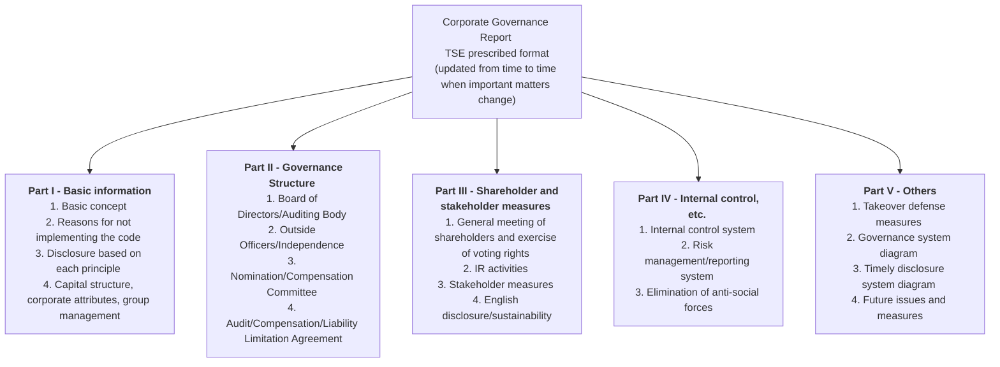

A report is not just an organizational chart. You can search for what principles a company implements, what they don't, and how they explain their decisions. It is updated from time to time if there are changes to the composition of the board of directors or IR activities, so it should be thought of as a continuous disclosure that shows the company's current governance, rather than a document created only once a year.

## Part I - Basic information to read first and Code compliance

The official name of Part I is **“Basic Concepts, Capital Structure, Corporate Attributes, and Other Basic Information Regarding Corporate Governance”**. Although the name is long, much of the information that investors see first is gathered here.

The main contents are as follows.

1. **Basic ideas regarding corporate governance** - Explain what the company uses for governance and how to position shareholders and other stakeholders.
2. **Reasons for not implementing each principle of the code** - If any of the basic principles, principles, and supplementary principles are not being implemented in the prime standard market, and the basic principles in the growth market, please state the reasons why they are not being implemented.
3. **Disclosures based on the principles of the Code** - Describe matters that the Code requires to be disclosed, such as cross-shareholdings, board skills, sustainability, cost of capital, and shareholder dialogue, or provide references to other resources.
4. **Capital structure** - State the foreign shareholding ratio, major shareholders, controlling shareholders, presence or absence of a parent company, etc.
5. **Corporate attributes and group management** - Indicates market segments, fiscal year-end, industry type, number of employees, number of consolidated subsidiaries, whether parent and subsidiary are listed, and how to protect minority shareholders.

In this part, we will first look at **the presence or absence of a controlling shareholder/parent company** and **foreign shareholding ratio**. In companies with controlling shareholders, independence and protection of minority shareholders are central to understanding. Companies with a high proportion of foreign ownership tend to have higher expectations for English-language disclosure, access to shareholder meetings, independent outside directors, and explanations regarding capital allocation.

Next, we will review the reasons for not implementing the Code and the disclosures based on each principle. Not only do they "explain" which principles, but they also look at whether their explanations are more specific than those of other companies in the same industry, whether they indicate dates and who made decisions, and whether they are consistent with other disclosure materials.

> **Column: Foreign stock ownership ratio changes the premise of dialogue**
> As the percentage of foreign ownership increases, the amount of information required by overseas investment management companies and voting advisory companies also increases. In addition to the availability of materials in English, it is necessary to explain in terms that foreign investors can understand, such as Japan's unique institutional design, cross-shareholdings, parent-child listings, and the authority of corporate auditors. IR personnel should keep track of the latest ratios and changes from the previous year.

## Part II: Actual picture of the board of directors and supervisory system

Part II deals with “Status of the business management organization and other corporate governance systems related to management decision-making, execution, and supervision”. Read here to understand the institutional design adopted by the company and how it is structured in practice.

Items to check are as follows.

1. **Organizational design** - Either a company with a board of auditors, a company with an audit and supervisory committee, or a company with a nominating committee, etc.
2. **Composition of the Board of Directors** - Number of directors, term of office, chairman, number and attributes of outside directors and independent officers.
3. **Independence of outside officers** ---Business relationships with the company, relationships with major shareholders and business partners, status of designation as independent officers.
4. **Nomination and Compensation Committee** - Presence of a voluntary committee, composition, chairperson, ratio of independent outside directors, role and authority.
5. **Audit system** - Cooperation between corporate auditors, audit and supervisory committee members, audit committee members, internal audit department, and accounting auditors.
6. **Executive remuneration** - Remuneration policy, concept of fixed, performance-linked, and stock remuneration, and decision-making procedures.
7. **Reasons for choosing the current structure** - Why is this organizational design suitable for your company, and what functions will the outside directors perform?

The three institutional designs differ not only in name but also in the allocation of authority. In a company with a board of corporate auditors, the corporate auditors constitute a statutory body separate from the directors. In a company with an audit and supervisory committee, directors who are members of the audit and supervisory committee participate in decisions by the board of directors. In a company with a nominating committee, etc., the nominating, auditing, and compensation committees are statutory committees. Even if the ratio of independent outside directors is the same, the effectiveness will vary depending on which organization they belong to and which decisions they participate in.

## Persuasive “compliance” and “explanation”

Disclosure in accordance with the spirit of the Code is not sufficient simply by stating that the code is being implemented. It is important that the reader understands the implementation details, the decision-making body, the timing of reviews, and the connection to management strategy.

Let's compare the skills matrix in Replenishment Principle 4.11.1 with an example.

> **Weak compliance explanation**
>
> *“We implement Supplementary Principle 4.11.1. Our Board of Directors is comprised of directors with diverse experience and abilities.”*
>
> **Specific compliance explanation**
>
> *“At its May 2024 meeting, our board identified eight areas of expertise needed to implement the priority measures in the FY2025–2027 medium-term plan: corporate management, finance and accounting, M&A, technology, overseas business, law and governance, sustainability, and human capital. The skills matrix on page 14 of this report shows how each director’s skills correspond to these areas. Before selecting candidates each year, the nomination committee reviews the expertise required and the composition of the current board.”*

The latter includes management strategy, timing of decisions by the board of directors, classification of abilities, review body, and reference pages. Readers can see that the matrix is used to select director candidates, not as a list of backgrounds.

Next, compare the explanations for cases in which the ratio of independent outside directors in Principle 4.8 is not met.

> **Weak explanation**
>
> *"Currently, we have not appointed more than one-third of our directors as independent outside directors. We will consider this in the future."*
>
> **Specific explanation**
>
> *"Out of the Company's 10 directors, three are independent outside directors, accounting for a ratio of 30%. The nominating committee is selecting candidates with a policy of adding one independent outside director at the regular general meeting of shareholders in June 2026. If elected, the ratio will be 36%. Progress will be reported to the board of directors quarterly."*

Even when explaining the reasons why something has not been implemented, investors can evaluate the board's thinking by showing the current situation, reasons for the decision, alternative measures, responsible party, and timing. A concrete "explanation" may have more informational value than a statement that only concludes "compliance."

## Part III: General Meeting of Shareholders, IR, Stakeholder Measures

Part III is “Implementation Status of Measures Concerning Shareholders and Other Stakeholders” and is the part most directly relevant to IR personnel.

1. **Activating shareholder meetings and facilitating the exercise of voting rights** -- Early sending of convocation notices, holding meetings that avoid crowded days, electronic voting, electronic voting platform for institutional investors, English translation of convocation notices, virtual general meetings, etc.
2. **IR activities** - Disclosure policy, briefing sessions for individual investors, analysts, and overseas investors, presence or absence of explanations by representatives themselves, posting of IR materials, departments and officers in charge.
3. **Stakeholder measures** - Respect for stakeholders in internal regulations, environment/CSR/sustainability reporting, diversity, internal reporting system, etc.

Here, rather than whether the company states that it “emphasizes dialogue with investors,” we look at who provides explanations, to which investor groups, and how often. I would like to confirm whether information is published in Japanese and English at the same time, whether the CEO and CFO are participating in dialogue, and whether sufficient consideration time is secured before the general meeting of shareholders.

## Part IV: Internal Control and Response to Anti-Social Forces

Part IV describes the basic concept and development status of the internal control system under the Companies Act, risk management, information management, whistleblowing, group company management, policies and systems for eliminating anti-social forces, etc.

The internal controls covered here are not completely the same as internal controls related to financial reporting under the Financial Instruments and Exchange Act, so-called J-SOX. The CG report focuses on the broader framework of the Companies Act, including the system for ensuring that the duties of directors and employees comply with laws and regulations and the articles of incorporation, the system for managing loss risk, the storage and management of job information, and the appropriateness of the corporate group's operations.

Normally, it is sufficient to read the summary at the end, but for companies that have had scandals, significant internal control deficiencies, or subsidiary management problems, it is worth reading this part first. Check whether measures to prevent recurrence are not limited to adding an organizational chart, and how the reporting channels and reporting to the board of directors have changed.

## Part V--Takeover defense measures and organizational chart

“Others” in Part V includes the status of implementation of takeover defense measures, future governance issues, governance system diagram, timely disclosure system diagram, etc.

For companies that have adopted takeover defense measures, we look at management's evaluation of their purpose, structure, and rationality. The organizational chart allows you to understand how the general meeting of shareholders, board of directors, auditing body, voluntary committees, executive committee, internal audit, and accounting auditor are connected. A timely disclosure system diagram shows which route important information is aggregated from business departments, who makes disclosure decisions, and where it is approved.

> **Column - Where to get it**
> The latest reports for each company can be searched by company name or securities code on TSE's **Corporate Governance Information Service**. PDFs are often posted on companies' IR sites, but for comparative research, using the TSE search service makes it easy to check multiple companies using the same format.

## Steps to read in 15 minutes

|elapsed time|What to check|
| --- | --- |
|0-4 minutes|**Part I** - Disclosure by principle of controlling shareholder/parent company, foreign ownership ratio, market segment, reasons for not implementing the code, cross-shareholdings, cost of capital, skill composition, etc.|
|4-9 minutes|**Part II** - Institutional design, board of directors and independent outside directors, nomination and compensation committee, audit system, executive compensation, and reasons for choosing the current structure.|
|9-12 minutes|**Part III** -- General meeting of shareholders, electronic voting, English convocation notice, briefing session, CEO/CFO involvement, IR system.|
|12-14 minutes|**Part IV**—Internal Control, Risk Management, Whistleblowing, Subsidiary Management. Increase the time if there has been a recent scandal.|
|14-15 minutes|**Part V** -- Takeover defense measures, governance system diagram, timely disclosure system diagram, and future challenges.|

For quick comparisons, it is not necessary to read all items at the same depth. First, we narrow down the issues based on shareholder composition and code compliance, and then follow up on the board of directors, committees, and IR systems related to those issues. If there is a controlling shareholder, minority shareholder protection is required, if there are many cross-shareholdings, the principle is 1.4, if the PBR is less than 1x, the principle is 5.2, and if the overseas ownership ratio is high, English disclosure and shareholder meeting environment are required.

## Practical matters that IR personnel should keep in mind

1. **Manage the CG report for disclosure at any time.** Any significant changes to board composition, committees, controlling shareholders, policies, or code compliance will be amended without waiting for the annual update.
2. **Write the principle-based disclosures in Part I for investors.** Instead of using fixed phrases, include the person making the decision, date, numerical value, target material, and review period. When referring to other materials, make sure that the reader can easily reach the relevant section.
3. **Align Parts I and II.** If you write that “the nominating committee will oversee succession planning,” the composition, number of meetings, and roles of the committee in Part II must also support this.
4. **Eliminate inconsistencies with IR materials, annual securities reports, and integrated reports.** When disclosing the same information in multiple media, such as foreign ownership ratio, independent outside director ratio, cross-shareholdings, remuneration policy, sustainability goals, etc., use the same reference date and definition.
5. **Improve based on TSE's entry guidelines and collection of good practices.** Before pursuing your own unique expression, check the formal purpose and precautions for each column, and compare with best practices from other companies in your industry.

## Source/reference materials

- Japan Exchange Group - Report on Corporate Governance (Format, Instructions, Sample): https://www.jpx.co.jp/equities/listing/cg/01.html
- Japan Exchange Group - Collection of good examples of corporate governance reports (PDF): https://www.jpx.co.jp/equities/listing/cg/tvdivq0000008jdy-att/b5b4pj0000036oc5.pdf
- Japan Exchange Group - Corporate Governance Information Service: https://www2.tse.or.jp/tseHpFront/CGK010010Action.do
- Japan Exchange Group - TSE listed company Corporate Governance White Paper: https://www.jpx.co.jp/equities/listing/cg/02.html

## Related articles

**Next article on this theme:** 2.5 - Code and guidelines - Differences in roles and how to distinguish them

**Related articles on other themes:**
- 3.2 - [tradable-share ratio - Mechanism that promoted the reduction of cross-shareholdings](/governance/market-restructuring/3.2-tradable-share-ratio/) (Indicator for reading capital structure and continued listing criteria)
- 4.3 - [List of companies disclosed by TSE - Discipline created by publication](/governance/capital-efficiency/4.3-the-disclosure-list/) (Monthly publication system starting from CG report)
- 5.1 - [Simultaneous Japanese and English disclosure is just the beginning - Mandatory in April 2025](/governance/frontier/5.1-english-disclosure-mandate/) (Part III English disclosure status and timely disclosure rules)

---

## Codes and guidelines: Their different roles and uses

**SOURCE URL:** https://jpinv.com/governance/cg-code/2.5-meti-guideline-family/

**記事要約**

Although the Corporate Governance Code and the Ministry of Economy, Trade and Industry's practical guidelines address the same governance issues, they have different roles. The Code sets out the principles and disclosures required of listed companies, and operates on a comply-or-explain basis. On the other hand, the CGS Guidelines, Group Guidelines, Fair M&A Guidelines, and Guidelines for Corporate Takeovers specify what procedures the board of directors and special committees should actually follow. In this article, we will explain the differences between the two and how to use them depending on the issue.

**本文**

> **Key points**
> - The **Corporate Governance Code** sets out the principles and disclosure framework required of listed companies. In contrast, various guidelines from the Ministry of Economy, Trade and Industry provide detailed procedures and points of focus that boards and committees should consider in practice.
> - In principle, the Ministry of Economy, Trade and Industry's guidelines are not subject to a "comply or explain" policy and are not legally binding. Still, it has a significant practical impact, as it is used as a common reference by companies, investors, proxy advisory firms, and legal and financial advisors.
> - The CGS Guidelines for succession planning, the Group Guidelines for listed subsidiaries, the Fair M&A Guidelines for MBOs and acquisitions by controlling shareholders, and the Guidelines for Corporate Takeovers for unsolicited acquisitions are central materials that supplement the Code.

## What is the difference between the Code, Companies Act, and Practical Guidelines?

Japan's governance system is not complete with just one document. At least the following three parts should be read separately.

**The first is corporate law.** Establishing the legal basis for company operations, such as directors' duties, company institutional design, shareholder meetings, and organizational restructuring. The Ministry of Justice is in charge, and violations may result in legal liability.

**The second code is the Financial Services Agency/Tokyo Stock Exchange code.** The Corporate Governance Code sets out the principles of behavior expected of listed companies, and the Stewardship Code sets out the principles of behavior expected of institutional investors. Listed companies will explain whether they have implemented the applicable principles and, if not, why. The company's main disclosure medium is the **Corporate Governance Report**.

**The third is the Ministry of Economy, Trade and Industry's practical guidelines.** The Guidelines are not a mechanical restatement of the principles of the Code. We delve into what issues to consider and in what order in situations such as board composition, CEO succession planning, conflicts of interest in listed subsidiaries, MBOs, and unsolicited acquisitions. Although it is neither a law nor a listing regulation, it has become established as a common language when explaining the fairness of procedures and the decision-making process of the board of directors.

> **Column: Don't simplify it by saying "there are two competent authorities"**
> If we view governance only as “the Financial Services Agency versus the Ministry of Economy, Trade and Industry,” we get the whole picture wrong. The Ministry of Justice, which is in charge of corporate law, the Tokyo Stock Exchange, which administers listing rules, the Financial Services Agency, which is responsible for regulating investors, and the Ministry of Economy, Trade and Industry, which formulates practical guidelines for corporate management and M&A, all play different roles. In practice, the basic reading is to confirm the legal minimum in the Companies Act, to cover disclosure expectations in the code, and to supplement specific procedures with practical guidelines.

## Four major guidelines published by the Ministry of Economy, Trade and Industry

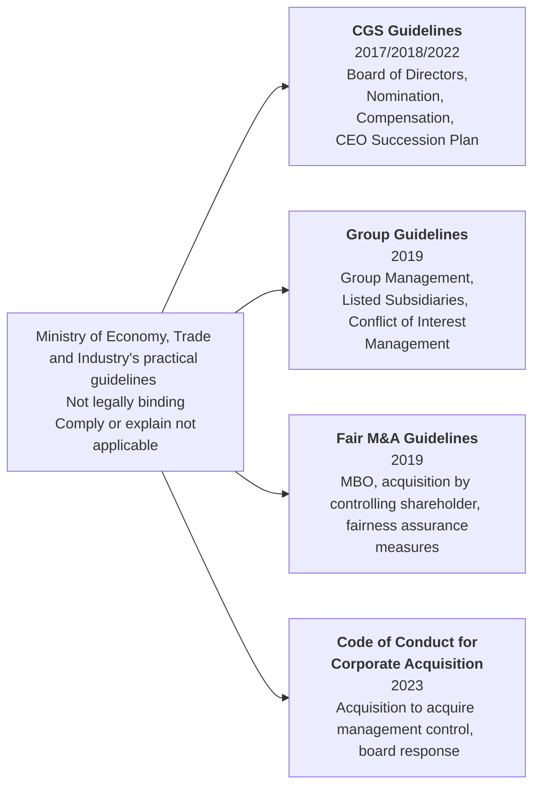

### 1.CGS Guidelines

The official name is **Practical Guidelines for Corporate Governance Systems**. The first edition was published in March 2017 and revised in September 2018 and July 2022.

These guidelines cover issues such as the role of the board of directors, the division of business execution and supervision, the use of outside directors, nomination and compensation mechanisms, CEO appointment/dismissal, and succession planning. While the Code states the principle that “the board of directors should appropriately supervise succession planning,” the CGS Guidelines delve into practical issues such as setting candidate images, candidate development, involvement of the nominating committee, and role sharing with the current CEO.

In the 2022 revision, the sections related to nomination, remuneration, and succession planning have been organized as “Guidelines for Utilizing Nomination Committees, Compensation Committees, and Succession Plans - Practical Guidelines for Corporate Governance Systems (CGS Guidelines) Separate Volume”. The revised version focuses on the perspective of not only increasing the supervisory function of the board of directors, but also increasing the appropriate risk-taking and execution capabilities of management.

### 2. Group guidelines

The official name is **Practical Guidelines for Group Governance Systems** and was published on June 28, 2019. He deals with the overall design of corporate groups, the allocation of authority between parent companies and subsidiaries, internal controls, business portfolio management, and conflicts of interest in listed subsidiaries.

Most importantly, parent companies with listed subsidiaries are encouraged to continually consider whether keeping the subsidiary listed makes sense for both the group as a whole and the subsidiary's minority shareholders. Listed subsidiaries are also required to utilize independent outside directors and special committees to manage conflicts of interest associated with transactions with parent companies and organizational restructuring.

This is not a guideline to “uniformly eliminate parent-child listings.” The idea is that if a company wants to remain listed, it needs to explain the reasons and benefits and put in place a mechanism to protect minority shareholders.

### 3. Fair M&A Guidelines

The official name is “Guidelines for Fair M&A - Toward Improving Corporate Value and Securing Shareholder Returns” and was announced on June 28, 2019. The 2007 MBO guidelines were completely revised, and in addition to MBOs, they also focused on transactions in which a controlling shareholder acquires a listed subsidiary.

These transactions create structural conflicts of interest between the buyer and the target company's management, or between the controlling shareholder and public shareholders. The guidelines indicate the following measures to ensure fairness in order to limit this impact.

- Establishment of an independent special committee
- Obtaining advice from external experts, valuation reports, and fairness opinions as necessary
- Market check to secure proposal opportunities from parties other than the acquirer
- Full disclosure of information regarding transaction terms and negotiation process
- Consideration of majority-of-minority conditions depending on the nature of the transaction

These are not uniform checklists that should be applied in the same way in all cases. This is a framework for determining which combination of measures will ensure fair procedures, depending on the degree of conflict of interest in a transaction and the market environment.

### 4. Guidelines for Corporate Takeovers

**“Guidelines for Corporate Takeovers”** was published on August 31, 2023. The target is an acquisition that acquires management control of a listed company. Based on the 2005 Guidelines on Takeover Defense Measures and the 2008 Corporate Value Research Group Report, the focus of the discussion shifted from ex-ante defensive measures to the decision-making process of the board of directors that receives a takeover proposal.

The guidelines emphasize three principles: **ensuring or improving corporate value and the common interests of shareholders**, **respecting shareholder will**, and **ensuring transparency**. The target company's board of directors is required to collect the necessary information and seriously consider it while comparing it with other options, rather than arbitrarily rejecting a sincere takeover proposal that has the potential to increase corporate value.

Therefore, the turning point in the guidelines was not that “hostile takeovers were welcomed.” Rather than assuming that a proposal is inappropriate just because it was unsolicited, they asked for a concrete evaluation of the content of the proposal, post-acquisition management policy, price, feasibility, etc.

In July 2026, the Ministry of Economy, Trade and Industry published **points, Q&A, and an interpretation document** of the guidelines, supplementing the practical thinking from receiving and considering takeover proposals, handling competing proposals, and information disclosure.

## Compare codes and guidelines by issue

|issue|corporate governance code|Contents supplemented by the guidelines of the Ministry of Economy, Trade and Industry|
| --- | --- | --- |
|**CEO succession plan**|Supplementary Principle 4.1.3 requires boards to appropriately oversee CEO and other succession planning and to be involved in ensuring that sufficient time and resources are devoted to the development of candidates.|The **CGS Guidelines** and the 2022 supplement will specify the candidate image, formation, training, and evaluation of candidate groups, the role of the nominating committee, and the division of labor with the current CEO.|
|**Governance of listed subsidiaries**|The 2021 version of Supplementary Principle 4.8.3 requires companies with controlling shareholders to increase the proportion of independent directors or to establish an independent special committee.|The **Group Guidelines** provide details on the parent company's consideration of the rationality of maintaining its listing, the management of parent-subsidiary transactions, the role of the subsidiary board of directors and special committees, and the protection of minority shareholders.|
|**MBO/Acquisition by controlling shareholder**|Principle 1.7 deals with the management of related party transactions, but does not exhaustively prescribe procedures for MBOs or acquisitions by controlling shareholders.|**Fair M&A Guidelines** organize measures to ensure fairness, such as special committees, external advice, valuation, market checks, and information disclosure.|
|**Unsolicited takeover/takeover defense measures**|Principle 1.5 requires explanations of the necessity and rationality and consideration of shareholder rights when introducing and operating takeover defense measures.|The **Guidelines for Corporate Takeovers** organizes the board of directors' consideration of a serious takeover proposal, provision of information to shareholders, counterproposals, and defensive measures based on three principles.|

## How to read them in practice

In practice, it will be easier to organize if you read them in the following order.

1. **Check the laws and regulations first.** Observe legally required procedures such as director authority, shareholder meeting resolutions, organizational restructuring, and tender offers.
2. **Next, check the code.** Find out what principles apply to your company and what you should explain in your corporate governance report.
3. **Then read the relevant practice guidelines.** Specify which issues should be considered by the board of directors and special committees, and how the decision-making process should be recorded and disclosed.
4. **Combine according to the unique circumstances of the project.** Rather than formally adopting all guidelines, choose the necessary measures depending on the magnitude of the conflict of interest, shareholder composition, urgency of the transaction, possibility of alternative proposals, etc.

> **Column: “Not legally binding” does not mean “can be ignored”**
> Non-compliance with the Practical Guidelines alone does not immediately result in a violation of laws and regulations or listing rules. On the other hand, if the measures to ensure fairness specified in the guidelines are not taken, the board of directors or special committee will need to explain why they have determined that sufficient fairness can be ensured through other procedures. The effectiveness of guidelines comes not from sanctions, but from common standards for comparing and evaluating decision-making processes.

## Points to consider when reading primary sources

When reading group guidelines, rather than just looking for a conclusion: “Should the subsidiary remain listed or take it private?” look at how often the parent company considers the rationale for remaining listed and how it requires the subsidiary to ensure independent decision-making.

Under the Fair M&A Guidelines, it is important not only whether there is a special committee, but also when it was established, whether the committee members were independent, whether they were substantively involved in the negotiations, and whether they obtained the necessary information and advice. Merely establishing a committee as a formality does not ensure procedural fairness.

The Code of Conduct for Corporate Acquisitions examines whether the board of directors is jumping to conclusions on behalf of shareholders and whether it has provided necessary comparative information to shareholders, rather than whether the proposal is "friendly" or "hostile." The key points/Q&A for 2026 are useful as supplementary materials when applying the three abstract principles to project practice.

## Implications for IR practice

1. **Be able to read not only the code but also the guidelines for each project.** For succession planning, publicly traded subsidiaries, MBOs, and unsolicited acquisitions, the Code alone does not provide the procedural information boards need.
2. **For MBOs and acquisitions by controlling shareholders, refer to the Fair M&A Guidelines from the beginning of the transaction.** Establishing a special committee as an afterthought will not restore independence to the negotiation process. IR also needs to be involved from the procedure design stage, not just before disclosure.
3. **Companies that maintain parent-subsidiary listing will specifically explain the benefits of listing.** In addition to general considerations such as “name recognition” and “recruitability,” it also shows what kind of benefits there are for the parent company, subsidiaries, and minority shareholders.
4. **If deviating from the guidelines, explain alternative procedures.** Rather than omitting explanations because it is non-binding, disclose the unique circumstances of the case and the reasons why fairness was ensured through other means.
5. **Follow up to study group materials.** Before the guidelines are revised, the points at issue will be sorted out by a study group of the Ministry of Economy, Trade and Industry. By reading the minutes, secretariat materials, and committee members' opinions, you can quickly grasp the upcoming system changes and market interest.

## Source/reference materials

- Ministry of Economy, Trade and Industry “Various guidelines regarding corporate governance”: https://www.meti.go.jp/policy/economy/keiei_innovation/keizaihousei/corporategovernance/guideline.html
- Ministry of Economy, Trade and Industry “Revision of the Practical Guidelines for Corporate Governance Systems (CGS Guidelines)” (July 2022): https://www.meti.go.jp/press/2022/07/20220719003/20220719003.html
- Regarding the publication of the Ministry of Economy, Trade and Industry's "CGS Study Group (Second Period) Report" (May 2018): https://www.meti.go.jp/press/2018/05/20180518002/20180518002.html
- Ministry of Economy, Trade and Industry “Various guidelines and publications related to M&A”: https://www.meti.go.jp/policy/economy/keiei_innovation/keizaihousei/fair-ma-rule/ma-guideline-publications.html
- Ministry of Economy, Trade and Industry “Guidelines for fair M&A practices – Toward increasing corporate value and securing shareholder returns” (2019): https://www.meti.go.jp/policy/economy/keiei_innovation/keizaihousei/pdf/fairma-guidelines.pdf
- Ministry of Economy, Trade and Industry “We have formulated “Guidelines for Corporate Takeovers” (August 31, 2023): https://www.meti.go.jp/press/2023/08/20230831003/20230831003.html
- Ministry of Economy, Trade and Industry “Points, Q&A, etc. of “Guidelines for Corporate Takeovers” have been formulated” (July 30, 2026): https://www.meti.go.jp/press/2026/07/20260730002.html
- Ministry of Economy, Trade and Industry/Ministry of Justice “Guidelines for takeover defense measures to secure or improve corporate value and common interests of shareholders” (2005): https://www.meti.go.jp/policy/economy/keiei_innovation/keizaihousei/pdf/shishin_hontai.pdf
- Ministry of Economy, Trade and Industry “Ideal takeover defense measures in light of recent changes in the environment” (June 2008): https://www.meti.go.jp/policy/economy/keiei_innovation/keizaihousei/pdf/080630TakeoverDefenseMeasures.pdf

## Related articles

**Next article for this theme:** That's all for theme 2. Next, proceed to [Theme 3: Reconsidering market segments](/governance/market-restructuring/).

**Related articles on other themes:**
- [1.4 Stewardship Code that changed the investor side (2014/2017/2020/2025)](/governance/foundations/1.4-stewardship-code-2014/)
- [5.3 What the privatization of Toyota Industries showed: group reorganization of listed companies and protection of minority shareholders](/governance/frontier/5.3-listed-subsidiaries/)
- [5.4 How to handle unsolicited acquisitions - 2023 “Guidelines for Corporate Takeovers”](/governance/frontier/5.4-mbo-takeover-guidelines/)

---

# テーマ3：Review of market segments

---

## From four market segments to three: The April 2022 restructuring

**SOURCE URL:** https://jpinv.com/governance/market-restructuring/3.1-four-segments-to-three/

**記事要約**

On April 4, 2022, the Tokyo Stock Exchange reorganized the First Section, Second Section, Mothers, and JASDAQ into three markets: Prime, Standard, and Growth. The purpose is not to organize names. The aim was to clarify the roles of each market, bring the standards for new listings closer to those for maintaining listings, review the definition of tradable shares, and require even higher levels of governance in the prime market, thereby creating a system that encourages corporate value to improve even after listing. This paper summarizes the background of the restructuring, the differences between the three markets, and the issues that led to subsequent reforms.

**本文**

> **Key points**
> - **April 4, 2022**, TSE reorganized the First Section, Second Section, Mothers, and JASDAQ into three markets:**Prime, Standard, and Growth**.
> - The problems before the reorganization were that the roles of each market overlapped, that there was little incentive to maintain high standards after listing, and that the First Section and TOPIX were effectively linked.
> - The reorganization laid the foundation for the integrated implementation of **stricter continued listing criteria, changes in the definition of tradable shares, governance principles for the prime market, and TOPIX reform**.

## Why did we review the market segments?

When the TSE and Osaka Stock Exchange spot markets were merged in 2013, the structure of each market remained largely unchanged to limit the impact on existing listed companies and investors. As a result, the First Section, Second Section, Mothers, and JASDAQ coexisted on the TSE. JASDAQ was divided into standard and growth, so some official materials refer to it as “four markets” and, counting subdivisions, as “five categories.”

Over time, two problems became clear.

**First, it was difficult to understand the role of each market.** The size and growth stage of target companies in the Second Section, Mothers, and JASDAQ overlapped, making it difficult for investors to discern the differences. In the first section of the market as well, it was unclear which companies would be positioned as representative of Japan's market.

**Secondly, the mechanism to encourage increases in corporate value after listing was weak.** Before the reorganization, there was a large difference between the level required for a new listing and the level required to maintain a listing. In addition, the standards for moving companies from other markets to the First Section were sometimes less strict than those for direct listing on the First Section. Once listed, there was no mechanism in place to encourage companies to maintain high levels of liquidity and governance.

Furthermore, **Affiliation in the First Section of the Market and inclusion in TOPIX were in fact linked**. Moving to the First Section, the structure was such that it received buying demand for TOPIX-linked funds, regardless of a company's investment grade. In addition to clarifying the role of market segments, it was also necessary to review their relationship with indexes.

## From consideration to implementation

In October 2018, the TSE established the “Council on the market structure of the cash market at the Tokyo Stock Exchange”. In December of the same year, an issue paper was published and comments were solicited from December 21, 2018 to January 31, 2019. The issues were summarized in March 2019 based on the opinions received and interviews with market participants.

Afterwards, the **Market Structure Specialist Group** set up within the Financial Services Agency's Financial System Council examined the entire system. The chairperson is Hideki Kanda, professor at Gakushuin University Graduate School of Law. The official name of the report published on December 27, 2019 is “Report of the Market Structure Expert Group - Towards a new market for companies and investors in the Reiwa era”.

The report indicated the following directions:

- Reorganize market segments into three markets, each with a clear role
- Standardize initial listing standards and continued listing criteria in principle
- Separate the scope of the First Section of the Market and TOPIX
- Differentiating governance levels depending on market segment

The TSE incorporated this policy into its listing system, and from September to December 2021, it allowed existing listed companies to choose the market they would like to migrate to. The selection results were announced on January 11, 2022, and the transition was made all at once on April 4 of the same year.

## What is the difference between the three markets?

TSE's approach to each market is as follows.

- **Prime market**: For companies that have the scale and liquidity to be investment targets for many institutional investors, have a higher standard of governance, and aim for sustainable growth and medium- to long-term improvement in corporate value through constructive dialogue with investors.
- **Standard market**: For companies that have a certain size and liquidity as public market investment targets, have basic governance standards as a listed company, and aim for sustainable growth and medium- to long-term improvement in corporate value.
- **Growth market**: For companies that disclose their business plans and progress in a timely and appropriate manner to achieve high growth potential and receive a certain level of evaluation from the market, but whose business performance is relatively high risk.

It is easy to see the difference when comparing the main **Listing Maintenance Standards**.

|Item|prime|standard|growth|
| --- | ---: | ---: | ---: |
|Number of shareholders|Over 800 people|Over 400 people|150 people or more|
|Number of tradable shares|20,000 units or more|2,000 units or more|1,000 units or more|
|Market capitalization of tradable shares|10 billion yen or more|1 billion yen or more|500 million yen or more|
|tradable-share ratio|35% or more|25% or more|25% or more|
|Trading value/trading volume|Average daily trading value of 20 million yen or more|Average monthly trading volume of 10 units or more|Average monthly trading volume of 10 units or more|
|net worth|be positive|be positive|be positive|

The important thing here is **not to confuse listing examination standards and continued listing criteria**. Some of the items that are examined at the time of initial listing, such as profit amount, sales, and number of years of business continuity, are set separately from the standards for maintaining listing. The significance of the reorganization is not to make the two completely the same, but to bring the standards closer than before and to maintain a state that is commensurate with the characteristics of the market even after listing.

## Number of companies at launch

The number of listed companies as of April 4, 2022 was as follows.

|market|Number of listed companies|Percentage of total|
| --- | ---: | ---: |
|prime|**1,839 companies**|Approximately 49%|
|standard|**1,466 companies**|Approximately 39%|
|growth|**466 companies**|Approximately 12%|
|**Total**|**3,771 companies**| 100% |

Since Prime alone accounted for almost half of the total, there was criticism right after its launch that it was difficult to see the difference from the First Section. The background to this is that in addition to the fact that existing listed companies have independently chosen the transition destination, a **transitional measure** has been established that allows companies that do not meet the normal standards of the selected market to apply the relaxed standards if they submit a compliance plan.

## Transition from old market to new market

The transition wasn't just a name change. The general flow is shown in the figure below.

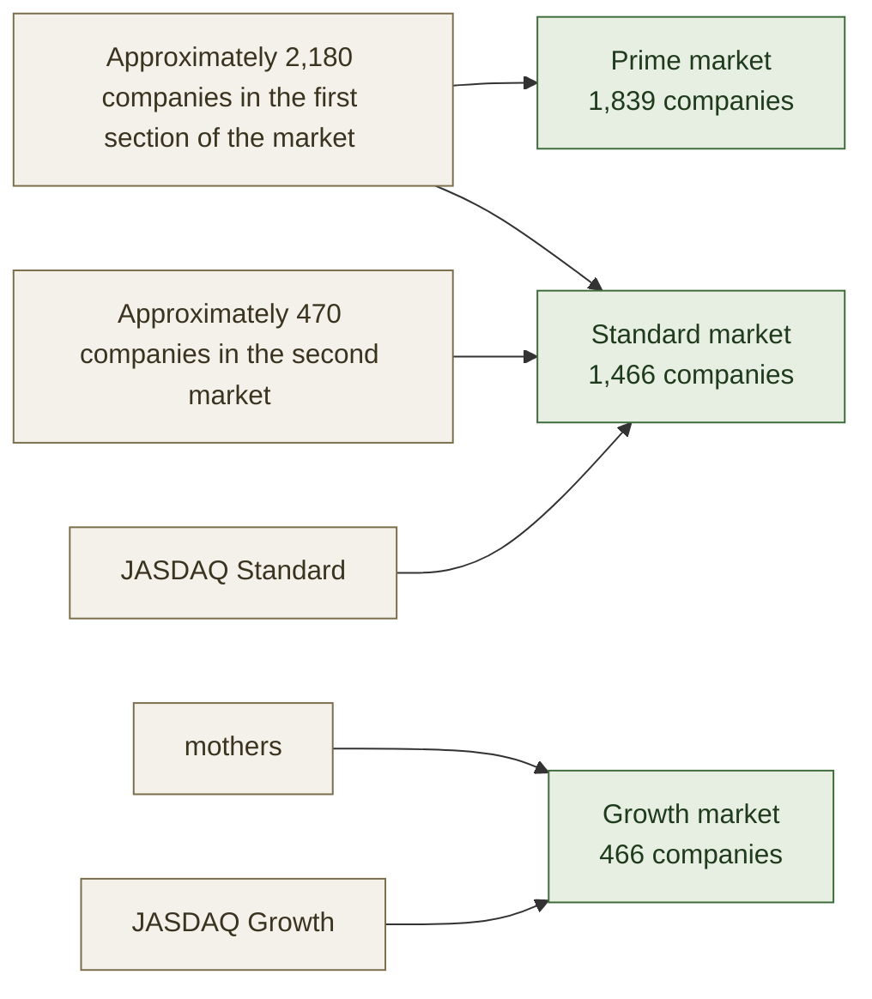

Companies in the first section of the market were divided into prime and standard. Market 2nd Section and JASDAQ Standard have mainly moved to Standard, and Mothers and JASDAQ Growth have moved to Growth. For this reason, the old market and new market do not correspond one-to-one.

## Three mechanisms that increased the effectiveness of reorganization

### 1. Change in the definition of tradable shares

Under the new system, the scope of **tradable shares** when determining the criteria for maintaining listing has been revised. Some stocks considered to be stably held, such as those held by banks, insurance companies, and business corporations, are now excluded from the list of tradable shares, making it more difficult for companies with large cross-shareholdings to meet the criteria. More details will be covered in the next article.

### 2. Governance principles for prime markets

The 2021 Corporate Governance Code revision required prime listed companies to take even higher measures. The main items are as follows.

- Appoint at least one-third of independent outside directors
- Enhancing climate-related disclosures under the TCFD or equivalent international framework
- Disclose necessary information in English as well
- Use the electronic voting platform for institutional investors

These were not uniform legal obligations, but were implemented as a "comply or explain" code. However, there are some areas that have since become mandatory under the listing rules, such as the simultaneous Japanese and English disclosure of timely disclosure that began in April 2025.

### 3. Separation from TOPIX

Before the reorganization, TOPIX basically covered all stocks on the First Section of the market. After the reorganization, constituent stocks were selected with an emphasis on liquidity, independent of market segments. As a result, prime listing alone no longer guarantees inclusion in TOPIX. Details are covered in 3.4.

## Why did the review continue even after the reorganization?

Although the foundation of the system has changed with the launch of the new market, the number of prime companies remains large, and the deadline for transitional measures was initially set to be **for the time being**. In order to make the differences between market segments substantive, it was necessary to clarify how long and what procedures would be used to deal with companies that did not meet standards.

Therefore, in July 2022, TSE established a **follow-up meeting regarding the review of market classification**. Discussions at the conference led to concrete proposals such as the end of transitional measures, the request for management to be conscious of cost of capital and stock prices, the functioning of growth markets, and additional reform of TOPIX.

The reorganization in April 2022 did not complete the reforms. It was the starting point for a long process of reviewing market segments, continued listing criteria, governance, and indexes as a single system.

## Suggestions for IR personnel

1. **Market segments is explained not only by company size but also by investor base and governance choices.** Prime listing means opting for greater liquidity, governance and dialogue with international investors.
2. **Understand new listing standards and continued listing criteria separately.** Explaining profit standards as requirements for maintaining listing would misrepresent the system.
3. **Continuously check the breakdown of tradable shares.** Not only the stock price, but also who owns the stock is directly linked to maintaining market segments.
4. **Manage market segment and TOPIX inclusion separately.** Prime listing and index inclusion are no longer the same decisions.
5. **Read follow-up meetings as leading indicators of institutional change.** The main measures for 2023 and beyond are being fleshed out from the materials and discussions held at the conference.

## Source/reference materials

- Japan Exchange Group “Summary of Market Segmentation Review”: https://www.jpx.co.jp/equities/improvements/market-structure/01.html
- Japan Exchange Group “Consideration of market structure”: https://www.jpx.co.jp/equities/improvements/market-structure/index.html
- Financial Services Agency “Regarding the publication of the report of the Financial System Council’s Market Structure Expert Group” (December 27, 2019): https://www.fsa.go.jp/singi/singi_kinyu/market-str/report/20191227.html
- Japan Exchange Group “Market Segment”: https://www.jpx.co.jp/equities/market-restructure/market-segments/index.html
- Japan Exchange Group “Announcement of market segment selection results” (January 11, 2022): https://www.jpx.co.jp/corporate/news/news-releases/0060/20220111-01.html
- Japan Exchange Group “Listing Maintenance Standards (Prime Market)”: https://www.jpx.co.jp/equities/listing/continue/outline/01.html
- Japan Exchange Group “End of transitional measures regarding continued listing criteria”: https://www.jpx.co.jp/equities/follow-up/04.html
- Japan Exchange Group “Announcement of Revised Corporate Governance Code” (June 11, 2021): https://www.jpx.co.jp/news/1020/20210611-01.html

## Related articles

- **2.3—Revised in 2021**: Governance principles for the prime market introduced prior to market restructuring.
- **3.2――tradable-share ratio**: A mechanism that connects market segments standards to the reduction of cross-shareholdings.
- **3.3 - Listing maintenance rules after the end of transitional measures**: How the special provision that was supposed to be "for the time being" was changed to a time-limited system.
- **3.4---TOPIX reform**: Reform that separates market segments and index adoption.
- **4.1 -- How to read PBR below 1x**: Request from TSE in March 2023, born from follow-up after market restructuring.

---

## Tradable-share ratio: How it encouraged cross-shareholding reductions

**SOURCE URL:** https://jpinv.com/governance/market-restructuring/3.2-tradable-share-ratio/

**記事要約**

In the market reorganization in April 2022, the definition of "tradable shares" used in the criteria for maintaining listing was also revised. In addition to major shareholders, executives, and treasury stock, stocks held by domestic banks, insurance companies, and business corporations are generally not included in tradable shares unless it can be confirmed that they will be distributed in the market as pure investment. Combined with the standard of 35% or more of tradable shares in the prime market, companies with many cross-shareholdings or stable shareholders have been under pressure to reconsider their shareholder structure. In this paper, we will summarize the definition, calculation method, and improvement measures from a practical perspective.

**本文**

> **Key points**
> - The tradable-share ratio is the ratio of the number of shares considered to be circulating in the market divided by the number of listed shares. The criteria for maintaining listing is 35% or more for Prime and 25% or more for Standard and Growth.
> - In principle, stocks held by domestic banks, insurance companies, business corporations, etc. are excluded from tradable shares. However, if the holding purpose is pure investment and the trading history within the past five years can be confirmed, the shares may be included in tradable shares if they meet the requirements of the TSE.
> - Simply purchasing company stock from cross-shareholding shareholders will not immediately increase the ratio. Since treasury stock is included in the denominator of the number of listed shares, the improvement effect will, in principle, only be seen **after cancellation**.

## What is the tradable-share ratio?

tradable shares are stocks that TSE recognizes as having a high probability of being traded on the market, based on its listing standards. It is not an index that only counts stocks that are actually bought and sold on a daily basis. Calculated by excluding shares that are likely to be stably held based on shareholder attributes, shareholding ratio, purpose of holding, etc.

The calculation formula is as follows.

> **tradable-share ratio = Number of tradable shares ÷ Number of listed shares × 100**

Listing maintenance criteria uses tradable shares in the following three ways.

|market|Number of tradable shares|Market capitalization of tradable shares|tradable-share ratio|
| --- | ---: | ---: | ---: |
|prime|20,000 units or more|10 billion yen or more|35% or more|
|standard|2,000 units or more|1 billion yen or more|25% or more|
|growth|1,000 units or more|500 million yen or more|25% or more|

The market capitalization of tradable shares is calculated by multiplying the number of tradable shares by the average daily closing price on the TSE market for three months prior to the end of the fiscal year. The number of tradable shares and the tradable-share ratio are affected by the shareholder composition, and the market capitalization of tradable shares is determined by the stock price factor.

## What is excluded from tradable shares?

Under the current system, the following stocks are mainly excluded from tradable shares:

1. **Shares held by shareholders holding 10% or more of the listed shares**. However, there are certain exceptions, such as stocks included in investment trusts and pension trusts.
2. **Shareholdings of Directors and Special Interests**. This includes directors, auditors, executive officers, officers' shareholding associations, as well as close relatives of officers, affiliated companies, etc.
3. **Treasury stock**.
4. **Shares held by domestic banks, insurance companies, business corporations, etc.** In principle, companies are excluded even if their holding ratio is less than 10%.

There are exceptions to the last category. If it is clear from the large-volume holding report or the holding status report prescribed by the TSE that the purpose of holding the stock is **pure investment or other purpose with a high probability of distribution in the market**, and if the transaction history within the last five years can be confirmed, the TSE may recognize the stock as tradable shares. However, this exception does not apply to shareholders, officers, etc. who own 10% or more.

Therefore, it is not accurate to understand that “stocks of banks, insurance companies, and business corporations are uncirculated without exception.” What is important is not only the name of the shareholder, but also **can you prove the purpose of ownership and trading history to the TSE**.

## The meaning of the 2022 review

The concept of tradable shares existed even before the market reorganization. However, under the 2022 system, holdings by domestic banks, insurance companies, business corporations, etc. will be treated more strictly, and the number of tradable shares, market capitalization, and ratio will be incorporated into each market's continued listing criteria.

The direct purpose of the system is to ensure appropriate liquidity for each market and to create a market that is easy for investors to buy and sell. On the other hand, when applied to the shareholder structure of Japanese companies, the tradable-share ratio is calculated to be lower for companies with more stable holdings based on cross-shareholdings or business relationships. As a result, the system had the effect of encouraging the sale of cross-shareholdings and the release of founding families' and parent company's equity to the market.

This is not a mechanism that directly prohibits cross-shareholdings. Even if a company can explain the rationale for cross-shareholdings, it does not necessarily mean that the shares will be counted as tradable shares. **The rationality of ownership based on governance and the liquidity based on listing standards are different judgments**.

## How do we understand the differences with the old system?

|point of view|Before market reorganization|From April 2022 onwards|
| --- | --- | --- |
|market segment|Differences in roles and maintenance standards for each category, such as the First Section of the Market, are unclear.|Clarifying the standards for tradable shares for each Prime Standard Growth|
|Stably held stocks|There was a relatively large scope for less than 10% holdings by banks, insurance companies, and business corporations to be included in tradable shares.|Excluded in principle, only included as an exception if net investment/trading results can be confirmed.|
|Prime equivalent ratio|There was a 35% standard in the First Section of the Market, but the definition and maintenance system were different.|Continue to maintain above 35% under stricter definitions|
|Judgment|Post-continued listing criteria are looser than new listing standards|In principle, judgment is made once a year based on the end of the business year, and if it is not achieved, it will be put into an improvement period.|

Even if the figure of 35% remains the same on the surface, the level of difficulty for the company changes depending on what counts as tradable shares. Even if the shareholder composition did not change, some companies saw a significant drop in the ratio as a result of recalculating using the new definition.

## What causes the tradable-share ratio to change?

There are two ways to improve the tradable-share ratio: increase the number of tradable shares, which is the numerator, or reduce the number of listed shares, which is the denominator. However, the ratio does not change depending on any capital policy.

### Measures to easily improve the ratio

- **Market sale/offering by cross-shareholding shareholders or the founding family**: If untradable shares are transferred to general investors, the number of tradable shares will increase.
- **Sale of equity by the parent company/major shareholder**: If the seller is a secondary shareholder, the numerator increases in the same way.
- **Public capital increase or widely diversified sale to third parties**: If new shares are held by tradable sharesholders, both the numerator and denominator will increase, but the higher the rate of increase in tradable shares, the higher the ratio will be.
- **Treasury stock acquisition and cancellation of untradable shares**: Treasury stock is also uncirculated at the time of acquisition and remains in the denominator, so the ratio does not change in principle. It will improve once the number of listed shares decreases through cancellation.

### Measures that do not change the ratio in principle

- **Stock split/reverse stock split**: The ratio usually remains the same, as the tradable shares and listed shares increase or decrease at the same rate.
- **Only acquires treasury stock from non-tradable shareholders and does not cancel them**: Non-tradable shares is simply replaced by treasury stock.
- **Stock price increase**: The market capitalization of tradable shares will rise, but the tradable-share ratio itself will not change.

## Check with numbers

Consider a company with 100 million issued and listed shares.

|holder|Number of shares|Should it be included in tradable shares?|
| --- | ---: | --- |
|Founding family|30 million shares|No (holding 10% or more)|
|Corresponding bank|5 million shares|No (strategy holding)|
|insurance company|4 million shares|No (strategy holding)|
|Business partner corporation|6 million shares|No (strategy holding)|
|Treasury stock|5 million shares|don't|
|Domestic and international institutional investors and individuals|50 million shares|do|
|**Total**|**100 million shares**|**50 million shares outstanding**|

The tradable-share ratio of this company is **50 million shares ÷ 100 million shares = 50%**.

Compare the changes caused by subsequent measures.

|Measures|Number of tradable shares|Number of listed shares|tradable-share ratio|
| --- | ---: | ---: | ---: |
|do nothing|50 million shares|100 million shares| 50.0% |
|Insurance company sells 4 million shares on the market|54 million shares|100 million shares| 54.0% |
|The company acquired 5 million shares from the bank and did not cancel them.|50 million shares|100 million shares| 50.0% |
|Cancellation of the above 5 million shares|50 million shares|95 million shares|Approximately 52.6%|
|Issued 10 million new shares to general investors|60 million shares|110 million shares|Approximately 54.5%|

As can be seen from this table, even the same "capital policy" has significantly different effects on the tradable-share ratio. The IR department must confirm whether each share counts as a tradable shares after the initiative, not the name of the initiative.

## Relationship with cross-shareholdings

There are already multiple systems in place regarding cross-shareholdings.

- annual annual Securities reports require disclosure of the purpose of holding each issue and the quantitative effects of holding it.
- Corporate Governance Code Principle 1.4 requires ownership policies, reduction policies, and individual verification by the board of directors.
- The Stewardship Code encourages investors to engage in dialogue about capital allocation, including cross-shareholdings.
- The tradable shares standard reflects cross-shareholdings in liquidity for maintaining listing.

The first three work primarily through explanation and dialogue. The tradable shares standard is directly reflected in the calculation of the listing maintenance standard, independent of the content of the holding explanation. This difference made the 2022 review powerful in practice.

However, one should be cautious about assuming that the TSE changed its definition of tradable shares in order to eliminate cross-shareholdings for policy purposes. The purpose of the official system is to ensure market liquidity, and the reduction in cross-shareholdings can be seen as an important effect of the system on Japan's shareholder structure.

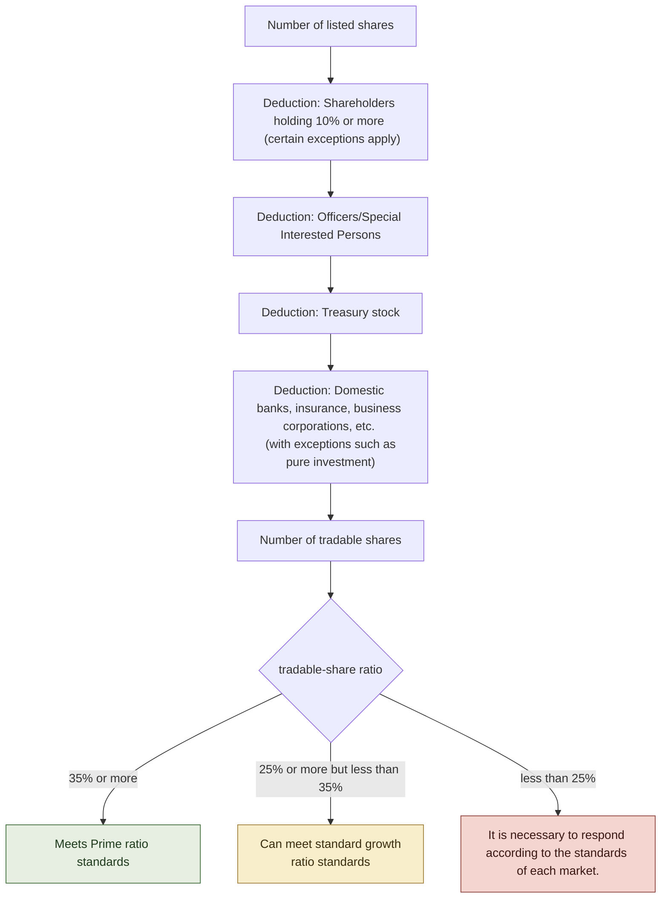

## Suggestions for IR personnel

1. **Reproduce your company's ratio using the TSE formula.** The "free-float ratio" used by a company or an index company's free-float ratio is not necessarily the same as the TSE's tradable-share ratio.
2. **Categorize shareholders not only by attributes but also by purpose of ownership.** Banks, insurance companies, and business corporations may also be included in tradable shares if they can prove their net investment and trading history. Confirm the required documents with shareholders early.
3. **Explain share buybacks and cancellations separately.** Acquisition alone may not improve the ratio. Board of Directors meeting materials and disclosures to investors will indicate whether or not there will be a cancellation and when it will be implemented.
4. **Manage in anticipation of judgment at the end of the business year.** In principle, TSE reviews the status at the end of each fiscal year once a year. In-house estimates are made every quarter so that we can respond before the reference date.
5. **Discuss listing maintenance and capital policy together.** Sales of cross-shareholdings, secondary offerings by major shareholders, capital increases, cancellation of treasury stock, and changes in market classification are matters that should be jointly determined not only by IR but also by finance, legal affairs, corporate planning, and the board of directors.

## Source/reference materials

- Japan Exchange Group “tradable shares – Details of standards for maintaining listing”: https://www.jpx.co.jp/equities/listing/continue/details/02.html
- Japan Exchange Group “Listing Maintenance Standards (Prime Market)”: https://www.jpx.co.jp/equities/listing/continue/outline/01.html
- Japan Exchange Group “Listing Maintenance Standards (Standard Market)”: https://www.jpx.co.jp/equities/listing/continue/outline/02.html
- Japan Exchange Group “Listing Maintenance Standards (Growth Market)”: https://www.jpx.co.jp/equities/listing/continue/outline/03.html
- Japan Exchange Group “Summary of Market Segmentation Review”: https://www.jpx.co.jp/equities/improvements/market-structure/01.html
- Japan Exchange Group "Definition of tradable shares - Exceptional treatment of stocks owned by domestic ordinary banks, insurance companies, business corporations, etc.": https://faq.jpx.co.jp/disclo/tse/web/knowledge8628.html
- Japan Exchange Group “Corporate Governance Code”: https://www.jpx.co.jp/equities/listing/cg/index.html

## Related articles

- **3.1---From 4 categories to 3 categories**: Market reorganization incorporating tradable shares standards.
- **3.3 - Rules for maintaining listing after completion of transitional measures**: Improvement period and procedures up to delisting when standards are not achieved.
- **5.2 -- Final phase of cross-shareholdings**: Overall picture of the system surrounding disclosure, individual verification, and reduction.
- **4.1 -- How to read PBR below 1x**: Capital cost management in parallel with reviewing capital structure.
- **1.2――Who filled the void after the main bank**: Historical background of cross-shareholdings.

---

## Listing maintenance rules after transitional measures end

**SOURCE URL:** https://jpinv.com/governance/market-restructuring/3.3-transitional-measures-cliff/

**記事要約**

In the April 2022 market reorganization, relaxed standards were applied to existing listed companies that did not meet the new market's normal continued listing criteria, provided they disclosed their compliance plans. Initially, the period for this transitional measure was set to be "for the time being," but TSE decided to end it in January 2023. From the record date that arrives after March 1, 2025, the original standards will be applied, and companies that do not meet the standards will enter an improvement period of one year in principle, and six months for trading volume standards. If improvements cannot be made, the shares proceed to delisting after designation as a Security Under Supervision or Security to Be Delisted. This paper outlines this procedure and the options available to companies.

**本文**

> **Key points**
> - When transitioning to a new market, even companies that did not meet the normal continued listing criteria could be eligible for the relaxed standards as a transitional measure if they disclosed a “plan for compliance with the continued listing criteria.”
> - The TSE decided to end the transitional measures on **January 30, 2023** and apply the original continued listing criteria from **a record date that arrives after March 1, 2025**.
> - Companies that fail to meet standards are given a one-year improvement period in principle, and six months for trading volume standards. If the company does not comply within that period, its shares proceed through designation as a Security Under Supervision or Security to Be Delisted, generally for about six months, before delisting.

## Why were transitional measures established?

In the April 2022 market reorganization, existing listed companies independently chose whether to move to Prime, Standard, or Growth. However, at the time of the transition, there were some companies that did not meet the normal standards for remaining listed on the list.

Therefore, TSE has established a transitional measure that applies the relaxed standards only if a company does the following two things:

1. **Disclose plans for compliance with continued listing criteria**
2. **Continuously disclose progress afterwards**

For example, in the prime market, the market capitalization of tradable shares must be at least 10 billion yen, and the tradable-share ratio must be at least 35%. During the transitional measures, relaxed standards were used, such as market capitalization of tradable shares of 1 billion yen or more and tradable-share ratio of 5% or more.

It was a rational system in terms of making the transition smooth. On the other hand, because the end date was initially set as “for the time being”, companies that met the normal standards and companies that submitted plans and were subject to the relaxed standards appeared to be in the same market segment from the outside. This has led to criticism that differences in market segments are not substantive.

## Until the end of transitional measures is decided

In July 2022, TSE established a **follow-up meeting regarding the review of market segments**. This is to continuously consider the effectiveness of new markets, incentives for improving corporate value, and the handling of transitional measures.

After soliciting opinions in the fall of the same year, TSE announced its response policy on January 30, 2023. The main points are as follows.

- Terminating the application of transitional measures
- **The original standards will be applied from the judgment reference date for the continued listing criteria that will arrive after March 1, 2025**
- Companies that do not meet the targets will be subject to the same improvement period system as regular listed companies.
- Certain special provisions will be made for companies that, as of March 31, 2023, have already disclosed plans that expire after March 1, 2026.

For many companies whose fiscal year ends in March, the first reference date is now March 31, 2025. However, the judgment date differs depending on the company's fiscal year end and shareholder record date. Instead of understanding that “all judgments were made in March 2025”, IR personnel need to check **what is the reference date for their company**.

## Basic procedures after March 2025

If the original continued listing criteria are no longer met, the procedures generally proceed in the following order.

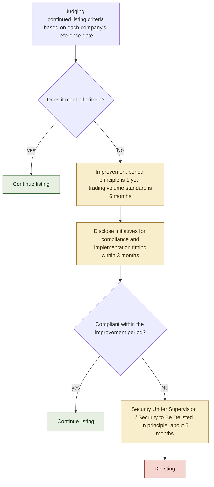

### 1. Judgment based on reference date

In principle, the number of shareholders, number of tradable shares, market capitalization of tradable shares, tradable-share ratio, etc. are determined once a year based on the situation at the end of the business year. For companies where the end of the business year and the record date for recording the status of major shareholders are different, the record date for shareholders, etc. may be used.

### 2. Improvement period

As a general rule, companies that fail to meet standards enter a **1 year** improvement period. The trading volume standard is **6 months**. After announcing that a company has not met standards, it is required to disclose a plan that describes the efforts to achieve compliance and the timing of implementation.

The improvement period cannot be extended simply by submitting a plan. It is necessary to actually comply with the standards within the period.

### 3. Designation as a Security Under Supervision or Security to Be Delisted and delisting

If a company fails to meet the criteria by the end of its improvement period, its shares may be designated as a Security Under Supervision while compliance is checked. If delisting is then decided, they are designated as a Security to Be Delisted and generally remain tradable for about six months before delisting.

Depending on the type of standard, compliance can be determined immediately at the end of the improvement period, so in some cases the designation as a Security Under Supervision (under confirmation) may not be necessary. Therefore, not all companies enter the “six months of supervision” on the same schedule.

## Exceptions and transitional treatment

There are limited exceptions to the system.

### Companies with compliance plans extending beyond the transition deadline

As of March 31, 2023, a company that has disclosed a compliance plan with a deadline that exceeds the first record date that occurs after March 1, 2026 will be treated as a **company with a compliance plan extending beyond the transition deadline**. The company will continue to be designated as a Security Under Supervision until its compliance with the disclosed plan deadline is confirmed.

### Special provisions for tradable-share ratio due to business revitalization support

If a third party holds a certain amount of shares to support business revitalization and TSE deems that the third party is likely to meet the tradable-share ratio criteria within five years, a longer than normal improvement period for the tradable-share ratio may be granted.

These systems do not allow companies to freely extend deadlines according to their wishes. It is necessary to meet the conditions set forth in the listing rules and receive confirmation from the TSE.

## Four options available to companies

Companies that find it difficult to comply with normal standards have four main options.

### 1. Meet the criteria in your current market segment

Companies can seek compliance within the improvement period through secondary offerings, selling cross-shareholdings in the market, canceling treasury stock, raising stock prices and market capitalization through improved business performance, and expanding the investor base.

Here again, the correspondence between measures and standards is important. For example, a reverse stock split typically does not change the tradable-share ratio. Even the acquisition of treasury stock may not lead to an improvement in the ratio unless it is canceled. It is necessary to select measures based on the formula confirmed in 3.2.

### 2. Change to another market segment

A company unable to meet Prime Market criteria may apply to transfer to the Standard Market if it meets that market’s criteria. Failure in its current market does not automatically transfer it to another market. In principle, a transfer requires screening equivalent to an initial listing examination.

In 2023, a one-time system was established for companies that moved from the former First Section to Prime to be able to re-elect the Standard Market. This special provision has already ended, and the standard market classification change procedure is now the norm.

### 3. Choose to go private or integrate with another company

Some companies compare the costs and benefits of remaining listed and choose MBO, TOB by parent company or operating company, or integration with other companies. However, the causal relationship between failure to meet the continued listing criteria and individual M&A differs from case to case. The privatization of a company that fails to meet the criteria should not automatically be attributed to the listing rules.

### 4. Aim for compliance using the improvement period

If it is not possible to complete the measures by the deadline, the company will disclose its plans to achieve this within the improvement period and explain its progress to the market. The plan needs to specifically state the current values for each standard, the necessary improvement range, measures, implementation timing, and major risks.

## From “listed” to “maintaining standards”

With the end of the transitional measures, listed market status is no longer a qualification that can be maintained once acquired. Every year, companies must check whether their current shareholder structure, liquidity, market capitalization, net assets, etc. conform to market standards.

This change has three implications.

**First, IR and finance are linked.** The market capitalization of tradable shares depends on the stock price and the number of tradable shares, the tradable-share ratio depends on the shareholder composition, and the trading value depends on the market trading conditions. Neither can be managed solely by IR or finance alone.

**Second, changing market segments becomes a management option.** Rather than aiming to maintain prime status, it is necessary to select a market by considering consistency with target investors, disclosure system, listing costs, and capital policy.

**Thirdly, the quality of the plan is questioned.** Failure to meet standards cannot be hidden. The company needs to clarify which numbers will be improved, by when, and with which measures, and update its progress.

## Suggestions for IR personnel

1. **Check your company's criteria date.** "March 1, 2025" is not your company's judgment date. The standard is the end of the business year that comes after that.
2. **Manage the margin for each standard numerically.** Sensitivity that reflects not only current prices but also stock price declines, changes in major shareholders, share buybacks, etc. is estimated on a monthly or quarterly basis.
3. **Prepare a plan in advance for when targets are not met.** It is too late to think about measures after entering the improvement period. Back-calculate the time required for board meetings, shareholder meetings, and examinations for secondary offerings, cancellations, market classification changes, etc.
4. **Do not simply refer to a change in market segments as a "downgrade."** If the investor base, disclosure burden, liquidity, and consistency with capital policy can be explained, it can be conveyed as a rational market choice.
5. **Check the latest list.** Securities subject to an improvement period, companies with compliance plans extending beyond the transition deadline, and Securities Under Supervision and Securities to Be Delisted will be updated on the JPX website. Rather than keeping a fixed number of companies in the document, it is more practical to link to the latest list.

## Source/reference materials

- Japan Exchange Group “End of transitional measures regarding continued listing criteria”: https://www.jpx.co.jp/equities/follow-up/04.html
- Japan Exchange Group “Summary of issues at the follow-up meeting regarding the review of market segments and future responses of TSE” (January 30, 2023): https://www.jpx.co.jp/news/1020/20230130-01.html
- Japan Exchange Group “List of stocks subject to improvement period”: https://www.jpx.co.jp/listing/market-alerts/improvement-period/
- Japan Exchange Group “Summary of Delisting Criteria”: https://www.jpx.co.jp/equities/listing/delisting/outline/01.html
- Japan Exchange Group “tradable shares – Details of standards for maintaining listing”: https://www.jpx.co.jp/equities/listing/continue/details/02.html
- Japan Exchange Group “List of stocks with market classification changes”: https://www.jpx.co.jp/listing/stocks/transfers/
- Japan Exchange Group “Follow-up on market segments review”: https://www.jpx.co.jp/equities/follow-up/

## Related articles

- **3.1 -- From 4 categories to 3 categories**: Overall picture of market restructuring with transitional measures in place.
- **3.2――tradable-share ratio**: Reasons for not achieving standards and improvement effects of each capital policy.
- **3.4――TOPIX reform**: Review of index adoption that proceeds separately from market segments.
- **4.3 - List of companies disclosing information on the TSE**: Another mechanism to encourage corporate behavior through public disclosure.
- **5.4 - How to handle unsolicited acquisitions**: Basics of M&A procedures including going private.

---

## TOPIX reform: Selecting constituents independently of market segments

**SOURCE URL:** https://jpinv.com/governance/market-restructuring/3.4-topix-reform/

**記事要約**

TOPIX long included almost all stocks listed on the TSE First Section. With market restructuring, JPX began a two-stage reform to improve its investability while preserving index continuity. Phase 1 reduced the weights of stocks with tradable-share market capitalization below ¥10 billion in ten steps from October 2022 to January 2025. From October 2026, Phase 2 draws from the Prime, Standard and Growth markets, with periodic reviews based on traded value and free-float adjusted market capitalization. Market membership and index inclusion are determined separately.

**本文**

> **Key points**
> - TOPIX was originally a free-float market capitalization weighted index covering all stocks listed on the First Section of the Tokyo Stock Exchange. Even after the market reorganization, existing constituents were retained and reviewed in stages to reduce the impact on investors.
> - **Phase 1 (October 2022–January 2025)** reduced the weights of stocks with tradable-share market capitalization below ¥10 billion in **ten quarterly steps**. The number of constituents fell from about 2,200 to about 1,700.
> - In **Phase 2**, the first periodic replacement will take place in October 2026. Different criteria apply to new inclusions and continuing constituents, selected across Prime, Standard and Growth. The number of constituent stocks is estimated to be approximately 1,200 upon completion of migration.

---

## Why is TOPIX reform integrated with market segments reform?

The old TOPIX was designed as an index that broadly covered the stocks listed on the First Section of the Tokyo Stock Exchange. If a company is listed on the First Section of the Tokyo Stock Exchange, it will, in principle, be included in TOPIX and will receive buying demand from TOPIX-linked funds. While this system is easy to understand when looking at the market as a whole, as the number of stocks on the First Section of the Tokyo Stock Exchange increases, the composition of the index and the liquidity of the investment target no longer necessarily match.

The Financial System Council's “Market Structure Expert Group” report in December 2019 pointed to the direction of separating market segments and TOPIX composition. Market segments is a system that determines the positioning of listed companies and standards for maintaining them listed, and indexes are investment indicators that represent the groups of stocks that can actually be bought and sold by managed funds. There is no necessity to continue operating both on the same basis.

Based on this idea, JPX is promoting reforms to balance TOPIX's market representativeness and functionality as an investment target. As of the end of March 2024, the assets under management linked to TOPIX have reached approximately 110 trillion yen, and a large change in constituent stocks at once would have a large impact on the market. For this reason, the reform is being implemented in two stages.

## Stage 1 (October 2022 to January 2025) - Step by step narrowing down existing stocks

At the time of market reorganization in April 2022, JPX continued to use the constituent stocks of the old TOPIX, regardless of whether they were transitioned to Prime, Standard, or Growth. This is because priority was given to the continuity of the index.

Stocks assessed as having **tradable-share market capitalization below ¥10 billion** were designated for gradual weight reduction. Their weights were reduced in **ten quarterly steps** from the end of October 2022 to the end of January 2025. An October 2023 reassessment allowed improvements in tradable-share market capitalization to be reflected.

As a result of this transition, the number of constituent stocks in TOPIX decreased from approximately 2,200 before the reform to approximately 1,700. Gradually reducing smaller constituents’ weights, rather than immediately excluding them, spreads index-linked fund trading over time and reduces abrupt effects on individual stocks.

## Stage 2 (from October 2026) - Periodic reshuffling independent of market segments

In the second stage, the TOPIX population expands not only to the prime market but also to three markets: **Prime, Standard, and Growth**. Market segment itself is no longer a criterion for recruitment, and stocks are selected based on ease of trading and free float market capitalization.

The first periodic replacement will be held in **October 2026**, the second in **October 2028**, and thereafter periodic replacement will be conducted every October. Stocks that are not continuously included in the initial reshuffling will have their weights reduced in eight steps every quarter from October 2026 to July 2028. There will be a re-evaluation in October 2027, and stocks that meet the continuation criteria will no longer receive weight reductions.

### Criteria for new and continued recruitment

The next TOPIX will be divided into **Additional Criteria**, which applies to companies that are not constituent stocks, and **Continuation Criteria**, which applies to companies that are already constituent stocks.

|indicators|Additional criteria|Continuation criteria|
| --- | ---: | ---: |
|Annual trading value turnover rate|**0.20 or more**|**0.14 or higher**|
|Cumulative ratio of free float market capitalization|**Top 96%**|**Top 97%**|

The reason why the continuation criteria are looser than the additional criteria is to prevent constituent stocks from being replaced frequently due to slight numerical changes. The index is designed to gradually replace illiquid stocks while maintaining index stability.

The annual trading value turnover rate is not simply "annual trading value ÷ market capitalization at the end of the period." It is calculated by summing the monthly turnover rate for the most recent 12 months, and the median daily trading value at the trading session of the TSE, the number of business days, and the free-float market capitalization at the end of the month are used for each month's turnover rate. The cumulative ratio of free-float market capitalization is also calculated among stocks that meet turnover criteria and are not delisted stocks or stocks on special alert.

## “Trade stock” and “float stock” are not the same thing.

The **traditional shares** used in the continued listing criteria for a market segment and the **float shares** used to calculate TOPIX are similar in concept, but are not the same. Tradable shares are defined based on the TSE's listing system and are used to determine the criteria for maintaining listing. On the other hand, TOPIX adjusts the index weight using the **free-float ratio** based on the calculation guidelines of JPX Research Institute.

Therefore, even if the tradable-share ratio improves, it does not necessarily mean that the free float ratio of TOPIX or the selection decision will move in the same range. The sale of cross-shareholdings and changes in the composition of major shareholders can affect both, but the IR department needs to check the calculation method for each separately.

## Phase 1 and 2 schedule

|period|Content|Estimated number of constituent stocks|
| --- | --- | ---: |
|Before reform|In principle, stocks from the First Section of the Tokyo Stock Exchange are adopted.|Approximately 2,200|
|October 2022 - January 2025|Stage 1. Reduce the weight of target stocks in 10 steps|Approximately 1,700|
|February 2025 - September 2026|Transition period after completion of stage 1|Approximately 1,700|
|October 2026|Initial periodic reshuffling of the next TOPIX| ― |
|October 2026 - July 2028|Reducing the weight of transition measures stocks in 8 steps|Estimated reduction to approximately 1,200|
|October 2027|Re-evaluating transitional measures stocks| ― |
|After October 2028|Second regular replacement. Conducted every year thereafter|Approximately 1,200 expected|

The number of approximately 1,200 is an estimate, and the actual number of constituent stocks will vary depending on market conditions at the time of periodic reconstitution and irregular additions/exclusions. Even so, it is clear that the number of stocks will be narrowed down significantly compared to before the reform, and the index will change to one that explicitly reflects the ease of buying and selling.

## What will change for listed companies?

Most importantly, **market segments and index inclusion result in different evaluations**. Companies in the standard and growth markets can also be included in the TOPIX if they meet additional criteria. On the other hand, even companies in the prime market may be removed from the TOPIX if their liquidity and free-float market capitalization do not reach the continuation criteria.

However, companies should not think that they can definitely "get indexed" with short-term measures alone. The trading value depends on investor demand, and there are unique calculation methods for determining the free float ratio. Stock splits and reverse stock splits generally do not increase the free-float market capitalization itself unless the shareholder structure or corporate value changes. It is appropriate to view index compliance as the result of medium- to long-term efforts such as diversifying the shareholder base, enhancing information disclosure, continuing dialogue with investors, and improving business value.

## Suggestions for IR personnel

1. **Manage market segments and TOPIX adoption separately.** Prime listing and TOPIX constituent stock will become independent from now on. Do not confuse the two even in internal documents.
2. **Do not confuse additional criteria with continuing criteria.** 0.14, top 97% will be applied to existing constituents, and 0.20, top 96% will be applied to new candidates.
3. **Check the calculation of tradable shares and free-float shares separately.** Do not directly use the listed maintenance criteria values for TOPIX determination. Refer to the index calculation guidelines and free float ratio calculation method as necessary.
4. **The schedule includes initial replacement in October 2026 and re-evaluation in October 2027.** If the stock falls under transitional measures, it will be possible to explain to investors how the weight reduction will proceed and the conditions for re-evaluation.
5. **Do not treat index adoption as a short-term stock price measure.** Improving liquidity is achieved through information disclosure, expanding the investor base, shareholder composition, and increasing corporate value. IR, finance, and corporate planning need to work on a common premise.

## Source/reference materials

- JPX “TOPIX (TSE Stock Price Index, TPX)” https://www.jpx.co.jp/markets/indices/topix/
- JPX “Summary of TOPIX review” https://www.jpx.co.jp/markets/indices/revisions-indices/
- JPX “First stage review” https://www.jpx.co.jp/markets/indices/revisions-indices/01.html
- JPX “Second Stage Review” https://www.jpx.co.jp/markets/indices/revisions-indices/02.html
- Financial Services Agency “Report of the Financial System Council’s Market Structure Expert Group” (December 27, 2019) https://www.fsa.go.jp/singi/singi_kinyu/market-str/report/20191227.html

## Related articles

- **3.1---From 4 categories to 3 categories**: Review of market segments that progressed at the same time as the TOPIX reform.
- **3.2--tradable-share ratio**: Definition and calculation of tradable shares used in continued listing criteria.
- **3.3 - Listing maintenance rules after transitional measures end**: Transitional measures and improvement period on the market segment side.
- **4.1 -- How to read PBR below 1x**: TSE's request regarding market valuation and capital efficiency.
- **1.1 -- Reasons why "ROE 8%" became the standard for reform**: How capital efficiency came to be viewed as a policy issue.

---

## Growth Market criteria for 2030: What does ¥10bn market capitalization after five years mean?

**SOURCE URL:** https://jpinv.com/governance/market-restructuring/3.5-growth-market-2030/

**記事要約**

The TSE has revised its continued listing criteria in order to make the growth market function as a “market where companies aiming for high growth gather.” After March 1, 2030, the current “market capitalization of 4 billion yen or more after 10 years of listing” will change to “market capitalization of 10 billion yen or more after 5 years of listing.” The target is not the new listing standards, but the maintenance standards that measure growth after listing. The company is required not only to update its growth strategy with the aim of reaching 10 billion yen, but also to consider options from an early stage, including changing to the standard market, M&A, and going private.

**本文**

> **Key points**
> - From **March 1, 2030**, the market capitalization standard for the growth market will change from “4 billion yen or more after 10 years of listing” to **“10 billion yen or more after 5 years of listing”**.
> - This is not a system that requires a market capitalization of 10 billion yen at the time of initial listing. This is a listing maintenance standard that encourages companies to grow to a size that can become investment targets for institutional investors within five years of being listed.
> - If standards are not met, a one-year improvement period will be entered, in principle. However, there is a special provision in place for companies that have disclosed a prescribed compliance plan at the time of transition, to have their delisting postponed until the plan's deadline.

---

## Why revisit the Growth Market?

The Growth Market, which was launched in April 2022, succeeded Mothers and JASDAQ Growth and is positioned as a market for “companies with high growth potential.” On the other hand, many companies remained small for a long time even after being listed, making it difficult for institutional investors to invest a sufficient amount of money.

According to the system outline published by the TSE in September 2025, there are approximately 200 companies with a market capitalization of 4 billion yen or more but less than 10 billion yen, accounting for approximately 30% of the entire growth market. TSE's goal is not to exclude small companies across the board. The idea is to return to listing, not as a destination for growth, but as a starting point for raising growth funds and further increasing business scale and corporate value.

For this reason, at the same time as reviewing the standards, all growth listed companies were requested to take measures to realize "management aimed at high growth." Companies are required to analyze their past growth performance and market valuations and update their growth strategies and disclosures in light of investor expectations.

## What will change from 2030?

Comparing the current system and the revised system, the change is not only in the level of market capitalization. The period until judgment begins will also be shortened from 10 years to 5 years.

|Item|Current standards|After March 1, 2030|
| --- | --- | --- |
|Market capitalization|**More than 4 billion yen**|**More than 10 billion yen**|
|Start of application|After listing **After 10 years**|**After 5 years after listing**|
|Stock price used for judgment|Average daily closing price for three months before the end of the fiscal year|Same as left|
|When standards are not achieved|Improvement period of 1 year in principle|Improvement period of 1 year in principle|
|Other main maintenance criteria|Number of shareholders: 150, market capitalization of tradable shares: 500 million yen, tradable-share ratio: 25%, etc.|No changes in principle|

The system will apply from **the first end of the fiscal year that occurs after March 1, 2030**. Therefore, for companies whose fiscal year ends in March, March 31, 2030 is, in principle, the first reference date.

Market capitalization is not determined solely by the closing price at one point. Calculated by multiplying the average daily closing price for the three months before the end of the business year by the number of listed shares on the last day of the business year. It is not a system that aims to meet standards based on stock price increases over a short period of time, but is designed to use market evaluation over a certain period of time.

## Is “10 billion yen” the same as the prime market standard?

Looking at the numbers alone, this is the same as the total market capitalization of tradable shares in the prime market, which is more than 10 billion yen. However, what is being measured is different.

- The new standard for the growth market is **market capitalization** of the entire company of 10 billion yen or more.
- The maintenance criteria for the prime market is **market capitalization of tradable shares** of 10 billion yen or more, based on shares recognized as circulating in the market.

For companies in which the founder or parent company has a large stake, the market capitalization of tradable shares may not reach 10 billion yen even if the total market capitalization exceeds 10 billion yen. Therefore, just because a company meets the new standards in the growth market does not mean that it will immediately meet the maintenance standards in the prime market.

## New listing standards will not be raised

This review does not aim to raise the entrance to the growth market to a market capitalization of 10 billion yen. Formal requirements such as a market capitalization of 500 million yen or more at the time of initial listing will be maintained.

What TSE focuses on is not only the size at the time of listing, but also **how to achieve high growth after listing**. Even if it is less than 10 billion yen at the time of listing, if there is a clear path to allocating the proceeds to growth investments and increasing the business scale and market evaluation within five years after listing, it will fit the purpose of the growth market. On the other hand, it will be more difficult than before for companies to remain small with vague growth strategies after going public.

This point also affects IPO preparations. The company and lead underwriter need to create not only a short-term plan to pass the listing examination, but also a growth plan that foresees business scale, capital needs, capital policy, and shareholder structure five years after listing.

## Options if standards are not met

Companies that do not reach a market capitalization of 10 billion yen will not be immediately delisted. The main paths a company can take are:

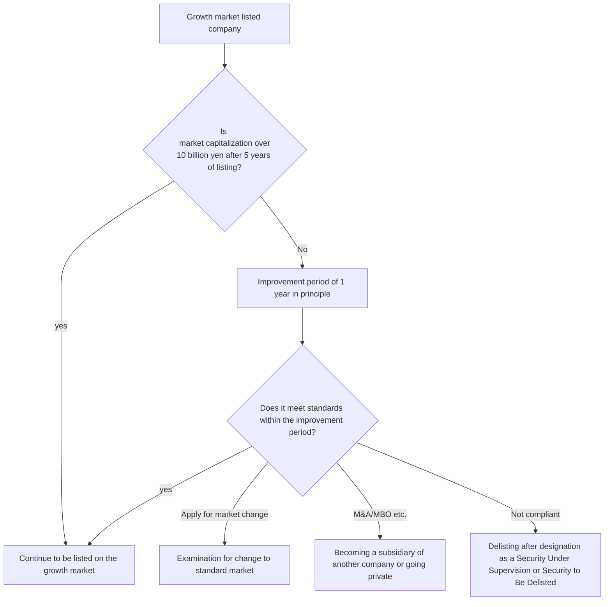

### 1. Aim for 10 billion yen in the growth market

The natural option is to implement growth strategies and increase business value and market valuation. TSE requires companies to analyze past growth performance, market valuation, cost of capital, and future growth investments and update "matters related to business plans and growth potential." Rather than simply setting a numerical target of 10 billion yen, it is necessary to demonstrate the path that will lead to corporate value, such as sales growth, profit margin, customer base, research and development, and M&A.

### 2. Change to standard market

Depending on the company's growth stage and business characteristics, the standard market may be more suitable. However, a market change is not an automatic "downgrade," but is a procedure in which a company applies and is examined against standard market change criteria. In addition to requirements such as a market capitalization of 1 billion yen, a 25% share ratio, and 400 shareholders, companies will also need to comply with all the principles of the Corporate Governance Code.

In the 2025 system review, standards for changing from the growth market to the standard market were also set so that companies that continue to invest in growth do not give up on changing markets solely due to profit requirements. When actually applying, it is necessary to check the latest regulations at that time.

### 3. Choose M&A or going private

Merging with another company or acquisition by an operating company provides options for incorporating a company's technology, talent, and customer base into a larger business infrastructure. In some cases, a company is taken private through an MBO by its founder or private equity, aiming for regrowth away from short-term valuations on the listed market.

The TSE has clearly stated that the purpose of the system review is not only to quickly grow to a scale that institutional investors can invest in, but also to encourage intercompany M&A and entrepreneurs to start their own businesses. M&A is not seen as a punishment for companies that do not meet standards, but as an option to realize business value in another form.

## Special provisions during transition

In principle, companies that fail to meet the standards on the last day of the first business year after March 1, 2030 will enter a one-year improvement period. However, companies that set a compliance plan that is disclosed within three months of the reference date and set a plan period that exceeds the end of the first business year that comes after March 1, 2031 will have their delisting suspended until the plan deadline.

This special provision is a mechanism that requires companies to disclose specific deadlines and plans while avoiding a sudden exit due to simultaneous implementation in 2030. It is not an indefinite grace period. Companies need to demonstrate their plan period, measures, and progress to the market, and achieve compliance with standards by the deadline.

## What to prepare from 2025 to 2030

Although there are several years left until the system comes into effect, market capitalization is not a number that can be directly managed in the short term. It is formed as a result of the accumulation of sales, profits, growth rate, capital policy, and investor trust. For this reason, it is realistic to proceed with preparations in the following order.

1. **Analyze the current situation.** Compare sales growth, profit margin, market capitalization, trading volume, and capital raising results after listing with initial plans.
2. **Create a business path to reach 10 billion yen.** Clarify sales growth rate, profit margin, required investment, financing, and M&A assumptions.
3. **Consider alternatives at the same time.** Decide on the conditions for starting consideration regarding changes to the standard market, capital alliances, business sales, M&A, and going private.
4. **Update disclosure.** "Matters related to business plans and growth potential" will be updated along with analysis of differences from past plans.
5. **Reviewed regularly by the Board of Directors.** Continue to discuss the formation of business value and the discrepancy in market evaluation, rather than short-term fluctuations in stock prices.

## Implications for growth market IR

1. **Do not independently set 10 billion yen as a stock price target.** Market capitalization is the result of market valuation. Show business path including sales, profits, cash flow, growth investments and dilution.
2. **Understand the determination method accurately.** Because the average stock price for the three months before the end of the fiscal year is used, suitability cannot be determined solely by the closing price on the end of the fiscal year.
3. **Do not confuse initial listing criteria and continued listing criteria.** The explanation that "IPO is not possible for less than 10 billion yen" is incorrect.
4. **Consider market changes early.** Changes to the standard market require review, and it takes time to prepare the application and comply with the code. Don't wait until the end of the improvement period.
5. **Do not consider the 2030 special provision as a permanent reprieve.** A compliance plan must have a deadline, and you will be responsible for demonstrating progress and results by that deadline.

## Source/reference materials

- JPX “Review of growth market continued listing criteria” (September 26, 2025) https://www.jpx.co.jp/news/1020/20250926-01.html
- JPX “Responses to demonstrate the functions of the growth market” https://www.jpx.co.jp/equities/follow-up/03.html
- JPX “Listing Maintenance Standards (Growth Market)” https://www.jpx.co.jp/equities/listing/continue/outline/03.html
- JPX “Market Capitalization – Details of Listing Maintenance Criteria” https://www.jpx.co.jp/equities/listing/continue/details/04.html
- JPX “Frequently Asked Questions (Stocks/Listed Companies) – Review of Growth Market Listing Maintenance Standards” https://www.jpx.co.jp/faq/stock_listed_company.html
- Ministry of Economy, Trade and Industry “Guidelines for Corporate Takeovers” (August 2023) https://www.meti.go.jp/press/2023/08/20230831003/20230831003.html
- Ministry of Economy, Trade and Industry “Guidelines for Fair M&A” (June 2019) https://www.meti.go.jp/press/2019/06/20190628003/20190628003.html

## Related articles

- **3.1---From 4 categories to 3 categories**: Overall picture of market reorganization with growth markets established.
- **3.2――tradable-share ratio**: An indicator common to the growth and standard continued listing criteria.
- **3.3—Rules for maintaining listing after completion of transitional measures**: Improvement period, market change, and procedures up to delisting.
- **3.4――TOPIX reform**: A system that selects index stocks based on liquidity, independent of market segment.
- **5.4—How to handle unsolicited acquisitions**: Principles of board conduct when considering M&A.
- **5.3 - Review of listed subsidiaries and affiliated companies**: A perspective to consider the significance of continuing to be listed and the protection of minority shareholders.

---

# テーマ4：capital efficiency revolution

---

## How to read PBR below 1: The real aim of the TSE request

**SOURCE URL:** https://jpinv.com/governance/capital-efficiency/4.1-march-2023-request-anatomy/

**記事要約**

On March 31, 2023, the Tokyo Stock Exchange requested all listed companies on the Prime Market and Standard Market to continue taking measures to realize "management that is conscious of cost of capital and stock prices." It is not a system that requires achieving PBR of 1x. This requires companies to understand their own cost of capital and return on capital, analyze market evaluations by the board of directors, disclose and implement improvement plans, and update them based on dialogue with investors. PBR should not be read as a target per se, but as an indicator that reflects the market's assessment of profitability, growth expectations, and risk.

**本文**

> **Key points**
> - TSE's request is **not a regulatory obligation**. On the other hand, it targets all listed companies in the prime and standard markets and requires continued responses from the board of directors and management.
> - TSE does not have a uniform target of PBR exceeding 1x. The request is for companies to analyze their cost of capital, returns on capital and market valuation, and to implement and update specific measures to improve corporate value.
> - Stock buybacks and dividend increases are also options, but it is not expected that this alone will be the only response. Research and development, human capital, capital investment, business portfolio, and balance sheet need to be reviewed all at once.

---

## TSE request on March 31, 2023

On March 31, 2023, the TSE requested all listed companies on the Prime Market and Standard Market to "take measures to realize management that is conscious of cost of capital and stock prices." It is not a formal rule change, and there are no penalties for violations. TSE itself has clearly stated that “this is not a regulatory obligation.”

Nevertheless, this request had a significant impact on corporate practice. The reason is that the target was not limited to companies with a PBR of less than 1 times, but all companies in both markets. Even companies with high stock prices were required to understand the cost of capital and return on capital, consider market evaluations at board meetings, and continue efforts toward improvement.

The trends indicated by TSE can be summarized into the following three points.

1. **Analyze the current situation.** Understand the market evaluation of your company's cost of capital, return on capital, PBR, etc., and analyze and evaluate it at the board of directors.
2. **Formulate, disclose and implement improvement measures.** Realize and present to investors a plan that will lead to improved return on capital and growth expectations.
3. **Updated based on dialogue.** Don't just announce it once and call it a day; review your efforts based on progress and investors' opinions.

## Why did PBR below 1x attract attention?

The background to this request was the low PBR and ROE of Japanese companies. TSE materials show that even in the prime market, about half of the companies have a PBR of less than 1 times, and many companies have an ROE of less than 8%.

PBR is an index calculated by dividing stock market capitalization by book value of equity. If the ratio is less than 1, it cannot be simply concluded that the value would be higher if the company was dissolved. This is because there are intangible assets that are not included in book value, as well as taxes and expenses when selling assets. Still, it is an important clue that the market may be cautiously evaluating future earnings power and capital allocation.

When a company's PBR falls below 1x, what the board of directors should be asking is not, "How can we raise the stock price to 1x?" More specifically, the question is:

- Does the current ROE exceed the cost of shareholders' equity?
- Is that level temporary or sustainable?
- Where are unprofitable businesses and idle assets located?
- Is it being communicated to the market that growth investments will lead to future cash flow?
- Is the allocation of shareholder returns and growth investments appropriate from the perspective of corporate value?

## Breaking down PBR and thinking about it

The following identity is often used when considering PBR.

> **PBR = ROE × PER**
>
> Stock price/Net assets per share = (Earnings per share/Net assets per share) x (Stock price/Earnings per share)

Based on this formula, the reasons for low PBR can be broadly divided into two. Either ROE, which indicates current profitability, is low, P/E, which indicates the market's assessment of future profit growth and sustainability, or both.

However, **PBR of more than 1x and ROE exceeding the cost of shareholders' equity are not unconditionally true**. In the residual income model, if the market expects that ROE will exceed the cost of equity capital in the future, PBR will likely exceed 1x, and if it expects it to fall below, it will likely fall below 1x. Actual stock prices are also affected by factors such as growth rate, business risk, accounting book value, and non-business assets.

Therefore, although equity spread (ROE - cost of equity) is a powerful diagnostic indicator, it is not the only variable that mechanically determines PBR. Disclosures should not oversimplify the formula and should be tied to the company's business structure and future plans.

## Continuous efforts required by TSE

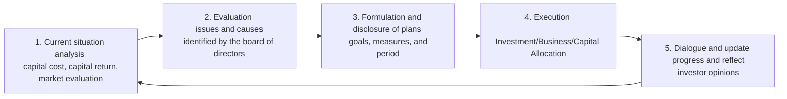

What is important about this series of efforts is that disclosure is not the goal. Disclosure is a means of making it possible for external parties to check analysis by the board of directors, implementation at the business site, and dialogue with investors.

TSE cites research and development, human capital, capital investment, and business portfolio reviews as specific examples. As a result of analyzing the balance sheet, it may be determined that share buybacks or increased dividends are effective, but rather than a temporary measure that only returns profits to shareholders, TSE expects fundamental measures to sustain returns on capital above the cost of capital.

## What the request does not specify

### Deadline for achieving 1x PBR

The request does not specify that the PBR should exceed 1x by what year. PBR is determined by the market, so it is not a goal that the company can directly control. Companies should manage profitability, growth investments, business portfolio, capital structure, disclosure and dialogue.

### Uniform ROE target

ROE of 8% is an important guideline indicated in the Ito report, but it is not the level required by the TSE for all companies. If business risks and capital structures differ, the cost of equity will also differ. The basic idea is for each company to reasonably estimate its own cost of capital and aim for profitability that exceeds that cost.

### Uniform dividend payout ratio and treasury stock acquisition amount

TSE does not set numerical standards for dividend payout ratios or share buyback amounts. Return is an item of capital allocation that is determined after comparing growth investment and financial soundness.

### Uniform disclosure deadline

There was no specific deadline for the start date, and a request was made to respond “as quickly as possible.” Since then, the list of disclosed companies has been published monthly, and the period in which it is listed as “under consideration” has been limited to six months, making it necessary to continually update it in practice.

## Why the request became established in practice

Starting in January 2024, the TSE has been publishing a monthly list of companies that have made disclosures based on requests. From 2025, the period under consideration will be limited to six months, and from 2026 it will also be possible to check the disclosure content of corporate governance reports on a list.

Furthermore, in addition to good examples, it also publishes “cases that have a gap with investors' perspectives” and examples of companies' efforts to solve problems. As a result, companies can now be compared not only on “what they have disclosed,” but also on “whether investors can read and understand the content,” and “whether they are implementing and updating their announced plans.”

In April 2026, the request was updated, and the appropriate allocation of management resources was once again placed as a central issue. In August 2026, a list of companies that investors evaluated as “making progress in initiatives” was also published. The role of the TSE is not to impose numerical targets, but rather to provide a common platform for comparison and dialogue between companies and investors.

## Suggestions for IR personnel

1. **Don't make PBR a standalone goal.** Changes in PBR are explained by dividing them into ROE, growth expectations, risks, and capital structure.
2. **Link cost of capital estimates to board discussions.** Don't just put calculations in the finance department; show how they are used for investment decisions, withdrawal decisions, and return policies.
3. **Disclosure will be updated as progress report.** Do not reprint the initial materials every year, but clearly state the difference from the target, measures taken, and changes based on dialogue with investors.
4. **Shareholder returns are shown in the same table as growth investments.** Explain dividends, stock buybacks, research and development, capital investment, M&A, and human capital as one capital allocation policy.
5. **Inspected based on the latest materials from TSE.** Check not only the 2023 request, but also the 2025 case study, 2026 request update, and investor survey.

## Source/reference materials

- JPX “Request regarding measures to realize management that is conscious of cost of capital and stock prices” (March 31, 2023) https://www.jpx.co.jp/news/1020/20230331-01.html
- JPX “Measures to realize management that is conscious of cost of capital and stock prices (Prime Standard Market)” https://www.jpx.co.jp/equities/follow-up/02.html
- JPX “Regarding the publication of “cases that have a gap with investors' perspectives” regarding “management with an awareness of cost of capital and stock prices” (November 21, 2024) https://www.jpx.co.jp/news/1020/20241121-01.html
- JPX “Updating requests regarding “management with an awareness of cost of capital and stock price” (April 28, 2026) https://www.jpx.co.jp/news/1020/20260428-01.html
- Ministry of Economy, Trade and Industry “Ito Report” https://www.meti.go.jp/policy/economy/keiei_innovation/kigyoukaikei/itoreport.html

## Related articles

- **1.1---Why "ROE 8%" became the standard for reform**
- **2.2—Revised in 2018—Turning point when cost of capital was specified in the code**
- **3.1---From 4 categories to 3 categories---Market reorganization in April 2022**
- **4.2---WACC/ROIC/Equity Spread---Basic terminology of cost of capital management**
- **4.3 - List of companies disclosed on the TSE - Discipline created by public disclosure**
- **4.4—Seven pitfalls to avoid when disclosing cost of capital**
- **4.5—From disclosure to implementation—April 2026 request update**

---

## WACC, ROIC, equity spread - basic terminology for cost of capital management

**SOURCE URL:** https://jpinv.com/governance/capital-efficiency/4.2-cost-of-capital-vocabulary/

**記事要約**

In management that is conscious of the cost of capital, it is necessary to use similar words accurately. Cost of equity and WACC, ROE and ROIC, and equity spread and ROIC spread refer to different capital providers and are used for different comparisons. In this article, we will organize the terms and formulas that the board of directors, corporate planning, and IR should use as a common language. The key is not to list metrics, but to explain how they are used to inform business decisions, investment criteria, capital allocation, and disclosures.

**本文**

> **Key points**
> - **ROE is compared with cost of equity and ROIC is compared with WACC.** If you use the wrong indicators for comparison, your judgment on value creation will also be wrong.
> - There is no one-size-fits-all correct answer to the cost of capital. It is important to be able to explain calculation methods, assumptions, reference periods, and sensitivities.
> - PBR and stock prices are the resulting market evaluations, and what management should directly control are profitability, growth, invested capital, risk, and capital allocation.

---

## Why terminology matters

The expressions “increase capital efficiency” and “be conscious of the cost of capital” alone do not have a clear practical meaning. The numbers used and decisions made will differ depending on whether you are looking at shareholder returns for the company as a whole, the return on invested capital for each business, or the cost of capital including debt.

What TSE is seeking is not to increase the number of difficult financial terms. It means accurately understanding your company's cost of capital and return on capital, and using it to make decisions about investments, withdrawals, M&A, shareholder returns, and business portfolios. In IR materials, it is necessary to indicate terms and formulas, and then explain the connection to management decisions.

## List of basic terms

|term|general formula|what to measure|Main comparison target|
| --- | --- | --- | --- |
|**Cost of equity**|In CAPM `rE = rf + β × ERP`|Required rate of return commensurate with the risk borne by shareholders|ROE, shareholder return, stock value evaluation|
|**Cost of Debt**|effective interest rate. WACC usually adjusts after tax|Financing costs such as loans and bonds|Investment decisions, capital structure|
| **WACC** |`(E/V)×rE + (D/V)×rD×(1−tax rate)`|Weighted average cost of capital including equity and interest-bearing debt|ROIC, business investment, corporate value evaluation|
| **ROE** |Net income ÷ average equity capital|How much final profit was generated relative to shareholders' equity?|cost of equity|
| **ROIC** |NOPAT ÷ invested capital|How much operating profit after tax was generated from the capital invested in the business?| WACC |
|**Equity Spread**|ROE - Cost of stockholders' equity|Excess return on equity|Is it greater than 0?|
|**ROIC spread**| ROIC－WACC |excess return on invested capital|Is it greater than 0?|
|**Residual profit/economic profit**|`(ROE−rE) x equity capital` or `(ROIC−WACC) x invested capital`|Capture excess returns in terms of amounts rather than rates|Value creation amount by business/period|
| **CROIC** |Depends on company definition|Return on invested capital using cash flow|WACC etc.|
|**PBR decomposition**| `PBR = ROE × PER` |Dividing PBR into current profitability and market valuation|Comparison with peers, cause analysis|

## Cost of equity and WACC

The cost of equity is the expected rate of return for the business and financial risks borne by shareholders. CAPM is often used in practice.

> **Cost of Equity Capital (CAPM)**
>
> `rE = risk-free rate + β × stock risk premium`

The results will vary depending on which government bond yield you use, how many years and how often you estimate beta, and how you set the stock risk premium. Therefore, just because a company presents one number does not necessarily mean that investors will adopt the same premise. It is more practical to show the basis of numerical values, ranges, and sensitivities.

WACC is a weighted average of the cost of equity and the cost of debt based on the composition ratio of equity and interest-bearing debt. The after-tax cost of debt is used because interest paid has a tax effect.

> **WACC**
>
> `WACC = (E/V)×rE + (D/V)×rD×(1−t)`

Here, E is stock value, D is interest-bearing debt, V is E+D, and t is the effective tax rate. Definitions vary from company to company, including whether market value or book value is used, and how cash is deducted from invested capital. In disclosure, it is necessary to specify not only the calculation results but also the definition.

## What is the difference between ROE and ROIC?

ROE measures how much profit a company as a whole generates from its shareholders' equity. It can be broken down into profit margin, asset turnover, and financial leverage.

> **DuPont decomposition of ROE**
>
> `ROE = Net profit margin on sales × Total asset turnover rate × Financial leverage`

ROE is important for shareholders, but it can also increase by increasing debt. Therefore, it is difficult to distinguish between the profitability of the business itself and the effect of financial leverage using ROE alone.

ROIC measures how much after-tax operating profit a business generates from its core business relative to the capital invested in the business from both debt and shareholder equity. It is suitable for managing capital efficiency for each business division or segment.

> **Typical form of ROIC**
>
> `ROIC = NOPAT ÷ Invested Capital`

However, the definitions of NOPAT and invested capital are not uniform. The figures change depending on whether goodwill, lease liabilities, surplus cash, and equity method investments are included. When using a company's own ROIC, it is necessary to specify the calculation formula and adjustment items and make it consistent throughout the period.

## Capturing value creation through spreads

The return on capital is more meaningful when viewed in terms of the difference between it and the cost of capital, rather than its individual height.

- **Equity Spread = ROE - Cost of Equity**
- **ROIC spread = ROIC－WACC**

If the spread is positive, the company is generating returns above the level required by the capital provider. If it is negative, it may mean that even if you are making a profit, you are not generating returns commensurate with the risk.

Furthermore, by multiplying the spread by the amount of capital, the amount of value created can be expressed in monetary terms as residual profit or economic profit. Even if the ratio is high, the monetary effect will be limited if the invested capital is small, and if the ratio is applied to even a small amount of capital, it will have a large impact on corporate value. When comparing business portfolios, it is effective to use both rates and amounts.

## PBR and residual profit model

`PBR = ROE × PER` is an accounting identity, and is the starting point for dividing the reason for low PBR into ROE and PER.

In the residual income model, stock value is expressed as the sum of the current book value of equity and the present value of future residual income.

> `Equity value = Current book value of equity + Present value of future residual income`
>
> `Residual profit = (ROE - cost of stockholders' equity) × beginning equity capital`

Based on this idea, if the market expects a positive equity spread in the future, PBR will likely exceed 1x, and if it expects a negative spread, it will likely fall below 1x. However, actual PBR is affected by factors such as growth rate, risk, intangible assets that are not recognized in accounting, and non-business assets, so it is not a simple one-to-one correspondence.

## Precautions when using CROIC

CROIC is used as an indicator that uses operating cash flow and free cash flow as the numerator of ROIC. However, there is no single standardized definition. The numbers vary greatly depending on whether maintenance investments are deducted, working capital fluctuations are smoothed out, and how M&A is handled.

When disclosing CROIC, be sure to indicate the following three points.

1. Definition of cash flow used in the numerator.
2. Definition of invested capital used in the denominator.
3. How did you handle temporary working capital changes and large investments?

Proprietary indicators are only useful if they have clear definitions, continue to use the same method, and can be used as a bridge with legal indicators.

## How to incorporate indicators into management

Good disclosure has more to do with decision-making than a list of metrics.

- Which WACC or hurdle rate should new investments be reviewed?
- What decisions should be made to improve or withdraw from existing businesses when ROIC falls below WACC?
- In M&A, how do you evaluate acquisition price, goodwill, and ROIC after integration?
- How do you decide on shareholder returns by comparing growth investment opportunities and financial strength?
- In a medium-term management plan, how should improvements in ROE and ROIC be broken down into profit margin, asset turnover, and invested capital?

The ROIC tree is one way to translate this connection into the field. ROIC is divided into profit margin and invested capital turnover ratio, and further broken down into daily business indicators such as price, product mix, cost, inventory, accounts receivable, and fixed assets. The important thing is not to post diagrams, but to link the actions of each department to corporate value.

## Suggestions for IR personnel

1. **Specify who is comparing ROE and ROIC.** ROE is compared to cost of shareholders' equity, and ROIC is compared to WACC.
2. **Cost of capital is explained not as a point but as a range with assumptions.** Allow disclosure of rf, β, ERP, cost of debt, tax rate, capital structure.
3. **Fix the definition of your own index.** Do not change the calculation formula for ROIC or CROIC for each document.
4. **Connect company-wide and business-specific metrics.** Shows not only consolidated ROE but also segmental ROIC and improvement measures.
5. **Back up your metrics with decision-making performance.** Explain not only the target value but also how it was used for investment, withdrawal, M&A, and return.

## Source/reference materials

- JPX “Measures to realize management that is conscious of cost of capital and stock prices (Prime Standard Market)” https://www.jpx.co.jp/equities/follow-up/02.html
- JPX “Regarding the publication of “case studies that have a gap with investors' perspectives” regarding “management with an awareness of cost of capital and stock prices” https://www.jpx.co.jp/news/1020/20241121-01.html
- JPX “Determination of companies to be awarded for the 7th Corporate Value Improvement Award” (Example of utilizing ROIC in business management) https://www.jpx.co.jp/news/1024/nlsgeu000003s94a-att/20190128_Release_jp.pdf
- Ministry of Economy, Trade and Industry “Ito Report” https://www.meti.go.jp/policy/economy/keiei_innovation/kigyoukaikei/itoreport.html
- Ministry of Economy, Trade and Industry “Ito Report 3.0 (SX version)” https://www.meti.go.jp/policy/economy/keiei_innovation/kigyoukaikei/ito_review.html

## Related articles

- **1.1---Why "ROE 8%" became the standard for reform**
- **4.1――How to read PBR1 times decline**
- **4.3 - List of companies disclosed on the TSE - Discipline created by public disclosure**
- **4.4—Seven pitfalls to avoid when disclosing cost of capital**
- **4.5—From disclosure to implementation—April 2026 request update**

---

## TSE’s disclosure list: The discipline created by public visibility

**SOURCE URL:** https://jpinv.com/governance/capital-efficiency/4.3-the-disclosure-list/

**記事要約**

Instead of forcing companies to "manage with an awareness of cost of capital and stock prices" through rules, the TSE has created a system to publicize the status of its response. The list of disclosing companies, which began in January 2024, shows each company's status on a monthly basis, such as “disclosed” or “under consideration,” based on their corporate governance reports. In 2025, the period of “under consideration” will be increased to six months, and in 2026 it will be possible to check the disclosure content of each company on a list. While the list itself does not score quality, it provides an entry point for comparison and dialogue, encouraging continuous disclosure updates.

**本文**

> **Key points**
> - Starting in January 2024, the TSE has been publishing a **Disclosed Company List** every month, targeting companies in the Prime and Standard markets, showing the status of their response to requests.
> - From January 2025 onwards, an item can be listed as “under consideration” for up to six months in principle. You'll also see the date your disclosure was updated and whether you'd like to receive communications from institutional investors.
> - From January 2026 onwards, you will also be able to see a list of each company's disclosures included in their corporate governance reports. It has become easier to compare not only the presence or absence of participation, but also the content.

---

## Why publish the list?

The March 2023 request is not a regulatory requirement. It is not a system in which the TSE examines each company's plan and decides whether it passes or fails, or imposes fines on companies that cannot achieve numerical targets for PBR or ROE.

Therefore, TSE adopted a method of making the status of response visible to market participants. By listing what a company discloses, investors can compare companies in the same industry side-by-side. Companies can also check whether they are the only ones who have postponed their response or whether updates have stopped after the initial disclosure.

With this system, there is no need for TSE itself to score each line on the merits of disclosure. Investors engage in dialogue, exercise voting rights, and make investment decisions based on published information. That comparability drives companies to improve disclosure and implementation.

## Changes in the list

|period|Main changes|
| --- | --- |
|**March 31, 2023**|Publish request to all Prime Standard companies|
|**October 2023**|Announcement of policy to publish list of disclosed companies|
|**January 2024**|The first list is published. From then on, updates will be made on the 15th of each month as a general rule.|
|**January 2025**|Renewal date, request for contact from institutional investors, introduction of 6-month limit for “under consideration”|
|**January 2026**|List of disclosures by each company in the CG report|
|**August 2026**|Publishes a list of "companies that are making progress" based on an investor survey|

The list is created based on the most recently submitted corporate governance report at the end of each month. The list as of the end of July 2026 was published on August 14th. In this way, the latest status is constantly updated, so it is more reliable to check the current TSE file than the number of companies in the article.

## Current classification method

Each company selects the content to be disclosed in the “Measures to realize management that is conscious of cost of capital and stock price” section of the CG report.

|Treatment on list|Selection in CG report|meaning|
| --- | --- | --- |
|**Disclosed**|“Disclosure of initiatives (first time)” or “Disclosure of initiatives (update)”|Discloses initiatives or updates thereof|
|**Under consideration**|“Disclosure of consideration status”|We are considering disclosing specific initiatives. Generally posted for up to 6 months|
|**Not listed**|Not applicable to the above|Cannot be confirmed as disclosed or under consideration on the list|

“Disclosed” does not mean that the content is sufficient. Even an abstract explanation of a few lines can be listed as disclosed if it is disclosed in a predetermined format. On the other hand, even if detailed materials are published, if the references and selected items in the CG report are not appropriate, they may not be reflected correctly in the list.

In addition to creating materials, IR personnel also need to check that the CG report and the list display match.

## What does the 6 month rule mean?

The initial "under consideration" status was an interim state to allow the company time to conduct a thorough analysis. However, if there is no deadline, specific disclosure can be postponed while it remains under consideration.

Starting from January 2025, the TSE will limit the period for listing items under consideration to six months. This does not mean that you will necessarily improve your PBR within 6 months. The expectation is that companies advance to concrete disclosure of their current analysis, challenges and intended actions.

Even if consideration takes time, it is easier to gain investors' understanding by indicating what is being analyzed, when it was discussed at the board meeting, and by when the next disclosure will be made, rather than simply stating that it is "under consideration."

## What you can check on the list

The list includes company name, stock code, market segment, industry, disclosure status, first disclosure date, update date, etc. From 2025 onwards, you will also be able to see which companies would like to be contacted by institutional investors. From 2026 onwards, it will become easier to access the disclosures contained in CG reports.

In practice, the following three points should be considered.

### 1. Interval between initial disclosure date and update date

Companies that have not updated their information after initial disclosure may have created materials and stopped responding. If medium-term management plans, capital policies, and business portfolios change, disclosures regarding cost of capital will also need to be reviewed.

### 2. Differences from other companies in the same industry

Even among companies in the same industry and size, there are differences in the specificity of capital cost figures, ROIC management, business-specific improvement measures, and shareholder return policies. The list can be used as an entry point for finding comparison targets.

### 3. Contents of “Disclosed”

Don't judge based on the condition alone, read the actual description. Confirm that the basis for capital cost, current situation analysis, goals, measures, progress, and updates are based on dialogue.

## Materials to supplement the list

TSE not only publishes lists, but also continuously publishes materials for considering the quality of disclosure.

- **Points based on the investors' perspective**: Organize what investors value.
- **Case study collection (Prime Standard)**: Introducing reference cases from actual disclosures.
- **Cases where there is a gap with investors' perspectives**: Organized abstract explanations, individual presentation of PBR targets, bias towards shareholder returns, etc.
- **A collection of case studies of companies' efforts to solve problems**: Rather than disclosing text, we introduce how problems were solved within the company.
- **2026 Company and Investor Survey**: Visualizing dialogue challenges and companies where investors are evaluating progress.

While a list shows who is disclosing, these materials show what the disclosure conveys and what kind of implementation will be evaluated. Both must be read together.

## Strengths and limitations of public discipline

The strength of the publication method is that all market participants can use the same information. It can be used immediately for peer comparisons, investor dialogue, and internal explanations without waiting for administrative action. The more information is disclosed, the more noticeable non-disclosure and suspension of updates become.

On the other hand, there is also the danger that being on the list becomes an end in itself. Status classification does not assurance the quality of disclosure or implementation results. Even if you show numbers, if the assumptions are unclear or if the goals and measures are not connected, investors' evaluations will not be high.

Therefore, it is appropriate to view the list as a starting point for dialogue, rather than a list of successful applicants.

## Suggestions for IR personnel

1. **Check your company's visibility in the monthly list.** Check for errors in status, date of first disclosure, date of update, and link destination.
2. **If "Under consideration", proceed to the next stage within 6 months.** Internally, the deadline is approximately 5 months, which includes updating the CG report.
3. **Determine update policy after initial disclosure.** Updated at least once a year, and whenever there are changes to the medium-term plan or capital policy.
4. **Compare 10 to 20 companies in the same industry.** Compare not only the status but also the basis of capital cost, goals, measures, and specificity of progress.
5. **Listing is not considered an achievement.** Disclosure has meaning only when it is used for dialogue with investors and management execution.

## Source/reference materials

- JPX “Measures to realize management that is conscious of cost of capital and stock prices (Prime Standard Market)” https://www.jpx.co.jp/equities/follow-up/02.html
- JPX “Review of the list of disclosed companies” (September 27, 2024) https://www.jpx.co.jp/news/1020/20240927-01.html
- JPX “Review of the list of disclosed companies” (September 26, 2025) https://www.jpx.co.jp/news/1020/20250926-02.html
- JPX “Regarding the publication of “case studies that have a gap with investors' perspectives” regarding “management with an awareness of cost of capital and stock prices” https://www.jpx.co.jp/news/1020/20241121-01.html
- JPX "Updating the requirements regarding 'management with an awareness of cost of capital and stock prices'" https://www.jpx.co.jp/news/1020/20260428-01.html

## Related articles

- **3.3――Listing maintenance rules after transitional measures end**
- **4.1――How to read PBR1 times decline**
- **4.2――WACC・ROIC・Equity Spread**
- **4.4—Seven pitfalls to avoid when disclosing cost of capital**
- **4.5—From disclosure to implementation—April 2026 request update**
- **5.1—Simultaneous disclosure in Japanese and English is just the beginning**

---

## 7 pitfalls to avoid when disclosing cost of capital

**SOURCE URL:** https://jpinv.com/governance/capital-efficiency/4.4-seven-sins-misalignment/

**記事要約**

In November 2024, the TSE organized how investors read the efforts of listed companies as “cases where there is a gap between investors' perspectives.” The official materials show 10 typical examples spanning three stages: analysis/evaluation, review/disclosure of initiatives, and dialogue/update. In this article, we will show you how to check your company's disclosure by rearranging the content into seven check items that are easy to use in IR practice.

**本文**

## Main points

- On **November 21, 2024**, TSE announced “cases where there is a gap between investors' perspectives.” The target is a total of 10 items divided into three stages: (1) analysis and evaluation, (2) consideration and disclosure of initiatives, and (3) dialogue and updates.
- The problem is not just that the numbers are small. Companies are facing a series of weaknesses, including evaluating the current situation only from their own perspective, failing to decide on the balance sheet they are aiming for, simply listing measures but not showing cause-and-effect relationships, and failing to reflect dialogue with investors in their next decisions.
- The following “7 Pitfalls” are the result of this course reorganizing the 10 items of the TSE according to the order of practical inspection. TSE itself does not indicate seven classifications.

---

## Check for discrepancies before “copying good practices”

A collection of good practices can help you understand what a complete disclosure looks like. However, even if you simply transfer indicators and charts from other companies, they will not be persuasive unless they are linked to your company's issues. The first thing to do is to find out where your company's analysis and explanations deviate from investors' awareness of the issues.

TSE materials conduct this inspection in three stages.

1. **Analysis/Evaluation** - How do you view the cost of capital, return on capital, market valuation, and balance sheet?
2. **Consideration and disclosure of initiatives** - How are targets, capital allocation, business portfolio, and executive compensation designed and explained in response to issues?
3. **Dialogue/Updates** - Does the company respond to dialogue with investors and reflect the content in disclosure and review of measures?

The points and case studies revised in December 2025 are based on the exchange of opinions with investors from over 400 companies both domestically and internationally. Therefore, it is best to think of the points raised here not as abstract model theory, but as a summary of the discomfort that investors feel when reading actual disclosures.

---

## 7 pitfalls

| # |Pitfall|Signs that are likely to appear in disclosure|Direction to review|
| --- | --- | --- | --- |
| **1**|**Assess the current situation using only your own yardstick**|It is judged that being above the average in the same industry is sufficient. It does not consider the basis for the cost of shareholders' equity or the discrepancy with market evaluation.|Assess the position from multiple perspectives, including investor dialogue, business risks, shareholder composition and the market’s required return.|
| **2**|**Look only at the surface of PBR and ROE**|They merely point out that PBR is below 1x and ROE is low, but they do not analyze factors such as profitability, growth expectations, asset efficiency, and information asymmetry.|Break down ROE, ROIC, margins, asset turnover and business-level profitability, and examine differences between management and market perceptions.|
| **3**|**Undecided on target balance sheet and capital allocation**|By simply explaining cash and deposits, cross-shareholdings, interest-bearing debt, growth investments, and shareholder returns individually, it is difficult to see what the company is aiming for as a whole.|Indicate the desired capital structure and priority order of capital allocation based on required funds, risk tolerance, investment opportunities, and debt capacity.|
| **4**|**Putting the goal first and not showing the connection to the task**|There are numbers such as "ROE 10%" and "PBR over 1x", but I don't know why they are at those levels or what they need to change to achieve them.|Connects logic from current situation analysis to goals, and breaks it down into specific measures such as profit margin, asset efficiency, business structure, and capital policy.|
| **5**|**Do not delve into unprofitable businesses and motivation of managers**|The company assumes that all businesses will grow, and is not considering downsizing, withdrawing from, or selling unprofitable businesses. Executive compensation is also biased toward single-year performance.|Examine each business’s returns on capital and decide whether to restructure, invest further, sell or exit. The compensation system will also be aligned with medium- to long-term corporate value.|
| **6**|**Just listing measures, not showing cause and effect relationship**|It enumerates DX, human capital, M&A, share buybacks, etc., but it does not show which issues should be improved and how, and which indicators would be effective.|Explain in the order of "Issue → Measures → KPI → Expected Effect → Verification Timing".|
| **7**|**Management judgment is not updated even after dialogue**|Disclosing only the number of meetings, refusing dialogue without a reasonable reason, and failing to reflect the points gained through dialogue in next year's plans and disclosures.|It will also disclose the main points raised during the dialogue, the considerations made by the board of directors, and the reasons for changes and postponements.|

---

## Pitfall 1: Assessing the current situation using only your company’s yardstick

The cost of capital is not an internal standard determined by the company at its convenience. The company estimates the rate of return required by the fund provider, taking into account business risks and the market environment. For this reason, simply showing the calculation formula is not always sufficient. If the level differs significantly from what investors perceive, it is necessary to explain why the difference occurs.

Also, being above the average in your industry alone is not enough. Investors choose investments not only within their own industry, but also in other industries and overseas companies. If the profitability of the industry as a whole is low, “at par with the same industry” is no basis for exceeding the cost of capital.

In addition to the cost of capital figure or range, the disclosure should include the main assumptions, the understanding gained through dialogue with investors, and the deviation from the company's perceived market valuation. TSE does not provide a uniform correct value. Importantly, a company's estimates are verifiable and align with investors' views.

---

## Pitfall 2: Only looking at the surface of PBR and ROE

Merely confirming that the PBR is below 1x and writing that the market valuation is low cannot be considered analysis. The necessary response will differ depending on whether ROE is below the cost of capital, whether there are doubts about the sustainability of growth, whether excessive assets are pushing down on profitability, or whether business content is not being communicated.

The same goes for ROE targets. For example, by using the following decomposition, you can see which management issues need to be addressed.

> **ROE = Net profit margin × Total asset turnover × Financial leverage**

It is effective to compare ROIC and WACC by business. Even if the company's overall ROE has improved, if there are still businesses that are below the cost of capital, the portfolio issues have not been resolved. When explaining market valuation, it is more important to show the structure that produces the numbers than the level of the numbers.

---

## Pitfall 3: Not deciding on the desired balance sheet

Even if you individually explain the reasons for holding large amounts of cash and deposits, the reasons for retaining cross-shareholdings, and the reasons for not increasing interest-bearing debt, it is unclear whether the combined balance sheet is appropriate for the company's strategy. What investors want to know is the level of required funds based on business risks and growth opportunities, and where to allocate surplus funds.

Stock buybacks and dividend increases may be appropriate based on analysis. However, if this is the only response to the TSE request, it will miss out on how to increase the competitiveness of the business and future profit growth. It is necessary to compare R&D, human capital, capital investment, M&A, debt repayment, and shareholder return in the same table and indicate priorities and decision criteria.

---

## Pitfall 4--Putting the goal first and not showing the path to achieving it

Investors cannot judge the feasibility of a plan just by looking at numbers such as "ROE of 10% in FY2027" or "PBR of 1x or more." PBR is a valuation given by the market and is not an indicator determined directly by management. ROE also has different meanings depending on improving profit margins, reducing assets, and changing financial leverage.

Goals must be derived from an analysis of the current situation. For example, indicate whether to increase profit margins by restructuring low-profit businesses, increase asset turnover by reducing working capital, or return surplus capital. By setting a deadline and a responsible party for each measure, and even indicating a review policy for when performance deviates from the plan, goals turn from mere declarations to tools for business management.

---

## Pitfall 5: Not delving into unprofitable businesses and executive compensation

The most difficult aspect of increasing capital efficiency is how to deal with businesses that are not producing profits. If there is room for improvement, rebuild it; if there is a more suitable owner, sell it; if there is no prospect of future returns exceeding the cost of capital, exit. Even if all businesses are maintained and only the overall goal is set, the allocation of management resources will not change.

At the same time, it is also necessary to check the management evaluation system. Remuneration that is linked only to sales or operating profit for a single year tends to motivate companies to accumulate assets and expand their scale. By showing how ROIC, ROE, TSR, business portfolio progress, etc. are reflected in medium- to long-term compensation, you can explain the mechanism for implementing the plan.

---

## Pitfall 6 - Don't just list the measures

At first glance, sentences like the following seem to involve a lot of efforts. However, I don't know what to solve.

> "We will increase corporate value through growth investment, DX, human capital investment, M&A, and shareholder returns."

What is needed is not the number of measures, but the causal relationship. For example, if you write, "Business A's low asset turnover rate is pushing down ROIC, we will shorten inventory days from X days to Y days and increase ROIC to Z% by FY2027," which will create a series of tasks, actions, indicators, and deadlines.

There is nothing wrong with using the medium-term management plan as a response to the TSE's request. However, in addition to showing the existing pages of the medium-term plan, it is necessary to make it possible to read the review based on the relationship with the cost of capital, the analysis of the board of directors, and dialogue with investors.

---

## Pitfall 7: Dialogue does not lead to management decisions

Even if the number of interviews and number of participants are disclosed, the results of the dialogue cannot be determined. What matters are what issues investors raise, how management and the board consider them, and what changes they make.

Furthermore, not being able to communicate important undisclosed facts is one thing, but refusing to have dialogue with investors is another issue. Attitudes such as not responding to interviews without a reasonable reason or uniformly refusing requests for interviews with outside directors are inconsistent with the Code's emphasis on dialogue and the purpose of the TSE's request.

When updating disclosures, it is a good idea to specify what has changed from the previous year. If you change your goals, explain why. If you decide not to take any measures, consider the investor's proposal and explain the reason for the decision. The purpose is not to follow the dialogue, but to show that the dialogue was used as a basis for making decisions.

---

## Self-check in 90 seconds

1. Can you explain the basis for the cost of capital, including the difference in perception between you and investors?
2. Are the levels of PBR, ROE, and ROIC broken down into business and financial factors?
3. Are the balance sheet goals and priorities for fund allocation indicated?
4. Is there a verifiable causal relationship between the goals and specific measures?
5. Has the company made a decision to rebuild, make additional investment, sell, or withdraw from a business that is below the cost of capital?
6. Rather than listing measures, do you explain them in the order of "Issue → Measures → KPI → Deadline"?
7. Are there any instances in which disclosures or management decisions have been updated in response to dialogue with investors?

If there is even one item that you are unable to answer, that is the next point to revise. Rather than assigning scores, it is more important to ask specific questions at board meetings.

---

## Implications for IR

1. **Make the 10 items of TSE a confirmation list before publication.** Don't check IR materials, medium-term management plans, and corporate governance reports separately, but make sure they can be read with the same logic.
2. **Do not make the capital cost figure the only point of contention.** As a group, explain the basis of the numbers, the difference in perception from the market, and how that difference was verified through dialogue.
3. **Link board discussions to disclosure.** Make sure the analysis, goals, business portfolio, and capital allocation are approved by the board of directors, rather than just having the IR department do the writing.
4. **Do not publish the same sentences every year.** Updates that show what has been maintained and what has changed based on results, dialogue, and changes in the environment.
5. **A good example is learning the structure and not borrowing numbers.** Instead of transferring other companies' WACC and ROIC goals, refer to "how they connect issues to measures."

---

## Source/reference materials

- Tokyo Stock Exchange “Regarding the publication of “cases that have a gap with investors' perspectives” regarding “management that is conscious of cost of capital and stock prices” (November 21, 2024): https://www.jpx.co.jp/news/1020/20241121-01.html
- Tokyo Stock Exchange “Measures to realize management that is conscious of cost of capital and stock prices (Prime Standard Market)”: https://www.jpx.co.jp/equities/follow-up/02.html
- Tokyo Stock Exchange “Summary of updated key points and case studies of “Management with an awareness of cost of capital and stock prices” (2024): https://www.jpx.co.jp/equities/follow-up/nlsgeu000006gevo-att/mklp77000000k4tq.pdf
- Tokyo Stock Exchange “Regarding the publication of “Examples of companies' efforts to solve problems” related to “Management with an awareness of cost of capital and stock prices” (December 26, 2025): https://www.jpx.co.jp/news/1020/20251226-01.html
- Tokyo Stock Exchange “Guide to how to use points and case studies” (2025): https://www.jpx.co.jp/equities/follow-up/jr4eth0000004vj2-att/t13vrt000000dlhw.pdf
- Tokyo Stock Exchange "Results of institutional investor survey regarding 'companies that are making progress in initiatives'" (August 12, 2026): https://www.jpx.co.jp/corporate/news/news-releases/1020/20260812-01.html

---

## Related articles

- **Theme 4.1** ---[How to read PBR below 1x--The true aim of the TSE request](/governance/capital-efficiency/4.1-march-2023-request-anatomy/)
- **Theme 4.2** ---[WACC/ROIC/Equity Spread--Basic terminology of cost of capital management](/governance/capital-efficiency/4.2-cost-of-capital-vocabulary/)
- **Theme 4.3** ---[List of companies disclosing information on the TSE -- Discipline created by public disclosure](/governance/capital-efficiency/4.3-the-disclosure-list/)
- **Theme 4.5** -- [From disclosure to implementation -- Request updated in April 2026](/governance/capital-efficiency/4.5-action-plan-2-update/)
- **Theme 5.2** ---[Final phase of cross-shareholdings -- Verification and disclosure for each stock](/governance/frontier/5.2-cross-shareholdings-end-game/)

---

## From disclosure to implementation - April 2026 request update

**SOURCE URL:** https://jpinv.com/governance/capital-efficiency/4.5-action-plan-2-update/

**記事要約**

On April 28, 2026, the Tokyo Stock Exchange updated its requirements regarding "management with an awareness of cost of capital and stock prices." The new central issue is "appropriate allocation of management resources." The focus has shifted from whether initial disclosures have been made to assessing growth investment, business portfolios, balance sheets and shareholder returns together, with evidence of implementation and progress. In this paper, we will summarize the position of the update and what should be changed in IR disclosure.

**本文**

## Main points

- **April 28, 2026**, TSE announced "Updated requirements regarding 'management with an awareness of cost of capital and stock price'". The central phrase in the official document is “appropriate allocation of management resources.”
- The request for 2023 has not been withdrawn. The basic flow of understanding the cost of capital and return on capital, analyzing it at the board of directors' meeting, disclosing the plan, and updating it based on dialogue with investors will continue.
- What has changed is the center of gravity of evaluation. Companies are now being asked not just whether they have disclosed information, but also how they have combined growth investments, business portfolios, owned assets, debt, and shareholder returns to improve corporate value.

---

## From request in 2023 to renewal in 2026

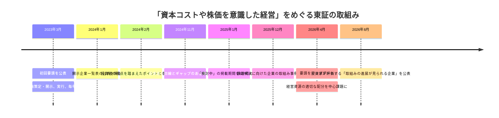

The first request in 2023 first required the board to address cost of capital, return on capital, and market valuation as management issues. Subsequently, TSE added a list of disclosed companies, good practices, cases that are out of step with investors' perspective, and a collection of case studies showing the process of resolving issues.

The April 2026 update does not replace this system with another system. Starting from disclosure, the focus is further deepened to see whether the allocation of management resources has actually changed and whether the results are reflected in figures and explanations.

The official name of the TSE is ``Update of requirements regarding “management with an awareness of cost of capital and stock price''”. At the 27th follow-up meeting, this was discussed as the "Fourth Year Initiatives," and based on the previous requests, points to be emphasized at the implementation stage were sorted out.

---

## The focus of renewal: Appropriate allocation of management resources

What the TSE has once again raised is the question of where to allocate management resources in order to consistently generate profitability that exceeds the cost of capital. The target is not just cash. Includes human resources, research and development, equipment, intellectual property, M&A, business portfolio, debt, owned assets, and shareholder returns.

What is important is not to simply choose between growth investment and shareholder returns. Allocate funds to investments that are expected to generate returns that exceed the cost of capital, and review investments that do not. For funds exceeding business needs, consider debt repayment and shareholder returns. All options need to be compared on the same basis for their contribution to value creation.

The TSE's request page states that stock buybacks and dividend increases may be effective in some cases, but it clearly states that “only that or a temporary response is not expected”. Therefore, the mere fact that shareholder returns have been increased does not explain the review of the allocation of management resources.

---

## Five issues to be asked at the implementation stage

### 1. Progress toward past goals

Shows how the company has progressed against targets such as ROE, ROIC, cross-shareholdings, and cash allocation disclosed from 2023 to 2025. If the target is not achieved, analyze the cause and explain whether to maintain the plan or modify it. Merely replacing goals with new numbers does not provide continuous validation.

### 2. Criteria for determining growth investments

Regarding investment in research and development, human capital, capital investment, M&A, and intangible assets, it shows not only the amount but also which competitive advantages will be strengthened and which profit indicators will be linked to. By simultaneously indicating areas in which you will not invest and areas in which you will withdraw, you can convey the reality of selection and concentration.

### 3. Review of business portfolio

For each business, evaluate whether it can achieve profitability that exceeds the cost of capital in the future. If the outlook is uncertain, compare options such as restructuring, additional investment, alliance with another company, sale, or withdrawal. The explanation of "growing all businesses" does not reveal the priorities for capital allocation.

### 4. Balance sheet optimization

Check cash and deposits, cross-shareholdings, idle assets, real estate, investment securities, and interest-bearing debt from both sides of the balance sheet. Quantitatively examine the required cash level and debt capacity, and explain the reason for holding in relation to corporate value.

### 5. Updates reflecting dialogue with investors

Investors' opinions are not required to be adopted as is. It is important to indicate which issues were considered by the board, what was changed, what was not changed, and the reasons why. The quality of renewal depends on how dialogue is used in management decisions.

---

## How to construct a disclosure that shows “execution”

Disclosures for 2026 and beyond will be easier to read if they are organized into the following five chapters.

|chapter|What to disclose|
| --- | --- |
|**1. Current status and progress**|Cost of capital, ROE/ROIC, market evaluation, past targets and results, variance analysis|
|**2. Management resource allocation policy**|Priorities for growth investment, M&A, human capital, R&D, capital investment, debt, and shareholder returns|
|**3. Business portfolio**|ROIC by business, response to businesses that are below the cost of capital, and decisions on sale, withdrawal, and reinvestment|
|**4. Balance sheet**|Required cash, cross-shareholdings, non-core assets, debt capacity, target capital structure|
|**5. Dialogue and next review**|Main points raised by investors, board considerations, changes, and next update timing|

The advantage of this structure is that instead of lining up measures, it can show everything from current situation recognition to judgment, implementation, and verification in a single flow. It is also possible to highlight key points in the corporate governance report and link details to medium-term management plans or dedicated pages.

---

## I'm not looking for a finished form from the beginning.

The institutional investor survey released by the TSE in August 2026 also identified "first steps" for companies that have not yet taken the step of disclosing their information. The most common opinions expressed here do not call for elaborate numerical targets or complete action plans from the beginning.

The first thing you need is

1. Analyze the cost of capital, ROE/ROIC, and market evaluation, and show **the current situation awareness as a manager**.
2. Indicate the direction of improvement and top management's **willingness** to take action.

It is.

This indicates that updated expectations do not uniformly require sophisticated financial models. What is important is for the company to recognize the issue, start discussing it at the board of directors, and clarify when it should consider the next step. After that, you can improve the accuracy through dialogue and implementation.

---

## Visualization of “progress” added in August 2026

In 2026, the Tokyo Stock Exchange conducted a survey asking domestic and foreign institutional investors which companies are making progress in their initiatives, and published the company names and evaluation comments. This has made it possible to see not only the presence or absence of disclosure, but also the companies whose progress investors have actually recognized.

While the list of disclosed companies shows whether initiatives have been started, this new list shows whether investors assess that initiatives are progressing. Although these are not official ratings, in IR practice they can be used to compare the progress of your company and that of other companies in the same industry.

In the same 2026 investor survey, issues such as decision-making on growth investments, fundamental review of business portfolios, optimization of owned assets, effectiveness of boards of directors, and continuity of dialogue and disclosure were cited as issues for which further improvement is expected. It can be seen that the focus of the update has shifted from simply the amount of disclosure to management itself.

---

## Implications for IR

1. **List commitments from 2023 onwards.** Summarize the targets and results announced in the past, such as ROE, ROIC, investment amount, cross-shareholdings, and return policy, in one table, and explain the unachieved items without erasing them.
2. **Illustrating capital allocation in one diagram.** Show growth investments, M&A, human capital, R&D, capital investments, debt repayments, and shareholder returns in the same period and in the same units, and explain their priorities.
3. **Do not make business-specific decisions ambiguous.** Set an improvement deadline and judgment criteria for projects that fall below the cost of capital. Share with the board the extent to which you are considering restructuring, partnering, selling, or exiting.
4. **Put the target image of the balance sheet into words.** Rather than writing policies for cash requirements, appropriate debt, cross-shareholdings, and non-core assets separately, integrate them into the desired capital structure.
5. **Disclose the reason for renewal.** For indicators or measures that have changed from the previous year, please include whether the reason was due to performance, business environment, or dialogue with investors.

---

## Source/reference materials

- Tokyo Stock Exchange “Updating requests regarding “management with an awareness of cost of capital and stock price” (April 28, 2026): https://www.jpx.co.jp/news/1020/20260428-01.html
- Tokyo Stock Exchange “Measures to realize management that is conscious of cost of capital and stock prices (Prime Standard Market)”: https://www.jpx.co.jp/equities/follow-up/02.html
- Tokyo Stock Exchange “Follow-up meeting on market segments review” (including the 27th and subsequent meetings): https://www.jpx.co.jp/equities/follow-up/
- Tokyo Stock Exchange “Regarding the publication of “Examples of companies' efforts to solve problems” related to “Management with an awareness of cost of capital and stock prices” (December 26, 2025): https://www.jpx.co.jp/news/1020/20251226-01.html
- Tokyo Stock Exchange "Results of institutional investor survey regarding 'companies that are making progress in initiatives'" (August 12, 2026): https://www.jpx.co.jp/corporate/news/news-releases/1020/20260812-01.html
- Tokyo Stock Exchange "Results of institutional investor survey regarding 'companies that are making progress in initiatives'" (material, 2026): https://www.jpx.co.jp/equities/follow-up/nlsgeu000006gevo-att/t13vrt000001rh2n.pdf
- Tokyo Stock Exchange “Regarding the publication of “cases that have a gap with investors' perspectives” regarding “management that is conscious of cost of capital and stock prices” (November 21, 2024): https://www.jpx.co.jp/news/1020/20241121-01.html

---

## Related articles

- **Theme 4.1** ---[How to read PBR below 1x--The true aim of the TSE request](/governance/capital-efficiency/4.1-march-2023-request-anatomy/)
- **Theme 4.2** ---[WACC/ROIC/Equity Spread--Basic terminology of cost of capital management](/governance/capital-efficiency/4.2-cost-of-capital-vocabulary/)
- **Theme 4.3** ---[List of companies disclosing information on the TSE -- Discipline created by public disclosure](/governance/capital-efficiency/4.3-the-disclosure-list/)
- **Theme 4.4** ---[7 pitfalls to avoid when disclosing cost of capital](/governance/capital-efficiency/4.4-seven-sins-misalignment/)
- **Theme 5.2** ---[Final phase of cross-shareholdings -- Verification and disclosure for each stock](/governance/frontier/5.2-cross-shareholdings-end-game/)
- **Theme 5.3** ---[What Toyota Industries' privatization showed -- Group reorganization of listed companies and protection of minority shareholders](/governance/frontier/5.3-listed-subsidiaries/)

---

# テーマ5：Current issues

---

## Simultaneous disclosure in Japanese and English is just the beginning - mandatory in April 2025

**SOURCE URL:** https://jpinv.com/governance/frontier/5.1-english-disclosure-mandate/

**記事要約**

On April 1, 2025, companies listed on the prime market were required to disclose financial information and timely disclosure information in both Japanese and English, in principle. However, it is not a system to provide full-text bilingual translation of all materials. While TSE allows partial or summary disclosure in English, if multiple disclosure items are included in Japanese materials, the TSE requires that all important items be communicated in English as well. In this paper, we will summarize the target materials, the concept of simultaneous disclosure, exceptional handling, and how to set up a practical system.

**本文**

> **Key points**
> - From April 1, 2025, companies listed on the prime market are required to disclose financial statements and timely disclosure information in English. The core of the system is to publish the English version at the same time as the Japanese version, in principle.
> - In addition to financial statements, supplementary explanatory materials for explaining financial results to investors in an easy-to-understand manner can also be covered. However, it is not necessary to translate all documents in full text; **partial or summary disclosure** is acceptable.
> - In cases where waiting for the English version would delay timely disclosure in Japanese, such as in the event of an emergency, the Japanese version will be given priority. Then, in principle, the English version will be published on the same day, or at the latest by the start of the next business day.

## What became the obligation?

On April 1, 2025, the TSE revised the English disclosure rules for companies listed on the prime market. Traditionally, the Corporate Governance Code has required disclosure of important information in English, but this was an expectation based on the principled “comply or explain” principle. From April 2025, financial statements and timely disclosure information will become mandatory under the listing rules.

If you organize the objects, it will look like this:

|Materials|Treatment after April 2025|Practical notes|
| --- | --- | --- |
|Summary of financial results/quarterly financial results|English disclosure required|It does not have to be a full-text parallel translation of the Japanese version.|
|Supplementary explanatory materials for financial results / Supplementary explanatory materials for quarterly financial results|Applicable if created to convey financial results|It is also possible to combine financial results summary and supplementary materials.|
|Timely disclosure information|English disclosure required|A partial or summary is fine, but disclosure items included in the Japanese version must not be omitted from the English version.|
|PR information|Any|Not subject to obligation as it does not fall under timely disclosure|
|Public inspection documents such as notice of general meeting of shareholders, corporate governance report, etc.|Any|Promoting disclosure in English is desirable, but not subject to the April 2025 obligation|
|annual Securities report|Not subject to TSE rules in April 2025|Treated under a separate system as legal disclosure|

The important thing here is not to judge based only on the name of the target material. For example, if a company creates supplementary financial results materials separate from the financial results summary and explains important performance factors, those materials will also be part of communicating financial results information to investors. If you only translate short messages from Japanese into English and leave important explanations in supplementary materials, important information will not reach overseas investors.

## Meaning of "simultaneously"

The system requires that the English version and the Japanese version be disclosed at the same time, in principle. The traditional method of posting English translations the next day or several days later is not enough.

However, promptness is the top priority for timely disclosure. In some cases, such as accidents, disasters, cyber incidents, lawsuits, sudden changes in performance, etc., the Japanese disclosure details may not be finalized until the last minute. If the Japanese version is delayed by waiting for the English version to be completed, TSE allows the Japanese version to be released first. In that case, the English version will, in principle, be published on the same day after the Japanese version is disclosed. If the Japanese version is disclosed at night on weekdays, and it is difficult to disclose the English version by 7:00 pm, the standard is until 9:00 am, when the next business day starts.

Therefore, "simultaneous disclosure" does not mean transmitting two files at the same time in seconds under any circumstances. The system is based on simultaneous publication during normal times, but in emergencies, priority is given to prompt disclosure in Japanese, and the English version is followed up as soon as possible.

## It doesn't have to be a full-text bilingual translation -- but no information will be lost.

TSE states that it is not necessary for all documents and the entire text of each document to be in English regarding financial results information. It is acceptable to issue only the financial results report in English, or to combine the summary information of the short report with supplementary explanatory materials for the financial results.

Timely disclosure may also be in part or in summary. There is no set standard as to how much detail is required. At a minimum, foreign investors must have content that allows them to understand when and what was decided or occurred, and they may be able to refer to the Japanese version for details.

However, being able to summarize is different from being able to omit important details. If a single document in Japanese contains multiple disclosure items, all disclosure items must be covered in the English version as well. For example, if the financial statement also discloses the occurrence of an impairment loss, it is necessary to also communicate that impairment loss in the English brief or in another English document.

In practice, it is easier to divide English disclosure into the following three layers.

1. **Information necessary to understand the facts** - Date of decision, date of occurrence, counterparty, amount, impact on performance, future plans.
2. **Explanation needed for investment decisions** - Background, strategic implications, key assumptions, risks, and implications for capital policy.
3. **Supplementary information only available in the Japanese version** - Detailed legal citations, domestic procedure explanations, and standard notes.

The first layer is the minimum required to comply with obligations, but for materials that will affect dialogue with investors, such as financial results and large-scale M&A, it is better to prepare up to the second layer in English. The extent to which the third layer should be translated will be determined depending on the nature of the material and the composition of overseas shareholders.

## Even after it became mandatory, disclosure of non-covered materials in English continues to progress.

According to a TSE survey as of the end of December 2024, 99.0% of companies listed on the prime market had made some kind of disclosure in English. By material, 93.8% were financial results, 76.4% were IR briefing materials, and 59.2% were timely disclosure materials. In a survey conducted at the end of December 2025 after the mandate was made, the disclosure rate in English for IR briefing materials, which are not covered, rose to 87.1%, and the disclosure rate for shareholder meeting convocation notices rose to 94.9%.

What these numbers show is that the April 2025 rules are not a system in which only two types of materials have to be translated. The prime market is a market that relies on dialogue with overseas investors, and financial results and timely disclosure information are just the beginning. The extent to which materials directly linked to determining corporate value, such as medium-term business plans, capital allocation policies, board composition, and sustainability information, will be provided in English remains up to each company's IR strategy.

## How to reorganize the work flow

In order to ensure stable simultaneous Japanese-English disclosure, it is important not to leave English translation as a task after the Japanese version is completed. Japanese and English will be incorporated into the same disclosure process in the following manner.

|stage|Practical steps to advance Japanese and English together|
| --- | --- |
|Drafting|Place disclosure items, numerical values, proper nouns, and important messages in a common Japanese-English composition table|
|translation|Unify standard expressions, account items, job titles, and M&A terms using an in-house glossary|
|confirmation|Compare numbers, dates, units, negative expressions, and forward-looking conditions across Japanese and English.|
|approval|Same approver and same deadline for Japanese and English versions|
|Announcement|Align the registration time on TDnet with the posting time on your company's website.|
|Post-inspection|Check the publication status on JPX English Disclosure GATE and TSE Listed Company Information Service|

For emergency disclosure, prepare a simple procedure that is different from the normal settlement flow. By deciding who will draft the main points in English, to what extent they can be published with internal approval, and what to do during times when external translation companies are not available, you can avoid delaying the publication of the Japanese version.

## Implications that IR personnel should be aware of

1. **Design simultaneous disclosure as a disclosure control rather than a translation task.** The process of starting English translation after the Japanese version is finalized causes delays even under normal times. Drafting, numerical confirmation, legal confirmation, and approval will be made common to both Japanese and English.
2. **Do not use "partial/summary information" as a license to omit information.** It is not permitted to omit important disclosure items from the Japanese version in the English version. To summarize, clearly state what should be kept and what should be referred to as Japanese.
3. **Determine in advance the rules for prioritizing Japanese in case of an emergency.** Exceptions may be used. However, it will be recorded who will decide whether the exception applies and by when the English version will be released.
4. **Materials that are not required will also be prioritized based on their importance to investors.** Full-year financial results explanatory materials, medium-term management plans, cost of capital disclosure, and important governance changes have a high priority of being translated into English, even if it is voluntary.
5. **Make JPX format examples, Japanese-English translation collection, and practical handbook standard materials.** Rather than creating your own translation each time, it is faster and more consistent to base your translations on official terminology and style.

## Source/reference materials

- TSE “Summary of development of listing system to expand English disclosure in prime market”: https://faq.jpx.co.jp/disclo/tse/web/knowledge8540.html
- TSE FAQ “What documents regarding financial information are required to be disclosed in English?”: https://faq.jpx.co.jp/disclo/tse/web/knowledge8598.html
- TSE FAQ: “To what extent is a part/summary of timely disclosure information acceptable?”: https://faq.jpx.co.jp/disclo/tse/web/knowledge8615.html
- TSE FAQ “Are all timely disclosures required to be made simultaneously in Japanese and English?”: https://faq.jpx.co.jp/disclo/tse/web/knowledge8617.html
- TSE FAQ “Does PR information and public inspection documents also need to be disclosed in English?”: https://faq.jpx.co.jp/disclo/tse/web/knowledge8614.html
- TSE “English disclosure implementation status survey results (as of the end of December 2024)”: https://www.jpx.co.jp/corporate/news/news-releases/0060/20250122-01.html
- TSE “English disclosure implementation status survey summary report (as of the end of December 2025)”: https://www.jpx.co.jp/corporate/news/news-releases/0060/20260126-04.html
- JPX English Disclosure GATE: https://www.jpx.co.jp/equities/listed-co/disclosure-gate/
- JPX English disclosure form example: https://www.jpx.co.jp/equities/listed-co/disclosure-gate/form/
- JPX Japanese-English bilingual collection: https://www.jpx.co.jp/equities/listed-co/disclosure-gate/term/index.html

---

**Next article on this theme:** [5.2 Final phase of cross-shareholdings - Verification and disclosure for each stock](/governance/frontier/5.2-cross-shareholdings-end-game/)

**Related articles on other themes:**
- [2.3 2021 Revision - Prime Market, Sustainability, and Diversity](/governance/cg-code/2.3-cg-code-2021-revision/)
- [3.1 From four market segments to three: The April 2022 restructuring](/governance/market-restructuring/3.1-four-segments-to-three/)
- [4.3 List of companies disclosing information on the TSE - Discipline created by public disclosure](/governance/capital-efficiency/4.3-the-disclosure-list/)
- [5.5 SSBJ Standards in Practice - Key Points of Phased Application and Preparation](/governance/frontier/5.5-ssbj-sustainability/)

---
## Cross-shareholdings in their final phase: Review and disclosure by holding

**SOURCE URL:** https://jpinv.com/governance/frontier/5.2-cross-shareholdings-end-game/

**記事要約**

The framework for strategic shareholdings has moved beyond explaining a holding policy to assessing each holding’s economic rationale, voting practices and commercial practices that may obstruct sales. In 2025, annual securities reports also began requiring disclosure of changes from strategic holdings to pure investment over the past five fiscal years, together with future holding and disposal policies for shares still held. This article connects the Corporate Governance Code, statutory disclosure and continued listing criteria.

**本文**

> **Key points**
> - Regulations regarding cross-shareholdings consist of three layers: the Corporate Governance Code, the annual Securities Report, and the TSE's tradable shares rules.
> - Principles 1-4 of the 2026 revised code require holding policies including reductions, verification of each stock, standards for exercising voting rights, as well as not preventing sales by cross-shareholding shareholders and not continuing transactions that are not economically rational.
> - In annual securities reports from the fiscal year ending March 2025 onward, stocks that have been changed from strategic holding purposes to pure investment purposes will be tracked and disclosed, including the year of change, reason, and post-change holding/sale policy.

## The current system has three tiers.

When reading cross-shareholding disclosures, don't just look at one document. Verification of company policies and the board of directors is shown in the Corporate Governance Code, holding status by stock is shown in the annual securities report, and the impact on maintaining listing is shown in the TSE's rules for tradable shares.

|system|Main documents|what to ask|
| --- | --- | --- |
|Principle-based governance discipline|Corporate governance report|Why hold it? Is there a reduction policy? How does the board of directors verify and exercise voting rights?|
|statutory disclosure|annual Securities report|Which stocks, how many shares, and at what price do you own them? What is the purpose of ownership, quantitative effects, and reasons for increase/decrease?|
|Listing maintenance standards|tradable-share ratio/traditional stock market capitalization|Will necessary liquidity be secured as a result of excluding holdings by banks, insurance companies, business corporations, etc. from tradable shares?|

The three systems are pointing in the same direction. Rather than immediately prohibiting cross-shareholdings, the mechanism is to require annual explanations on the rationale for cross-holdings, reduce relationships that have no economic rationality, and impose costs on remaining holdings in terms of market liquidity.

## 2026 Revised Code Principles 1-4

The Corporate Governance Code, which was finalized in July 2026, has organized four practical points to check regarding cross-shareholdings.

1. **Holding policy including reduction and verification of each stock.** Every year, the board of directors examines whether the holding purpose, benefits, and risks of individual stocks are commensurate with the cost of capital, and discloses the results.
2. **Standards for exercising voting rights.** Rather than automatically agreeing to a company's proposal because there is a business relationship, have specific criteria based on corporate value and the common interests of shareholders.
3. **Does not prevent sale.** When a business partner that holds cross-shareholdings in its own company requests a sale, do not prevent the sale by suggesting a reduction in transactions or otherwise.
4. **Do not continue unreasonable transactions.** Transactions with cross-shareholding shareholders that harm the common interests of the company and its shareholders must not be continued without sufficient verification of their economic rationality.

With this structure, the issue regarding cross-shareholdings is no longer just “should it be held?” Governance issues include whether the company holding the stock is preventing the sale of the stock and whether there is an inappropriate link between stock ownership and commercial transactions.

## Each stock is explained in the annual securities report.

Under the statutory disclosure, companies with a certain number of cross-shareholdings or more are required to state the number of shares by issue, the amount recorded on the balance sheet, the purpose of holding, the quantitative effect of holding, and the reason for the increase or decrease in the current period. Due to system reforms, the number of stocks subject to individual disclosure has expanded.

In practice, the weakest statement is one that ends with a single sentence, “To maintain and strengthen business relationships.” The existence of a business relationship is an explanation of the fact, not an explanation of why capital is tied up. At a minimum, the following items need to be presented in one flow.

|Check items|What is disclosed?|
| --- | --- |
|Purpose of holding|What specific businesses, transactions, joint developments, and supply relationships will it lead to?|
|economic benefit|How did you measure the benefit? How did you compare not only sales and procurement but also cost of capital?|
|risk|Impact on stock price fluctuations, concentration, dependence on business partners, reputation, and liquidity|
|Judgment of the Board of Directors|Choose whether to continue, downsize, or sell, and when to reconsider?|
|Exercise of voting rights|What criteria should you use to make decisions without automatically agreeing to company proposals?|

Even if you write that it is difficult to quantify the benefits, do not end your explanation there. It is necessary to record what materials were presented to the board of directors, what alternative indicators were used to verify the stock, and what was used to determine whether to continue holding the stock.

## Do not end with “change to pure investment purpose”

A new problem has arisen as more and more companies change the classification of cross-shareholdings to pure investment purposes and continue to hold them for long periods of time. Even if only the name is changed to “net investment,” it cannot be said to be removed from cross-shareholdings as long as the transaction relationship is maintained.

For this reason, in accordance with the amendment to the Cabinet Office Ordinance in January 2025, the following matters will be disclosed regarding shares that have changed from strategic holding purposes to pure investment purposes within the last five fiscal years, including the current fiscal year, and are still held as of the end of the fiscal year.

- Brand name
- Number of shares
- Balance sheet amount
- Year in which the purpose of holding was changed
- Reason for change
- Changed holding or sale policy

The revised provisions will be applied from annual securities reports, etc. for fiscal years ending on or after March 31, 2025. Even after converting it to pure investment purposes, there are questions about how long you will hold it, at what price and terms you will consider selling it, and why you are still holding it.

## Weaknesses revealed by the 2026 review

The Financial Services Agency's annual securities report review focused on the following statements regarding cross-shareholdings.

- The purpose of holding each stock is abstract, and company-specific relationships are unclear.
- No substantive purpose such as "securing stable shareholders" is stated.
- The relationship between the details of the verification by the board of directors and the actual continuation/increase in holdings is not explained.
- The reason for the change to pure investment purpose and the sale policy after the change are not clear.

What we can see from this is that the system has moved from filling out forms to looking at consistency between written content and actual behavior. If the amount held increases despite a reduction policy, it is necessary to separately explain whether this is due to a rise in stock prices or additional acquisitions. If you intend to sell the stock and continue to hold it for many years, you will need to show the terms and conditions of the sale and your progress.

## Verification table by stock that can be used at board of directors meetings

In practice, rather than discussing cross-shareholdings all at once, it is recommended to submit the following table to the board of directors, at least for important stocks.

|Item|Content|
| --- | --- |
|Issue/Holding amount|Number of shares, market value, book value, percentage of equity|
|History of ownership|Acquisition timing, initial purpose, and relationship with the other party|
|current benefits|Specific business benefits and how to measure them|
|Comparison with capital cost|Evaluation and assumptions including dividends received, unrealized gains and losses, and trading benefits|
|risk|Stock price decline, concentration, possibility of sale, impact on business relationships|
|Exercise of voting rights|Important proposals from the previous year and reasons for decisions|
|conclusion|Continuation, reduction in stages, or sale|
|Execution time|Date of next review, estimated date of sale, status of discussions with the other party|

The purpose of this table is not to create a precise single point number. The board should be able to move away from the judgment of “holding a stock because it has a long relationship” and be able to compare each stock based on the same criteria.

## Implications that IR personnel should be aware of

1. **Create corporate governance report and annual securities report from the same data.** If the policy and results are created in different departments, the reduction policy and the description by brand will be inconsistent.
2. **Review your conduct as the issuer whose shares are held, as well as your own holdings.** When a business partner wants to sell shares in your company, do not exert pressure through trading terms or orders.
3. **Track after change to pure investment objective.** Classification change is not an exit. Make it possible to disclose sales policy, holding period, and actual sales results.
4. **Managed together with the tradable-share ratio.** Reducing cross-shareholdings not only affects the capital efficiency of the holding company, but also the liquidity and listing maintenance of the issuing company.
5. **Explain not only the sales record but also the reasons for remaining stocks.** The further the reduction, the greater the accountability of the last remaining stocks.

## Source/reference materials

- Financial Services Agency/TSE “Concerning the Finalization of the Corporate Governance Code (2026 Revised Edition)”: https://www.fsa.go.jp/singi/follow-up/index.html
- Financial Services Agency “Revision of Cabinet Office Ordinances Regarding Disclosure of Cross-Shareholdings” (January 31, 2025): https://www.fsa.go.jp/news/r6/sonota/20250131-2/20250131-2.html
- Financial Services Agency “Review of annual securities reports and large-scale holding reports (FY2020)”: https://www.fsa.go.jp/news/r7/sonota/20260327.html
- Financial Services Agency “Collection of good practices for disclosure of descriptive information 2025”: https://www.fsa.go.jp/news/r6/singi/20250203.html
- Financial Services Agency “Revision of Cabinet Office Ordinance on Disclosure of Corporate Details” (Expansion of individual disclosure of cross-shareholdings): https://www.fsa.go.jp/access/30/187.pdf
- JPX “Corporate Governance”: https://www.jpx.co.jp/equities/listing/cg/index.html
- JPX “Distributable shares – details of standards for maintaining listing”: https://www.jpx.co.jp/equities/listing/continue/details/02.html

---

**Previous article on this topic:** [5.1 Simultaneous Japanese and English disclosure is just the beginning - mandatory in April 2025](/governance/frontier/5.1-english-disclosure-mandate/)

**Next article on this theme:** [5.3 What the privatization of Toyota Industries showed - group reorganization of listed companies and protection of minority shareholders](/governance/frontier/5.3-listed-subsidiaries/)

**Related articles on other themes:**
- [1.2 Who filled the gap after the main bank](/governance/foundations/1.2-pre-reform-architecture/)
- [2.2 Revised in 2018 - Turning point when cost of capital was specified in the code](/governance/cg-code/2.2-cg-code-2018-revision/)
- [3.2 tradable-share ratio--mechanism that promoted the reduction of cross-shareholdings](/governance/market-restructuring/3.2-tradable-share-ratio/)
- [4.5 From disclosure to implementation - Request update for April 2026](/governance/capital-efficiency/4.5-action-plan-2-update/)

---
## What the delisting of Toyota Industries revealed: Group reorganization of listed companies and protection of minority shareholders

**SOURCE URL:** https://jpinv.com/governance/frontier/5.3-listed-subsidiaries/

**記事要約**

The delisting of Toyota Industries was a major transaction that reorganized the Toyota Group's capital relationships and eliminated cross-holdings between Toyota Industries, Toyota Motor Corporation, Denso, Aisin, and Toyota Tsusho. After the announcement in June 2025, the tender offer price and schedule was revised, and the TOB was completed in March 2026 at 20,600 yen per share. It was delisted on June 1st. In this paper, we do not simply refer to this transaction as “the end of keiretsu,” but rather read it from the perspective of group reorganization that includes listed companies, price formation, and minority shareholder protection.

**本文**

> **Key points**
> - The tender offer for Toyota Industries shares was conducted from January 15, 2026 to March 23, 2026, and was concluded at **20,600 yen per share**. After the tender offer, the ownership percentage was 63.60%, and the company's shares were delisted on June 1, 2026.
> - As a result of the transaction, cross-shareholdings between Toyota Industries, Toyota Motor Corporation, Aisin, Denso, and Toyota Tsusho were dissolved. On the other hand, Toyota Motor Corporation was designed to participate in the company through preferred stock with no voting rights.
> - What this case demonstrates is the need to weigh the benefits of remaining listed against the speed of decision-making afforded by going private, at a price and process that is fair to minority shareholders.

## Transaction progress

The delisting of Toyota Industries was announced on June 3, 2025. The idea was to establish a new holding company centered on Toyota Fudosan, with Toyota Motor Corporation and other Toyota group companies also participating in transactions. Subsequently, the conditions and price for starting the tender offer were revised, and the tender offer took place in 2026.

|date|main events|
| --- | --- |
|June 3, 2025|Announcement of Toyota Industries' policy to make it private. Toyota Group companies plan to participate in transactions and eliminate cross-holdings|
|January 15, 2026|Start of TOB with Toyota Asset Preparatory Co., Ltd.|
|March 6, 2026|Final review of tender offer conditions|
|March 23, 2026|TOB ends|
|March 24, 2026|Announcement of establishment of TOB. Number of shares tendered: 191,087,116 shares, ownership ratio after tender offer: 63.60%|
|March 30, 2026|Start payment|
|May 12, 2026|Reverse stock split, etc. resolved at extraordinary general meeting of shareholders|
|June 1, 2026|Delisted from TSE Prime Market and Nagoya Stock Exchange Premier Market|
|June 3, 2026|Effective date of reverse stock split|

The final tender offer price was 20,600 yen per share. Even for shareholders who did not tender their shares in the tender offer, money was delivered to them at the same price in principle through a subsequent squeeze-out through a reverse stock split.

## How have capital relations changed?

The unique feature of the transaction is that it does not simply delist one company, but also liquidates cross-shareholdings within the group at the same time. The plan was for Toyota Motor Corporation, Aisin, Denso, and Toyota Tsusho to sell their shares in Toyota Industries, and Toyota Industries to liquidate the shares of these four companies through a treasury tender offer.

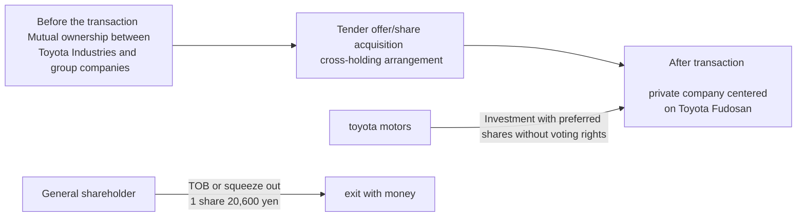

Through this reorganization, cross-holdings between Toyota Industries and the four companies were eliminated. However, capital relationships have not completely disappeared. Toyota plans to invest in the company in the form of preferred shares with no voting rights, and rather deepen its business collaboration with the Toyota Group. Therefore, it is not accurate to read this case as “the keiretsu structure has disappeared.” **It should be viewed as a reorganization that continues business collaboration with a different capital design while reorganizing mutual holdings**.

## Why was it made private?

The company explained that as it celebrates its 100th anniversary in 2026, quick decision-making through privatization will be effective in promoting medium- to long-term investments in logistics solutions, automation, electrification, etc. The logic is to deepen cooperation with Toyota group companies and carry out growth investments without being excessively influenced by quarterly performance expectations.

While this explanation is reasonable, another question always remains when taking a listed company private. **The question is whether the current minority shareholders are receiving the fruits of that growth at a fair price**. If a significant increase in value is expected after going private, it will be important to consider to what extent that expectation is reflected in the tender offer price.

## Four perspectives from which to read this project

### 1. Continuously verify the benefits of remaining listed

The fact that there are listed companies within the group itself is not a problem. There are inherent benefits to going public, such as independent financing, stock compensation, talent acquisition, trust from business partners, and management discipline. On the other hand, there are also conflicts of interest with the parent company and major shareholders, slow decision-making, and the cost of protecting minority shareholders.

What the board of directors should consider is not whether the company should remain listed because it has been listed for a long time, but whether the benefits of remaining listed still exceed the costs. The Ministry of Economy, Trade and Industry's practical guidelines for group governance systems also require parent companies with listed subsidiaries to continually check the rationality of maintaining their listing.

### 2. Price revisions are also evidence that the process is moving.

In large-scale delistings, the initial proposed price is not necessarily the final price. Terms may change through special committees, third-party valuation institutions, shareholder opinions, market price trends, and negotiations with acquirers.

The fact that the price has changed itself should not be immediately read as a failure of the original proposal. What is important is whether there is a mechanism to consider prices and conditions from an independent standpoint, and whether the results of negotiations and the reasons for decisions are disclosed to shareholders.

### 3. Consider “group optimization” and “minority shareholder interests” separately.

Restructuring that is desirable for the group as a whole does not necessarily mean that it is also desirable for minority shareholders of the target company. It is necessary to consider the attribution of synergies, future growth potential, value of owned assets, unrealized gains on cross-shareholdings, etc. as the value of the target company alone.

For this reason, special committees consisting mainly of independent outside directors are important in transactions involving controlling shareholders or major affiliated companies. The special committee is not a formality for consummating a transaction, but rather a body for negotiating conditions from the perspective of the target company and general shareholders.

### 4. Eliminating cross-shareholdings and continuing business relationships are compatible

This project undermined the assumption that cooperation could not be achieved without mutual stock ownership. Even if cross-holdings are dissolved, the cooperative relationship can continue through other contracts and capital designs, such as joint development, supply contracts, technology collaboration, and preferred stock.

This point is important for companies that explain cross-shareholdings. Simply stating that it is "necessary to maintain a business relationship" does not answer the question of why it is necessary to continue holding common stock rather than a contract or business alliance.

## Implications that IR personnel should be aware of

1. **If your company has a group of listed companies or is a listed company with a major shareholder, document the benefits of remaining listed.** Realize the benefits of financing, brand, talent, transactions and management discipline.
2. **Determine procedures for managing conflicts of interest before consideration of going private begins.** The composition of the special committee, selection of external advisors, information management, and authority for price negotiations will be organized in normal times.
3. **Explain the group-wide synergies and the individual value of the target company separately.** The value that minority shareholders give up should not be wrapped up in group theory alone.
4. **Consider alternatives to cross-shareholdings.** Examine whether relationships can be maintained without mutual ownership of common stock, such as business alliances, long-term contracts, joint research, or preferred stock.
5. **Do not make one project the conclusion for the entire Japanese company.** Toyota Industries' delisting is an important precedent, but each company's decision to remain listed varies depending on its business, capital, and shareholder structure.

## Source/reference materials

- Toyota Industries “Notice regarding delisting of our company’s shares”: https://www.toyota-shokki.co.jp/investors/notice/
- Toyota Industries “Frequently asked questions regarding the results of the tender offer and going private”: https://www.toyota-shokki.co.jp/investors/delist-faq/
- Toyota Motor Corporation and others “Accelerate collaboration by making Toyota Industries private” (June 3, 2025): https://global.toyota/jp/newsroom/corporate/42882869.html
- Toyota Fudosan “Changes to tender offer conditions” (March 6, 2026): https://www.toyotafudosan.com/news/20260306/
- JPX “List of delisted stocks (stocks)”: https://www.jpx.co.jp/listing/stocks/delisted/
- Ministry of Economy, Trade and Industry “Practical Guidelines for Group Governance Systems”: https://www.meti.go.jp/press/2019/06/20190628003/20190628003.html
- Ministry of Economy, Trade and Industry “Guidelines for fair M&A”: https://www.meti.go.jp/policy/economy/keiei_innovation/keizaihousei/pdf/fairma-guidelines.pdf

---

**Previous article on this theme:** [5.2 Final stage of cross-shareholdings - verification and disclosure for each stock](/governance/frontier/5.2-cross-shareholdings-end-game/)

**Next article on this theme:** [5.4 How to handle unsolicited acquisitions - 2023 “Guidelines for corporate acquisitions”](/governance/frontier/5.4-mbo-takeover-guidelines/)

**Related articles on other themes:**
- [1.2 Who filled the gap after the main bank](/governance/foundations/1.2-pre-reform-architecture/)
- [2.5 Codes and guidelines: Their different roles and uses](/governance/cg-code/2.5-meti-guideline-family/)
- [3.2 tradable-share ratio--mechanism that promoted the reduction of cross-shareholdings](/governance/market-restructuring/3.2-tradable-share-ratio/)
- [5.2 Final stage of cross-shareholdings - Verification and disclosure for each stock](/governance/frontier/5.2-cross-shareholdings-end-game/)

---
## How to Handle Unsolicited Acquisitions - 2023 "Guidelines for Corporate Takeovers"

**SOURCE URL:** https://jpinv.com/governance/frontier/5.4-mbo-takeover-guidelines/

**記事要約**

The Ministry of Economy, Trade and Industry's “Guidelines for Corporate Acquisitions” published in 2023 clarified the idea that acquisition proposals that do not have the consent of management will be considered in accordance with the content and procedures of the proposal. The guidelines set out three principles: corporate value and the common interests of shareholders, shareholder will, and transparency, and require the board of directors to conduct independent consideration and provide sufficient information, rather than dismissing sincere proposals based on management's preferences. In 2026, the study group organized practical issues into "Key Points/Q&A."

**本文**

> **Key points**
> - The 2023 Guidance does not uniformly characterize unsolicited acquisitions as harmful. The board of directors needs to seriously consider whether specific proposals contribute to corporate value and the common interests of shareholders.
> - The three guiding principles are the principle of corporate value and common interests of shareholders, the principle of shareholder will, and the principle of transparency.
> - In many cases, the final decision on whether to accept a takeover proposal is left to the shareholders. The role of the board of directors is to prepare comparable information, conduct necessary negotiations, and explain the reasons for decisions.

## Stay away from the word "hostile"

Traditionally, in Japan, takeovers without the consent of management have been called "hostile takeovers," and there has been a tendency to treat them as if they were undesirable transactions in and of themselves. However, being hostile to management is not the same as being detrimental to shareholders and the company.

Therefore, the 2023 Guidelines adopt a perspective that is more in line with the fact that the acquisition is an unsolicited acquisition without the consent of the target company's board of directors, rather than the emotionally charged expression "hostile." Even if it is unsolicited, there is a possibility that the proposal will increase corporate value after considering the price, certainty of funding, business plan, impact on employees and business partners, and post-acquisition management policy. On the other hand, even if a proposal starts out amicably, it will be undesirable for shareholders if the terms are unfair.

## three principles

|principle|meaning|
| --- | --- |
|**Principles of corporate value and common interests of shareholders**|The pros and cons of an acquisition are determined based on whether it contributes to the company's sustainable corporate value and the interests of shareholders as a whole.|
|**Principles of shareholder will**|When making decisions regarding control of a company, respect the wishes of shareholders given reasonable information and time.|
|**Principle of transparency**|Both the acquirer and the target company appropriately disclose information necessary for shareholders to make decisions.|

The three principles are neither intended to promote takeovers nor to negate defensive measures. This is a standard that organizes the roles of the acquirer, the target company's board of directors, and shareholders, and creates a fair judgment process.

## What should the board do?

The practice of a board of directors that receives an unsolicited takeover proposal is easy to understand if you consider the following flow.

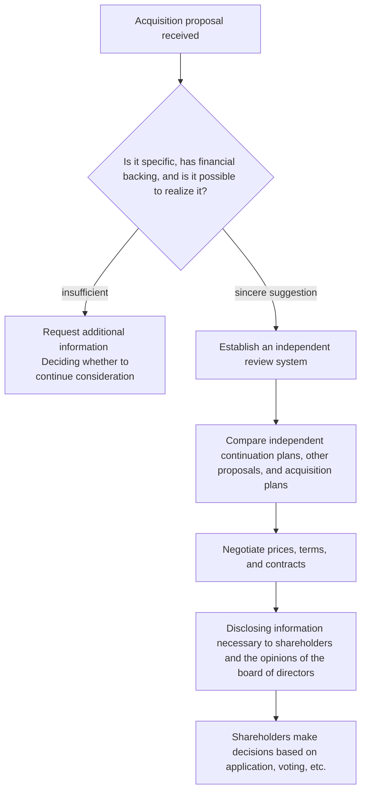

### 1. Determine whether the proposal is sincere.

In addition to the proposed price, we check the financing support, post-acquisition business plan, necessary permits and approvals, conditions for completion of the transaction, and the acquirer's track record. There is no need for an immediate company-wide response to inquiries that lack specificity. On the other hand, it is also not appropriate to ignore potentially viable proposals based solely on the wishes of management.

### 2. Establish an independent review system

Conflicts of interest arise in judgments when management may lose their position as a result of an acquisition. A special committee will be established as necessary, with independent outside directors focusing on the matter. The necessity of a special committee will depend on the nature of the transaction, but the stronger the interests of management, the greater the need for an independent entity to be involved in price negotiations and judgments.

### 3. Compare with alternatives

The acquisition proposal is not a choice between maintaining the status quo. Compare with standalone medium-term plans, changes in capital policy, business sales, proposals from other acquirers, etc. If the target company claims that its plan is better, it must demonstrate the plan's assumptions, feasibility, and timeline in a way that shareholders can compare.

### 4. Negotiate terms

The board doesn't just say whether it's for or against something. Negotiate for better terms for the company and shareholders, including price, purchase period, preconditions, treatment of employees and business partners, provision of information, and contractual restrictions.

### 5. Provide judgment material to shareholders

In order for shareholders to make a decision, they need not only the acquirer's proposal, but also an analysis of the target company's board of directors, an independent committee's opinion, a value calculation concept, and alternative plans. If the board objects, abstract arguments such as “it doesn't fit the corporate culture” or “it's not long-term oriented” are not enough. Explain which conditions undermine corporate value.

## 2026 “Points/Q&A”

In 2026, the Ministry of Economy, Trade and Industry restarted a study group on fair acquisitions and compiled “Points/Q&A” to apply the concepts of the 2023 Guidelines to practice. Rather than replacing them with new guidelines, they confirmed that the 2023 Guidelines continue to be appropriate, and supplemented their interpretation with respect to consideration of proposals, confirmation of shareholder intentions, comparison of multiple proposals, etc.

In practice, the following points are important.

- The board of directors does not necessarily immediately announce the fact that it has received a proposal, but when it reaches a stage that is important for shareholder judgment, timely and appropriate disclosure becomes necessary.
- If there are multiple proposals, compare not only price, but also conditions, feasibility, time, and business impact on the same basis.
- When an acquirer requests information, consider providing reasonable information to evaluate the proposal, taking into account confidentiality and competitive concerns.
- There is more than one way to confirm shareholder intent. Judgments will be made depending on the type of transaction, such as applying for a TOB, voting at a general meeting of shareholders, and confirming intentions regarding the activation of takeover defense measures.

## How should takeover defense measures be positioned?

The 2023 Guidelines do not completely deny takeover defense measures. However, they say that defensive measures should not be used to protect the management team, but rather to secure information and time for shareholders to make decisions, and to protect corporate value and the common interests of shareholders.

When introducing or activating defensive measures, the following points should be considered.

1. Are the target acquirers and actions clear?
2. Is it necessary and appropriate?
3. Were independent outside directors substantially involved?
4. Is there a system in place to confirm shareholder intentions?
5. Is there no undue disadvantage to the acquirer and unreasonable exclusion of competitive proposals?

If companies continue to request information indefinitely in order to buy time, or if they impose difficult-to-fulfill conditions only on the acquirer, transparency and appropriateness will be lacking. Defensive measures need to be designed not as “a mechanism to stop takeovers,” but “a mechanism to create a forum where shareholders can make informed decisions.”

## Implications that IR personnel should be aware of

1. **Create a line of communication during normal times in case you receive an unsolicited proposal.** Determine the roles of the CEO, chairman of the board, independent outside director, legal affairs, IR, external lawyers, and FA.
2. **Always be ready to explain independent continuation plans.** The medium-term plan that was hastily created after receiving the acquisition proposal lacks persuasive power. Clarify capital cost, business portfolio, and capital allocation on a daily basis.
3. **Evaluate based on conditions and procedures, not "friendly or hostile."** Do not make relationships with management the focus of explanations to shareholders.
4. **Accelerate the provision of information to independent outside directors.** In cases where there is a strong conflict of interest, it is not enough for outside directors to approve the matter afterwards. Involve them from the early stages of proposal evaluation and terms negotiation.
5. **Assemble the explanation for shareholders by comparing the two.** Compare acquisition and go-ahead proposals, and other proposals as appropriate, using the same assumptions and time horizon.

## Source/reference materials

- Ministry of Economy, Trade and Industry “Guidelines for Corporate Takeovers” (August 31, 2023): https://www.meti.go.jp/press/2023/08/20230831003/20230831003.html
- List of documents related to Ministry of Economy, Trade and Industry's "Guidelines for Corporate Takeovers": https://www.meti.go.jp/policy/economy/keiei_innovation/keizaihousei/fair-ma-rule/ma-guideline-publications.html
- Ministry of Economy, Trade and Industry “Study Group on Fair Acquisitions”: https://www.meti.go.jp/shingikai/economy/kosei_baishu/index.html
- Ministry of Economy, Trade and Industry “Reopening of the Study Group on Fair Acquisitions” (February 3, 2026): https://www.meti.go.jp/press/2025/02/20260203001/20260203001.html
- Ministry of Economy, Trade and Industry “Key Points and Q&A of “Guidelines for Corporate Takeovers” (July 30, 2026): https://www.meti.go.jp/press/2026/07/20260730002.html
- Ministry of Economy, Trade and Industry “Guidelines for fair M&A”: https://www.meti.go.jp/policy/economy/keiei_innovation/keizaihousei/pdf/fairma-guidelines.pdf

---

**Previous article on this topic:** [5.3 What Toyota Industries' privatization showed - group reorganization of listed companies and protection of minority shareholders](/governance/frontier/5.3-listed-subsidiaries/)

**Next article on this theme:** [5.5 SSBJ Standards in Practice - Steps of Application and Preparation Key Points](/governance/frontier/5.5-ssbj-sustainability/)

**Related articles on other themes:**
- [2.5 Codes and guidelines: Their different roles and uses](/governance/cg-code/2.5-meti-guideline-family/)
- [4.5 From disclosure to implementation - Request update for April 2026](/governance/capital-efficiency/4.5-action-plan-2-update/)
- [5.3 What the privatization of Toyota Industries showed](/governance/frontier/5.3-listed-subsidiaries/)
- [5.7 Collaborative engagement after the third revision of the Stewardship Code](/governance/frontier/5.7-activism-engagement-2025/)

---
## SSBJ Standards in Practice: Key Points of Phased Application and Preparation

**SOURCE URL:** https://jpinv.com/governance/frontier/5.5-ssbj-sustainability/

**記事要約**

SSBJ published Japan's sustainability disclosure standards in March 2025 and revised them in March 2026. In February 2026, the Financial Services Agency finalized a system that will require companies listed on the prime market with an average market capitalization of 1 trillion yen or more over five fiscal years to gradually disclose information in their annual securities reports in accordance with SSBJ standards. This will apply from the fiscal year ending March 2027 for those with an average market capitalization of 3 trillion yen or more, and from the fiscal year ending March 2028 for those with an average market capitalization of 1 trillion yen or more. This paper will summarize the structure of the standards, timing of application, two-stage disclosure, handling of Scope 3, and preparation of the assurance system.

**本文**

> **Key points**
> - The SSBJ Standards consist of three parts: “Application of Sustainability Disclosure Standards”, “General Disclosure Standards”, and “Climate-related Disclosure Standards”. It was announced on March 5, 2025 and revised on March 13, 2026.
> - Among companies listed on the prime market, companies with a five-year average market capitalization of 3 trillion yen or more will be required to make statutory disclosures in accordance with SSBJ standards from the fiscal year ending March 2027, and companies with an average market capitalization of 1 trillion yen or more will be required to comply with the SSBJ standards from the fiscal year ending March 2028.
> - In the first year of application and in the following year, **two-step disclosure** is allowed, in which certain information is later added in an amended report. For Scope 3 emissions, a safe harbor has also been established for specific disclosure of reasoning processes and internal procedures.

## What are the SSBJ standards made of?

The standards published by the Sustainability Standards Board (SSBJ) consist of the following three items.

|standards|Main role|
| --- | --- |
|**Application of sustainability disclosure standards**|Defines matters common to the entire standard, such as reporting companies, scope, materiality, comparative information, presentation, and transitional measures.|
|**General Disclosure Standard**|Establish a framework for disclosing governance, strategy, risk management, metrics and targets for sustainability-related risks and opportunities|
|**Climate-related disclosure standards**|Define climate-related risks and opportunities, scenario analysis, greenhouse gas emissions, transition plans, targets, etc.|

All three were published on March 5, 2025, and revised on March 13, 2026. Furthermore, in June 2026, practical standards were published when greenhouse gas emissions measured and reported under the SHK system of the Global Warming Countermeasures Law are used for climate-related disclosures.

Although the SSBJ standards place emphasis on consistency with ISSB's IFRS S1 and S2, there are also differences in line with Japan's legal system and practices. Even if a company reports in compliance with ISSB overseas, it may not be sufficient to simply post it in the Japanese annual securities report. It is necessary to separately check the requirements of the SSBJ standards and the additional information provided by the Financial Services Agency's disclosure ordinance.

## To whom does it apply and when?

The Cabinet Office Ordinance finalized in February 2026 requires SSBJ standards for companies listed on the TSE Prime Market with an average market capitalization of 1 trillion yen or more. The average market capitalization is determined by the average of the market capitalization at the end of the previous fiscal year and the end of the four previous fiscal years.

|Target company|Start of application|
| --- | --- |
|Average market capitalization as of the end of the fiscal year ending March 2026 is **3 trillion yen or more**|annual annual Securities reports, etc. for fiscal years ending on or after March 31, 2027|
|Average market capitalization is over **1 trillion yen**|annual annual Securities reports, etc. for fiscal years ending on or after March 31, 2028|
|Average market capitalization is less than 1 trillion yen|Under the current Cabinet Office Ordinance, obligations under SSBJ standards are not applicable.|

For companies that have been listed for less than five fiscal years, the company will be judged based on the average market capitalization at the end of each fiscal year that has passed.

[Confirmation required: For companies listed on the prime market with an average market capitalization of 500 billion yen or more and less than 1 trillion yen, the interim report of the Financial System Council indicated that the basic plan would apply from the fiscal year ending March 2029, but as of August 2026, the start of application for this layer has not yet been determined by Cabinet Office Ordinance. ]

## What to write in a annual securities report

Target companies will include information in accordance with SSBJ standards in the "Sustainability Policy and Initiatives" section of their annual securities reports. In addition, the Disclosure Ordinance also requires the following:

- Compliance with SSBJ standards
- If two-step disclosure or transitional measures under the standards are used, their application status
- Reasoning process used to estimate and make assumptions about future information
- Scope 3 greenhouse gas emissions calculation method, assumptions, and reasoning process
- Internal disclosure procedures for creating and confirming forward-looking information and Scope 3 information
- If a finalized value is shown in the semi-annual report, the difference from the previous year's estimated value

What is important here is that this is no longer a voluntary report created solely by the sustainability department. Once a annual securities report is submitted, it is subject to the same disclosure controls as financial reports, supervision by the board of directors, confirmation by auditors, etc., and responsibilities of management.

## two-step disclosure

For the first year of application and the following year, it is possible to omit some of the information that should be included in accordance with the SSBJ standards at the time of submitting the annual securities report, and supplement it by submitting an amended report by the deadline for submitting the semi-annual report for the following year.

This two-step disclosure is a transitional mechanism in response to Scope 3 and overseas subsidiary data, which require time to collect information. This is not a system to postpone the submission deadline. In the initial annual securities report, it is necessary to clarify what will be disclosed in two stages and the reason for adding it at a later date, and to manage the process up to the revised report.

In practice, the following three classifications are valid:

1. **Information that can be determined when submitting a annual securities report** -- Governance system, strategy, major risks, goals, Scope 1 and 2, etc.
2. **Information to be disclosed based on reasonable estimates** - future outlook, scenario analysis, and emissions for which data are not yet determined.
3. **Information to be supplemented later through two-step disclosure** - Information that takes time to collect from overseas subsidiaries and value chains and cannot be calculated at a reasonable value at the time of submission.

## Scope 3 safe harbor

Scope 3 emissions depend on data from business partners and customers, industry averages, estimated coefficients, etc., so the figures are likely to change later. The Financial Services Agency has clearly stated that as long as the factors that cause the discrepancy, the reasoning process, and the internal disclosure procedures are specifically described to the extent that is generally considered reasonable, even if a discrepancy occurs as a result, the company will not be immediately liable for misstatements, etc.

The safe harbor is not a system that unconditionally allows rough numbers. Rather, the premise is to explain what data was used, what was estimated, and who verified it. It is important for IR personnel to be able to disclose not only the calculated value itself, but also the calculation process.

## To what extent is the assurance system fixed?

Regarding the assurance of sustainability information, the Financial System Council has indicated a direction to gradually introduce limited assurance. For companies with an average market capitalization of 3 trillion yen or more, discussions are underway with a focus on starting assurance from the fiscal year ending March 2028, one year after the start of application of the SSBJ standards. In the early stages, proposals are being made to limit the scope, such as Scope 1 and 2 emissions and governance and risk management.

[Confirmation required: As of August 2026, the entire system has not been finalized as a law, including who will be responsible for assurance services, registration and supervision, and timing of expansion of assurance scope. It is necessary to check the latest Financial System Council materials and legal revisions. ]

Therefore, companies should not wait for the assurance scheme to be finalized. Evidence that can be verified by a third party, data responsibilities, change history, scope of consolidation, and estimate approval procedures need to be in place from the first year of disclosure.

## Divide preparation into five tasks

|work|Specific confirmation|
| --- | --- |
|Application judgment|Calculate the average market capitalization for 5 fiscal years each period and determine the applicable year.|
|Difference analysis|Compare current integrated reports, TCFD disclosures, and CDP responses with SSBJ requirements|
|Data maintenance|Scope 1, 2, 3, financial impact, migration plan, and target data ownership decisions|
|disclosure control|Document accounting, review, management approval, board oversight, and correction procedures|
|assurance support|Prepare evidence, system privileges, audit trails, and preliminary dialogue with external assurance providers|

Particularly difficult is the connection between sustainability information and financial statements. Investors question consistency when companies describe climate risks as material but do not reflect them in impairment tests, useful lives, provisions, and capital investment plans. Sustainability disclosure needs to be linked to business planning and accounting decisions, rather than being a separate reporting exercise.

## Implications that IR personnel should be aware of

1. **First, determine the applicable year.** Judgment is based on the average of 5 fiscal years, not the market capitalization of a single year. A common calculation table is used for accounting, legal affairs, and IR.
2. **Check the SSBJ standards and disclosure ordinance separately.** Compliance with the standards alone may not satisfy additional statements in the annual securities report.
3. **Use two-step disclosure as a planned transitional measure.** Do not put off the same information every year. Indicate a permanent plan for data collection from the first year.
4. **Scope 3 solidifies processes over numbers.** If you can explain data sources, estimation methods, judgments, approvals, and history of changes, you can appropriately communicate numerical uncertainty.
5. **Leave a trail with an eye to the assurance.** Manual spreadsheets used in the era of voluntary disclosure are not enough. Create internal controls similar to financial reporting.

## Source/reference materials

- SSBJ “Sustainability Disclosure Standards”: https://www.ssb-j.jp/jp/ssbj_standards.html
- SSBJ “Announcement of Sustainability Disclosure Standards” (March 5, 2025): https://www.ssb-j.jp/jp/ssbj_standards/2025-0305.html
- SSBJ “Related information for application”: https://www.ssb-j.jp/jp/ssbj_standards/reference.html
- SSBJ “Handbook”: https://www.ssb-j.jp/jp/related_information/handbooks/fundamental.html
- Financial Services Agency “Revision of Disclosure Ordinance and Results of Public Comments” (February 20, 2026): https://www.fsa.go.jp/news/r7/shouken/20260220/20260220.html
- Financial Services Agency “Information regarding disclosure of sustainability information”: https://www.fsa.go.jp/policy/kaiji/sustainability-kaiji.html
- Financial Services Agency “Working Group on Sustainability Information Disclosure and Assurance”: https://www.fsa.go.jp/singi/singi_kinyu/sustainability_disclose_wg/

---

**Previous article on this topic:** [5.4 How to handle unsolicited acquisitions - 2023 “Guidelines for Corporate Takeovers”](/governance/frontier/5.4-mbo-takeover-guidelines/)

**Next article on this theme:** [5.6 How to achieve "30% in 2030" - How to develop female executive candidates](/governance/frontier/5.6-board-diversity-30-by-30/)

**Related articles on other themes:**
- [2.3 2021 Revision - Prime Market, Sustainability, and Diversity](/governance/cg-code/2.3-cg-code-2021-revision/)
- [4.2 WACC/ROIC/Equity Spread--Basic terminology of cost of capital management](/governance/capital-efficiency/4.2-cost-of-capital-vocabulary/)
- [5.1 Simultaneous Japanese and English disclosure is just the beginning - mandatory in April 2025](/governance/frontier/5.1-english-disclosure-mandate/)
- [5.6 To achieve “30% in 2030” - How to develop female executive candidates](/governance/frontier/5.6-board-diversity-30-by-30/)

---
## To achieve “30% by 2030” - How to develop female executive candidates

**SOURCE URL:** https://jpinv.com/governance/frontier/5.6-board-diversity-30-by-30/

**記事要約**

Companies listed on the TSE Prime Market are encouraged to aim for women to hold at least 30% of officer positions by 2030. In 2025, women accounted for 17.7% of officers and the share of companies with no female officers fell to 2.5%. However, the management pipeline remains narrow: women held 24.4% of assistant manager positions, 15.9% of section manager positions and 9.8% of department manager positions. This article explains the target’s legal status, how to interpret the data and how to develop future officer candidates.

**本文**

> **Key points**
> - “The ratio of female executives to 30% or more by 2030” is not a legal quota. Since October 2023, it has been positioned as a **desired item** in the TSE Corporate Code of Conduct.
> - In 2025, women held 17.7% of officer positions at Prime Market companies, while 2.5% of companies had no female officers.
> - The problem is not just in the final selection of director candidates. The ratio of women is 24.4% for assistant manager or equivalent positions, 15.9% for section manager equivalent positions, and 9.8% for general manager positions, which is lower in higher positions, and there is a need to increase the pool of potential executive candidates over the medium to long term.

## Positioning of the 30% target

The government has set the following goals for companies listed on the prime market in its “Basic Policy on Gender Equality and Empowerment of Women 2023.”

- Appoint at least one female director by 2025.
- By 2030, aim to increase the ratio of female executives to 30% or more.
- Recommend the development of an action plan to achieve the goal.

On October 10, 2023, the TSE incorporated these as "desired matters" in the corporate code of conduct of the Securities Listing Regulations. Therefore, 30% is neither a legally mandated quota nor a value that would result in immediate delisting if it is not reached. However, it is publicized as expected behavior in the prime market, and investors use it as a standard when evaluating board composition and candidate development.

Care must also be taken in the definition of "officer." In addition to directors, auditors, and executive officers, the government's tally may include certain executive officers and others that each company has included in its targets. When disclosing your company's goals, you must specify who is included in the numerator and denominator, or you will not be able to compare them with other companies.

## Current location in 2025

|indicators|Current situation|2030 goals|
| --- | --- | --- |
|Ratio of female executives in prime market listed companies|**17.7%**(2025)|**30% or more**|
|Prime company with no female executives|**2.5%** (2025)|Establish the appointment of one or more people|
|Ratio of female executives in all listed companies|**14.0%** (2025)| 20% |
|Listed company that formulates goals and action plans for female executives|**5.9%** (2025)| 30% |

The number of companies without any female officers has fallen considerably. The next challenge is not to just appoint one person, but to change the overall composition of the board of directors and bring it closer to 30%.

For example, if the board of directors is 10 people, there will be 3 women, and if the board is 12 people, 4 women will make up 30% or more. Even in companies where the term of office is one year and candidates are elected every year, it takes time to search for candidates, prepare candidates, and make adjustments both within and outside the company. Counting backwards from the annual general meeting of shareholders in 2030, a multi-year election plan will need to be fleshed out from 2026 to 2028.

## The real issue is the depth of the candidate pool.

Candidates for executive positions do not suddenly appear. In companies that emphasize internal promotion, opportunities to gain managerial experience create a population of executive candidates, such as general managers, executive officers, business managers, overseas office managers, and CFO candidates.

In private-sector companies in 2024, women held 24.4% of assistant manager positions, 15.9% of section manager positions and 9.8% of department manager positions. Representation falls at higher levels. Trying to reach 30% quickly through internal candidates alone may concentrate outside director and committee responsibilities among a small number of people.

This issue cannot be solved by simply increasing the number of employees. The distribution of experience is important, including who should be given responsibility for profits, who should be given overseas experience, who should be entrusted with M&A and business restructuring, and who should be allowed to participate in management meetings.

## Connecting board diversity and internal human resources strategy

The 2026 revised Corporate Governance Code considers diversity to include not only gender, but also internationality, background (including mid-career recruitment), age, cultural background, etc. Additionally, due to the revision of the Cabinet Office Disclosure Ordinance in February 2026, human capital disclosure has been expanded in annual securities reports, including human resources strategies related to corporate strategies on a consolidated basis, policies for determining employee salaries, etc., and increases and decreases in average salaries.

For this reason, rather than treating the ratio of female executives as an independent numerical target, it is more persuasive to present it as a single flow.

1. Define the knowledge and experience of the board of directors necessary for the company's strategy.
2. Identify the experience gaps on your current board using the skills matrix.
3. Provide necessary experience to female candidates for managerial positions and executive officers within the company.
4. If there are insufficient candidates within the company, systematically search for candidates from outside the company.
5. Disclose the composition of the Board of Directors and the progress of candidate training every year.

Candidates are not chosen solely because they are women. The company broadly searches for candidates with the skills necessary for the company's strategy, and in the process of searching and developing them, it expands access to traditionally overlooked female talent.

## Items to include in your action plan

|Item|Examples of disclosure and operation|
| --- | --- |
|Current location|Ratio of female executives, ratio of female managers, number of people in each position, definitions|
|goal|Not only the ratio of executives in 2030, but also interim targets for 2027 and 2028|
|Board of Directors re-election plan|Relationship with expiration of term, retirement schedule, and appropriate size of the board of directors|
|Developing internal candidates|Experience in business responsibility, overseas, finance, digital, M&A, etc.|
|Search for external candidates|Utilize candidate databases, search companies, and human resources from other industries|
|Environmental maintenance|Long working hours, transfers, childcare/nursing care, reappointment, flexible work system|
|director|How many times a year and which indicators do the nominating committee and board of directors check?|

Particularly important are intermediate goals. If we just say “30% in 2030”, we can postpone it until 2029. It is necessary to discuss the list of director candidates for 2027 and 2028 and how each candidate will compensate for the lack of experience.

## Three common mistakes

### 1. Make numbers with only outside directors

Appointing outside directors is important, but unless internal executives change, the diversity of management personnel will not progress. Review the composition of internal directors, executive officers and business managers as well.

### 2. Treat manager ratio and executive ratio as the same thing

The ratio of officers is an indicator of the composition of the board of directors, and the ratio of managers is an indicator of human resource development. The time axis and population are different. Disclose both and explain how they are connected.

### 3. End with “There is no suitable person”

If there are no suitable people, analyze why they are not available. Identify areas where the number of candidates is decreasing in recruitment, assignment, evaluation, transfer, balancing work with childcare, and promotion to important positions, and take corrective measures.

## Implications that IR personnel should be aware of

1. **Specify the denominator of the 30% target and target position.** If the definitions differ between government statistics and in-house disclosures, explain the differences.
2. **Create a re-election table counting backwards from 2030.** Indicates the number of candidates required for each year, reflecting director terms of office, resignations, increases and decreases in number of directors.
3. **Treat the ratio of female managers as a leading indicator for executive candidates.** In particular, track the number and experience of general managers, executive officers, and business managers.
4. **Disclose the role of the nominating committee.** Specify how you will be involved in candidate search, training plans, external searches, and progress confirmation.
5. **Explain the distribution of experience, not just numbers.** Who you entrust with important business, overseas, finance, digital, and M&A shows the true state of the candidate pool.

## Source/reference materials

- Cabinet Office Gender Equality Bureau “Female Executive Information Site”: https://www.gender.go.jp/policy/mieruka/company/yakuin.html
- Cabinet Office “Priority Policies for Women’s Empowerment and Gender Equality 2023” related commentary: https://www.gender.go.jp/public/kyodosankaku/2023/202402/202402_02.html
- Cabinet Office “Joint Participation May 2026 Issue”: https://www.gender.go.jp/public/kyodosankaku/2026/202605/202605_02.html
- Cabinet Office “White Paper on Gender Equality 2020”: https://www.gender.go.jp/about_danjo/whitepaper/r08/zentai/html/honpen/b1_s01_04.html
- Financial Services Agency/TSE “Corporate Governance Code (2026 revised edition)”: https://www.fsa.go.jp/singi/follow-up/index.html
- Financial Services Agency “Revision of Disclosure Ordinances, etc. Including Human Capital Disclosure” (February 20, 2026): https://www.fsa.go.jp/news/r7/shouken/20260220/20260220.html

---

**Previous article on this topic:** [5.5 SSBJ Standards in Practice - Key Points of Phased Application and Preparation](/governance/frontier/5.5-ssbj-sustainability/)

**Next article on this theme:** [5.7 Collaborative engagement after the third revision of the Stewardship Code](/governance/frontier/5.7-activism-engagement-2025/)

**Related articles on other themes:**
- [2.3 2021 Revision - Prime Market, Sustainability, and Diversity](/governance/cg-code/2.3-cg-code-2021-revision/)
- [2.4 How to read a corporate governance report in 15 minutes](/governance/cg-code/2.4-reading-a-cg-report/)
- [5.5 SSBJ Standards in Practice - Key Points of Phased Application and Preparation](/governance/frontier/5.5-ssbj-sustainability/)
- [5.8 Tracking the next reforms: Governance councils and study groups](/governance/frontier/5.8-working-groups-landscape/)

---
## Collaborative engagement after the third revision of the Stewardship Code

**SOURCE URL:** https://jpinv.com/governance/frontier/5.7-activism-engagement-2025/

**記事要約**

In June 2025, the Financial Services Agency finalized the third revision of Japan’s Stewardship Code. The revision focuses on greater transparency of beneficial ownership and collaborative engagement by institutional investors as a means of constructive dialogue. Following the 2024 amendment to the Financial Instruments and Exchange Act, clarified interpretations of joint holders and material proposal acts took effect in May 2026. This article explains how issuers should approach collaborative engagement and establish internal procedures.

**本文**

> **Key points**
> - The third revision in June 2025 focused on **transparency of beneficial owners** and **collaborative engagement**. Existing signatories were required to update their policies for the revised version by the end of 2025.
> - Just because multiple investors interact with the same company does not mean they immediately become joint holders under the Financial Instruments and Exchange Act. Judgments will be made based on specific relationships, such as the continuity of the agreement and the purpose of jointly making important proposals.
> - Rather than rejecting collaborative engagement outright, issuing companies need to confirm the participants, purpose, agenda, authority, and information management, and then establish a system to accept it as normal shareholder dialogue.

## What changed in the third revision?

After the Japanese version of the Stewardship Code was formulated in 2014, it was revised in 2017, 2020, and 2025. In the third revision, two issues came to the fore in order to increase the effectiveness of dialogue.

### 1. Transparency of beneficial owners

If the nominal shareholders listed in the shareholder register are different from the beneficial owners who make investment decisions and exercise voting rights, the issuing company may not know who to talk to. The revised version encouraged institutional investors to publish policies on how to respond when asked by portfolio companies to explain their holdings.

This is not a system that allows companies to unconditionally know the details of all investors. The move is to clarify who will be in charge of investment decisions and who will decide on the policy for exercising voting rights, to the extent necessary for constructive dialogue, based on structures such as custody, trust, and management outsourcing.

### 2. Collaborative engagement

When it is difficult for a single investor alone to convey a sufficient awareness of an issue to a company, multiple institutional investors may engage in joint dialogue on common issues. The third revision clearly positions collaborative engagement as a potentially effective stewardship activity depending on the circumstances.

Collaborative engagement is not just a method for activists. It is also used by long-term asset managers, pension funds, ESG investors, and others to communicate their opinions on common issues such as climate change, board effectiveness, cross-shareholdings, and capital allocation.

## Relationship with the large-shareholding reporting system

One of the reasons why institutional investors have been hesitant to engage in collaborative engagement has been the fear that multiple investors would be considered "joint holders" and would be subject to aggregation and reporting obligations under the large-shareholding reporting system.

With the revision of the Financial Instruments and Exchange Act in 2024 and the subsequent arrangement of Cabinet Orders, Cabinet Office Orders, and Q&As, the relationship between collaborative engagement and joint holders has been clarified. The system is effective from May 1, 2026.

|issue|Practical thinking|
| --- | --- |
|attended the same meeting|That alone does not immediately make you a joint holder.|
|Expressing shared concerns|Without a continuing agreement or an intention to undertake material proposal actions jointly, this does not necessarily establish joint-holder status.|
|Agreeing to exercise voting rights jointly|Joint-holder status may arise, depending on the agreement and its continuity.|
|jointly seek material changes in management control;|It is necessary to individually confirm whether it falls under “important proposal acts, etc.”|

Collaborative engagement should not be treated as unrestricted, nor should every instance be assumed to establish joint-holder status. Investors need to record its purpose, any agreements and the independence of voting decisions. Issuers should establish what the engagement involves rather than assume its legal classification.

## How will issuers respond?

When you receive an offer for collaborative engagement, check the following five points.

1. **Participants.** Which managers, asset owners and advisors will participate?
2. **Purpose.** What is the purpose of the meeting, such as collecting information, exchanging opinions, requesting specific improvements, considering shareholder proposals, etc.?
3. **Agenda.** What are the specific issues such as capital allocation, board of directors, climate, cross-shareholdings, etc.?
4. **Authority.** Will participants speak on behalf of their institutions? Will each company make voting decisions independently?
5. **Information management.** What to do about not handling undisclosed important facts, what to do with meeting records, and what to do with the scope of sharing among participants.

After confirming these, decide on a response policy with the company's attendees, just like in regular investor dialogue. If the topic is the composition of the board of directors or CEO succession planning, consider involving not only IR and management, but also the chairman of the board and the lead independent outside director. When it comes to capital allocation and business portfolios, the CFO and corporate planning are central.

## Prepare for inquiries from beneficial owners

The third revision encourages investors to disclose their policies, but issuers also need to prepare. Rather than just leaving the shareholder investigation to an outside company, issuers should maintain the following information centrally.

- Name on shareholder register
- Known beneficial owners and managers
- Holding policy, investment period, voting policy
- Past interviews, questions, requests, and company responses
- History of participation in collaborative engagement
- Consistency with large holding reports, change reports, and voting results

Even if investors do not respond to explanations about their holdings, you should not immediately refuse dialogue. There may be restrictions such as laws, contracts, customer confidentiality, etc. It is better to narrow down your inquiries to the information that the company really needs - those who are the ones who are talking, those who make investment decisions, and those who exercise voting rights.

## Principles for not degrading the quality of dialogue

In collaborative engagement, the more participants there are, the more likely the conversation will drift toward generalizations. Issuing companies should be aware of the following three points.

### Do not read the same material aloud

Merely reexplaining financial results briefing materials has no meaning in collaborative engagement. Ask why investors collectively chose the issue and identify where the company's judgment and investor concerns diverge.

### Do not give out undisclosed information individually

Even if multiple investors participate, the risk of selective disclosure remains the same. Do not share unpublished results, M&A, capital policies or director appointments. Necessary information will be provided to the entire market through timely disclosure and public materials.

### Connect answers to the board of directors

Important points raised should be reported to the board of directors or the competent committee, rather than being recorded in the interview records. Be able to explain the reasons for opinions that were not adopted by the company. Dialogue is not a place to comply with investors' wishes, but a place to increase the board of directors' input for decision-making.

## Implications that IR personnel should be aware of

1. **Unify the point of contact for collaborative engagement.** Decide who will be responsible for accepting applications, confirming participants, internal distribution, recording, and responding.
2. **Do not reject outright or accept unconditionally.** Check the purpose, agenda, participants, and information management, then select appropriate attendees.
3. **Do not judge whether a person is a joint holder based solely on the format of the meeting.** Determined by objectives such as agreement content, continuity, exercise of voting rights, and important proposals.
4. **Link beneficial shareholder information with dialogue history.** In addition to creating a list of shareholders, record who is interested in which issues.
5. **Return the results of the dialogue to the Board of Directors.** Explain which opinions were adopted and which opinions were not adopted, and the reasons thereof, at the next disclosure or interview.

## Source/reference materials

- Financial Services Agency “Confirmation of Stewardship Code (Third revised edition)” (June 26, 2025): https://www.fsa.go.jp/news/r6/singi/20250626.html
- Financial Services Agency “Expert Study Group on Stewardship Code”: https://www.fsa.go.jp/singi/stewardship/index.html
- Financial Services Agency “Announcement of draft revisions to the Stewardship Code” (March 21, 2025): https://www.fsa.go.jp/news/r6/singi/20250321-3.html
- Financial Services Agency “Organization of laws, Q&A, etc. regarding “important proposals, etc.” and “joint holders'' under the large-volume ownership reporting system”: https://www.fsa.go.jp/news/r7/shouken/20250826.html
- Financial Services Agency “Efforts to Substantiate Stewardship Activities”: https://www.fsa.go.jp/policy/pjlamc/20260724/01.pdf
- Financial Services Agency “Legal Issues Regarding Collaborative Engagement between Institutional Investors”: https://www.fsa.go.jp/access/r5/246.html

---

**Previous article on this theme:** [5.6 How to achieve “30% in 2030” - How to develop female executive candidates](/governance/frontier/5.6-board-diversity-30-by-30/)

**Next article on this theme:** [5.8 Tracking the next reforms: Governance councils and study groups](/governance/frontier/5.8-working-groups-landscape/)

**Related articles on other themes:**
- [1.4 Stewardship Code that changed the investor side](/governance/foundations/1.4-stewardship-code-2014/)
- [2.4 How to read a corporate governance report in 15 minutes](/governance/cg-code/2.4-reading-a-cg-report/)
- [4.5 From disclosure to implementation - Request update for April 2026](/governance/capital-efficiency/4.5-action-plan-2-update/)
- [5.4 How to handle unsolicited acquisitions](/governance/frontier/5.4-mbo-takeover-guidelines/)

---
## Tracking the next reforms: Governance councils and study groups

**SOURCE URL:** https://jpinv.com/governance/frontier/5.8-working-groups-landscape/

**記事要約**

Japan's governance system is formed through conferences and study groups under the jurisdiction of the Financial Services Agency, TSE, Ministry of Economy, Trade and Industry, Ministry of Justice, and SSBJ. In 2026, the revision of the Corporate Governance Code was completed, and progress was made in the legal application of SSBJ standards and in the practical organization of acquisition guidelines. Meanwhile, issues such as sustainability assurance, corporate legislation, and statutory disclosure are still under consideration. In this article, we separate systems for which a conclusion has been reached and those that need to be considered going forward, and organize them as a practical map for IR personnel.

**本文**

> **Key points**
> - When tracking system trends, separate meetings into those that have completed revisions, those that inspect the implementation status, and those that are currently designing the system.
> - In July 2026, the revised Corporate Governance Code was finalized and its application began on the TSE. Therefore, the stage of following the revised expert meeting as a “meeting to create future rules” is over.
> - Important issues going forward will be sustainability assurance, corporate legislation, statutory disclosure, TSE's market segments/capital cost measures, and the establishment of acquisition practices.

## First, divide it into three states.

The list of policy meetings becomes more difficult to understand as the number increases. In practice, it is helpful to categorize each meeting into three categories:

1. **Meeting that completed the system reform.** Final documents and legislation are out, and companies are in the implementation stage.
2. **Meeting to check implementation status.** Rather than creating new provisions, check whether the existing system is actually functioning.
3. **Meeting to continue system design.** May create future obligations such as interim arrangements, exposure drafts, and legislation.

The main trends as of August 2026 are as follows.

|policy flow|Jurisdiction|current status|Recent achievements|What to check next|
| --- | --- | --- | --- | --- |
|Corporate Governance Code Revised|Financial Services Agency/TSE|**Completed/Implemented**|Revised Code finalized on July 21, 2026; application on the TSE began the same day|Reflection in in-house CG report, board operations, policy holdings, and human resources strategy|
|Follow-up on both codes|Financial Services Agency/TSE|**Inspection of implementation status**|action program 2025|Status of establishment of revised code and stewardship practices|
|Market segment/cost of capital/growth market|TSE|**Continuous inspection and operation**|Update of capital cost requirements, new growth market standards, TOPIX reform|Disclosure quality, implementation, listing maintenance, index migration|
|Statutory disclosure system|Financial Services Agency/Financial System Council|**System design in progress**|Amendments to annual securities reports, human capital, and sustainability disclosures|Pre-general meeting disclosure, English disclosure, additional review of descriptive information|
|Sustainability disclosure/assurance|Financial Services Agency/Financial System Council|**Some disclosures have been finalized, assurance remains under consideration**|Legislation of gradual application of SSBJ standards|Scope of assurance, start date, person in charge of assurance work and supervision|
|Acquisition practice|Ministry of Economy, Trade and Industry|**Guideline finalization/practical arrangement**|2023 Guidelines, 2026 “Points/Q&A”|Connection with market practices, court precedents, and TOB system|
|company legislation|Ministry of Justice/Legislative Council|**System design in progress**|Companies Act Subcommittee considers interim draft plan|Amendments to laws regarding beneficial owners, shareholder meetings, stock systems, and corporate governance|
|SSBJ standards development| SSBJ |**Standard maintenance/practical support**|2025 standards, 2026 revisions, practical standards|Practical commentary, response to ISSB revisions, additional theme standards|

## 1. 2026 Corporate Governance Code Revision—already in implementation stage

The Committee of Experts on Revising the Corporate Governance Code, chaired by Yuri Okina, held discussions starting in October 2025 and announced a revised proposal in April 2026. After public comment, the revised version was finalized on July 21, 2026. The TSE also began applying the revised code on the same day.

Therefore, what IR professionals should read now is not a prediction of the future of the conference, but the next document.

- 2026 revised code text
- Changes from before revision
- Purpose and outline of the revision
- Responses to public comments
- Collection of case studies related to strengthening the functions of the board of directors 2026

In addition to reflecting the revised content in the CG report, it is also necessary to review board materials, nomination and compensation committees, verification of cross-shareholdings, human resources strategies, and supervision of growth investments.

## 2. Follow-up meeting: looking at the “substance” of the system

Since 2015, the Financial Services Agency and the Tokyo Stock Exchange's Stewardship Code and Corporate Governance Code Follow-up Meeting have confirmed the implementation status of both codes and published opinions and action programs.

The latest formal Action Program is the 2025 edition. With the 2026 revised Code finalized, the focus has shifted from adding provisions to whether boards effectively oversee growth investment and resource allocation, and whether investor engagement informs decisions.

When reading meeting materials, look not only at good examples where the company's name is mentioned, but also at items organized as issues. This is where the seeds of next year's TSE data, Financial Services Agency review, and next revision appear.

## 3. TSE market segments follow-up – changing behavior after listing

The TSE's “Follow-up Meeting on Review of Market Segmentation” will address issues such as continued listing criteria after market reorganization, management with an awareness of cost of capital and stock prices, English disclosure, growth markets, and index reform.

The unique feature of this conference is that it changes the behavior of listed companies without creating laws. Combining requests, public listings, case studies, continued listing criteria, and phased transition. IR personnel should read not only news releases, but also meeting materials and TSE's "future actions."

## 4. Information Disclosure Working Group of the Financial System Council: Creating the next generation of annual securities reports

The Information Disclosure Working Group is responsible for designing the legal disclosure system. Meetings continued in 2026 to address issues such as annual securities reports, semi-annual reports, disclosure before shareholder meetings, human capital, cross-shareholdings, and information in English.

The materials from this meeting are important because they may ultimately lead to Cabinet Office ordinances and disclosure forms. While the Code discussion sets out the principles, the Information Disclosure Working Group specifies who should write what, when, in what format, and so on.

## 5. Sustainability Information Disclosure and Assurance Working Group—Next focus is on assurance

Regarding the legal application of the SSBJ standards, the Cabinet Office Ordinance revised in February 2026 fixed the application period for prime companies with an average market capitalization of 3 trillion yen or more and 1 trillion yen or more. Meanwhile, the assurance system continues to be considered.

Issues that need to be confirmed in the future include the scope of the limited assurance, the year of commencement, the treatment of Scope 3, the person in charge of assurance work, quality control, and the supervisory system. Target companies need to prepare evidence and internal controls without waiting for the system to be finalized.

## 6. Ministry of Economy, Trade and Industry's Study Group on Fair Acquisitions - From Guidelines to Practice

The study group reconvened in 2026 and published Key Points and Q&A on the 2023 Guidelines for Corporate Takeovers in July 2026. These documents clarify practical questions; they do not replace the 2023 Guidelines.

Rather than predicting future meeting schedules, IR and legal personnel should incorporate the 2023 Guidelines and 2026 Q&A into their company's acquisition response procedures. Design the acceptance of unsolicited proposals, special committees, information disclosure, and confirmation of shareholder intentions during normal times.

## 7. Legislative Council Corporate Law Subcommittee: Reviewing the foundations of corporate law

The Ministry of Justice's Corporate Legislation Subcommittee held its first meeting in April 2025 and has continued deliberations since then. It covers issues related to the basics of corporate law, such as shareholder meetings, stocks, beneficial owners, and corporate governance.

While amending the Companies Act will take longer than the Code or the TSE request, if passed it will have legal effects on all stock companies. Since the process proceeds in the order of interim drafts, public comments, draft outlines, and bills, the IR staff separates their role from the legal department and quickly grasps the issues that will affect dialogue with shareholders and the operation of the general meeting.

## 8. SSBJ—Following the standards even after they are published

SSBJ published three standards in 2025, followed by amendments and practical implementation standards in 2026. A standard setter’s work continues after publication: reference information, handbooks and implementation standards are added as ISSB standards change, domestic legislation develops and practical or industry-specific questions arise.

Target companies need to follow not only the Financial Services Agency's laws and regulations page, but also the SSBJ's standards page, proceedings summaries, and exposure drafts.

## How to read until the system is established

Japan's governance system will generally take shape in the following order.

1. Challenges are expressed in government policies and action programs.
2. Issues are sorted out at expert meetings, study groups, and working groups.
3. Interim reports, reports, draft guidelines, and exposure drafts will be published.
4. After public comments, the code, guidelines, Cabinet Office ordinance, and TSE rules will be finalized.
5. Practical expectations become concrete through FAQs, examples, good practices, and review results.

The earliest signal is the meeting materials, but it is the final document that should confirm the company's response. Do not communicate ideas that are still under consideration to the company as “fixed rules.” On the other hand, if you wait for the final decision to start preparing data and human resources, you will not be able to make it in time. It is important to **separately manage the certainty of the system and the reversibility of preparation**.

## IR department monthly confirmation sheet

|frequency|Page to check|purpose|
| --- | --- | --- |
|monthly|JPX “Follow-up meeting regarding market segments review”|Cost of capital, maintenance of listing, English disclosure, growth market updates|
|At the meeting|Financial Services Agency follow-up meeting|Code implementation, dialogue, policy holdings, and board issues|
|At the meeting|Financial System Council Information Disclosure WG|System reform for annual securities reports and semi-annual reports|
|At the meeting|Sustainability Disclosure/Assurance WG|SSBJ application and assurance system|
|quarter|Ministry of Economy, Trade and Industry's Corporate Governance and Acquisition Related Study Group|Acquisitions, group governance, board practice|
|quarter|Legislative Council Corporate Legislation Subcommittee|General meeting of shareholders, beneficial owners, and revisions to the Companies Act|
|monthly|SSBJ Standards/Exposure Draft Page|Standard revisions, practical responses, explanatory materials|

## Implications that IR personnel should be aware of

1. **Specify whether "under consideration," "finalized," or "already implemented" for each document.** Do not confuse future plans with current obligations in internal briefings.
2. **The 2026 revised code is to be implemented, not predicted.** Update the CG report and board practices in light of the latest text.
3. **See the legal nature of the deliverables from the conference name.** Opinions, guidelines, codes, Cabinet Office ordinances, and TSE regulations have different effects.
4. **Use meeting materials as leading indicators and final documents as implementation standards.** Prepare early and avoid over-investing in uncertain matters.
5. **One system ledger for IR, legal affairs, accounting, sustainability, and human resources.** This is because the same amendment covers multiple departments' disclosures and board operations.

## Source/reference materials

- Financial Services Agency “Stewardship Code and Corporate Governance Code Follow-up Meeting”: https://www.fsa.go.jp/singi/follow-up/index.html
- Financial Services Agency “Action Program 2025 to Substantiate Corporate Governance Reform”: https://www.fsa.go.jp/news/r6/singi/20250630-1.html
- Financial Services Agency/TSE “Corporate Governance Code (2026 revised edition)”: https://www.fsa.go.jp/singi/follow-up/index.html
- TSE “Announcement of Revised Corporate Governance Code” (July 21, 2026): https://www.jpx.co.jp/corporate/news/news-releases/1020/20260721-01.html
- TSE “Follow-up meeting on market segments review”: https://www.jpx.co.jp/equities/follow-up/
- Financial Services Agency “Financial System Council Information Disclosure Working Group”: https://www.fsa.go.jp/singi/singi_kinyu/disclosure_wg/
- Financial Services Agency “Working Group on Disclosure and Assurance of Sustainability Information”: https://www.fsa.go.jp/singi/singi_kinyu/sustainability_disclose_wg/
- Ministry of Economy, Trade and Industry “Study Group on Fair Acquisitions”: https://www.meti.go.jp/shingikai/economy/kosei_baishu/index.html
- Ministry of Justice “Legislative Council Corporation Legislation Subcommittee”: https://www.moj.go.jp/shingi1/housei02_index.html
- SSBJ “Sustainability Disclosure Standards”: https://www.ssb-j.jp/jp/ssbj_standards.html

---

**Next to this curriculum:** [IR Toolbox - Search for primary materials of JPX, Financial Services Agency, Ministry of Economy, Trade and Industry, and SSBJ](/governance/toolbox/)

**Related articles on this theme:**
- [5.1 Simultaneous Japanese and English disclosure is just the beginning - mandatory in April 2025](/governance/frontier/5.1-english-disclosure-mandate/)
- [5.2 Final stage of cross-shareholdings - Verification and disclosure for each stock](/governance/frontier/5.2-cross-shareholdings-end-game/)
- [5.3 What the privatization of Toyota Industries showed](/governance/frontier/5.3-listed-subsidiaries/)
- [5.4 How to handle unsolicited acquisitions](/governance/frontier/5.4-mbo-takeover-guidelines/)
- [5.5 SSBJ Standards in Practice - Key Points of Phased Application and Preparation](/governance/frontier/5.5-ssbj-sustainability/)
- [5.6 How to achieve “30% by 2030”](/governance/frontier/5.6-board-diversity-30-by-30/)
- [5.7 Collaborative engagement after the third revision of the Stewardship Code](/governance/frontier/5.7-activism-engagement-2025/)

**Related articles on other themes:**
- [2.5 Codes and guidelines: Their different roles and uses](/governance/cg-code/2.5-meti-guideline-family/)
- [4.5 From disclosure to implementation - Request update for April 2026](/governance/capital-efficiency/4.5-action-plan-2-update/)
