# JII ガバナンス改革カリキュラム 日本語原稿（全面改稿版）

## カリキュラム・トップページ

**SOURCE URL:** https://jpinv.com/governance/

### 日本のガバナンス改革を、制度の流れと実務の両面から学ぶ

日本企業の資本効率がなぜ長く低迷し、どのような制度改革が積み重ねられてきたのか。一次資料をたどりながら、IR実務に必要な知識を順を追って整理する講座です。

### 個別の制度を、改革全体の流れの中で捉える

各テーマは、前のテーマで扱った制度や問題意識を土台にしています。最初から通して読むことも、実務で直面している論点から読み始めることもできます。

- **全5テーマ:** 1990年代から現在までの改革を時系列で整理
- **全27記事:** 各記事に一次資料へのリンクを掲載
- **無料公開:** IR担当者、アナリスト、取締役会事務局、上場準備担当者向け

### 5つのテーマ

改革の起点から現在進行中の制度議論まで、時系列と制度同士のつながりが見えるように構成しています。

1. **改革の起源（1990年代～2014年／4記事）:** 資本効率の低迷、改革前の企業統治、アベノミクス、スチュワードシップ・コードを扱います。
2. **コードの時代（2015～2021年／5記事）:** コーポレートガバナンス・コードとその改訂、コーポレート・ガバナンス報告書、経済産業省の各種指針を整理します。
3. **市場区分の見直し（2022～2025年／5記事）:** プライム・スタンダード・グロースへの再編、流通株式、経過措置、TOPIX改革を扱います。
4. **資本効率をめぐる改革（2023年3月～現在／5記事）:** 東証要請、資本コスト経営の基本用語、開示企業一覧、投資家の期待とずれる開示例を読み解きます。
5. **現在の論点（2024～2027年／8記事）:** 英文開示、政策保有株式、上場子会社、企業買収、SSBJ基準、取締役会の多様性、協働対話を扱います。

### IRツールボックス

コード本文、開示企業一覧、好事例集、審議会・研究会の報告書など、実務で参照する一次資料を9分野に整理しています。

### まずは3問で理解度を確認

講座全体を理解するうえで、特に重要な論点を3問に絞りました。

#### Q1／改革の起源

日本企業の資本効率を語る際によく引用される「ROE 8%」は、どの文書で示されましたか。

- スチュワードシップ・コード
- 伊藤レポート
- コーポレートガバナンス・コード
- 東証の2023年3月要請

**解説:** 経済産業省が2014年8月に公表した伊藤レポートは、グローバル投資家から認められるための最初の目安として、最低限8%を上回るROEを掲げました。

#### Q2／資本効率

東証の「資本コストや株価を意識した経営」が求めていないものは、次のうちどれでしょうか。

- 資本コストと資本収益性の分析
- 課題の特定
- 取組みの開示と継続的な更新
- PBR1倍超を必達目標にすること

**解説:** PBRは企業が直接管理する目標ではなく、収益性や成長性に対して市場が示す評価です。

#### Q3／英文開示

プライム市場上場会社の適時開示について、日英同時開示が義務化されたのはいつですか。

- 2025年4月1日
- 2024年4月1日
- 2026年1月1日
- 2026年4月1日

**解説:** 適用開始日は2025年4月1日です。

### 目的別の使い方

1. **最初から通して読む:** テーマ1から5まで順番に読み、改革の全体像をつかみます。所要時間の目安は8～12時間です。
2. **必要なテーマから読む:** いま直面している課題に近い記事から読み始めます。各記事の末尾に関連記事を掲載しています。
3. **実務で調べる:** IRツールボックスから、必要な一次資料と関連解説を探します。

### 社内研修にも活用できます

新任担当者の研修、社内勉強会、上場準備チーム向けの講座として、対象者と期間に合わせて内容を設計します。

---

## IRツールボックス

**SOURCE URL:** https://jpinv.com/governance/toolbox/

### IRツールボックス――ガバナンス実務に必要な一次資料を分野別に整理

IR担当者が参照する公式資料を、コード、指針、開示企業一覧、FAQ、審議会・研究会の報告書、統計など9分野に整理しました。日常業務で繰り返し使える資料集として、随時更新します。

### 本ツールボックスについて

JIIガバナンス改革カリキュラムの中核資料として、JPX・東証、金融庁、経済産業省、SSBJ、法務省、GPIFが公表する約50点以上の資料を索引化しています。

英語版も全文公開しています（約7,500語）。

### 収録分野

- **A. コード類** ― コーポレートガバナンス・コード（2015／2018／2021年）、スチュワードシップ・コード（2014／2017／2020／2025年）、アセットオーナー・プリンシプル（2024年）
- **B. 市場構造・上場制度** ― プライム／スタンダード／グロースの基準、上場維持基準、英文開示ルール、TOPIX算出要領
- **C. 開示企業一覧** ― 資本コストや株価を意識した経営の開示企業一覧（月次更新）、英文開示の猶予措置適用会社一覧
- **D. 好事例・事例集** ― 資本コスト開示の好事例、投資家との対話事例
- **E. 経済産業省の指針** ― CGSガイドライン、グループガイドライン、公正M&A指針、企業買収における行動指針
- **F. 審議会・研究会の報告書** ― 金融庁のフォローアップ会議、東証の市場区分の見直しに関するフォローアップ会議
- **G. FAQ・実務資料** ― コーポレート・ガバナンス報告書記載要領、英文開示実務ハンドブック、適時開示ガイドブック
- **H. データ・統計** ― コーポレート・ガバナンス情報サービス、コーポレート・ガバナンス白書
- **I. 海外投資家向け資料** ― 金融庁、経済産業省、JPXが公開する英語資料・英語ポータル

---

## テーマページ

### テーマ1：改革の起源

**ページ見出し:** 改革の起点

日本企業の資本効率が長く低迷した背景をたどり、伊藤レポート（2014年8月）が示した**「ROE8%」**、アベノミクスの「第三の矢」、そして2014年のスチュワードシップ・コードへと続く改革の出発点を整理します。

**記事一覧の見出し:**

- 「ROE8%」が改革の基準になった理由
- メインバンク後の空白を、誰が埋めたのか
- ガバナンス改革が成長戦略に組み込まれた理由
- 投資家側を変えたスチュワードシップ・コード（2014／2017／2020／2025年）

### テーマ2：コードの時代

**ページ見出し:** コードの時代

2015年の**コーポレートガバナンス・コード**と2018年・2021年の改訂を、コンプライ・オア・エクスプレインの考え方やコーポレート・ガバナンス報告書の読み方とともに解説します。あわせて、経済産業省のCGSガイドライン、グループガイドライン、公正M&A指針、企業買収における行動指針の役割を整理します。

**記事一覧の見出し:**

- 2015年コーポレートガバナンス・コード――「遵守か、説明か」の基本
- 2018年改訂――資本コストがコードに明記された転機
- 2021年改訂――プライム市場・サステナビリティ・多様性
- コーポレート・ガバナンス報告書を15分で読む方法
- コードと指針――役割の違いと読み分け方

### テーマ3：市場区分の見直し

**ページ見出し:** 市場区分の見直し

2022年4月のプライム・スタンダード・グロースへの再編を起点に、**流通株式**の定義変更、経過措置の終了、TOPIX改革、2030年に向けたグロース市場改革までをたどります。

**記事一覧の見出し:**

- 4区分から3区分へ――2022年4月の市場再編
- 流通株式比率――政策保有株式の縮減を促した仕組み
- 経過措置終了後の上場維持ルール
- TOPIX改革――市場区分から独立した選定指数へ
- グロース市場の2030年基準――「5年で100億円」が示すもの

### テーマ4：資本効率をめぐる改革

**ページ見出し:** 資本効率をめぐる改革

2023年3月31日の東証要請「資本コストや株価を意識した経営の実現に向けた対応」を読み解きます。WACC、ROIC、エクイティ・スプレッドといった基本用語、月次の開示企業一覧、投資家の期待とずれる開示例、2026年4月の要請更新までを扱います。

**記事一覧の見出し:**

- PBR1倍割れをどう読むか――東証要請の本当の狙い
- WACC・ROIC・エクイティ・スプレッド――資本コスト経営の基本用語
- 東証の開示企業一覧――公表が生む規律
- 資本コスト開示で避けたい7つの落とし穴
- 開示から実行へ――2026年4月の要請更新

### テーマ5：現在の論点

**ページ見出し:** 現在進行中の論点

2025年4月の英文開示義務化、政策保有株式の縮減、上場子会社の見直し、2023年の企業買収における行動指針、SSBJ基準、女性役員比率「2030年30%」、スチュワードシップ・コード第三次改訂後の協働対話、そして次の制度改正を検討する会議・研究会を扱います。

**記事一覧の見出し:**

- 日英同時開示は始まりにすぎない――2025年4月の義務化
- 政策保有株式の最終局面――銘柄ごとの検証と開示
- 豊田自動織機の非公開化が示したもの――上場会社のグループ再編と少数株主保護
- 未承諾買収をどう扱うか――2023年「企業買収における行動指針」
- SSBJ基準の実務――段階適用と準備の要点
- 「2030年30%」を実現するには――女性役員候補をどう育てるか
- スチュワードシップ・コード第三次改訂後の協働対話
- 次の制度改正を読む――ガバナンス関連会議・研究会の全体像

---

## 全27記事

---

# テーマ1：改革の起源

---

## 「ROE8%」が改革の基準になった理由

**SOURCE URL:** https://jpinv.com/governance/foundations/1.1-lost-decades-roe-gap/

**記事要約**

2014年8月の伊藤レポートは、日本企業の低いROEを景気循環だけの問題ではなく、資本配分と企業統治に根差す構造問題として捉え直した。本稿では、同レポートが「最低限8%を上回るROE」を掲げた背景と、この数字がその後の資本効率改革における共通の基準となった経緯を整理する。

**本文**

> **要約**
> - 日経平均株価は1989年12月29日に38,915.87円で取引を終え、この水準を上回るまでに34年2か月を要した。
> - その長い停滞期、日本企業のROEは国際的に見て低い水準にとどまった。伊藤レポートは、その原因を景気や人口動態だけに求めず、企業の資本配分とガバナンスの問題として示した。
> - 同レポートが掲げた「最低限8%を上回るROE」は、企業と投資家が資本効率を議論する際の共通の出発点となった。

## 1989年の高値を回復するまでの34年

1989年12月29日、日経平均株価は**38,915.87円**、TOPIXは**2,881.37**で取引を終えた。その後、両指数は30年以上にわたり、この水準を下回った。日経平均が1989年末の終値を上回ったのは2024年2月である。TOPIXも同じ頃、ようやく当時の高値に近づいた。

1990年代には、株価低迷の主因としてバブル崩壊、不良債権問題、デフレが挙げられた。2000年代に入ると、生産年齢人口の減少など人口動態を重視する見方が強まった。いずれも重要な要因だが、共通する限界があった。日本企業の業績や資本配分が市場評価にどう影響したかではなく、企業を取り巻く外部環境を中心に説明していたことである。

第二次安倍政権が発足した2012年末頃から、経済産業省では別の問題意識が明確になっていった。日本株の収益率が低い背景には、日本企業の**資本効率の低さ**がある。資金がバランスシートに積み上がり、十分な収益を生まない事業や投資に回り、株式持ち合いや社内出身者中心の取締役会によって外部からの規律も働きにくい。こうした診断に立てば、必要なのは金融政策や人口政策だけではなく、企業統治と資本配分の改革となる。

## 数字で見るROEギャップ

2014年当時、国際比較からは日本企業の収益性の低さがはっきりと見えていた。

| 地域 | 平均ROE(2004–2013) | 平均ROIC(McKinsey) | 外国人株式保有比率(2014) |
| --- | --- | --- | --- |
| 日本 | **5%未満** | **約8%** | 約30% |
| 米国 | 14–15% | **約21%** | n/a |
| 欧州(Stoxx 600) | 10–11% | **約15%** | n/a |

出所:経済産業省『伊藤レポート』§1、§3(2014);McKinsey & Co., *Closing Japan's valuation gap by changing corporate traditions*。

伊藤レポートが浮き彫りにした問題は、大きく二つある。

1. **資本コストに対する認識が弱かったこと。** 「自社の資本コストを意識している」と答えた上場企業は約40%にとどまり、実際に開示している企業は10%未満だった。資本コストを把握しなければ、投資や事業継続の採算を同じ基準で比較することはできない。
2. **社内管理と投資家向け説明が分断されていたこと。** 海外投資家にはROEや株主価値を説明する一方、社内では売上高、営業利益、人員など別の指標で経営を管理する。両者を結ぶ論理がなければ、資本市場向けの説明は経営の実態と離れてしまう。

> 「日本企業のROEは5%を下回ってきた。にもかかわらず、資本コストはそれを大きく上回っている。これは構造的な問題である。」
> ― 経済産業省『持続的成長への競争力とインセンティブ ― 企業と投資家の望ましい関係構築 プロジェクト最終報告書(伊藤レポート)』(2014年8月)

伊藤邦雄氏が示した問題意識も、同じ点にあった。日本企業は優れた技術、特許、人材、世界市場での地位を持ちながら、それらを資本コストを上回る収益に十分結びつけられていない。伊藤レポートが示したのは、この技術力と収益性の隔たりである。

## なぜ「8%」だったのか

伊藤レポートは、8%を恣意的に決めたわけではない。プロジェクトでは2013～2014年にグローバル投資家を調査し、日本株に求める資本コストを確認した。その回答は7%前後に集中しており、調査対象となった投資家の約9割が想定する資本コストを上回る目安として、ROE8%が示された。

レポートの代表的な一節は、次のとおりである。

> 「グローバルな投資家から認められるにはまずは第一ステップとして、最低限8%を上回るROEを達成することに各企業はコミットすべきである。」
> ― 伊藤レポート §1.3

ここで押さえるべき点は三つある。

- **8%は最終目標ではなく、最初に超えるべき目安である。** 業種や事業特性によっては、より高い水準が求められる。
- **基準の相手はグローバル投資家である。** 国内平均との比較ではなく、国際的な資本市場で投資対象として認められるかどうかが出発点となっている。
- **一時的な達成ではなく、経営としての約束を求めている。** 好況期に偶然8%を超えるのではなく、継続的に資本コストを上回る経営を行うという意味である。

この基準は、その後の政策や市場実務に広く浸透した。スチュワードシップ・コードを受け入れた機関投資家の対話、コーポレートガバナンス・コードに基づく開示、GPIFの運用受託機関に対する評価、証券会社の企業分析、そして2023年3月の東証要請まで、資本効率を考える際の共通の物差しとして使われてきた。

## 改革を後押しした二つの変化

ROEの低さ自体は、伊藤レポートの公表よりはるか以前から続いていた。それでも2013～2014年に問題意識が政策として定着したのは、株主構成と企業監督の仕組みが大きく変わっていたためである。

第一は、外国人投資家の存在感が高まったことである。1980年代初頭にはわずかだった外国人の株式保有比率は、2014年までに約30%に上昇した。日々の売買代金でも外国人投資家の比重が高まり、日本株の価格形成は国際的な投資基準の影響を強く受けるようになった。国内平均と比べて「まずまず」であることよりも、海外企業と比べて十分な収益性があるかが問われ始めた。

第二は、メインバンクによる監督が弱まったことである。上場株式に占める銀行の保有比率は、1980年代の20%超から2014年には5%未満へ低下した。かつて銀行は、株主、貸し手、経営監視者という三つの役割を担っていた。銀行が株式を手放し、融資関係も変化するなかで、その監督機能を誰が引き継ぐのかが新たな課題となった。

> **コラム ― なぜ社内からは問題が見えにくかったのか。** 大手製造業では、2000年代を通じて営業利益率が改善し、ネット有利子負債も減少したため、経営者には財務体質が良くなっているように見えた。ところが、利益の増加以上に内部留保が積み上がれば、ROEの分母である自己資本が膨らむ。利益率が改善していても、自己資本の増加がそれを上回ればROEは上がらない。ROE8%という基準と、その後の資本コスト開示は、この問題を見える形にした。

## 数字が議論を変えた

伊藤レポート以前、ROE6%の企業は「日本企業の平均並み」と説明することができた。公表後は、同じ6%でも、経済産業省が示した8%に届かない理由を説明する必要が生じた。海外投資家だけが使う評価軸ではなく、日本の産業政策当局が示した基準になったことで、経営課題として扱われる重みが増したのである。

発行主体が経済産業省だったことにも意味がある。製造業を中心とする日本企業にとって、経済産業省は産業政策を担う身近な官庁である。その経済産業省が資本効率を企業競争力の問題として取り上げたことで、ROEをIR部門だけの論点として片づけることは難しくなった。

その後の主な広がりは、次の三つに整理できる。

1. **2015年のコーポレートガバナンス・コード**は、資本を有効に活用し、中長期的な企業価値を高めることを上場会社に求めた。
2. **GPIFのスチュワードシップ活動**は、外部運用機関に対し、投資先企業の資本効率について対話することを促した。ROE8%は、その対話で繰り返し参照される水準となった。
3. **2023年3月の東証要請**は、資本コストと資本収益性を取締役会で分析し、改善策を開示・実行することをプライム・スタンダード市場の上場会社に求めた。伊藤レポートが示した問題意識が、各社の継続的な経営課題として具体化された。

2014年の伊藤レポートから2023年の東証要請まで、改革の中心にある問いは一貫している。企業は、預かった資本から、その資本に求められる以上の収益を生み出しているか。ROE8%は、その問いを経営者と投資家が共有するための最初の基準となった。

## IR担当が押さえるべき含意

1. **8%を一律の最終目標にしない。** 伊藤レポートが示したのは「最低限8%を上回る」ことである。中期経営計画で8%前後を目標にする場合は、自社の株主資本コストとの関係や、なぜその水準が妥当なのかを説明する。
2. **資本コストの算定根拠を示す。** 数値だけでなく、使用した前提や投資家との認識差も説明する。資本コストを開示しないままROE目標だけを掲げても、価値を創造できる水準かどうかは判断できない。
3. **社内KPIと株主価値をつなぐ。** 営業利益率、人員生産性、セグメント利益などの日常的な管理指標が、ROEやROICを通じて企業価値にどう結びつくかを示す。
4. **ROEを要因分解して説明する。** 目標未達の理由は、純利益率、総資産回転率、財務レバレッジに分けて示す。投資家が求めているのは数値の弁明ではなく、原因の把握と改善策である。
5. **資本配分の判断基準を明確にする。** 設備投資、M&A、配当、自社株買いについて、それぞれの期待収益率と資本コストとの関係を説明する。

## 出典・参考資料

- 経済産業省『持続的成長への競争力とインセンティブ ― 企業と投資家の望ましい関係構築 プロジェクト最終報告書(伊藤レポート)』(2014年8月、日本語版ポータル):https://www.meti.go.jp/policy/economy/keiei_innovation/kigyoukaikei/itoreport.html
- 経済産業省『伊藤レポート3.0(SX版)概要』(2022年8月):https://www.meti.go.jp/press/2022/pdf/0831_003c.pdf
- 経済産業省『伊藤レポート3.0(SX版)』本文(2022年8月):https://www.meti.go.jp/policy/economy/keiei_innovation/kigyoukaikei/ito_review_3.0__sx_edition__released_august2022_en.pdf（英語版）
- McKinsey & Co., *Closing Japan's valuation gap by changing corporate traditions*（英語版）:https://www.mckinsey.com/capabilities/strategy-and-corporate-finance/our-insights/closing-japans-valuation-gap-by-changing-corporate-traditions
- Nippon.com 日経平均ヒストリカルデータ（英語版）:https://www.nippon.com/en/japan-data/h01927/

---

**本テーマの次の記事:**[1.2 メインバンク後の空白を、誰が埋めたのか](/governance/)

**他テーマの関連記事:**
- [2.2 2018年改訂――資本コストがコードに明記された転機](/governance/)
- [4.1 PBR1倍割れをどう読むか――東証要請の本当の狙い](/governance/)
- [4.2 WACC・ROIC・エクイティ・スプレッド――資本コスト経営の基本用語](/governance/)

---

## メインバンク後の空白を、誰が埋めたのか

**SOURCE URL:** https://jpinv.com/governance/foundations/1.2-pre-reform-architecture/

**記事要約**

戦後の日本企業は、系列、メインバンク、株式持ち合い、社内出身者中心の取締役会、終身雇用という相互に支え合う仕組みのもとで経営されてきた。ところが、1990年代以降にこれらが弱まると、メインバンクが担っていた経営監督も後退した。本稿では、その空白を埋めるために、スチュワードシップ・コード、コーポレートガバナンス・コード、GPIFの運用受託機関に対する働きかけが導入された経緯をたどる。

**本文**

> **要約**
> - 戦後型の企業統治は、系列、メインバンク、株式持ち合い、社内出身者中心の取締役会、終身雇用という五つの仕組みに支えられていた。
> - 1988年のピーク時には、持ち合い株式が東証時価総額の**50%超**を占めたが、2017年には10%を下回った。銀行による株式保有も、同じ期間に20%超から5%未満へ低下した。
> - メインバンクの後退後、経営を継続的に監督する主体が見えにくくなった。この空白を埋める制度として、2014年以降の二つのコードとGPIFのスチュワードシップ活動が整備された。

## 戦後型ガバナンスを支えた五つの仕組み

1970～1980年代の日本企業では、五つの仕組みが互いを補いながら機能していた。個々の制度を別々に見るだけでは、当時の企業統治の全体像はつかみにくい。

1. **系列** ―― 三菱、三井、住友、芙蓉、三和、第一勧銀などの水平的な企業集団と、完成品メーカーを頂点とする垂直的な取引網である。水平系列では都市銀行と*総合商社*が中心となり、製造業、保険会社、不動産会社などが結びついていた。
2. **メインバンク制度** ―― 主要な貸し手である銀行が株式も保有し、平時には経営を継続的に見守り、経営危機には再建に関与する仕組みである。青木昌彦は、この仕組みが日本企業の調整能力を支える制度として理論化した。
3. **株式持ち合い** ―― 取引関係や企業集団の内部で相互に株式を保有する仕組みである。安定株主を確保し、経営権の変動や未承諾買収を防ぐ役割を果たした。
4. **社内出身者中心の取締役会と監査役制度** ―― 取締役会は20～40人規模になることも多く、その大半を社内で昇進した役員が占めた。法定の監督機関としては、取締役とは別に監査役・監査役会が置かれた。
5. **終身雇用と年功賃金** ―― 会社を株主のためだけの組織ではなく、従業員が長期に所属する共同体として運営する土台となった。

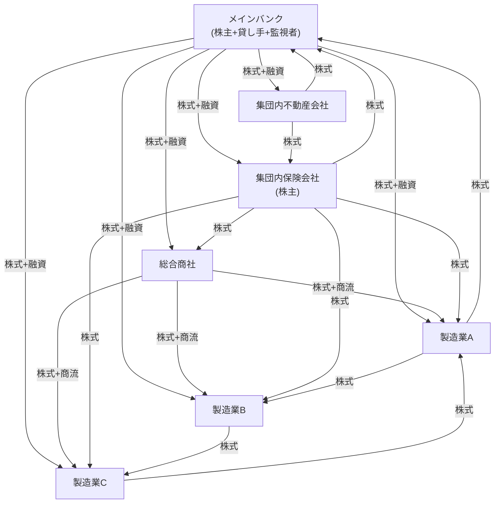

*1980年代の水平系列における持ち合い構造の模式図。矢印は株式保有の関係を示す。メインバンクは、株主、主要な貸し手、事実上の経営監視者という三つの役割を同時に担っていた。*

## この仕組みは何を実現し、誰を優先したのか

この企業統治は、株主利益の最大化よりも、企業を取り巻く関係者の**長期的な調整**を重視していた。企業集団の内部では情報を共有しやすく、メインバンクは経営悪化の早い段階で支援や再建に入ることができた。終身雇用は、従業員が一社で長く働くことを前提に、企業固有の技能へ投資する土台にもなった。

一方で、利益や余剰資金は、貸し手への安定した利払い、従業員の雇用と賃金、取引先との長期関係に優先的に配分された。株主への配当や自己資本に対する収益率は、その後に位置づけられた。その結果、ROEを高める圧力は弱く、経営陣が分散した一般株主から距離を置きやすい構造が生まれた。

> **コラム ― 監査役制度を一段落で。** 監査役は取締役の職務執行を監査し、取締役会に出席し、株主に報告する法定機関である。ただし、取締役会の決議に加わることや、執行役員を任免すること、経営戦略を決定することはできない。実務では、元社内役員やメインバンク出身者が監査役に就く例も多かった。2001年の商法改正により、監査役の半数以上を社外監査役とすることや、任期を4年とすることが定められたが、取締役とは異なる権限構造は現在も続いている。

## 緩やかな解体、1990年から2014年

1989年末の株価ピーク後、五つの仕組みは一度に消えたのではなく、三つの流れを通じて徐々に弱まった。

**第一波 ― 銀行の資本悪化（1990～2003年）。** 地価と株価の下落により、銀行は不良債権処理と自己資本の立て直しを迫られた。保有株式の売却も進み、系列内企業間の相互保有は1981年の約25%から1999年には約20%へ低下した。上場株式に占める銀行の保有比率も、1980年代の20%超から2014年には5%未満となった。銀行が株主として持っていた影響力と、経営を監督する余力が同時に弱まったのである。

**第二波 ― 会計・法制度の改革（1997～2008年）。** 2001年度から持ち合い株式に時価評価が導入され、保有に伴う価格変動リスクが財務諸表に表れやすくなった。2001年の商法改正は監査役制度を強化し、2002年改正（2003年4月施行）は、指名・監査・報酬の各委員会を置く「委員会等設置会社」を選択できるようにした。ただし普及は緩やかで、2016年末でも約3,800社の上場会社のうち導入企業は約70社にとどまった。金融商品取引法に基づく内部統制報告制度、いわゆる**J-SOX**は、2008年4月1日以後に開始する事業年度から適用された。

**第三波 ― 外国人投資家の増加（2003～2014年）。** 東証上場株式に占める外国人の保有比率は、1980年代の低い水準から2014年には約30%まで上昇した。銀行が株式を手放す一方で、外国人投資家は議決権を行使し、株主総会に参加し、収益性や取締役会の独立性を問うようになった。持ち合い株式の比率が東証全体の10%を下回ったのは2017年である。

数字を並べると、変化の方向が分かる。

| 指標 | 1988年ピーク | 2014年(スチュワードシップ・コード前) |
| --- | --- | --- |
| 持ち合い比率(東証時価総額対比) | **50%超** | 約15%(かつ低下中) |
| 上場株式に占める銀行保有比率 | **20%超** | **5%未満** |
| 東証上場株式の外国人保有比率 | 僅少 | **約30%** |
| TOPIX500のうち独立社外取締役を一人以上有する企業 | n/a | **約22%** |
| 「資本コストを意識している」上場企業 | n/a | **約40%** |
| 資本コストを開示する上場企業 | n/a | **10%未満** |

## 監視機能の空白

問題は、旧来の仕組みが弱まった後、その役割をすぐに引き継ぐ主体が現れなかったことにある。メインバンクは株式保有を減らし、経営への関与も後退した。ところが、独立社外取締役はまだ少なく、2013年時点でTOPIX500企業のうち一人以上を選任していた会社は約22%にすぎなかった。国内機関投資家は株式を保有していても、投資先企業との対話を積極的に行う慣行が十分に育っていなかった。外国人投資家は対話を求めたが、日本国内でその役割を支える制度は整っていなかった。

伊藤レポートは、当時のCEOの典型的な在任期間を**4～6年**とし、業績よりも年功によって交代時期が決まりやすい点を問題視した。社内出身者中心の取締役会、取締役の選解任権を持たない監査役、安定株主が多い株主構成のもとでは、重大な不祥事などを除き、業績を理由に経営トップを交代させる仕組みが働きにくかった。

> 「日本のコーポレートガバナンスは、2010年代初頭まで、監視機能をある機関 ―― メインバンク ―― が担っていた体系であった。だがその機関は既にその役割からほぼ撤退しており、他のいかなるアクターも代替を授権されていなかった。」
> ― Curtis Milhaupt, *On the (Fleeting) Existence of the Main Bank System and Other Japanese Economic Institutions*(コロンビア大学ロースクール)を意訳

2013年以降の改革は、この空白を埋めるための制度整備として捉えられる。2014年のスチュワードシップ・コードは、機関投資家に投資先企業との建設的な対話を求めた。2015年のコーポレートガバナンス・コードは、上場会社の取締役会に独立社外取締役の選任を求めた。伊藤レポートは、資本コストと資本効率を議論する共通言語を示した。そしてGPIFは、運用受託機関を通じてこれらの考え方を実務に広げる役割を担った。

## メインバンクからGPIFへ

経営監督の担い手は、メインバンクから直ちに機関投資家へ移ったわけではない。その間には、約15年にわたる空白があった。

**メインバンク（1950年代～1990年代）。** 銀行は主要な貸し手であると同時に、投資先企業の株式を3～5%程度保有し、経営陣と定期的に面談した。法的な拒否権はなくても、融資、株式保有、企業集団内での地位を通じて、重要な経営判断に大きな影響を及ぼした。

**空白期（1990～2014年）。** 銀行は保有株式と融資を減らし、不良債権先への長期関与よりも回収と撤退を優先するようになった。独立社外取締役の選任はまだ広がらず、国内機関投資家による対話も限定的だった。外国人投資家は海外のカストディアンを通じて議決権を行使したが、日本企業への継続的な働きかけを支える国内制度は十分ではなかった。

**GPIFと運用受託機関（2014年～現在）。** GPIFは2014年5月30日に日本版スチュワードシップ・コードの受入れを表明した。水野弘道氏は2015年1月にCIOに就任し、2020年3月まで務めた。GPIFは国内株式を外部の運用会社に委託しているため、企業への働きかけは運用受託機関を通じて行われる。GPIFが受託機関のスチュワードシップ活動を評価する仕組みは、運用業界全体の対話と議決権行使を変える強い誘因となった。2024年までにGPIFの運用資産は240兆円を超え、2014年以降の増加額は109兆円に達した。

1980年代のメインバンクと、2020年代の機関投資家は、組織も権限も大きく異なる。それでも、経営陣の外側から「預かった資本を十分に生かしているか」と問い続ける点では、共通する役割を担っている。

## 今も残る三つの構造

改革前の仕組みは完全に消えたわけではない。2026年のIR実務にも、次の三つが影響している。

1. **持ち合い株式が残っている。** 市場全体では縮小したが、保険会社、メガバンク、商社などには政策保有株式がなお集中している。2021年のコーポレートガバナンス・コード改訂は、個別銘柄ごとの保有の適否を検証し、その内容を開示することを求めている。
2. **監査役会設置会社が多数を占める。** 2024年時点でも、上場会社の過半数は監査等委員会設置会社や指名委員会等設置会社ではなく、監査役会設置会社である。外国人投資家との対話では、監査役と取締役の権限の違いや、現在の機関設計を選んだ理由を説明する必要がある。
3. **社内昇進と年功を重視する慣行が続いている。** 終身雇用そのものは変化しているが、取締役候補を社内から選ぶ傾向はなお強い。社外取締役候補の裾野も十分に広いとはいえず、異業種間で経営人材が移る例は限られている。

これらの論点は、政策保有株式、上場子会社、取締役会の多様性を扱うテーマ4・5でも改めて取り上げる。

## IR担当が押さえるべき含意

1. **株主構成を長期の変化の中で見る。** 国内金融機関や取引先企業の保有比率が高い場合は、その保有が政策保有株式に当たるか、売却時に流通株式比率へどう影響するかまで確認する。
2. **経営監督の実績を説明できるようにする。** 業績や戦略上の理由で経営陣を交代させた事例、取締役会が重要案件を修正・否決した事例、独立社外取締役が果たした役割を整理しておく。
3. **監査役制度を英語で正確に説明する。** 正式名称は「Audit & Supervisory Board」であり、監査役は取締役会決議の議決権を持たない。この違いを一文で説明できるようにする。
4. **政策保有株式は銘柄ごとに説明する。** 「取引関係の維持」だけでは足りない。保有による便益、リスク、資本コストとの比較、縮減方針を具体的に示す。
5. **外国人保有比率の推移を追う。** 外国人保有比率が上がれば、資本効率、取締役会の独立性、政策保有株式など、対話で問われる論点も変わる。単年度の数字ではなく、長期推移で管理する。

## 出典・参考資料

- Curtis J. Milhaupt, *On the (Fleeting) Existence of the Main Bank System and Other Japanese Economic Institutions*(コロンビア大学ロースクール / SSRN、英語版):https://papers.ssrn.com/sol3/papers.cfm?abstract_id=290283
- Hideki Kanda, *Japan's Audit & Supervisory Board Member System*(日本監査役協会、2021年8月、英語版):https://www.kansa.or.jp/wp-content/uploads/2021/10/Japans-Audit-Supervisory-Board-Member-System.pdf
- サンフランシスコ連邦準備銀行『Japan's Cross-Shareholding Legacy』(2009年8月、英語版):https://www.frbsf.org/wp-content/uploads/August-2009-Japans-Cross-Shareholding-Legacy-the-Financial-Impact-on-Banks-august-09-FINAL.pdf
- 野村資本市場研究所『Corporate Governance and Reform of Japan's Commercial Code』(2002年、英語版):https://www.nicmr.com/nicmr/english/report/repo/2002/2002sum01.pdf
- 金融庁『金融商品取引法』概要:https://www.fsa.go.jp/policy/fiel/index.html
- 経済産業省『伊藤レポート』(2014年8月、日本語版ポータル):https://www.meti.go.jp/policy/economy/keiei_innovation/kigyoukaikei/itoreport.html
- GPIF『日本版スチュワードシップ・コード受入れについて』:https://www.gpif.go.jp/investment/pdf/adoption_Japans_stewardship_code.pdf

---

**本テーマの前の記事:**[1.1 「ROE8%」が改革の基準になった理由](/governance/)

**本テーマの次の記事:**[1.3 ガバナンス改革が成長戦略に組み込まれた理由](/governance/)

**他テーマの関連記事:**
- [5.2 政策保有株式の最終局面――銘柄ごとの検証と開示](/governance/)
- [5.3 豊田自動織機の非公開化が示したもの――上場会社のグループ再編と少数株主保護](/governance/)
- [2.5 コードと指針――役割の違いと読み分け方](/governance/)

---

## ガバナンス改革が成長戦略に組み込まれた理由

**SOURCE URL:** https://jpinv.com/governance/foundations/1.3-abenomics-third-arrow/

**記事要約**

2013年6月14日に閣議決定された『日本再興戦略 ― JAPAN is BACK』は、コーポレートガバナンス改革を企業法務の問題にとどめず、日本経済の成長力を高める政策として位置づけた。本稿では、この閣議決定を受けて、スチュワードシップ・コード、会社法改正、伊藤レポート、コーポレートガバナンス・コードが短期間に具体化した経緯を整理する。

**本文**

> **要約**
> - 安倍晋三氏は2012年12月26日に首相に就任し、日本経済再生本部と産業競争力会議を設置して成長戦略の検討を進めた。
> - アベノミクスの「第三の矢」は、2013年6月14日の『日本再興戦略 ― JAPAN is BACK』として具体化された。同戦略は、コーポレートガバナンス改革を日本企業の競争力と生産性を高める政策に組み込んだ。
> - この方針を起点に、2014年のスチュワードシップ・コードと伊藤レポート、会社法改正、2015年のコーポレートガバナンス・コードが相次いで実現した。

## 2012年12月の政治状況

2012年12月の総選挙で自民党が政権に復帰し、安倍晋三氏は二度目の首相に就任した。政権には、衆議院での安定した議席、積極的な金融緩和に転じる日本銀行、従来の段階的な政策では日本経済を立て直せないという明確な問題意識があった。

この経済政策は、後に**アベノミクス**と呼ばれた。金融政策、財政政策、成長戦略を、毛利元就の故事になぞらえて「三本の矢」として示したものである。

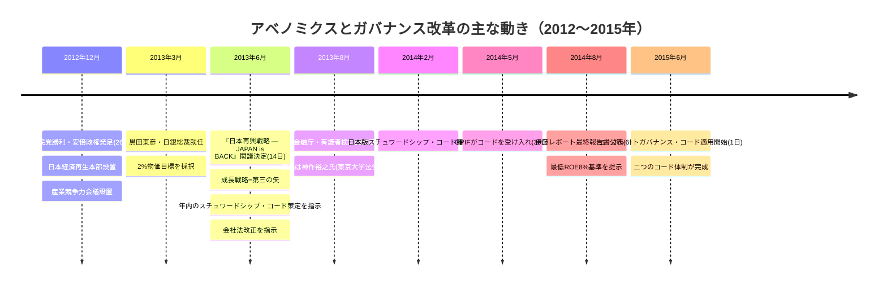

三本の矢の役割は、次のように整理できる。

| 矢 | 内容 | 主管機関 |
| --- | --- | --- |
| 第一:大胆な金融政策 | 2%物価目標;量的・質的金融緩和;資産買入れ拡大 | 日本銀行(黒田) |
| 第二:機動的な財政政策 | 補正予算;緊急経済対策 | 財務省 |
| 第三:成長戦略(構造改革) | 労働市場の規制緩和;特区;**コーポレートガバナンス**;農業改革;TPP参加 | 内閣府/日本経済再生本部 |

第一・第二の矢が主に需要を支える政策だったのに対し、第三の矢は供給力や生産性を高める構造改革である。その中にコーポレートガバナンスが明記されたことで、企業統治は法務や不祥事防止だけの論点ではなく、日本経済の成長力に関わる政策課題となった。

## 2013年6月14日『日本再興戦略』

『日本再興戦略 ― JAPAN is BACK』は2013年6月14日に閣議決定された。本文に加え、成果指標と工程を示す資料が用意され、政策ごとに担当省庁と期限が置かれた。実質的な検討を担ったのは、首相を議長とし、閣僚と民間議員が参加する産業競争力会議である。

ガバナンス改革に関して、同戦略が示した主な方針は次の四点である。

1. **日本版スチュワードシップ・コードを2013年内に取りまとめること。** 所管は金融庁とされ、閣議決定から約6か月という短い期限が置かれた。
2. **会社法を改正し、社外取締役を選任しない上場会社に理由の説明を求めること。** 法律上の「説明義務」によって、社外取締役を置かない判断を市場の検証にさらす考え方である。
3. **企業と投資家の望ましい関係を検討すること。** 経済産業省のプロジェクトとして進み、2014年8月の伊藤レポートにつながった。
4. **コーポレートガバナンス・コードを策定すること。** 具体的な方針と期限は、2014年6月の改訂版『日本再興戦略』で明確になった。

制度設計では、英国の経験が参考にされた。英国では2010年にスチュワードシップ・コードが導入され、2012年のケイ・レビューは、機関投資家が企業の長期的な価値創造に責任を持つべきだと提言していた。日本は、この原則主義とコンプライ・オア・エクスプレインの考え方を、自国の市場構造に合わせて取り入れた。

> 「機関投資家が、対話等を通じて企業の中長期的な成長を促進することにより、その受託者責任を果たすための諸原則…」
> ― 『日本再興戦略』における日本版スチュワードシップ・コードの記述

## なぜガバナンスを「成長政策」と位置づけたのか

それまでコーポレートガバナンスは、主として会社法を所管する法務省や、金融商品取引法を所管する金融庁の領域と考えられていた。安倍政権は、これを金融・財政政策と並ぶ成長戦略の一部として扱った。背景には、二つの考え方があった。

**第一に、資本効率の改善は経済全体の生産性を高めるという考え方である。** 日本企業が海外企業より低い収益率で多額の資本を保有しているなら、資本配分を改善する余地は大きい。McKinseyが示した日本のROIC約8%、米国約21%、欧州約15%という比較は、企業統治と資本配分の改善が経済成長につながり得ることを端的に示した。

**第二に、企業だけでなく投資家の行動も変える必要があるという考え方である。** 法律を改正しても、株主が経営陣と対話し、資本配分や取締役会の実効性を問い続けなければ、企業行動は変わりにくい。英国のスチュワードシップ・コードは、機関投資家の対話を受託者責任の一部として位置づける制度例を提供した。

この二つを組み合わせると、ガバナンス改革は会社法の技術論ではなく、企業の生産性と競争力を高める政策になる。だからこそ、担当省庁だけに委ねず、首相官邸が期限と方向性を示す案件として扱われた。

> **コラム ― なぜ産業競争力会議が中心になったのか。** 産業競争力会議には、閣僚に加えて企業経営者や有識者が参加した。ガバナンス改革を金融規制の一分野ではなく、産業競争力を高める政策として議論できる場だったことが重要である。ここで方向性を示し、金融庁、経済産業省、法務省、東証がそれぞれの制度に落とし込む形が取られた。

## 6か月から18か月の短期決戦

『日本再興戦略』が示した期限は、日本の制度改革としてはきわめて短かった。主な動きは次のとおりである。

- **2013年8月** ―― 金融庁が「日本版スチュワードシップ・コードに関する有識者検討会」を設置。座長は**神作裕之**氏。委員17名には、運用会社、アセットオーナー、議決権行使助言会社、関係省庁、東証などの関係者が参加した。
- **2013年8月～2014年2月** ―― 検討会を6回開催。パブリックコメントには日本語26件、英語19件の意見が寄せられた。
- **2014年2月26日** ―― 日本版スチュワードシップ・コードを確定。
- **2014年5月30日** ―― GPIFが同コードの受入れを表明。
- **2014年6月** ―― 改正会社法が成立し、社外取締役を置かない一定の会社に理由の説明を求める仕組みを導入。
- **2014年6月24日** ―― 改訂版『日本再興戦略』を閣議決定し、コーポレートガバナンス・コードをコンプライ・オア・エクスプレインで策定する方針を明記。
- **2014年8月6日** ―― 経済産業省が伊藤レポートを公表し、「最低限8%を上回るROE」を提示。
- **2015年3月** ―― 金融庁・東証の有識者会議がコーポレートガバナンス・コード原案を公表。
- **2015年6月1日** ―― コーポレートガバナンス・コードの適用を開始。

約18か月の間に、投資家向けの行動原則、上場会社向けの行動原則、社外取締役をめぐる会社法上の説明義務がそろった。2001年の監査役制度改革や2002年の委員会等設置会社の導入が数年にわたる検討を要したことと比べても、異例の速さである。閣議決定が担当機関と期限を明示したことが、この速度を支えた。

## 2013年の戦略に含まれなかった論点

『日本再興戦略』は改革の方向を示したが、現在の制度をすべて盛り込んでいたわけではない。後の改革につながる主な未着手事項は、次のとおりである。

- **独立社外取締役の人数基準。** 当時求めたのは、社外取締役を置かない場合の理由説明である。独立性や複数選任の具体的な水準は、2015年のコードと2018年・2021年の改訂で強化された。
- **流通株式比率。** 市場区分と株主構成を結びつける改革は、2022年のプライム・スタンダード・グロース再編まで待つことになる。
- **資本コストの開示。** 伊藤レポートが問題意識を示し、2018年のコード改訂が資本コストを明記し、2023年3月の東証要請が継続的な分析・開示・実行へと具体化した。
- **英文開示。** プライム市場の重要情報に関する日英同時開示は、2025年4月に義務化された。
- **サステナビリティ開示。** 2020年のスチュワードシップ・コード改訂、2021年のコーポレートガバナンス・コード改訂、SSBJ基準へと段階的に整備された。

後の制度はそれぞれ別の文書として成立したが、企業統治を成長政策として扱う基本的な考え方は、2013年の『日本再興戦略』を引き継いでいる。

## 『日本再興戦略』が残したもの

『日本再興戦略』自身がコードの条文を書いたわけではなく、ROEの数値基準を決めたわけでもない。その役割は、コーポレートガバナンスを日本経済の成長課題と位置づけ、関係機関に具体化を求め、期限を示したことにある。

日本企業の生産性と競争力を高めるには、資本配分と企業統治を変える必要がある。金融庁、東証、経済産業省、法務省はそれぞれの制度を通じて改革を進める。この方針が閣議決定として示されたことで、その後のコード、指針、開示制度が一つの流れとして動き始めた。

## IR担当が押さえるべき含意

1. **改革の起点を説明するときは、2013年6月14日を押さえる。** 海外投資家に「なぜ日本の改革は2014年前後から加速したのか」と聞かれたとき、『日本再興戦略』が最も簡潔な答えになる。
2. **ガバナンスを成長戦略として説明する。** 取締役会構成や開示の充実は、形式的な制度対応ではなく、資本配分、生産性、企業価値の向上につなげる取組みとして位置づける。
3. **所管機関を正確に把握する。** スチュワードシップ・コードは金融庁、コーポレートガバナンス・コードは金融庁・東証、伊藤レポートや企業統治の実務指針は経済産業省、会社法は法務省、上場規程は東証、サステナビリティ開示基準はSSBJが担う。
4. **自社の対応を制度改正の時系列に重ねる。** 独立社外取締役の初選任、資本コスト開示の開始、スキル・マトリックスの公表など、自社がいつ何を変えたかを整理すると、投資家との対話で改革の進捗を説明しやすい。
5. **審議会や政府方針を先行指標として読む。** 大きな方向性が政府文書で示され、コードや指針で具体化され、開示を通じて定着するという流れは、現在の改革でも繰り返されている。

## 出典・参考資料

- 内閣官房『日本再興戦略 ― JAPAN is BACK』(2013年6月14日、文書群・日本語):https://www.cas.go.jp/jp/seisaku/seicho/kettei.html
- 内閣官房(首相官邸)『アベノミクス三本の矢』概要PDF（英語版）:https://japan.kantei.go.jp/letters/message/abenomics/TheThreeArrowsOfAbenomics_EN.pdf
- 内閣官房「これまでの成長戦略について」（日本語）:https://www.cas.go.jp/jp/seisaku/seicho/kettei.html
- 内閣府・経済財政諮問会議 改革ワーキンググループ:https://www5.cao.go.jp/keizai-shimon/kaigi/special/reform/wg1/index.html
- 金融庁「スチュワードシップ・コードに関する有識者検討会」(検討会一覧):https://www.fsa.go.jp/singi/stewardship/index.html
- 金融庁『日本版スチュワードシップ・コード』2014年版本文:https://www.fsa.go.jp/news/25/singi/20140227-2/04.pdf
- 経済産業省『伊藤レポート』(2014年8月、日本語版ポータル):https://www.meti.go.jp/policy/economy/keiei_innovation/kigyoukaikei/itoreport.html

---

**本テーマの前の記事:**[1.2 メインバンク後の空白を、誰が埋めたのか](/governance/)

**本テーマの次の記事:**[1.4 投資家側を変えたスチュワードシップ・コード（2014／2017／2020／2025年）](/governance/)

**他テーマの関連記事:**
- [2.1 2015年コーポレートガバナンス・コード――「遵守か、説明か」の基本](/governance/)
- [2.5 コードと指針――役割の違いと読み分け方](/governance/)
- [5.8 次の制度改正を読む――ガバナンス関連会議・研究会の全体像](/governance/)

---

## 投資家側を変えたスチュワードシップ・コード（2014／2017／2020／2025年）

**SOURCE URL:** https://jpinv.com/governance/foundations/1.4-stewardship-code-2014/

**記事要約**

日本版スチュワードシップ・コードは、機関投資家に対し、投資先企業を深く理解し、建設的な対話と議決権行使を通じて中長期的な企業価値の向上を促すことを求める原則である。本稿では、2014年の策定から2017年、2020年、2025年の三度の改訂までをたどり、投資家に求められる責任がどのように広がってきたかを整理する。

**本文**

> **要約**
> - 日本版スチュワードシップ・コードは、神作裕之氏を座長とする金融庁の有識者検討会が取りまとめ、**2014年2月26日**に確定した。当初は七つの原則で構成され、コンプライ・オア・エクスプレインで運用される。
> - **2017年改訂**では、運用会社の経営陣の責任、アセットオーナーによる運用会社の監督、個別企業・議案ごとの議決権行使結果の公表などが強化された。
> - **2020年改訂**ではサステナビリティの考慮、株式以外の資産への適用、サービス・プロバイダーを対象とする原則8が加わり、**2025年改訂**では協働対話の位置づけなどが明確になった。

## 二つのコードが担う役割

金融庁は、スチュワードシップ・コードとコーポレートガバナンス・コードを、ガバナンス改革の**「車の両輪」**と表現してきた。前者は機関投資家の行動を、後者は上場会社の行動を対象とする。企業が十分な情報を開示し、取締役会が実効的に監督していても、株主が形式的に議決権を行使するだけでは対話は深まらない。反対に、投資家が積極的に対話しても、企業側に説明責任を果たす仕組みがなければ改革は進みにくい。

日本版スチュワードシップ・コードは、コーポレートガバナンス・コードより約16か月早く確定した。まず投資家側に対話の責任を置き、その後、上場会社側に対応する原則を整えた順序にも意味がある。コーポレートガバナンス・コードについては[テーマ2.1](/governance/)で詳しく扱う。

## 2014年の策定

金融庁は2013年8月、「日本版スチュワードシップ・コードに関する有識者検討会」を設置した。座長は東京大学大学院法学政治学研究科の**神作裕之**教授で、運用会社、アセットオーナー、議決権行使助言会社、関係省庁、東証などから17名が参加した。

検討会は2013年8月から2014年2月までに6回開かれた。和文26件、英文19件のパブリックコメントを踏まえ、**2014年2月26日**にコードを確定した。

コードは、スチュワードシップ責任を次のように定義している。

> 「スチュワードシップ責任」とは、機関投資家が、投資先企業やその事業環境等に関する深い理解に加え、運用戦略に応じたサステナビリティの考慮に基づく**建設的な「目的を持った対話」(対話)**などを通じて、当該企業の企業価値の向上やその持続的成長を促すことにより、顧客・受益者(最終受益者を含む。以下同じ。)の中長期的な投資リターンの拡大を図る責任を意味する。

この定義で重要なのは、次の三点である。

1. **目的は中長期的な投資リターンである。** 短期的な株価変動や、個々の株主総会議案だけを扱う考え方ではない。
2. **対話は任意の広報活動ではない。** 投資先企業の企業価値と顧客・受益者の利益を高めるために、機関投資家が果たすべき責任として位置づけられている。
3. **対話には企業と事業環境への深い理解が必要である。** 一律の議決権行使基準を当てはめるだけでなく、企業ごとの戦略、資本配分、リスクを把握したうえで判断することを求めている。

## 当初の7原則

2014年版は、七つの原則と、それぞれを具体化する指針で構成された。

1. **方針の公表** ―― スチュワードシップ責任を果たすための明確な方針を策定し、公表する。
2. **利益相反の管理** ―― 管理すべき利益相反を特定し、その管理方針を公表する。
3. **投資先企業の状況把握** ―― 持続的成長に向けた課題を的確に把握する。
4. **目的を持った対話** ―― 投資先企業と認識を共有し、問題の改善に努める。
5. **議決権行使方針と結果の公表** ―― 形式的な基準だけに頼らず、企業の持続的成長に資する判断を行う。
6. **顧客・受益者への報告** ―― 議決権行使を含む活動内容を定期的に報告する。
7. **能力と体制の整備** ―― 企業と事業環境を理解し、適切に判断するための知識、人材、組織を備える。

GPIFは2014年5月30日にコードの受入れを表明した。受入機関数は、2015年半ばの127、2016年12月の214、2020年5月の281を経て、2024年12月31日時点で**333**となった。

> **コラム ― コンプライ・オア・エクスプレインとは。** 受入機関は、各原則を実施するか、実施しない場合にその理由を説明する。実施しないこと自体に直ちに制裁があるわけではないが、説明の妥当性は顧客、受益者、投資先企業、市場から評価される。画一的な規則ではなく、原則を守りながら各機関の運用方針や規模に応じた実施方法を認める仕組みである。

## 英国の制度から何を取り入れ、日本向けに何を変えたか

日本版の直接の参考となったのは、英国の2010年スチュワードシップ・コードである。七つの原則という基本構成は英国版を踏襲したが、所管や受入機関の公表方法などは日本の制度に合わせて設計された。

| 選択 | 英国スチュワードシップ・コード | 日本スチュワードシップ・コード |
| --- | --- | --- |
| 所管 | 財務報告評議会(FRC、独立した規制当局) | **金融庁**(金融規制当局) |
| 受入機関の格付け | 段階別リスト(2020年以降:Tier 1 / Tier 2) | **単一の公開リスト** |
| 議決権行使助言会社 | ESMA水準の別手続で対応 | **2020年以降、コードの範囲内**(原則8) |
| アセットオーナーの説明責任 | 言及はあるが中核ではない | **2017年改訂以降、強調されている** |

金融庁が所管することで、コードは金融行政や運用会社の監督と連動しやすくなった。一方、受入機関を優劣で格付けせず、一つの公開リストに掲載する点には、日本の行政が採用してきた公表型の手法が表れている。

また、日本ではGPIFをはじめ多くのアセットオーナーが、実際の運用を外部の運用会社に委託している。そのため、アセットオーナーが委託先に何を期待し、どのように評価するかを明確にすることが、投資の連鎖全体を機能させるうえで重要となった。議決権行使助言会社などのサービス・プロバイダーをコードの対象に含めたのも、投資判断に影響する主体を連鎖の外に置かないためである。

## 策定後3回の改訂で何が変わったか

| 観点 | 2014年(当初版) | 2017年(第一次改訂) | 2020年(第二次改訂) | 2025年(第三次改訂) |
| --- | --- | --- | --- | --- |
| 原則の数 | **7** | 7 | **8** | 8(指針改訂) |
| 新設原則 | ― | ― | **原則8:サービス・プロバイダー**(議決権行使助言会社、年金コンサルタント) | ― |
| 議決権開示 | 総括ベースの開示を想定 | **個別企業・議案ごとの議決権行使結果**の公表を促進 | 再確認・充実 | 再確認 |
| サステナビリティ/ESG | 明示なし | 重要なESG要素への言及を追加 | スチュワードシップ責任の定義に**「サステナビリティ(ESG要素を含む中長期的な持続可能性)」を明示** | 2020年の位置づけを継承 |
| 対象資産クラス | 日本上場株式 | 日本上場株式 | **債券など株式以外の資産にも適用可能であることを明示** | 2020年の範囲を継承 |
| アセットオーナーの説明責任 | 言及あり | **委託先に対する期待と監督を強化** | さらに明確化 | 継続 |
| 協働対話 | 特段の明示なし | 特段の明示なし | 実務上の選択肢 | **有力な対話手法として位置づけを明確化** |
| 確定日 | 2014年2月26日 | 2017年5月29日 | 2020年3月24日 | 2025年6月26日 |
| 対応期限 | ― | 2017年11月末 | 2020年9月末 | 2025年末を目安 |

### 2017年改訂で何が変わったか

2017年改訂は、和文18件、英文11件の意見を踏まえ、**2017年5月29日**に確定した。

主な変更は三つある。

1. **運用会社の経営陣の責任を明確にした。** スチュワードシップ活動を担当部門だけに任せず、経営陣が人材、組織、利益相反管理に責任を持つことを求めた。
2. **議決権行使結果の公表を充実させた。** 単なる賛否件数の集計ではなく、個別の投資先企業・議案ごとの結果を公表する方向を示した。
3. **アセットオーナーによる運用会社の監督を強めた。** 委託先に求める活動を明確にし、その実施状況を評価することを求めた。GPIFはこの考え方を、運用受託機関の評価に反映した。

### 2020年改訂で何が変わったか

**2020年3月24日**の再改訂では、スチュワードシップ責任の定義に、運用戦略に応じたサステナビリティの考慮が明記された。ESGは付随的な対話テーマではなく、企業価値と投資リターンに影響する要素として、運用方針に応じて考慮すべき事項となった。

同時に、コードは日本の上場株式だけを念頭に置くものではなくなった。債券など他の資産を保有する機関投資家も、コードの目的に沿った活動が可能な場合には適用できることが示された。また、議決権行使助言会社や年金コンサルタントなど、投資の連鎖を支えるサービス・プロバイダーを対象とする**原則8**が新設された。

受入機関には、2020年9月末までに改訂内容に合わせて公表事項を更新することが期待された。金融庁は2017年版との変更点を示す見え消し版も公開している:https://www.fsa.go.jp/news/r1/singi/20200324/02.pdf

### 2025年改訂で何が変わったか

第三次改訂は**2025年6月26日**に確定した。中心となった論点の一つが、複数の機関投資家が共通の課題について連携して企業と対話する**協働対話**である。協働対話がスチュワードシップ責任を果たす有力な手段になり得ることを示しつつ、各投資家が自ら判断し、利益相反を管理する責任は変わらないことを確認した。

第三次改訂の詳細は、[テーマ5.7](/governance/)で扱う。

> 「日本の上場企業の成長と競争力は、二つのコード ―― 機関投資家を規律するスチュワードシップ・コードと、上場企業を規律するコーポレートガバナンス・コード ―― が並行して機能することに依存する。両コードは、資本市場改革の車の両輪である。」
> ― 金融庁『スチュワードシップ・コード及びコーポレートガバナンス・コードのフォローアップ会議』の継続的立場表明(意訳)

## 任意の受入れを実効的な規律に変える仕組み

コーポレートガバナンス・コードは東証の上場会社に適用される。一方、スチュワードシップ・コードの受入れは機関投資家の任意である。それでも広く定着したのは、次の仕組みが働いているためである。

1. **受入機関一覧の公表。** 金融庁はコードの受入れを表明した機関を公表する。一定規模の運用会社や年金基金が一覧にない場合、顧客や受益者から理由を問われる。
2. **アセットオーナーによる委託先評価。** GPIFなどのアセットオーナーは、運用会社の選定・評価にスチュワードシップ活動を組み込む。大口資金を受託するためには、コードの受入れだけでなく、実際の対話や議決権行使の質が問われる。
3. **金融庁の継続的な検証。** フォローアップ会議やコード改訂の検討会が、利益相反、議決権行使、協働対話などの課題を取り上げ、期待水準を更新する。

法令による一律の義務ではなく、受入れの公表、顧客・受益者への説明、委託先評価、市場からの検証を組み合わせることで、原則主義の実効性を確保している。

## IR担当が押さえるべき含意

1. **主要株主がコードを受け入れているか確認する。** 上位株主の受入状況、スチュワードシップ方針、重点対話事項を一覧にする。対話の優先順位や質問の背景を理解しやすくなる。
2. **主要運用会社の活動報告と議決権行使結果を読む。** 各社は、方針、活動報告、個別企業・議案ごとの行使結果を公表している。自社に対する判断や、同業他社との比較が表れる場合がある。
3. **2020年改訂後のサステナビリティ対話に備える。** 気候、人権、人的資本などが企業価値にどう影響するかを説明できるようにし、SSBJ基準を含む開示との整合を取る。
4. **改訂年ごとの差を取締役会に説明する。** 2014年版だけを前提にすると、2017年のアセットオーナー責任、2020年のサステナビリティと原則8、2025年の協働対話を見落とす。
5. **金融庁の検討会資料を先行して読む。** 改訂前の議論には、今後投資家から問われる論点が表れる。取締役会や経営会議への説明資料に、最新の検討状況を反映する。

## 出典・参考資料

- 金融庁『「責任ある機関投資家」の諸原則「日本版スチュワードシップ・コード」』策定公表(2014年):https://www.fsa.go.jp/news/25/singi/20140227-2.html
- 金融庁 日本版スチュワードシップ・コード最終本文(2014年2月、本文PDF):https://www.fsa.go.jp/news/25/singi/20140227-2/04.pdf
- 金融庁 2017年改訂版コード公表:https://www.fsa.go.jp/news/29/singi/20170529.html
- 金融庁 2017年改訂版コード本文(PDF):https://www.fsa.go.jp/news/29/singi/20170529/01.pdf
- 金融庁『「日本版スチュワードシップ・コード」(再改訂版)の確定について』(2020年3月24日):https://www.fsa.go.jp/news/r1/singi/20200324.html
- 金融庁 2020年改訂版コード本文(PDF):https://www.fsa.go.jp/news/r1/singi/20200324/01.pdf
- 金融庁 2020年改訂版コード(見え消し付き):https://www.fsa.go.jp/news/r1/singi/20200324/02.pdf
- 金融庁『日本版スチュワードシップ・コード』第三次改訂版の確定について(2025年6月26日):https://www.fsa.go.jp/news/r6/singi/20250626.html
- 金融庁「スチュワードシップ・コードに関する有識者検討会」:https://www.fsa.go.jp/singi/stewardship/index.html
- 金融庁「スチュワードシップ・コード及びコーポレートガバナンス・コードのフォローアップ会議」:https://www.fsa.go.jp/singi/follow-up/index.html
- GPIF『日本版スチュワードシップ・コード受入れについて』:https://www.gpif.go.jp/investment/pdf/adoption_Japans_stewardship_code.pdf
- GPIF『2024–2025年度 スチュワードシップ活動報告』:https://www.gpif.go.jp/investment/Stewardship_Activities_Report_2024-2025.pdf

---

**本テーマの前の記事:**[1.3 ガバナンス改革が成長戦略に組み込まれた理由](/governance/)

**本テーマの次の記事:**テーマ1完了 ― [テーマ2:コードの時代](/governance/cg-code/)へ進み、[2.1 2015年コーポレートガバナンス・コード――「遵守か、説明か」の基本](/governance/)から始める。

**他テーマの関連記事:**
- [2.1 2015年コーポレートガバナンス・コード――「遵守か、説明か」の基本](/governance/)
- [5.7 スチュワードシップ・コード第三次改訂後の協働対話](/governance/)
- [5.5 SSBJ基準の実務――段階適用と準備の要点](/governance/)
- [★ IRツールボックス――ガバナンス実務に必要な一次資料を分野別に整理](../../toolbox/ir-toolbox.j)

---

# テーマ2：コードの時代

---

## 2015年コーポレートガバナンス・コード――「遵守か、説明か」の基本

**SOURCE URL:** https://jpinv.com/governance/cg-code/2.1-cg-code-2015-primer/

**記事要約**

2015年6月に適用が始まったコーポレートガバナンス・コードは、上場会社に対し、株主の権利、情報開示、取締役会の責務、株主との対話などについて原則を示し、実施しない場合には理由の説明を求める。本稿では、2015年版の構造、五つの基本原則、コンプライ・オア・エクスプレインの考え方をIR実務の視点から整理する。

**本文**

> **要点**
> - 日本初の**コーポレートガバナンス・コード**は2015年3月5日に公表され、同年6月1日から適用された。法律ではなく、東証の上場規則を通じて運用される原則主義のソフトローである。
> - 2015年版は、**五つの基本原則、30の原則、38の補充原則（計73項目）**で構成された。上場会社は、各原則を実施するか、実施しない場合にはその理由を説明する。
> - 原則4.8は、東証一部・二部上場会社に対して**独立社外取締役を少なくとも2名以上**選任することを求めた。社内出身者中心だった日本の取締役会を変える重要な基準となった。

## コードはどのように生まれたか

2015年版コードは、アベノミクスの「第三の矢」に位置づけられた企業統治改革の一つである。2014年6月の改訂版『日本再興戦略』は、持続的な成長と中長期的な企業価値向上を促すため、コーポレートガバナンス・コードを策定する方針を示した。

狙いは、取締役会の説明責任と監督機能を高め、日本企業の資本効率を改善することだった。制度設計では、細かな行為を一律に定める米国型の規則よりも、企業ごとの事情を認めながら原則への対応を市場に説明させる英国型の考え方が採用された。

策定を担ったのは、金融庁と東証が共同事務局を務める**「コーポレートガバナンス・コードの策定に関する有識者会議」**である。座長は慶應義塾大学の**池尾和人教授**が務め、OECDも助言に加わった。委員12名の構成は次のとおりである。

- 経済界 **4名**
- 投資家側 **4名**
- 法学研究者 **1名**
- 実務法曹 **1名**
- 会計専門家 **1名**
- 監査役協会 **1名**

企業側だけに偏らず、投資家側の意見も同じ人数で反映する構成だった。会議は2014年8月に始まり、同年12月に原案を公表して意見を募集し、2015年3月に最終案を取りまとめた。

> **コラム ― なぜ原則主義を採用したのか。** 業種、規模、機関設計、株主構成が異なるすべての上場会社に、同じ手続を一律に課せば、形式対応が増えやすい。そこでコードは、望ましい企業統治の原則を示し、各社が自社の事情に応じて実施方法を選ぶ原則主義を採用した。実施しない場合にも、合理的な理由を説明すればコード上の対応となる。コード前文は、「各社の置かれた状況に応じて実効的なコーポレートガバナンスを実現できるよう、原則主義のアプローチを採る」としている。

## 5+30+38の構造

2015年版コードは、三つの階層で構成されている。最上位の**基本原則**が、上場会社に共通する五つの考え方を示す。その下の**原則**が各分野で求める対応を定め、**補充原則**が開示や手続をさらに具体化する。

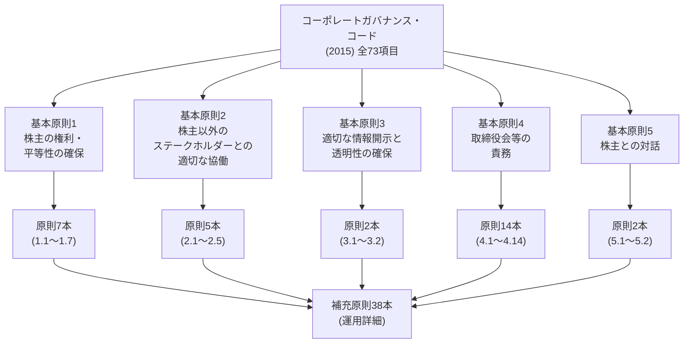

五つの基本原則を一文ずつ要約すると、次のようになる。

| # | 基本原則 | 取締役会に求められる内容 |
| --- | --- | --- |
| 1 | 株主の権利・平等性の確保 | 株主、とりわけ少数株主・外国人株主の権利を守り、実質的な平等を確保する。 |
| 2 | 株主以外のステークホルダーとの適切な協働 | 従業員、顧客、取引先、債権者、地域社会などの権利と立場を尊重し、適切に協働する。 |
| 3 | 適切な情報開示と透明性の確保 | 法令で求められる情報に加え、投資判断に役立つ情報を正確かつ分かりやすく開示する。 |
| 4 | 取締役会等の責務 | 戦略の方向づけ、適切なリスクテイクを支える環境整備、経営陣の監督を行う。 |
| 5 | 株主との対話 | 株主総会以外の場でも、株主と建設的に対話する。 |

実務上は、原則と補充原則に付された番号が重要である。たとえば、独立社外取締役は原則4.8、CEOの後継者計画は補充原則4.1.3に位置づけられる。コーポレート・ガバナンス報告書も、この番号に沿って各社の対応を記載する。

2015年当時、東証一部・二部上場会社は73項目すべてがコンプライ・オア・エクスプレインの対象だった。マザーズとJASDAQの上場会社については、五つの基本原則だけを対象とする簡素な適用が認められた。

## 2015年版コードが求めたこと

基本原則5は、株主との対話について次のように定めた。

> *「上場会社は、株主総会の場以外においても、株主との間で建設的な対話を行うべきである。その際、経営陣幹部・取締役(社外取締役を含む)は、こうした対話を通じて株主の声に耳を傾け、その関心・懸念に正当な関心を払うとともに……」*
> ― コーポレートガバナンス・コード(2015年版)基本原則5

この規定は、株主との対話をIR部門だけの仕事ではなく、経営陣と取締役会の責任として位置づけた。社外取締役も対話の当事者に含め、投資家の関心や懸念を経営に反映することを求めている。

取締役会の独立性については、原則4.8が具体的な人数を示した。

> *「上場会社は、独立社外取締役を少なくとも2名以上選任すべきである……業種・規模・事業特性・機関設計・会社をとりまく環境等を総合的に勘案して、自主的な判断により、少なくとも3分の1以上の独立社外取締役を選任することが必要と考える上場会社は、上記にかかわらず、そのための取組み方針を開示すべきである。」*
> ― コーポレートガバナンス・コード(2015年版)原則4.8

「独立社外取締役2名以上」は、社内出身者だけで構成されることの多かった日本の取締役会に、外部の視点を制度的に入れる出発点となった。

## コンプライ・オア・エクスプレインの仕組み

コードは会社法や金融商品取引法そのものではない。東証の有価証券上場規程と上場契約を通じて適用される。各社の対応は、東証所定の**コーポレート・ガバナンス報告書**で開示する。取締役会構成や方針など重要事項に変更があれば、報告書も随時更新する。

各原則について、上場会社は次のどちらかを選ぶ。

1. **実施する（Comply）** ―― 原則をどのように実施しているかを、具体的な制度、方針、実績とともに説明する。
2. **実施しない理由を説明する（Explain）** ―― 自社の事情を踏まえ、なぜ別の方法を選んだのか、その方法で原則の趣旨をどう実現するのかを説明する。

「実施しない」という選択が直ちに違反になるわけではない。重要なのは説明の内容である。投資家、議決権行使助言会社、取引所は、説明が具体的で合理的か、原則の趣旨に向き合っているかを評価する。東証の「コーポレート・ガバナンス情報サービス」では、各社の報告書を検索できるため、同じ原則に対する説明を企業間で比較することもできる。

> **コラム ― コードと会社法は別物。** 会社法は、会社が守らなければならない法的な最低基準を定める。コーポレートガバナンス・コードは、その上で、上場会社に望ましい企業統治を求めるソフトローである。コードを実施しないこと自体が民事・刑事責任に直結するわけではないが、必要な説明を行わなければ上場規則上の問題となり得る。また、説明の質は議決権行使や投資家との対話に直接影響する。

## 2015年当時の適用関係

| 発行体の区分(2015年時点) | コンプライ・オア・エクスプレインの対象 |
| --- | --- |
| 東証1部 | 全73項目(基本原則5+原則30+補充原則38) |
| 東証2部 | 全73項目 |
| マザーズ | 基本原則5のみ |
| JASDAQ | 基本原則5のみ |

一部・二部には全原則を適用し、新興市場には基本原則だけを適用することで、上場会社として求める最低水準と、企業規模に応じた負担のバランスを取った。この区分ごとの適用関係は、2022年4月の市場再編に合わせて見直されることになる。

## IR実務への含意

1. **主要な原則番号を使って説明する。** CEO後継者計画なら補充原則4.1.3、独立社外取締役なら原則4.8というように、質問と該当原則を結びつける。社内でも投資家との対話でも共通言語になる。
2. **コーポレート・ガバナンス報告書を定期的に点検する。** IR資料や統合報告書と記載が食い違っていないか、取締役会構成や委員会の変更が反映されているかを確認する。
3. **「実施」の説明も具体的に書く。** 「実施しています」だけでは、投資家は実効性を判断できない。制度、責任者、開催頻度、直近の実績まで示す。
4. **実施しない場合は、理由と代替策を示す。** 単に「検討中」とせず、現在の考え方、原則の趣旨を満たす別の方法、今後の見通しを説明する。
5. **報告書を更新される実務文書として扱う。** 年に一度だけ作る書類ではない。重要な変更があれば随時更新し、東証に提出された最新版を対外説明の基準にする。

## 出典・参考資料

- 金融庁 ― コーポレートガバナンス・コードに関する有識者会議: https://www.fsa.go.jp/singi/corporategovernance/index.html
- 金融庁 ― コーポレートガバナンス・コード原案(2015年3月): https://www.fsa.go.jp/news/27/singi/20150305-1.html
- ECGI ― 2015年6月1日施行の英語版テキスト（英語版）: https://www.ecgi.global/sites/default/files/codes/documents/japan_cg_code_1jun15_en.pdf
- 日本取引所グループ ― コーポレートガバナンス: https://www.jpx.co.jp/equities/listing/cg/index.html
- 日本取引所グループ ― コーポレート・ガバナンスに関する報告書の記載要領: https://www.jpx.co.jp/equities/listing/cg/01.html
- 日本取引所グループ ― コーポレート・ガバナンス情報サービス: https://www2.tse.or.jp/tseHpFront/CGK010010Action.do

## 関連記事

**本テーマの次の記事:** 2.2 ― 2018年改訂――資本コストがコードに明記された転機

**他テーマの関連記事:**
- 1.3 ― [ガバナンス改革が成長戦略に組み込まれた理由](/governance/)
- 1.4 ― [投資家側を変えたスチュワードシップ・コード（2014／2017／2020／2025年）](/governance/)
- 3.1 ― [4区分から3区分へ――2022年4月の市場再編](/governance/)

---

## 2018年改訂――資本コストがコードに明記された転機

**SOURCE URL:** https://jpinv.com/governance/cg-code/2.2-cg-code-2018-revision/

**記事要約**

2018年6月の改訂は、コーポレートガバナンス・コードが「形を整える段階」から「経営の中身を問う段階」へ進んだ節目である。原則5.2に資本コストが明記され、政策保有株式には縮減方針と銘柄ごとの検証が求められた。CEOの後継者計画は取締役会が監督すべき事項となり、企業年金もアセットオーナーとしての役割を問われるようになった。同時に公表された『投資家と企業の対話ガイドライン』は、企業と投資家が何を話し合うべきかを具体化した。

**本文**

> **要点**
> - 2018年改訂は**2018年6月1日**に確定した。原則5.2に**「自社の資本コストを的確に把握した上で」**という文言が加わり、資本コストが上場会社の経営計画と説明責任に正式に組み込まれた。
> - 政策保有株式（原則1.4）、CEOの後継者計画（補充原則4.1.3）、企業年金（原則2.6）についても、取締役会が担うべき役割と開示の水準が引き上げられた。
> - 同時に公表された**『投資家と企業の対話ガイドライン』**は、両コードの附属文書として、企業と機関投資家が重点的に議論すべき事項を示した。

## 「形式」から「実質」へ

2015年版コードの策定を担った有識者会議は、その後、金融庁と東京証券取引所が共同事務局を務める**スチュワードシップ・コード及びコーポレートガバナンス・コードのフォローアップ会議**に引き継がれた。ここで重要なのは、企業側のコーポレートガバナンス・コードと、投資家側のスチュワードシップ・コードが、別々の制度としてではなく、相互に作用する一組の仕組みとして点検されるようになったことである。

2015年版の導入後、独立社外取締役の選任やコーポレート・ガバナンス報告書の提出は広く定着した。一方で、取締役会の議論や資本配分、CEOの選解任といった経営の実質まで変わったかについては、なお課題が残った。金融庁が当時掲げたのが、コーポレートガバナンス改革を**「形式から実質へ」**と深めるという考え方である。

2018年改訂は、この問題意識をコード本文に反映した。新たな項目を数多く増やすよりも、資本コスト、政策保有株式、CEO後継者計画、企業年金といった、企業価値に直結する論点の要求水準を引き上げたのである。

> **コラム――2018年に対話ガイドラインが必要になった理由**
> コードの各原則だけでは、企業と投資家が実際の面談で何を議論すべきかまでは分からない。そこで金融庁は、経営戦略、資本政策、CEOの選解任、取締役会の機能、政策保有株式、企業年金などを、対話で重点的に確認する事項として整理した。コードが企業と投資家それぞれの行動原則を示し、対話ガイドラインが両者の議論をつなぐ役割を担う。

## 改訂の中心となった4つの論点

2018年改訂で実務上の影響が特に大きかったのは、次の4点である。

| 論点 | 2015年版 | 2018年版で変わったこと |
| --- | --- | --- |
| **資本コスト** | 原則5.2は経営戦略・経営計画の説明を求めていたが、「資本コスト」という語はなかった。 | **原則5.2を改訂。** 自社の資本コストを的確に把握したうえで、収益計画、資本政策、収益力・資本効率の目標、事業ポートフォリオや経営資源配分の具体策を説明するよう求めた。 |
| **政策保有株式** | 原則1.4は保有方針の開示と、取締役会による合理性の検証を求めていた。 | **原則1.4を強化。** 縮減方針を含む保有方針を開示し、個別銘柄ごとに便益・リスクが資本コストに見合うかを毎年検証することを求めた。**補充原則1.4.1**では、政策保有株主が売却を申し出た際に、取引縮減を示唆するなどして売却を妨げてはならないとした。 |
| **CEO後継者計画** | 補充原則4.1.3は後継者育成に触れていたが、取締役会の関与は簡潔な記述にとどまった。 | **補充原則4.1.3を改訂。** 経営戦略に照らして望ましいCEO像を定め、後継者計画と候補者育成を取締役会が主体的に監督することを明確にした。 |
| **企業年金** | 企業年金への言及はなかった。 | **原則2.6を新設。** 母体企業に対し、企業年金がアセットオーナーとして機能できるよう、専門性のある人材の登用・配置など人事・運営面で支援し、その取組を開示するよう求めた。 |

このうち、後の制度展開に最も大きくつながったのが資本コストである。2018年以降、対象となる上場会社は、資本コストを把握したうえで経営計画を策定していると示すか、そうしていない理由を説明する必要が生じた。2023年3月に東京証券取引所が公表した「資本コストや株価を意識した経営の実現に向けた対応」は、突然始まった政策ではない。原則5.2で示された期待を、より具体的な経営課題として改めて企業に問い直したものと位置づけられる。

## 原則5.2が求めた説明

2018年版の原則5.2は、資本コストを把握するだけでなく、それを経営判断につなげ、株主に分かる形で説明することまで求めた。

> *「経営戦略や経営計画の策定・公表に当たっては、自社の資本コストを的確に把握した上で、収益計画や資本政策の基本的な方針を示すとともに、収益力・資本効率等に関する目標を提示し、その実現のために、事業ポートフォリオの見直しや、設備投資・研究開発投資・人材投資等を含む経営資源の配分等に関し具体的に何を実行するのかについて、株主に分かりやすい言葉・論理で明確に説明を行うべきである。」*
> ― コーポレートガバナンス・コード（2018年版）原則5.2

ここで問われているのは、資本コストの数値を一つ示すことだけではない。収益目標や資本政策をどのように定め、事業ポートフォリオや設備投資、研究開発、人材投資にどう反映するのかまで、一つの論理として説明することが求められている。

政策保有株式についても、同じ資本コストの考え方が判断基準に据えられた。

> *「取締役会は、毎年、個別の政策保有株式について、保有目的が適切か、保有に伴う便益やリスクが資本コストに見合っているか等を具体的に精査し、保有の適否を検証するとともに、そうした検証の内容について開示すべきである。」*
> ― コーポレートガバナンス・コード（2018年版）原則1.4

これにより、政策保有株式は「取引関係の維持に必要だから保有する」という一般論だけでは説明しにくくなった。取締役会には、保有によって得られる便益とリスクを銘柄ごとに確認し、その資本を他に振り向けた場合との比較まで意識した判断が求められる。

## 『投資家と企業の対話ガイドライン』

2018年6月に公表された『投資家と企業の対話ガイドライン』は、コーポレートガバナンス・コードとスチュワードシップ・コードの附属文書に位置づけられている。ガイドライン自体はコンプライ・オア・エクスプレインの対象ではないが、両コードを実効的に運用するため、企業と投資家が重点的に議論すべき事項を示している。

主な論点は、次のとおりである。

- 経営環境の変化に対応した経営判断
- 投資戦略と財務管理
- CEOの選解任・育成と取締役会の機能
- 政策保有株式
- アセットオーナーとしての企業年金

ガイドラインがあることで、「原則を遵守しているか」という確認だけでなく、その原則が経営の中でどのように機能しているかを対話で掘り下げられるようになった。たとえば資本コストであれば、算定値の有無だけでなく、その水準を投資判断や事業撤退にどう使っているかまでが議題となる。

## 取締役会の独立性と指名・報酬委員会

2018年改訂では、取締役会の構成に関する期待も引き上げられた。原則4.8は、独立社外取締役を少なくとも2名選任するという従来の基準を維持しつつ、業種、規模、事業特性、機関設計などを踏まえ、必要と考える会社には**3分の1以上**の独立社外取締役を選任する方針の開示を求めた。

補充原則4.10.1は、独立社外取締役が取締役会の過半数に達していない会社に対し、独立社外取締役を主要な構成員とする任意の指名委員会・報酬委員会などを設け、指名・報酬の重要事項について適切な関与と助言を得ることを求めた。法定の機関設計を変更しなくても、CEOの選解任や役員報酬の客観性を高める仕組みを整えられるようにしたのである。

## 上場会社の対応状況

東京証券取引所が2018年12月末時点のコーポレート・ガバナンス報告書を集計したところ、市場第一部では、全原則を遵守している会社が**18.1%**、全原則の9割以上を遵守している会社が**85.3%**だった。2017年7月の集計と比べると、それぞれ13.4ポイント、7.7ポイント低下している。

これは、企業の取組が後退したというより、改訂によって要求水準が上がり、新たに説明を要する項目が増えた結果と読むべきである。なかでも、独立社外取締役を主要な構成員とする任意の指名・報酬委員会に関する補充原則4.10.1の遵守率は52.1%にとどまった。2018年改訂が、形式的な対応では済みにくい論点を企業に突きつけたことが分かる。

## IR担当者が押さえるべき実務

1. **資本コストの説明を原則5.2と結びつける。** WACC、ROIC、エクイティ・スプレッドを示す際は、単なる財務指標の紹介ではなく、経営戦略、資本政策、経営資源配分を一つの説明につなげる。
2. **政策保有株式は銘柄ごとの判断過程まで整える。** 縮減方針、取締役会による年次検証、当期の売却実績を相互に整合させる。「取引関係の維持」という定型句だけでは、原則1.4が求める説明にならない。
3. **後継者計画は交代直前に作るものではない。** CEOに求める資質、候補者の育成方法、指名委員会と取締役会の検討頻度を平時から文書化する。
4. **企業年金の運営をIRの説明範囲に入れる。** 自社年金の運用体制、専門人材、運用機関への働きかけ、利益相反管理について、社内の担当部署と確認しておく。
5. **対話ガイドラインを面談準備に使う。** ガイドラインの各項目を、投資家から問われ得る質問に置き換えて、CEO・CFO向けの事前説明資料に反映する。

## 出典・参考資料

- 金融庁――コーポレートガバナンス・コードの改訂と投資家と企業の対話ガイドラインの策定について（2018年3月）: https://www.fsa.go.jp/news/30/singi/20180326.html
- 金融庁――改訂コーポレートガバナンス・コード（2018年6月、PDF）: https://www.fsa.go.jp/news/30/singi/20180326/01.pdf
- 金融庁――投資家と企業の対話ガイドライン: https://www.fsa.go.jp/news/30/singi/20180601/01.pdf
- 金融庁――スチュワードシップ・コード及びコーポレートガバナンス・コードのフォローアップ会議: https://www.fsa.go.jp/singi/follow-up/index.html
- 日本取引所グループ――コーポレートガバナンス・コードへの上場会社の対応状況（2018年12月31日時点）: https://www.jpx.co.jp/news/1020/20190221-01.html

## 関連記事

**本テーマの次の記事:** 2.3――2021年改訂――プライム市場・サステナビリティ・多様性

**他テーマの関連記事:**
- 4.1――[PBR1倍割れをどう読むか――東証要請の本当の狙い](/governance/)（2018年に明記された資本コストが、2023年の東証要請へつながる過程）
- 4.2――[WACC・ROIC・エクイティ・スプレッド――資本コスト経営の基本用語](/governance/)（原則5.2を実務に落とし込むための用語）
- 5.2――[政策保有株式の最終局面――銘柄ごとの検証と開示](/governance/)（2018年の原則1.4強化後に進んだ縮減と開示の変化）

---

## 2021年改訂――プライム市場・サステナビリティ・多様性

**SOURCE URL:** https://jpinv.com/governance/cg-code/2.3-cg-code-2021-revision/

**記事要約**

2021年6月の改訂は、翌年に控えた東証の市場区分再編と一体で進められた。プライム市場には、独立社外取締役を3分の1以上とすること、重要情報を英語でも開示すること、機関投資家向けの電子議決権行使基盤を利用すること、TCFDまたは同等の枠組みに沿って気候関連開示を充実させることなど、一段高い原則が設けられた。あわせて、全原則の適用を受ける上場会社には、取締役会のスキル構成、サステナビリティ、人的資本・知的財産への投資、管理職の多様性について、より具体的な開示が求められるようになった。

**本文**

> **要点**
> - 2021年改訂は**2021年6月11日**に施行された。プライム市場向けの原則は、新市場区分が始まった**2022年4月4日**から適用された。
> - プライム市場には、独立社外取締役3分の1以上、指名・報酬委員会の独立性、英文開示、電子議決権行使プラットフォーム、TCFD等に基づく気候関連開示など、追加の要求が設けられた。
> - スキル・マトリックス、管理職の多様性、サステナビリティ、人的資本・知的財産への投資は、プライム市場だけでなく、コードの全原則の適用を受ける上場会社に広く関わる改訂である。

## 市場区分再編と一体で行われた改訂

2021年改訂は、2022年4月の市場区分再編を抜きにしては理解できない。東京証券取引所は、従来の市場第一部、市場第二部、マザーズ、JASDAQを、**プライム、スタンダード、グロース**の3市場に再編した。なかでもプライム市場は、「グローバルな投資家との建設的な対話を中心に据えた企業向け」と位置づけられた。

この位置づけに実質を持たせたのが、コーポレートガバナンス・コードの改訂である。市場区分を変えるだけでは、プライムとスタンダードの違いは時価総額や流動性の基準にとどまる。そこで東証は、プライム市場にだけ適用する原則をコードに設け、取締役会の独立性、英文開示、気候関連開示、株主総会の利用環境について、より高い水準を求めた。

一方、コードの適用範囲そのものも市場ごとに整理された。プライム市場とスタンダード市場の上場会社は、基本原則、原則、補充原則のすべてについてコンプライ・オア・エクスプレインを行う。グロース市場の上場会社が対象とするのは基本原則である。

## 改訂で変わった5つの分野

| 論点 | 2018年版 | 2021年版で変わったこと |
| --- | --- | --- |
| **取締役会の独立性** | 独立社外取締役は少なくとも2名。3分の1以上が必要と考える会社には、その方針の開示を求めた。 | **プライム市場**では、独立社外取締役を**3分の1以上**選任すべきとした。必要と考える会社には過半数の選任を促した。指名・報酬委員会についても、プライム市場では構成員の過半数を独立社外取締役とすることを基本とした。 |
| **取締役会のスキル構成** | 取締役会全体の知識・経験・能力、多様性、規模について考え方を示すことを求めていた。 | **補充原則4.11.1を改訂。** 経営戦略に照らして取締役会に必要なスキルを特定し、各取締役のスキルとの対応関係を、スキル・マトリックスなど適切な形で開示するよう求めた。他社での経営経験を持つ人材を独立社外取締役に含めることも明記した。 |
| **サステナビリティ・気候変動** | 原則2.3でサステナビリティ課題への対応に触れていたが、人的資本・知的財産や具体的な気候開示の枠組みまでは示していなかった。 | **補充原則3.1.3を新設。** サステナビリティの取組と、人的資本・知的財産への投資を経営戦略との関係が分かる形で開示するよう求めた。**プライム市場**には、TCFDまたは同等の枠組みに基づく気候関連開示の充実を求めた。**補充原則4.2.2**では、取締役会による基本方針の策定と監督を明記した。 |
| **中核人材の多様性** | 女性の活躍促進を含む多様性の確保を求めていたが、数値目標までは求めていなかった。 | **補充原則2.4.1を新設。** 女性、外国人、中途採用者の管理職登用について、考え方と自主的かつ測定可能な目標、その進捗を公表するよう求めた。人材育成方針と社内環境整備方針も開示対象となった。 |
| **海外投資家・株主総会への対応** | 英文開示や電子議決権行使の環境整備を、株主構成に応じて進めるよう求めていた。 | **プライム市場**には、必要な情報を英語でも開示・提供すること、少なくとも機関投資家向けに議決権電子行使プラットフォームを利用できるようにすることを明記した。 |

ここで区別しておきたいのは、**プライム市場だけに適用される原則**と、**全原則の適用を受ける会社に共通する原則**である。独立社外取締役3分の1以上、指名・報酬委員会の独立性に関する上乗せ、英文開示、電子議決権行使プラットフォーム、TCFD等に基づく気候関連開示は、プライム市場に固有の要求である。これに対し、スキル・マトリックス、管理職の多様性、サステナビリティ方針、人的資本・知的財産への投資の開示は、スタンダード市場を含め、コードの全原則の適用を受ける会社にも関わる。

## 独立社外取締役3分の1以上

2021年改訂を象徴するのが、原則4.8のプライム市場向け部分である。

> *「プライム市場上場会社は、独立社外取締役を少なくとも3分の1以上選任すべきである（機関設計に応じて、本原則が求める取締役会の機能を実現する観点から、独立社外取締役を過半数選任することが必要と考えるプライム市場上場会社は、十分な人数の独立社外取締役を選任すべきである）。」*
> ― コーポレートガバナンス・コード（2021年版）原則4.8

2015年版と2018年版では、「少なくとも2名」が共通の基準だった。2021年改訂は、プライム市場について人数ではなく**取締役会に占める比率**を明確にした。取締役会の規模が大きくなっても、独立社外取締役の影響力が薄まらないようにするためである。

さらに補充原則4.10.1は、プライム市場の指名委員会・報酬委員会について、構成員の過半数を独立社外取締役とすることを基本とした。独立社外取締役を取締役会に置くだけでなく、CEOの後継者選定や役員報酬といった重要な判断に、実際に関与させることを求めた改訂である。

## サステナビリティを経営戦略の開示に組み込む

補充原則3.1.3は、サステナビリティを独立した社会貢献活動としてではなく、経営戦略と経営資源配分の問題として扱った。

> *「上場会社は、経営戦略の開示に当たって、自社のサステナビリティについての取組みを適切に開示すべきである。また、人的資本や知的財産への投資等についても、自社の経営戦略・経営課題との整合性を意識しつつ分かりやすく具体的に情報を開示・提供すべきである。特に、プライム市場上場会社は、気候変動に係るリスク及び収益機会が自社の事業活動や収益等に与える影響について、必要なデータの収集と分析を行い、国際的に確立された開示の枠組みであるTCFDまたはそれと同等の枠組みに基づく開示の質と量の充実を進めるべきである。」*
> ― コーポレートガバナンス・コード（2021年版）補充原則3.1.3

この原則には三つの段階がある。第一に、全対象会社がサステナビリティへの取組を開示する。第二に、人的資本と知的財産への投資を、経営戦略との関係が分かる形で説明する。第三に、プライム市場は、気候変動によるリスクと収益機会を分析し、TCFD等の枠組みに沿って開示を充実させる。

その後、有価証券報告書にはサステナビリティ情報の記載欄が設けられ、SSBJ基準の整備も進んだ。2021年改訂は、そうした法定開示に先立って、取締役会とIR部門に実務を始めさせる役割を果たした。

## 多様性は「方針」から「測定可能な目標」へ

補充原則2.4.1は、女性、外国人、中途採用者の管理職登用について、理念だけでなく、**自主的かつ測定可能な目標**を示すよう求めた。コードが一律の数値を指定したわけではない。各社が自社の状況に応じて目標を決め、その考え方、進捗、人材育成方針、社内環境整備方針を公表する仕組みである。

改訂時点で、3月期決算の上場会社約2,220社における女性役員比率は約7.4%だった。政府が2023年に掲げた「2030年までに女性役員比率30%以上」という目標との間には大きな差がある。補充原則2.4.1が直接対象とするのは管理職層だが、そこで候補者を継続的に育てることが、将来の執行役員や取締役の人材基盤につながる。

## コードは73項目から83項目へ

2021年改訂後のコードは、**基本原則5、原則31、補充原則47の計83項目**となった。2015年版の73項目から10項目増え、サステナビリティ、人的資本、知的財産、多様性、グループガバナンス、プライム市場向けの追加原則が組み込まれた。

項目数以上に重要なのは、開示どうしをつなげる必要が高まったことである。たとえば、スキル・マトリックスは経営戦略と結びつき、人的資本投資はサステナビリティ方針と資本配分につながる。英文開示は日本語版の要約ではなく、海外投資家との対話を支える情報基盤として扱う必要がある。個々の原則に別々に回答するだけでは、全体として説得力のある説明になりにくくなった。

## 2022年4月の適用開始

プライム市場向けの原則は、2022年4月4日の市場区分再編と同時に適用された。企業はその前から、取締役候補者の追加、指名・報酬委員会の構成変更、気候データの収集、英文開示体制の整備、議決権電子行使プラットフォームの導入を進めた。

東証が2022年7月14日時点のコーポレート・ガバナンス報告書を集計した資料は、改訂後の各原則への対応状況を市場別に示している。ここでの「説明」は、移行が遅れていることを意味するとは限らない。コードは、原則を実施しない場合でも、会社の事情と今後の方針を具体的に説明することを認めている。

> **コラム――コンプライ・オア・エクスプレインは「いずれ遵守すればよい」という制度ではない**
> 原則を実施していない会社でも、その理由が自社の事情に即しており、代替策や今後の方針が明確であれば、コード上の説明は成立する。反対に、「今後検討する」とだけ記し、判断理由も時期も示さなければ、形式上は説明でも、投資家からは実質のない回答と受け取られる。問われるのは、遵守か説明かの選択そのものより、取締役会がどう判断したかである。

## IR担当者が押さえるべき実務

1. **プライム市場向けの原則を独立して管理する。** 独立社外取締役、指名・報酬委員会、英文開示、電子議決権行使、TCFD等の各項目について、責任部署、取締役会での確認時期、開示媒体を一覧化する。
2. **スキル・マトリックスを経営戦略から作る。** 取締役の経歴に当てはまりそうな項目を並べるのではなく、中期経営計画の実行に必要な能力を先に定め、その能力を誰が担うかを示す。
3. **サステナビリティ開示を財務計画とつなげる。** 気候、人的資本、知的財産への投資額や成果指標を、事業戦略、資本配分、リスク管理の説明と整合させる。
4. **多様性は目標、実績、育成策を一組で示す。** 「多様性を重視する」という方針だけでなく、現状値、目標値、期限、候補者を育てる仕組みまで開示する。
5. **英文開示を翻訳作業だけにしない。** 日本語資料と同じ時点で、同じ重要情報を海外投資家が利用できる体制を整える。2025年4月の英文開示義務化は、2021年改訂で始まった流れを制度として強めたものである。

## 出典・参考資料

- 金融庁――コーポレートガバナンス・コードと投資家と企業の対話ガイドラインの改訂について（2021年4月公表、6月11日確定）: https://www.fsa.go.jp/news/r2/singi/20210406.html
- 日本取引所グループ――「改訂コーポレートガバナンス・コード」の公表について（2021年6月11日）: https://www.jpx.co.jp/news/1020/20210611-01.html
- 日本取引所グループ――改訂コーポレートガバナンス・コード（2021年6月、PDF）: https://www.jpx.co.jp/equities/listing/cg/tvdivq0000008jdy-att/b7gje6000005ob1l.pdf
- 金融庁――2021年6月11日確定版の解説（PDF）: https://www.fsa.go.jp/news/r2/singi/20210611/04.pdf
- 日本取引所グループ――コーポレートガバナンス・コードへの上場会社の対応状況（2022年6月定時総会後）: https://www.jpx.co.jp/news/1020/20220803-01.html

## 関連記事

**本テーマの次の記事:** 2.4――コーポレートガバナンス報告書を15分で読む方法

**他テーマの関連記事:**
- 3.1――[4区分から3区分へ――2022年4月の市場再編](/governance/)（2021年改訂と一体で設計された新市場区分）
- 3.3――[経過措置終了後の上場維持ルール](/governance/)（市場区分の定量基準とコードの原則を切り分けて理解する）
- 5.1――[日英同時開示は始まりにすぎない――2025年4月の義務化](/governance/)（補充原則3.1.2から適時開示ルールへの発展）
- 5.5――[SSBJ基準の実務――段階適用と準備の要点](/governance/)（補充原則3.1.3から法定開示へ続く流れ）
- 5.6――[「2030年30%」を実現するには――女性役員候補をどう育てるか](/governance/)（補充原則2.4.1と人材パイプライン）

---

## コーポレート・ガバナンス報告書を15分で読む方法

**SOURCE URL:** https://jpinv.com/governance/cg-code/2.4-reading-a-cg-report/

**記事要約**

コーポレート・ガバナンス報告書は、上場会社の資本構成、コードへの対応、取締役会の構成、株主総会・IRの運営、内部統制などを一つにまとめた東証所定の開示書類である。本稿では、正式な5部構成を確認したうえで、投資家やIR担当者が15分で全体像をつかむ読み順と、説得力のある「遵守」「説明」を見分ける着眼点を整理する。

**本文**

> **要点**
> - 東証のコーポレート・ガバナンス報告書は、**第I部から第V部までの5部構成**である。
> - コードの各原則を実施しない理由と、各原則に基づく開示は、主に**第I部**に記載される。取締役会・委員会・監査・報酬などの体制は**第II部**に記載される。
> - 15分で読むなら、まず第I部で資本構成とコード対応を確認し、次に第II部で取締役会の実態、第III部で株主総会とIR、第IV・V部で内部統制とその他の重要事項を確認する。

## CG報告書の全体構成

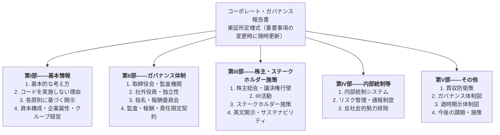

報告書は単なる組織図ではない。会社がどの原則を実施し、何を実施していないのか、その判断をどのように説明しているかまで検索できる。取締役会の構成やIR活動に変更があれば随時更新されるため、年に一度だけ作る書類ではなく、会社の現在のガバナンスを示す継続開示と考えるべきである。

## 第I部――最初に読むべき基本情報とコード対応

第I部の正式名称は、**「コーポレート・ガバナンスに関する基本的な考え方及び資本構成、企業属性その他の基本情報」**である。名称は長いが、投資家が最初に見る情報の多くがここに集まっている。

主な内容は次のとおりである。

1. **コーポレート・ガバナンスに関する基本的な考え方**――会社がガバナンスを何のために整備し、株主や他のステークホルダーをどう位置づけるかを説明する。
2. **コードの各原則を実施しない理由**――プライム・スタンダード市場では基本原則、原則、補充原則、グロース市場では基本原則について、実施していないものがあれば理由を記載する。
3. **コードの各原則に基づく開示**――政策保有株式、取締役会のスキル構成、サステナビリティ、資本コスト、株主との対話など、コードが開示を求める事項を記載するか、他の資料への参照先を示す。
4. **資本構成**――外国人株式保有比率、大株主、支配株主、親会社の有無などを記載する。
5. **企業属性とグループ経営**――市場区分、決算期、業種、従業員数、連結子会社数、親子上場の有無、少数株主保護の考え方などを示す。

この部分では、まず**支配株主・親会社の有無**と**外国人株式保有比率**を見る。支配株主がいる会社では、独立性と少数株主保護が読み解きの中心になる。外国人保有比率が高い会社では、英文開示、株主総会の利用環境、独立社外取締役、資本配分に関する説明への期待も高くなりやすい。

次に、コードを実施しない理由と各原則に基づく開示を確認する。どの原則を「説明」しているかだけでなく、同業他社と比べて説明が具体的か、日付や判断主体が示されているか、他の開示資料と整合しているかを見る。

> **コラム――外国人株式保有比率は、対話の前提を変える**
> 外国人保有比率が上がれば、海外の運用会社や議決権行使助言会社が求める情報の比重も高まる。英文資料の有無だけでなく、日本特有の機関設計、政策保有株式、親子上場、監査役の権限などを、海外投資家が理解できる言葉で説明する必要がある。IR担当者は、最新の比率と前年からの変化を把握しておきたい。

## 第II部――取締役会と監督体制の実像

第II部は、**「経営上の意思決定、執行及び監督に係る経営管理組織その他のコーポレート・ガバナンス体制の状況」**を扱う。ここを読むと、会社が採用する機関設計と、それが実際にどう構成されているかが分かる。

確認すべき項目は次のとおりである。

1. **機関設計**――監査役会設置会社、監査等委員会設置会社、指名委員会等設置会社のいずれか。
2. **取締役会の構成**――取締役の人数、任期、議長、社外取締役・独立役員の人数と属性。
3. **社外役員の独立性**――会社との取引関係、主要株主・取引先との関係、独立役員への指定状況。
4. **指名・報酬委員会**――任意委員会の有無、構成、委員長、独立社外取締役の比率、役割と権限。
5. **監査体制**――監査役・監査等委員・監査委員、内部監査部門、会計監査人の連携。
6. **役員報酬**――報酬方針、固定・業績連動・株式報酬の考え方、決定手続。
7. **現在の体制を選んだ理由**――なぜその機関設計が自社に適しているのか、社外取締役がどのような機能を果たすのか。

三つの機関設計は、名称だけでなく権限の配置が異なる。監査役会設置会社では監査役が取締役とは別の法定機関を構成する。監査等委員会設置会社では監査等委員である取締役が取締役会の議決に加わる。指名委員会等設置会社では、指名・監査・報酬の三委員会が法定委員会となる。同じ独立社外取締役比率でも、どの機関に所属し、どの決定に参加するかによって実効性は変わる。

## 説得力のある「遵守」と「説明」

コードの趣旨に沿った開示は、単に「実施している」と記すだけでは不十分である。実施内容、判断主体、見直し時期、経営戦略とのつながりが読者に分かることが重要になる。

補充原則4.11.1のスキル・マトリックスを例に比べてみよう。

> **弱い遵守説明**
>
> *「当社は補充原則4.11.1を実施しています。取締役会は、多様な経験と能力を有する取締役で構成されています。」*
>
> **具体性のある遵守説明**
>
> *「当社は、2024年5月の取締役会において、2025～2027年度中期経営計画の重点施策を実行するために必要な能力を、企業経営、財務・会計、M&A、技術、海外事業、法務・ガバナンス、サステナビリティ、人的資本の8分野に整理しました。各取締役との対応関係は本報告書14ページのスキル・マトリックスに示しています。指名委員会は、毎年の候補者選定に先立ち、必要な能力と現任取締役の構成を見直します。」*

後者には、経営戦略、取締役会での決定時期、能力の分類、見直し主体、参照ページが入っている。読者は、マトリックスが経歴の一覧ではなく、取締役候補者の選定に使われていることを確認できる。

次に、原則4.8の独立社外取締役比率を満たしていない場合の説明を比べる。

> **弱い説明**
>
> *「当社は現在、独立社外取締役を3分の1以上選任していません。今後検討してまいります。」*
>
> **具体性のある説明**
>
> *「当社の取締役10名のうち、独立社外取締役は3名で、比率は30%です。指名委員会は、2026年6月の定時株主総会で独立社外取締役を1名追加する方針で候補者を選定しています。選任された場合の比率は36%となります。進捗は四半期ごとに取締役会へ報告します。」*

実施していない理由を説明する場合でも、現状、判断理由、代替策、責任主体、時期を示せば、投資家は取締役会の考え方を評価できる。「遵守」という結論だけの記述より、具体的な「説明」の方が情報価値を持つこともある。

## 第III部――株主総会、IR、ステークホルダー施策

第III部は、**「株主その他の利害関係者に関する施策の実施状況」**であり、IR担当者に最も直接関係する部分である。

1. **株主総会の活性化と議決権行使の円滑化**――招集通知の早期発送、集中日を避けた開催、電子投票、機関投資家向け議決権電子行使プラットフォーム、招集通知の英訳、バーチャル総会など。
2. **IR活動**――ディスクロージャーポリシー、個人投資家・アナリスト・海外投資家向け説明会、代表者自身による説明の有無、IR資料の掲載、担当部署・担当役員。
3. **ステークホルダー施策**――社内規程におけるステークホルダー尊重、環境・CSR・サステナビリティ報告、多様性、内部通報制度など。

ここでは、会社が「投資家との対話を重視する」と書いているかより、誰が、どの投資家層に、どの頻度で説明しているかを見る。日本語と英語の情報が同時に公表されているか、CEOやCFOが対話に参加しているか、株主総会前に十分な検討時間が確保されているかも確認したい。

## 第IV部――内部統制と反社会的勢力への対応

第IV部には、会社法上の**内部統制システムに関する基本的な考え方と整備状況**、リスク管理、情報管理、内部通報、グループ会社管理、反社会的勢力排除の方針・体制などが記載される。

ここで扱う内部統制は、金融商品取引法上の財務報告に係る内部統制、いわゆるJ-SOXと完全に同じものではない。CG報告書では、取締役・使用人の職務が法令・定款に適合するための体制、損失リスクを管理する体制、職務情報の保存・管理、企業集団の業務の適正など、会社法上のより広い枠組みを中心に確認する。

通常は最後に概要を読めば足りるが、不祥事、内部統制の重要な不備、子会社管理上の問題があった会社では、この部分を先に読む価値がある。再発防止策が組織図の追加だけにとどまっていないか、通報経路や取締役会への報告がどう変わったかを確認する。

## 第V部――買収防衛策と体制図

第V部の「その他」には、買収防衛策の導入状況、今後のガバナンス課題、ガバナンス体制図、適時開示体制図などが含まれる。

買収防衛策を導入している会社では、その目的、仕組み、合理性に関する経営陣の評価を見る。体制図では、株主総会、取締役会、監査機関、任意委員会、執行会議、内部監査、会計監査人がどのようにつながっているかを一枚で把握できる。適時開示体制図は、重要情報が事業部門からどの経路で集約され、誰が開示判断を行い、どこで承認されるかを示す。

> **コラム――どこで入手するか**
> 各社の最新報告書は、東証の**コーポレート・ガバナンス情報サービス**で、会社名や証券コードから検索できる。会社のIRサイトにもPDFが掲載されることが多いが、比較調査では東証の検索サービスを使うと、同じ様式で複数社を確認しやすい。

## 15分で読む手順

| 経過時間 | 確認する内容 |
| --- | --- |
| 0～4分 | **第I部**――支配株主・親会社、外国人保有比率、市場区分、コードを実施しない理由、政策保有株式・資本コスト・スキル構成などの原則別開示。 |
| 4～9分 | **第II部**――機関設計、取締役会と独立社外取締役、指名・報酬委員会、監査体制、役員報酬、現在の体制を選んだ理由。 |
| 9～12分 | **第III部**――株主総会、電子議決権行使、英文招集通知、説明会、CEO・CFOの関与、IR担当体制。 |
| 12～14分 | **第IV部**――内部統制、リスク管理、内部通報、子会社管理。最近の不祥事がある場合は時間を増やす。 |
| 14～15分 | **第V部**――買収防衛策、ガバナンス体制図、適時開示体制図、今後の課題。 |

短時間で比較する場合は、項目をすべて同じ深さで読む必要はない。まず株主構成とコード対応で論点を絞り、その論点に関係する取締役会・委員会・IR体制を追う。支配株主がいれば少数株主保護、政策保有株式が多ければ原則1.4、PBR1倍割れなら原則5.2、海外保有比率が高ければ英文開示と株主総会環境、というように読み進める。

## IR担当者が押さえるべき実務

1. **CG報告書を随時開示として管理する。** 取締役会構成、委員会、支配株主、方針、コード対応に重要な変更があれば、年次更新を待たずに修正する。
2. **第I部の原則別開示を、投資家向けの文章として書く。** 定型句ではなく、判断主体、日付、数値、対象資料、見直し時期を入れる。別資料を参照させる場合は、読者が該当箇所へ迷わず到達できるようにする。
3. **第I部と第II部を整合させる。** 「指名委員会が後継者計画を監督する」と書くなら、第II部の委員会構成、開催回数、役割もそれを裏づけていなければならない。
4. **IR資料、有価証券報告書、統合報告書との不一致をなくす。** 外国人保有比率、独立社外取締役比率、政策保有株式、報酬方針、サステナビリティ目標など、同じ事項を複数媒体で開示する場合は基準日と定義をそろえる。
5. **東証の記載要領と好事例集を起点に改善する。** 自社独自の表現を追求する前に、各欄の正式な目的と記載上の注意を確認し、同業他社の好事例と比較する。

## 出典・参考資料

- 日本取引所グループ――コーポレート・ガバナンスに関する報告書（様式、記載要領、サンプル）: https://www.jpx.co.jp/equities/listing/cg/01.html
- 日本取引所グループ――コーポレート・ガバナンス報告書の好事例集（PDF）: https://www.jpx.co.jp/equities/listing/cg/tvdivq0000008jdy-att/b5b4pj0000036oc5.pdf
- 日本取引所グループ――コーポレート・ガバナンス情報サービス: https://www2.tse.or.jp/tseHpFront/CGK010010Action.do
- 日本取引所グループ――東証上場会社 コーポレート・ガバナンス白書: https://www.jpx.co.jp/equities/listing/cg/02.html

## 関連記事

**本テーマの次の記事:** 2.5――コードと指針――役割の違いと読み分け方

**他テーマの関連記事:**
- 3.2――[流通株式比率――政策保有株式の縮減を促した仕組み](/governance/)（資本構成と上場維持基準を読むための指標）
- 4.3――[東証の開示企業一覧――公表が生む規律](/governance/)（CG報告書を起点とする月次の公表制度）
- 5.1――[日英同時開示は始まりにすぎない――2025年4月の義務化](/governance/)（第III部の英文開示状況と適時開示ルール）

---

## コードと指針――役割の違いと読み分け方

**SOURCE URL:** https://jpinv.com/governance/cg-code/2.5-meti-guideline-family/

**記事要約**

コーポレートガバナンス・コードと経済産業省の実務指針は、同じガバナンス課題を扱いながら、役割が異なる。コードは上場会社に求める原則と開示を示し、コンプライ・オア・エクスプレインで運用される。一方、CGSガイドライン、グループガイドライン、公正M&A指針、企業買収における行動指針は、取締役会や特別委員会が実際にどのような手続を踏むべきかを具体化する。本稿では、両者の違いと、論点に応じた使い分けを整理する。

**本文**

> **要点**
> - **コーポレートガバナンス・コード**は、上場会社に求める原則と開示の枠組みを示す。これに対し、経済産業省の各種指針は、取締役会や委員会が実務で検討すべき手順と着眼点を詳しく示す。
> - 経済産業省の指針は、原則として**コンプライ・オア・エクスプレインの対象ではなく、法的拘束力も持たない**。それでも、会社、投資家、議決権行使助言会社、法律・財務アドバイザーが共通の参照資料として用いるため、実務上の影響は大きい。
> - 後継者計画ではCGSガイドライン、上場子会社ではグループガイドライン、MBOや支配株主による買収では公正M&A指針、未承諾買収では企業買収における行動指針が、コードを補う中心資料となる。

## コード、会社法、実務指針は何が違うのか

日本のガバナンス制度は、一つの文書だけで完結していない。少なくとも、次の三つを分けて読む必要がある。

**第一は会社法である。** 取締役の義務、会社の機関設計、株主総会、組織再編など、会社運営の法的な土台を定める。所管は法務省であり、違反には法的な責任が伴い得る。

**第二は金融庁・東京証券取引所のコードである。** コーポレートガバナンス・コードは上場会社に、スチュワードシップ・コードは機関投資家に、それぞれ期待される行動原則を示す。上場会社は、適用される原則について、実施しているか、実施していない場合はその理由を説明する。会社側の主な開示媒体は**コーポレート・ガバナンスに関する報告書**である。

**第三が経済産業省の実務指針である。** 指針は、コードの原則を機械的に言い換えるものではない。取締役会の構成やCEOの後継者計画、上場子会社の利益相反、MBO、未承諾買収といった場面で、どのような論点を、どのような順序で検討すべきかを掘り下げる。法令でも上場規則でもないが、手続の公正性や取締役会の判断過程を説明する際の共通言語として定着している。

> **コラム――「所管官庁が二つある」と単純化しない**
> ガバナンスを「金融庁対経済産業省」とだけ捉えると、全体像を誤る。会社法を所管する法務省、上場規則を運用する東京証券取引所、投資家側の規律を担う金融庁、企業経営やM&Aの実務指針を策定する経済産業省が、それぞれ異なる役割を担っている。実務では、法的な最低線を会社法で確認し、開示上の期待をコードで押さえ、具体的な進め方を実務指針で補う、という読み方が基本になる。

## 経済産業省が公表する四つの主要指針

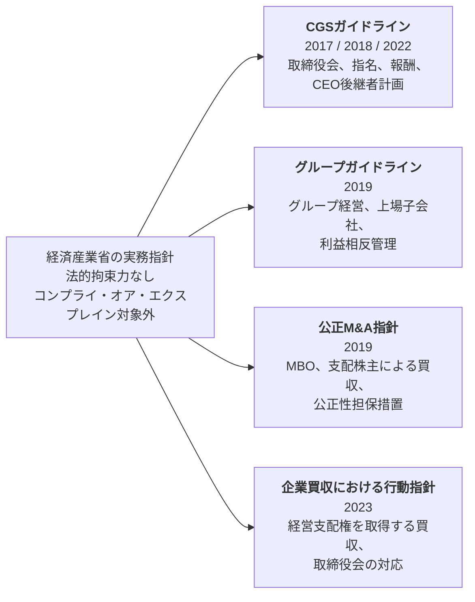

### 1. CGSガイドライン

正式名称は**『コーポレート・ガバナンス・システムに関する実務指針』**である。初版は2017年3月に公表され、2018年9月と2022年7月に改訂された。

この指針が扱うのは、取締役会の役割、業務執行と監督の分担、社外取締役の活用、指名・報酬の仕組み、CEOの選解任と後継者計画などである。コードが「取締役会は後継者計画を適切に監督すべきである」と原則を示すのに対し、CGSガイドラインは、候補者像の設定、候補者育成、指名委員会の関与、現CEOとの役割分担といった実務上の論点まで踏み込む。

2022年改訂では、指名・報酬・後継者計画に関する部分が、**『指名委員会・報酬委員会及び後継者計画活用に関する指針―コーポレート・ガバナンス・システムに関する実務指針（CGSガイドライン）別冊―』**として整理された。取締役会の監督機能だけでなく、経営陣による適切なリスクテイクと執行力を同時に高める視点が、改訂版の軸になっている。

### 2. グループガイドライン

正式名称は**『グループ・ガバナンス・システムに関する実務指針』**で、2019年6月28日に公表された。企業グループ全体の設計、親会社と子会社の権限配分、内部統制、事業ポートフォリオ管理、上場子会社における利益相反などを扱う。

とりわけ重要なのが、上場子会社を持つ親会社に対し、**子会社を上場したままにすることがグループ全体と子会社の少数株主の双方にとって妥当かを、継続的に検討するよう促している点**である。上場子会社側についても、独立社外取締役や特別委員会を活用し、親会社との取引や組織再編に伴う利益相反を管理することを求めている。

これは「親子上場を一律に解消せよ」という指針ではない。上場を維持するなら、その理由と便益を説明し、少数株主保護の仕組みを整える必要がある、という考え方である。

### 3. 公正M&A指針

正式名称は**『公正なM&Aの在り方に関する指針―企業価値の向上と株主利益の確保に向けて―』**で、2019年6月28日に公表された。2007年のMBO指針を全面的に見直し、MBOに加えて、支配株主が上場子会社を買収する取引も主な対象とした。

こうした取引では、買い手と対象会社の経営陣、または支配株主と一般株主の間に構造的な利益相反が生じる。指針は、その影響を抑えるための公正性担保措置として、次のような手段を示している。

- 独立性のある特別委員会の設置
- 外部専門家からの助言や価値算定書、必要に応じたフェアネス・オピニオンの取得
- 買収者以外の提案機会を確保するマーケット・チェック
- 取引条件や交渉過程に関する充実した情報開示
- 取引の性質に応じたマジョリティ・オブ・マイノリティ条件の検討

これらは、すべての案件で同じように採用すべき一律のチェックリストではない。取引の利益相反の程度や市場環境に応じて、どの措置を組み合わせれば公正な手続を確保できるかを判断するための枠組みである。

### 4. 企業買収における行動指針

**『企業買収における行動指針』**は2023年8月31日に公表された。対象は、上場会社の経営支配権を取得する買収である。2005年の買収防衛策に関する指針や2008年の企業価値研究会報告書を踏まえつつ、議論の中心を事前の防衛策から、買収提案を受けた取締役会の判断過程へ移した。

指針が重視するのは、**企業価値・株主共同の利益の確保または向上**、**株主意思の尊重**、**透明性の確保**という三つの原則である。対象会社の取締役会には、企業価値を高める可能性のある真摯な買収提案を恣意的に退けず、必要な情報を集め、他の選択肢と比較しながら真摯に検討することが求められる。

したがって、指針の転換点は「敵対的買収を歓迎した」ことではない。未承諾であるというだけで提案を不適切と決めつけず、提案内容、買収後の経営方針、価格、実現可能性などを具体的に評価するよう求めた点にある。

2026年7月には、経済産業省が同指針の**ポイント、Q&A、解釈文書**を公表し、買収提案の受領から検討、競合提案の扱い、情報開示までの実務上の考え方を補足した。

## コードと指針を論点別に比較する

| 論点 | コーポレートガバナンス・コード | 経済産業省の指針が補う内容 |
| --- | --- | --- |
| **CEO後継者計画** | 補充原則4.1.3は、取締役会がCEOなどの後継者計画を適切に監督し、候補者の育成に十分な時間と資源が充てられるよう関与することを求める。 | **CGSガイドライン**と2022年の別冊が、候補者像の設定、候補者群の形成、育成、評価、指名委員会の役割、現CEOとの分担などを具体化する。 |
| **上場子会社のガバナンス** | 2021年版の補充原則4.8.3は、支配株主を有する会社に、独立社外取締役の割合を高めるか、独立した特別委員会を設置することを求める。 | **グループガイドライン**が、親会社による上場維持の合理性の検討、親子間取引の管理、子会社取締役会・特別委員会の役割、少数株主保護を詳しく示す。 |
| **MBO・支配株主による買収** | 原則1.7は関連当事者間取引の管理を扱うが、MBOや支配株主による買収の手続を網羅的には定めていない。 | **公正M&A指針**が、特別委員会、外部助言、価値算定、マーケット・チェック、情報開示など、公正性を確保するための措置を整理する。 |
| **未承諾買収・買収防衛策** | 原則1.5は、買収防衛策の導入・運用について、必要性・合理性の説明と株主の権利への配慮を求める。 | **企業買収における行動指針**が、真摯な買収提案を受けた取締役会の検討、株主への情報提供、対抗提案、防衛策の在り方を、三原則に沿って整理する。 |

## 実務ではどう読み合わせるか

実務では、次の順序で読むと整理しやすい。

1. **まず法令を確認する。** 取締役の権限、株主総会決議、組織再編、公開買付けなど、法的に必要な手続を押さえる。
2. **次にコードを確認する。** 自社に適用される原則と、コーポレート・ガバナンス報告書で説明すべき事項を確認する。
3. **そのうえで該当する実務指針を読む。** 取締役会や特別委員会がどの論点を検討し、判断過程をどう記録・開示すべきかを具体化する。
4. **案件固有の事情に合わせて組み合わせる。** 指針を形式的にすべて採用するのではなく、利益相反の大きさ、株主構成、取引の緊急性、代替提案の可能性などに応じて必要な措置を選ぶ。

> **コラム――「法的拘束力がない」は「無視してよい」という意味ではない**
> 実務指針への不適合だけで直ちに法令違反や上場規則違反になるわけではない。一方、指針が示す公正性担保措置を採らなかった場合には、なぜ別の手続で十分な公正性を確保できると判断したのかを、取締役会や特別委員会が説明する必要が生じる。指針の効力は制裁ではなく、判断過程を比較・評価するための共通基準から生まれる。

## 一次資料を読む際の着眼点

グループガイドラインを読むときは、「上場子会社を残すか、非公開化するか」という結論だけを探すのではなく、親会社が上場を維持する合理性をどの頻度で検討し、子会社の独立した意思決定をどう確保するよう求めているかを見る。

公正M&A指針では、特別委員会の有無だけでなく、**いつ設置されたか、委員が独立しているか、交渉に実質的に関与したか、必要な情報と助言を得たか**が重要である。形式的に委員会を置くだけでは、手続の公正性は確保できない。

企業買収における行動指針では、提案が「友好的」か「敵対的」かより、取締役会が株主に代わって結論を先取りしていないか、必要な比較材料を株主に示しているかを読む。2026年のポイント・Q&Aは、抽象的な三原則を案件実務に落とし込む際の補助資料として有用である。

## IR実務への含意

1. **コードだけでなく、案件ごとの指針を読める状態にする。** 後継者計画、上場子会社、MBO、未承諾買収では、コードだけでは取締役会が必要とする手続情報が足りない。
2. **MBOや支配株主による買収では、公正M&A指針を案件初期から参照する。** 特別委員会を後付けで設置しても、交渉過程の独立性は取り戻せない。IRも、開示の直前ではなく、手続設計の段階から関与する必要がある。
3. **親子上場を維持する会社は、上場の便益を具体的に説明する。** 「知名度」や「採用力」といった一般論だけでなく、親会社・子会社・少数株主それぞれにどのような便益があるかを示す。
4. **指針から外れる場合は、代替手続を説明する。** 非拘束であることを理由に説明を省くのではなく、案件固有の事情と、別の手段で公正性を確保した理由を開示する。
5. **研究会資料まで追う。** 指針の改訂前には、経済産業省の研究会で論点が整理される。議事要旨、事務局資料、委員意見を読むと、次の制度変更と市場の関心を早めに把握できる。

## 出典・参考資料

- 経済産業省「コーポレートガバナンスに関する各種ガイドラインについて」: https://www.meti.go.jp/policy/economy/keiei_innovation/keizaihousei/corporategovernance/guideline.html
- 経済産業省「コーポレート・ガバナンス・システムに関する実務指針（CGSガイドライン）の改訂について」(2022年7月): https://www.meti.go.jp/press/2022/07/20220719003/20220719003.html
- 経済産業省「CGS研究会（第2期）報告書」の公表について(2018年5月): https://www.meti.go.jp/press/2018/05/20180518002/20180518002.html
- 経済産業省「M&Aに関する各種ガイドライン及び出版物」: https://www.meti.go.jp/policy/economy/keiei_innovation/keizaihousei/fair-ma-rule/ma-guideline-publications.html
- 経済産業省『公正なM&Aの在り方に関する指針―企業価値の向上と株主利益の確保に向けて―』(2019年): https://www.meti.go.jp/policy/economy/keiei_innovation/keizaihousei/pdf/fairma-guidelines.pdf
- 経済産業省「『企業買収における行動指針』を策定しました」(2023年8月31日): https://www.meti.go.jp/press/2023/08/20230831003/20230831003.html
- 経済産業省「『企業買収における行動指針』のポイント・Q&A等を策定しました」(2026年7月30日): https://www.meti.go.jp/press/2026/07/20260730002.html
- 経済産業省・法務省『企業価値・株主共同の利益の確保又は向上のための買収防衛策に関する指針』(2005年): https://www.meti.go.jp/policy/economy/keiei_innovation/keizaihousei/pdf/shishin_hontai.pdf
- 経済産業省『近時の諸環境の変化を踏まえた買収防衛策の在り方』(2008年6月): https://www.meti.go.jp/policy/economy/keiei_innovation/keizaihousei/pdf/080630TakeoverDefenseMeasures.pdf

## 関連記事

**本テーマの次の記事:** テーマ2はここまでです。続いて[テーマ3：市場区分の見直し](/governance/market-restructuring/)へ進みます。

**他テーマの関連記事:**
- [1.4 投資家側を変えたスチュワードシップ・コード（2014／2017／2020／2025年）](/governance/)
- [5.3 豊田自動織機の非公開化が示したもの――上場会社のグループ再編と少数株主保護](/governance/)
- [5.4 未承諾買収をどう扱うか――2023年「企業買収における行動指針」](/governance/)

---

# テーマ3：市場区分の見直し

---

## 4区分から3区分へ――2022年4月の市場再編

**SOURCE URL:** https://jpinv.com/governance/market-restructuring/3.1-four-segments-to-three/

**記事要約**

2022年4月4日、東京証券取引所は市場第一部・市場第二部・マザーズ・JASDAQを、プライム・スタンダード・グロースの3市場に再編した。目的は名称を整理することではない。各市場の役割を明確にし、新規上場基準と上場維持基準の水準を近づけ、流通株式の定義を見直し、プライム市場には一段高いガバナンスを求めることで、上場後も企業価値向上を促す仕組みに改めることだった。本稿では、再編の背景、3市場の違い、その後の改革につながった論点を整理する。

**本文**

> **要点**
> - **2022年4月4日**、東証は市場第一部・市場第二部・マザーズ・JASDAQを、**プライム、スタンダード、グロース**の3市場に再編した。
> - 再編前の問題は、市場ごとの役割が重なっていたこと、上場後に高い基準を維持する動機が弱かったこと、そして市場第一部とTOPIXが事実上結び付いていたことである。
> - 再編は、**上場維持基準の厳格化、流通株式の定義変更、プライム市場向けのガバナンス原則、TOPIX改革**を一体で進めるための土台となった。

## なぜ市場区分を見直したのか

東証と大阪証券取引所の現物市場が2013年に統合された際、既存の上場会社や投資家への影響を抑えるため、それぞれの市場構造はほぼそのまま残された。その結果、東証には市場第一部、市場第二部、マザーズ、JASDAQが並存した。JASDAQはスタンダードとグロースに分かれていたため、公式資料によっては「4市場」、細区分まで数えて「5区分」と表現される。

時間がたつにつれ、二つの問題が明確になった。

**一つ目は、各市場の役割が分かりにくいことだった。** 市場第二部、マザーズ、JASDAQは対象企業の規模や成長段階が重なり、投資家から見て違いがつかみにくかった。市場第一部も、どのような企業を日本の代表市場として位置付けるのかが曖昧になっていた。

**二つ目は、上場後の企業価値向上を促す仕組みが弱かったことである。** 再編前は、新規上場時に求められる水準と、上場を維持するための水準に大きな差があった。また、他市場から市場第一部へ移る際の基準が、市場第一部への直接上場基準より緩い場合があった。いったん上場すれば、その後も高い流動性やガバナンス水準を保つよう企業を促す仕組みになっていなかった。

さらに、**市場第一部への所属とTOPIXへの組み入れが事実上連動していた**。市場第一部に移れば、企業の投資適格性とは別に、TOPIX連動資金の買い需要を受ける構造だった。市場区分の役割を明確にするだけでなく、指数との関係も見直す必要があった。

## 検討から実施まで

東証は2018年10月に**「東京証券取引所における現物市場の市場構造の在り方等に関する懇談会」**を設置した。同年12月には論点ペーパーを公表し、2018年12月21日から2019年1月31日まで意見を募集した。寄せられた意見や市場関係者へのヒアリングを踏まえ、2019年3月に課題を整理した。

その後、金融庁の金融審議会に設けられた**市場構造専門グループ**が制度全体を検討した。座長は神田秀樹・学習院大学大学院法務研究科教授。2019年12月27日に公表された報告書の正式名称は、**『市場構造専門グループ報告書―令和時代における企業と投資家のための新たな市場に向けて―』**である。

報告書は、次の方向性を示した。

- 市場区分を、それぞれ明確な役割を持つ3市場に再編する
- 新規上場基準と上場維持基準を原則として共通化する
- 市場第一部とTOPIXの範囲を切り離す
- 市場区分に応じてガバナンス水準に差を設ける

東証はこの方針を上場制度に落とし込み、2021年9月から12月にかけて既存上場会社に移行先の市場を選ばせた。選択結果は2022年1月11日に公表され、同年4月4日に一斉移行した。

## 3市場は何が違うのか

東証が示す各市場の考え方は、次のとおりである。

- **プライム市場**：多くの機関投資家の投資対象となり得る規模と流動性を持ち、より高いガバナンス水準を備え、投資家との建設的な対話を通じて持続的成長と中長期的な企業価値向上を目指す企業向け。
- **スタンダード市場**：公開市場の投資対象として一定の規模と流動性を持ち、上場会社として基本的なガバナンス水準を備え、持続的成長と中長期的な企業価値向上を目指す企業向け。
- **グロース市場**：高い成長可能性を実現するための事業計画と進捗を適時・適切に開示し、市場から一定の評価を得る一方、事業実績の面では相対的にリスクが高い企業向け。

主な**上場維持基準**を比べると、違いが分かりやすい。

| 項目 | プライム | スタンダード | グロース |
| --- | ---: | ---: | ---: |
| 株主数 | 800人以上 | 400人以上 | 150人以上 |
| 流通株式数 | 2万単位以上 | 2,000単位以上 | 1,000単位以上 |
| 流通株式時価総額 | 100億円以上 | 10億円以上 | 5億円以上 |
| 流通株式比率 | 35%以上 | 25%以上 | 25%以上 |
| 売買代金・売買高 | 1日平均売買代金0.2億円以上 | 月平均売買高10単位以上 | 月平均売買高10単位以上 |
| 純資産 | 正であること | 正であること | 正であること |

ここで重要なのは、**上場審査基準と上場維持基準を混同しないこと**である。利益額や売上高、事業継続年数など、新規上場時に審査される項目の一部は、上場維持基準とは別に定められている。再編の意義は、両者を完全に同一にしたことではなく、従来よりも水準を近づけ、上場後も市場の性格に見合う状態を維持するよう求めた点にある。

## 発足時の会社数

2022年4月4日時点の上場会社数は、次のとおりだった。

| 市場 | 上場会社数 | 全体に占める割合 |
| --- | ---: | ---: |
| プライム | **1,839社** | 約49% |
| スタンダード | **1,466社** | 約39% |
| グロース | **466社** | 約12% |
| **合計** | **3,771社** | 100% |

プライムだけで全体のほぼ半数を占めたため、発足直後から「市場第一部との違いが見えにくい」との批判が出た。その背景には、移行先を既存上場会社が主体的に選べたことに加え、選択した市場の通常基準を満たしていない会社にも、適合計画を提出すれば緩和基準を適用する**経過措置**が設けられたことがある。

## 旧市場から新市場への移行

移行は、単なる名称変更ではなかった。大まかな流れは次の図で示せる。

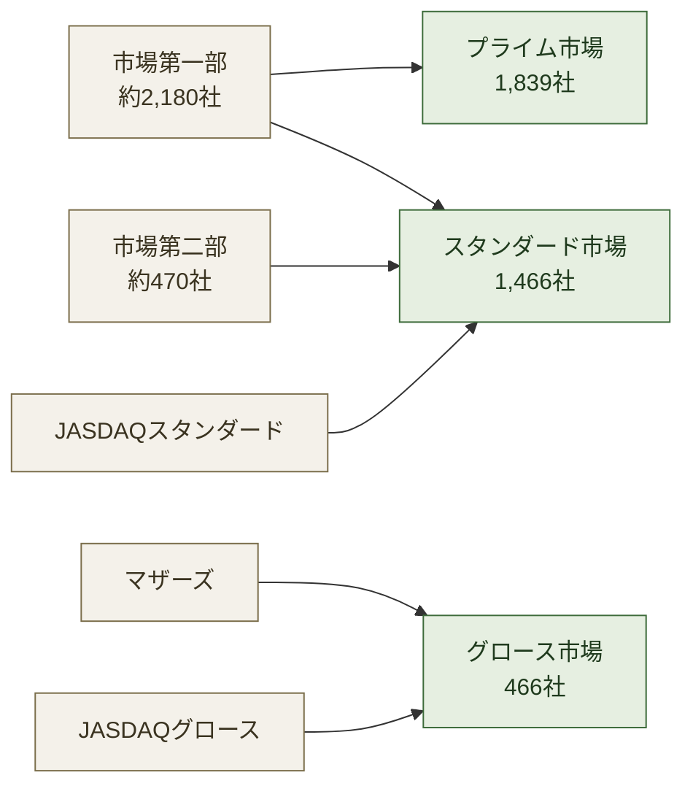

市場第一部の会社は、プライムとスタンダードに分かれた。市場第二部とJASDAQスタンダードは主にスタンダードへ、マザーズとJASDAQグロースはグロースへ移った。このため、旧市場と新市場は一対一には対応しない。

## 再編の実効性を高めた三つの仕組み

### 1. 流通株式の定義変更

新制度では、上場維持基準を判定する際の**流通株式**の範囲が見直された。銀行、保険会社、事業法人による保有など、安定保有とみられる株式の一部が流通株式から除外されるようになり、政策保有株式の多い会社ほど基準を満たしにくくなった。詳しくは次の記事で扱う。

### 2. プライム市場向けのガバナンス原則

2021年のコーポレートガバナンス・コード改訂では、プライム上場会社に一段高い対応を求めた。主な項目は、次のとおりである。

- 独立社外取締役を少なくとも3分の1以上選任する
- TCFDまたは同等の国際的枠組みに基づく気候関連開示を充実させる
- 必要な情報を英語でも開示する
- 機関投資家向け議決権電子行使プラットフォームを利用する

これらは一律の法的義務ではなく、コード上のコンプライ・オア・エクスプレインとして運用された。ただし、2025年4月に始まった適時開示の日英同時開示のように、その後、上場規則上の義務へ進んだ分野もある。

### 3. TOPIXとの切り離し

再編前のTOPIXは市場第一部の全銘柄を原則として対象にしていた。再編後は、市場区分とは別に、流動性を重視して構成銘柄を選ぶ方向へ改められた。これにより、プライム上場だけでTOPIXへの組み入れが保証される仕組みではなくなった。詳しくは3.4で扱う。

## なぜ再編後も見直しが続いたのか

新市場発足によって制度の土台は変わったが、プライムの会社数は依然として多く、経過措置の期限も当初は**「当分の間」**とされていた。市場区分の違いを実質的なものにするには、基準未達会社をいつまで、どのような手続で扱うかを明確にする必要があった。

そこで東証は2022年7月、**市場区分の見直しに関するフォローアップ会議**を設置した。同会議の議論から、経過措置の終了、資本コストや株価を意識した経営の要請、グロース市場の機能発揮、TOPIXの追加改革などが具体化していく。

2022年4月の再編は、改革の完成ではない。市場区分、上場維持基準、ガバナンス、指数を一つの仕組みとして見直す長い過程の出発点だった。

## IR担当者への示唆

1. **市場区分の説明は、会社の規模だけでなく、投資家層とガバナンスの選択として行う。** プライム上場は、より高い流動性とガバナンス、国際投資家との対話を選んだことを意味する。
2. **新規上場基準と上場維持基準を分けて把握する。** 利益基準などを上場維持要件として説明すると、制度を誤って伝えることになる。
3. **流通株式の内訳を継続的に確認する。** 株価だけでなく、誰が株式を持っているかが市場区分の維持に直結する。
4. **市場区分とTOPIXの組み入れを別々に管理する。** プライム上場と指数採用は、もはや同じ判定ではない。
5. **フォローアップ会議を制度変更の先行指標として読む。** 2023年以降の主要施策は、同会議の資料と議論から具体化している。

## 出典・参考資料

- 日本取引所グループ「市場区分見直しの概要」: https://www.jpx.co.jp/equities/improvements/market-structure/01.html
- 日本取引所グループ「市場構造の在り方等の検討」: https://www.jpx.co.jp/equities/improvements/market-structure/index.html
- 金融庁「金融審議会『市場構造専門グループ』報告書の公表について」(2019年12月27日): https://www.fsa.go.jp/singi/singi_kinyu/market-str/report/20191227.html
- 日本取引所グループ「市場区分」: https://www.jpx.co.jp/equities/market-restructure/market-segments/index.html
- 日本取引所グループ「市場区分の選択結果の公表」(2022年1月11日): https://www.jpx.co.jp/corporate/news/news-releases/0060/20220111-01.html
- 日本取引所グループ「上場維持基準（プライム市場）」: https://www.jpx.co.jp/equities/listing/continue/outline/01.html
- 日本取引所グループ「上場維持基準に関する経過措置の終了」: https://www.jpx.co.jp/equities/follow-up/04.html
- 日本取引所グループ「改訂コーポレートガバナンス・コードの公表」(2021年6月11日): https://www.jpx.co.jp/news/1020/20210611-01.html

## 関連記事

- **2.3――2021年改訂**：市場再編に先立って導入された、プライム市場向けのガバナンス原則。
- **3.2――流通株式比率**：市場区分の基準を政策保有株式の縮減につなげた仕組み。
- **3.3――経過措置終了後の上場維持ルール**：「当分の間」とされた特例が、期限付きの制度へ変わった経緯。
- **3.4――TOPIX改革**：市場区分と指数採用を切り離す改革。
- **4.1――PBR1倍割れをどう読むか**：市場再編後のフォローアップから生まれた、2023年3月の東証要請。

---

## 流通株式比率――政策保有株式の縮減を促した仕組み

**SOURCE URL:** https://jpinv.com/governance/market-restructuring/3.2-tradable-share-ratio/

**記事要約**

2022年4月の市場再編では、上場維持基準に使う「流通株式」の定義も見直された。大口株主、役員、自己株式に加え、国内の銀行、保険会社、事業法人などが保有する株式は、純投資として市場に流通することが確認できる場合を除き、原則として流通株式に含まれない。プライム市場の流通株式比率35%以上という基準と組み合わさることで、政策保有株式や安定株主の多い会社には、株主構成そのものを見直す圧力が生じた。本稿では、定義、計算方法、改善策を実務の目線で整理する。

**本文**

> **要点**
> - 流通株式比率は、**市場で流通するとみなされる株式数を、上場株式数で割った比率**である。プライムは35%以上、スタンダードとグロースは25%以上が上場維持基準となる。
> - 国内の普通銀行、保険会社、事業法人などの保有株式は原則として流通株式から除かれる。ただし、保有目的が純投資で、直近5年以内の売買実績が確認できるなど、東証の要件を満たす場合は流通株式に含められることがある。
> - 政策保有株主から自社株を買い取っただけでは、比率は直ちには上がらない。自己株式も上場株式数の分母に含まれるため、改善効果が出るのは、原則として**消却した後**である。

## 流通株式比率とは何か

流通株式とは、東証が上場基準の判定上、**市場で売買される可能性が高いと認める株式**である。日々実際に売買された株式だけを数える指標ではない。株主の属性、持株比率、保有目的などから、安定保有される可能性が高い株式を除外して算定する。

計算式は次のとおりである。

> **流通株式比率 ＝ 流通株式数 ÷ 上場株式数 × 100**

上場維持基準は、次の三つの形で流通株式を使う。

| 市場 | 流通株式数 | 流通株式時価総額 | 流通株式比率 |
| --- | ---: | ---: | ---: |
| プライム | 2万単位以上 | 100億円以上 | 35%以上 |
| スタンダード | 2,000単位以上 | 10億円以上 | 25%以上 |
| グロース | 1,000単位以上 | 5億円以上 | 25%以上 |

流通株式時価総額は、流通株式数に、事業年度末以前3か月間の東証市場における日々の最終価格の平均値を掛けて算出する。流通株式数と流通株式比率は株主構成に左右され、流通株式時価総額はそれに株価要因が加わる。

## 何が流通株式から除かれるのか

現行制度では、主に次の株式が流通株式から除かれる。

1. **上場株式数の10%以上を保有する株主の株式**。ただし、投資信託や年金信託に組み入れられている株式など、一定の例外がある。
2. **役員と特別利害関係者の保有株式**。取締役、監査役、執行役、役員持株会のほか、役員の近親者、関係会社などが含まれる。
3. **自己株式**。
4. **国内の普通銀行、保険会社、事業法人などの保有株式**。持株比率が10%未満でも、原則として除外される。

最後の分類には例外がある。大量保有報告書や東証所定の保有状況報告書で、保有目的が**純投資その他市場に流通する見込みが高い目的**であることが明らかで、かつ直近5年以内の売買実績が確認できる場合には、東証が流通株式として認めることがある。ただし、10%以上を保有する株主や役員等に該当する場合は、この例外の対象にならない。

したがって、「銀行・保険会社・事業法人の株式は例外なく非流通」と理解するのは正確ではない。重要なのは株主の名称だけでなく、**保有目的と売買実績を東証に立証できるか**である。

## 2022年の見直しが持った意味

市場再編前から流通株式の考え方は存在した。しかし、2022年の制度では、国内の銀行、保険会社、事業法人などによる保有をより厳格に扱い、各市場の上場維持基準に流通株式数・時価総額・比率を組み込んだ。

制度上の直接の目的は、各市場にふさわしい流動性を確保し、投資家が売買しやすい市場をつくることである。一方、日本企業の株主構成に当てはめると、政策保有株式や取引関係に基づく安定保有が多い会社ほど、流通株式比率が低く算定される。このため、制度は結果として、政策保有株式の売却や創業家・親会社持分の市場放出を促す作用を持った。

これは、政策保有株式を直接禁止する仕組みではない。会社が政策保有の合理性を説明できたとしても、その株式が流通株式として数えられるとは限らない。**ガバナンス上の保有合理性と、上場基準上の流動性は別の判定**だからである。

## 旧制度との違いをどう捉えるか

| 観点 | 市場再編前 | 2022年4月以降 |
| --- | --- | --- |
| 市場区分 | 市場第一部など、区分ごとの役割と維持基準の差が不明確 | プライム・スタンダード・グロースごとに流通株式基準を明示 |
| 安定保有株式 | 10%未満の銀行・保険・事業法人保有が流通株式に含まれる余地が比較的大きかった | 原則として除外し、純投資・売買実績を確認できる場合のみ例外的に算入 |
| プライム相当の比率 | 市場第一部にも35%基準はあったが、定義と維持制度が異なる | 厳格化した定義の下で35%以上を継続的に維持 |
| 判定 | 上場後の維持基準が新規上場基準より緩い | 事業年度末を基準に原則年1回判定し、未達なら改善期間へ |

表面上は35%という数字が同じでも、何を流通株式に数えるかが変われば、会社にとっての難易度も変わる。株主構成を変えていなくても、新しい定義で計算し直した結果、比率が大きく下がる会社が生じた。

## 流通株式比率は何で動くのか

流通株式比率を改善する方法は、分子である流通株式数を増やすか、分母である上場株式数を減らすかの二つである。ただし、どの資本政策でも比率が動くわけではない。

### 比率を改善しやすい施策

- **政策保有株主や創業家による市場売却・売出し**：非流通株式が一般投資家に移れば、流通株式数が増える。
- **親会社・主要株主による持分売却**：売却先が流通株主であれば、同様に分子が増える。
- **公募増資や第三者への広い分散売却**：新株が流通株主に保有されれば、分子と分母の双方が増えるが、流通株式の増加率が高ければ比率も上がる。
- **非流通株式の自己株式取得と消却**：取得時点では自己株式も非流通であり、分母に残るため比率は原則変わらない。消却して上場株式数が減った時点で改善する。

### 原則として比率を変えない施策

- **株式分割・株式併合**：流通株式と上場株式が同じ割合で増減するため、通常、比率は変わらない。
- **非流通株主からの自己株式取得だけを行い、消却しない**：非流通株式が自己株式に置き換わるだけである。
- **株価上昇**：流通株式時価総額は上がるが、流通株式比率そのものは変わらない。

## 数字で確認する

発行済み・上場株式数が1億株の会社を考える。

| 保有者 | 株式数 | 流通株式に算入するか |
| --- | ---: | --- |
| 創業家 | 3,000万株 | しない（10%以上保有） |
| 取引銀行 | 500万株 | しない（政策保有） |
| 保険会社 | 400万株 | しない（政策保有） |
| 取引先事業法人 | 600万株 | しない（政策保有） |
| 自己株式 | 500万株 | しない |
| 国内外の機関投資家・個人 | 5,000万株 | する |
| **合計** | **1億株** | **流通株式5,000万株** |

この会社の流通株式比率は、**5,000万株÷1億株＝50%**である。

その後の施策による変化を比べる。

| 施策 | 流通株式数 | 上場株式数 | 流通株式比率 |
| --- | ---: | ---: | ---: |
| 何もしない | 5,000万株 | 1億株 | 50.0% |
| 保険会社が400万株を市場売却 | 5,400万株 | 1億株 | 54.0% |
| 会社が銀行から500万株を自己株取得、未消却 | 5,000万株 | 1億株 | 50.0% |
| 上記500万株を消却 | 5,000万株 | 9,500万株 | 約52.6% |
| 一般投資家向けに1,000万株を新規発行 | 6,000万株 | 1億1,000万株 | 約54.5% |

この表から分かるように、同じ「資本政策」でも流通株式比率への効果は大きく異なる。IR部門は、施策の名称ではなく、**施策後に各株式が流通株式として数えられるか**を確認しなければならない。

## 政策保有株式との関係

政策保有株式については、すでに複数の制度が働いている。

- 有価証券報告書では、銘柄ごとの保有目的や定量的な保有効果などの開示が求められる。
- コーポレートガバナンス・コード原則1.4は、保有方針、縮減方針、取締役会による個別検証を求める。
- スチュワードシップ・コードは、投資家に政策保有株式を含む資本配分について対話することを促す。
- 流通株式基準は、政策保有株式を上場維持上の流動性に反映する。

最初の三つは主として**説明と対話**を通じて働く。流通株式基準は、保有の説明内容とは別に、上場維持基準の計算へ直接反映される。この違いが、2022年の見直しを実務上強いものにした。

ただし、「東証が政策保有株式を解消するために流通株式の定義を変更した」と政策目的まで断定するのは慎重であるべきだ。公式の制度趣旨は市場流動性の確保であり、政策保有株式の縮減は、その制度が日本の株主構成に働いた重要な効果と捉えるのが適切である。

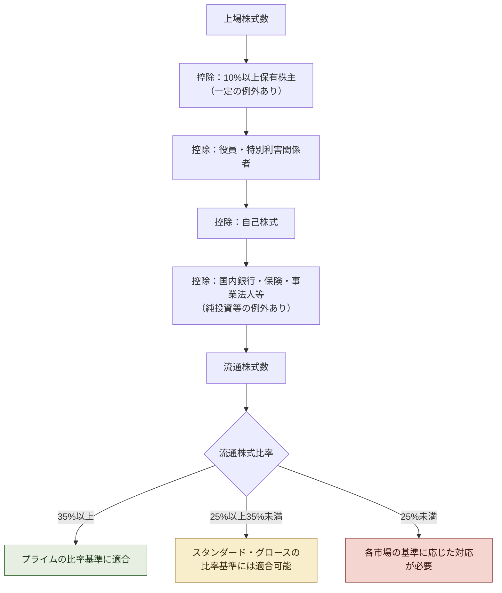

## IR担当者への示唆

1. **東証の算式で自社の比率を再現する。** 自社で使う「浮動株比率」や指数会社の浮動株比率と、東証の流通株式比率は同じとは限らない。
2. **株主を属性だけでなく保有目的まで分類する。** 銀行・保険・事業法人でも、純投資と売買実績を立証できれば流通株式に含まれる場合がある。必要書類を株主と早めに確認する。
3. **自己株式取得と消却を分けて説明する。** 取得だけでは比率が改善しない場合がある。取締役会資料と投資家向け開示では、消却の有無と実施時期まで示す。
4. **事業年度末の判定を見越して管理する。** 東証の審査は原則として各事業年度末の状況を対象に年1回行われる。社内では四半期ごとに試算し、基準日前に対応できるようにする。
5. **上場維持と資本政策を一体で議論する。** 政策保有株式の売却、主要株主の売出し、増資、自己株式の消却、市場区分変更は、IRだけでなく財務、法務、経営企画、取締役会が共同で判断すべき事項である。

## 出典・参考資料

- 日本取引所グループ「流通株式―上場維持基準の詳細」: https://www.jpx.co.jp/equities/listing/continue/details/02.html
- 日本取引所グループ「上場維持基準（プライム市場）」: https://www.jpx.co.jp/equities/listing/continue/outline/01.html
- 日本取引所グループ「上場維持基準（スタンダード市場）」: https://www.jpx.co.jp/equities/listing/continue/outline/02.html
- 日本取引所グループ「上場維持基準（グロース市場）」: https://www.jpx.co.jp/equities/listing/continue/outline/03.html
- 日本取引所グループ「市場区分見直しの概要」: https://www.jpx.co.jp/equities/improvements/market-structure/01.html
- 日本取引所グループ「流通株式の定義―国内の普通銀行、保険会社及び事業法人等が所有する株式に関する例外的な取扱い」: https://faq.jpx.co.jp/disclo/tse/web/knowledge8628.html
- 日本取引所グループ「コーポレートガバナンス・コード」: https://www.jpx.co.jp/equities/listing/cg/index.html

## 関連記事

- **3.1――4区分から3区分へ**：流通株式基準が組み込まれた市場再編。
- **3.3――経過措置終了後の上場維持ルール**：基準未達時の改善期間と上場廃止までの手続。
- **5.2――政策保有株式の最終局面**：開示、個別検証、縮減をめぐる制度の全体像。
- **4.1――PBR1倍割れをどう読むか**：資本構成の見直しと並行する資本コスト経営。
- **1.2――メインバンク後の空白を、誰が埋めたのか**：政策保有株式の歴史的背景。

---

## 経過措置終了後の上場維持ルール

**SOURCE URL:** https://jpinv.com/governance/market-restructuring/3.3-transitional-measures-cliff/

**記事要約**

2022年4月の市場再編では、新市場の通常の上場維持基準を満たしていない既存上場会社にも、適合計画を開示することを条件に緩和基準が適用された。当初、この経過措置の期限は「当分の間」とされていたが、東証は2023年1月に終了時期を決定した。2025年3月1日以後に到来する基準日からは本来の基準が適用され、未達会社は原則1年、売買高基準では6か月の改善期間に入る。改善できなければ、監理・整理銘柄への指定を経て上場廃止となる。本稿では、この手続と会社が取り得る選択肢を整理する。

**本文**

> **要点**
> - 新市場への移行時、通常の上場維持基準を満たさない会社でも、**「上場維持基準の適合に向けた計画」**を開示すれば、経過措置として緩和基準の適用を受けられた。
> - 東証は**2023年1月30日**、経過措置を終了し、**2025年3月1日以後に到来する基準日**から本来の上場維持基準を適用すると決めた。
> - 基準未達となった会社には、原則1年、売買高基準は6か月の改善期間が与えられる。期間内に適合しなければ、監理銘柄・整理銘柄に原則約6か月指定された後、上場廃止となる。

## 経過措置は何のために設けられたのか

2022年4月の市場再編では、既存上場会社がプライム、スタンダード、グロースのいずれへ移るかを主体的に選択した。ただし、移行時点で選択先の通常の上場維持基準を満たしていない会社もあった。

そこで東証は、会社が次の二つを行う場合に限り、緩和された基準を適用する経過措置を設けた。

1. **上場維持基準の適合に向けた計画を開示すること**
2. **その後も進捗状況を継続的に開示すること**

たとえばプライム市場では、本来、流通株式時価総額100億円以上、流通株式比率35%以上などが必要である。経過措置中は、流通株式時価総額10億円以上、流通株式比率5%以上など、緩和された基準が用いられた。

移行を円滑にするという意味では合理的な仕組みだった。一方、当初は終了時期が**「当分の間」**とされていたため、通常基準を満たす会社と、計画書を提出して緩和基準の適用を受ける会社が、外からは同じ市場区分に見えた。これでは市場区分の違いが実質化しないとの批判が生じた。

## 経過措置の終了が決まるまで

東証は2022年7月、**市場区分の見直しに関するフォローアップ会議**を設置した。新市場の実効性、企業価値向上への動機付け、経過措置の扱いなどを継続的に検討するためである。

同年秋の意見募集を経て、東証は2023年1月30日に対応方針を公表した。要点は次のとおりである。

- 経過措置の適用を終了する
- **2025年3月1日以後に到来する上場維持基準の判定基準日**から、本来の基準を適用する
- 未達会社には、通常の上場会社と同じ改善期間制度を適用する
- 2023年3月31日時点で、2026年3月1日以後に期限が到来する計画をすでに開示していた会社には、一定の特例を設ける

多くの3月期決算会社にとって、最初の判定基準日は2025年3月31日となった。ただし、判定日は会社の決算期や株主等基準日により異なる。IR担当者は「2025年3月に一斉判定された」と理解するのではなく、**自社の基準日がいつか**を確認する必要がある。

## 2025年3月以後の基本手続

本来の上場維持基準に適合しない状態となった場合、手続はおおむね次の順に進む。

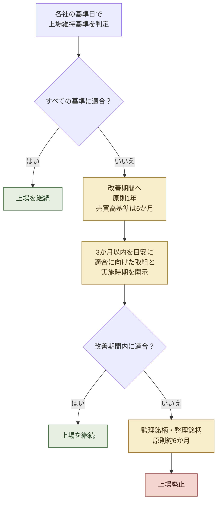

### 1. 基準日で判定

株主数、流通株式数、流通株式時価総額、流通株式比率などは、原則として事業年度末の状況で年1回判定される。事業年度末と大株主の状況を記載する基準日が異なる会社では、その株主等基準日が用いられる場合がある。

### 2. 改善期間

基準未達となった会社は、原則として**1年間**の改善期間に入る。売買高基準は**6か月間**である。会社は基準未達の公表後、適合に向けた取組と実施時期を記載した計画を開示する必要がある。

改善期間は、単に計画を出せば延長される仕組みではない。期間内に実際に基準へ適合することが必要である。

### 3. 監理・整理銘柄への指定と上場廃止

改善期間の末日に基準を満たしていなければ、確認手続のため監理銘柄に指定される場合がある。その後、上場廃止が決定すれば整理銘柄となり、原則として約6か月の売買期間を経て上場廃止となる。

基準の種類によっては、改善期間末日に適否を直ちに判定できるため、監理銘柄（確認中）の指定を経ない場合もある。したがって、すべての会社が同じ日程で「監理6か月」に入るわけではない。

## 例外と経過的な扱い

制度には、限られた例外がある。

### 超過計画開示会社

2023年3月31日時点で、2026年3月1日以後最初に到来する基準日を超える期限の適合計画を開示していた会社は、**超過計画開示会社**として扱われる。その会社は、開示済みの計画期限における適合状況が確認されるまで、監理銘柄指定を継続する。

### 事業再生支援に伴う流通株式比率の特例

第三者が事業再生を支援するため一定の株式を保有し、5年以内に流通株式比率の基準へ適合する見込みがあると東証が認めた場合、流通株式比率について通常より長い改善期間が認められることがある。

これらは、会社の希望に応じて自由に期限を延ばす制度ではない。上場規則に定められた条件を満たし、東証の確認を受ける必要がある。

## 会社が取り得る四つの選択肢

通常基準への適合が難しい会社には、大きく四つの選択肢がある。

### 1. 現在の市場区分で基準を満たす

流通株式の売出し、政策保有株式の市場売却、自己株式の消却、業績改善による株価・時価総額の引き上げ、投資家層の拡大などを通じて、改善期間内の適合を目指す。

ここでも施策と基準の対応関係が重要である。たとえば、株式併合は通常、流通株式比率を変えない。自己株式取得も、消却しなければ比率改善につながらない場合がある。3.2で確認した算式に照らして施策を選ぶ必要がある。

### 2. 別の市場区分へ変更する

プライム基準への適合が難しくても、スタンダード基準を満たせる会社は、スタンダードへの変更を申請できる。ただし、現在の市場で基準を外れたからといって、自動的に下位市場へ移るわけではない。原則として、変更先の新規上場基準と同等の審査を受ける。

2023年には、旧市場第一部からプライムへ移行した会社を対象に、スタンダード市場を再選択できる一回限りの制度が設けられた。この特例はすでに終了しており、現在は通常の市場区分変更手続が基本である。

### 3. 非公開化・他社との統合を選ぶ

上場維持の費用と便益を比較し、MBO、親会社や事業会社によるTOB、他社との統合を選ぶ会社もある。もっとも、上場維持基準の未達と個々のM&Aの因果関係は案件ごとに異なる。基準未達会社の非公開化を、すべて制度の直接効果とみなすべきではない。

### 4. 改善期間を使って適合を目指す

期限までに施策を完了できない場合は、改善期間内の達成計画を開示し、その進捗を市場に説明する。計画には、基準ごとの現状値、必要な改善幅、施策、実施時期、主要なリスクを具体的に示す必要がある。

## 「上場している」から「基準を維持している」へ

経過措置の終了によって、上場市場は一度取得すれば維持できる資格ではなくなった。会社は毎年、現在の株主構成、流動性、時価総額、純資産などが市場の基準に適合しているかを確認しなければならない。

この変化には三つの意味がある。

**第一に、IRと財務の仕事がつながる。** 流通株式時価総額は株価と流通株式数、流通株式比率は株主構成、売買代金は市場での取引状況に左右される。いずれもIRだけ、財務だけでは管理できない。

**第二に、市場区分変更が経営上の選択肢になる。** プライムを維持すること自体を目的にするのではなく、対象とする投資家、開示体制、上場コスト、資本政策との整合を考えて市場を選ぶ必要がある。

**第三に、計画の質が問われる。** 基準未達を隠すことはできない。会社は、どの数値を、いつまでに、どの施策で改善するのかを明確にし、進捗を更新する必要がある。

## IR担当者への示唆

1. **自社の判定基準日を確認する。** 「2025年3月1日」が自社の判定日ではない。そこから後に最初に到来する事業年度末等が基準になる。
2. **各基準の余裕を数値で管理する。** 現在値だけでなく、株価下落、主要株主の異動、自己株式取得などを反映した感応度を月次または四半期で試算する。
3. **未達時の計画を事前に用意する。** 改善期間に入ってから施策を考えるのでは遅い。売出し、消却、市場区分変更などに必要な取締役会・株主総会・審査の時間を逆算する。
4. **市場区分変更を「格下げ」とだけ表現しない。** 投資家層、開示負担、流動性、資本政策との整合を説明できれば、合理的な市場選択として伝えられる。
5. **最新の一覧を確認する。** 改善期間該当銘柄、超過計画開示会社、監理・整理銘柄はJPXのウェブサイトで更新される。固定した社数を資料に残すより、最新一覧へリンクする方が実務的である。

## 出典・参考資料

- 日本取引所グループ「上場維持基準に関する経過措置の終了」: https://www.jpx.co.jp/equities/follow-up/04.html
- 日本取引所グループ「市場区分の見直しに関するフォローアップ会議の論点整理及び東証の今後の対応について」(2023年1月30日): https://www.jpx.co.jp/news/1020/20230130-01.html
- 日本取引所グループ「改善期間該当銘柄等一覧」: https://www.jpx.co.jp/listing/market-alerts/improvement-period/
- 日本取引所グループ「上場廃止基準の概要」: https://www.jpx.co.jp/equities/listing/delisting/outline/01.html
- 日本取引所グループ「流通株式―上場維持基準の詳細」: https://www.jpx.co.jp/equities/listing/continue/details/02.html
- 日本取引所グループ「市場区分の変更銘柄一覧」: https://www.jpx.co.jp/listing/stocks/transfers/
- 日本取引所グループ「市場区分の見直しに関するフォローアップ」: https://www.jpx.co.jp/equities/follow-up/

## 関連記事

- **3.1――4区分から3区分へ**：経過措置が設けられた市場再編の全体像。
- **3.2――流通株式比率**：基準未達の原因と、資本政策ごとの改善効果。
- **3.4――TOPIX改革**：市場区分とは別に進む指数採用の見直し。
- **4.3――東証の開示企業一覧**：公表を通じて企業行動を促す別の仕組み。
- **5.4――未承諾買収をどう扱うか**：非公開化を含むM&A手続の基本。

---

## TOPIX改革――市場区分から独立した選定指数へ

**SOURCE URL:** https://jpinv.com/governance/market-restructuring/3.4-topix-reform/

**記事要約**

TOPIXは長く、東証一部の上場銘柄をほぼそのまま取り込む指数だった。市場区分の見直しを機に、JPXは指数の連続性を保ちながら、投資対象としての機能を高める二段階の改革に着手した。第1段階では、流通株式時価総額100億円未満の銘柄のウエイトを2022年10月から2025年1月まで10回に分けて引き下げた。第2段階では、2026年10月からプライム・スタンダード・グロースの3市場を母集団とし、売買代金と浮動株時価総額を基準に定期入替を行う。市場区分と指数採用は、今後それぞれ別の基準で決まる。

**本文**

> **要点**
> - TOPIXは、もともと東証一部の全銘柄を対象とする浮動株時価総額加重型の指数だった。市場区分再編後も投資家への影響を抑えるため既存銘柄をいったん継続採用し、段階的に見直してきた。
> - **第1段階（2022年10月～2025年1月）**では、流通株式時価総額100億円未満の銘柄について、構成比率を四半期ごとに**10回**に分けて引き下げた。構成銘柄数は約2,200から約1,700へ減少した。
> - **第2段階**では、2026年10月に初回の定期入替を行う。新規採用と継続採用で異なる基準を設け、プライム・スタンダード・グロースの3市場から銘柄を選ぶ。移行完了時の構成銘柄数は約1,200と試算されている。

---

## なぜTOPIX改革は市場区分改革と一体なのか

旧TOPIXは、東証一部の銘柄を広く網羅する指数として設計されていた。東証一部に上場すれば原則としてTOPIXにも組み入れられ、TOPIX連動資金の買い需要を受ける。この仕組みは市場全体を捉えるうえでは分かりやすい一方、東証一部の銘柄数が増えるにつれて、指数の構成と投資対象としての流動性が必ずしも一致しなくなった。

2019年12月の金融審議会「市場構造専門グループ」報告書は、市場区分とTOPIXの構成を切り分ける方向を示した。市場区分は上場会社の位置づけと上場維持基準を定める制度であり、指数は運用資金が実際に売買できる銘柄群を表す投資指標である。両者を同じ基準で動かし続ける必然性はない。

JPXは、この考え方に基づき、TOPIXの**市場代表性**と**投資対象としての機能性**を両立させる改革を進めている。2024年3月末時点でTOPIXへの連動運用資産は約110兆円に達しており、構成銘柄を一度に大きく入れ替えれば市場への影響も大きい。このため、改革は二段階に分けて実施されている。

## 第1段階（2022年10月～2025年1月）――既存銘柄を段階的に絞り込む

2022年4月の市場区分再編時、JPXは旧TOPIXの構成銘柄を、移行先がプライム、スタンダード、グロースのいずれであるかにかかわらず継続採用した。指数の連続性を優先したためである。

そのうえで、所定の判定により**流通株式時価総額が100億円未満**となった銘柄を「段階的ウエイト低減銘柄」に指定した。対象銘柄の構成比率は、2022年10月末から2025年1月末まで、四半期ごとに**10段階**で引き下げられた。2023年10月には再評価も行われ、流通株式時価総額の改善を反映できる仕組みが設けられた。

この移行によって、TOPIXの構成銘柄数は改革前の約2,200から約1,700へ減少した。小型銘柄を直ちに除外するのではなく、時間をかけてウエイトを低減したのは、指数連動ファンドの売買を分散し、個別銘柄への急激な市場影響を抑えるためである。

## 第2段階（2026年10月以降）――市場区分から独立して定期入替を行う

第2段階では、TOPIXの母集団がプライム市場だけでなく、**プライム・スタンダード・グロースの3市場**に広がる。市場区分そのものは採用条件ではなくなり、売買のしやすさと浮動株時価総額に基づいて銘柄を選ぶ。

初回の定期入替は**2026年10月**、2回目は**2028年10月**に実施され、その後は毎年10月に定期入替を行う予定である。初回入替で継続採用されない銘柄は、2026年10月から2028年7月まで、四半期ごと8段階でウエイトが引き下げられる。2027年10月には再評価があり、継続基準を満たした銘柄は、その後のウエイト低減が停止される。

### 新規採用と継続採用の基準

次期TOPIXでは、構成銘柄でない会社に適用する**追加基準**と、すでに構成銘柄である会社に適用する**継続基準**が分けられている。

| 指標 | 追加基準 | 継続基準 |
| --- | ---: | ---: |
| 年間売買代金回転率 | **0.20以上** | **0.14以上** |
| 浮動株時価総額の累積比率 | **上位96%以内** | **上位97%以内** |

継続基準を追加基準より緩くしているのは、わずかな数値変動で構成銘柄が頻繁に入れ替わるのを防ぐためである。指数の安定性を保ちながら、流動性の低い銘柄を徐々に入れ替える設計となっている。

年間売買代金回転率は、単純な「年間売買代金÷期末時価総額」ではない。直近12か月の月次回転率を合計して算出し、各月の回転率には東証の売買立会における日次売買代金の中央値、営業日数、月末の浮動株時価総額を用いる。浮動株時価総額の累積比率も、回転率基準を満たし、整理銘柄や特別注意銘柄でない銘柄群の中で計算される。

## 「流通株式」と「浮動株」は同じではない

市場区分の上場維持基準で使う**流通株式**と、TOPIXの算出に使う**浮動株**は、似た考え方ではあるが同一ではない。流通株式は東証の上場制度に基づく定義であり、上場維持基準の判定に使われる。一方、TOPIXではJPX総研の算出要領に基づく**浮動株比率**を用い、指数ウエイトを調整する。

そのため、流通株式比率が改善したからといって、TOPIXの浮動株比率や採用判定が同じ幅で動くとは限らない。政策保有株式の売却や大株主構成の変化は両方に影響し得るが、IR部門はそれぞれの算定方法を別に確認する必要がある。

## 第1段階と第2段階のスケジュール

| 時期 | 内容 | 構成銘柄数の目安 |
| --- | --- | ---: |
| 改革前 | 東証一部の銘柄を原則として採用 | 約2,200 |
| 2022年10月～2025年1月 | 第1段階。対象銘柄のウエイトを10回に分けて低減 | 約1,700 |
| 2025年2月～2026年9月 | 第1段階完了後の移行期間 | 約1,700 |
| 2026年10月 | 次期TOPIXの初回定期入替 | ― |
| 2026年10月～2028年7月 | 移行措置銘柄のウエイトを8段階で低減 | 約1,200へ縮小する試算 |
| 2027年10月 | 移行措置銘柄を再評価 | ― |
| 2028年10月以降 | 2回目の定期入替。その後は毎年実施 | 約1,200を想定 |

約1,200という数字は試算であり、実際の構成銘柄数は定期入替時の市場状況や非定期の追加・除外によって変わる。それでも、改革前に比べて銘柄数が大きく絞られ、売買のしやすさを明示的に反映する指数へ変わる方向は明確である。

## 上場会社にとって何が変わるのか

最も重要なのは、**市場区分と指数採用が別の評価になること**である。スタンダード市場やグロース市場の会社でも、追加基準を満たせばTOPIXに採用され得る。一方、プライム市場の会社でも、流動性や浮動株時価総額が継続基準に届かなければ、TOPIXから外れる可能性がある。

ただし、会社が短期的な施策だけで指数採用を確実に「取りに行ける」と考えるべきではない。売買代金は投資家の需要に左右され、浮動株比率の判定にも独自の算定方法がある。株式分割や株式併合は、株主構成や企業価値が変わらなければ、通常は浮動株時価総額そのものを増やさない。指数対応は、株主基盤の分散、情報開示の充実、投資家との継続的な対話、事業価値の向上といった中長期の取組みの結果として捉えるのが適切である。

## IR担当者への示唆

1. **市場区分とTOPIX採用を別々に管理する。** プライム上場であることとTOPIX構成銘柄であることは、今後は独立した状態になる。社内資料でも二つを混同しない。
2. **追加基準と継続基準を取り違えない。** 既存構成銘柄には0.14・上位97%、新規採用候補には0.20・上位96%が適用される。
3. **流通株式と浮動株の算定を分けて確認する。** 上場維持基準の数値を、そのままTOPIX判定に流用しない。必要に応じて指数算出要領と浮動株比率の算定方法を参照する。
4. **2026年10月の初回入替と2027年10月の再評価を日程に入れる。** 移行措置銘柄に該当する場合、ウエイト低減の進み方と再評価の条件を投資家に説明できるようにする。
5. **指数採用を短期的な株価対策として扱わない。** 流動性の向上は、情報開示、投資家層の拡大、株主構成、企業価値の積み重ねで生まれる。IR、財務、経営企画が共通の前提で取り組む必要がある。

## 出典・参考資料

- JPX「TOPIX（東証株価指数、TPX）」 https://www.jpx.co.jp/markets/indices/topix/
- JPX「TOPIXの見直しの概要」 https://www.jpx.co.jp/markets/indices/revisions-indices/
- JPX「第1段階の見直し」 https://www.jpx.co.jp/markets/indices/revisions-indices/01.html
- JPX「第2段階の見直し」 https://www.jpx.co.jp/markets/indices/revisions-indices/02.html
- 金融庁「金融審議会『市場構造専門グループ』報告書」（2019年12月27日） https://www.fsa.go.jp/singi/singi_kinyu/market-str/report/20191227.html

## 関連記事

- **3.1――4区分から3区分へ**：TOPIX改革と同時に進んだ市場区分の見直し。
- **3.2――流通株式比率**：上場維持基準で使う流通株式の定義と算定。
- **3.3――経過措置終了後の上場維持ルール**：市場区分側の移行措置と改善期間。
- **4.1――PBR1倍割れをどう読むか**：市場評価と資本効率をめぐる東証の要請。
- **1.1――「ROE8%」が改革の基準になった理由**：資本効率を政策課題として捉えるようになった経緯。

---

## グロース市場の2030年基準――「上場5年で時価総額100億円」が意味すること

**SOURCE URL:** https://jpinv.com/governance/market-restructuring/3.5-growth-market-2030/

**記事要約**

東証はグロース市場を「高い成長を目指す企業が集う市場」として機能させるため、上場維持基準を見直した。2030年3月1日以後は、現在の「上場10年経過後に時価総額40億円以上」から、「上場5年経過後に時価総額100億円以上」へ変わる。対象となるのは新規上場基準ではなく、上場後の成長を測る維持基準である。会社には、100億円を目指して成長戦略を更新するだけでなく、スタンダード市場への変更、M&A、非公開化を含む選択肢を早い段階から検討することが求められる。

**本文**

> **要点**
> - **2030年3月1日**から、グロース市場の時価総額基準は「上場10年経過後に40億円以上」から、**「上場5年経過後に100億円以上」**へ変わる。
> - これは新規上場時に時価総額100億円を求める制度ではない。上場後5年間で、機関投資家の投資対象となり得る規模へ成長することを促す上場維持基準である。
> - 基準未達の場合は原則として1年間の改善期間に入る。ただし、移行時に所定の適合計画を開示した会社には、その計画期限まで上場廃止を猶予する特例が設けられている。

---

## なぜグロース市場を改めて見直したのか

2022年4月に発足したグロース市場は、マザーズとJASDAQグロースを引き継ぎ、「高い成長可能性を有する企業向け」の市場として位置づけられた。一方、上場後も小規模なまま長くとどまる会社が多く、機関投資家が十分な金額を投資しにくいという課題が残った。

東証が2025年9月に公表した制度要綱では、時価総額40億円以上100億円未満の会社が約200社、グロース市場全体の約3割を占めると整理されている。東証が目指しているのは、小型会社を一律に排除することではない。上場を成長の到達点ではなく、成長資金を調達し、事業規模と企業価値をさらに高める出発点に戻すことである。

このため、基準の見直しと同時に、全グロース上場会社に対して「高い成長を目指した経営」の実現に向けた対応が要請された。会社は、これまでの成長実績と市場評価を分析し、投資家の期待を踏まえて成長戦略と開示を更新することが求められている。

## 2030年から何が変わるのか

現行制度と見直し後の制度を比べると、変更点は時価総額の水準だけではない。判定が始まるまでの期間も、10年から5年へ短縮される。

| 項目 | 現行基準 | 2030年3月1日以後 |
| --- | --- | --- |
| 時価総額 | **40億円以上** | **100億円以上** |
| 適用開始 | 上場後**10年経過後** | 上場後**5年経過後** |
| 判定に用いる株価 | 事業年度末日以前3か月の日々の終値の平均 | 同左 |
| 基準未達時 | 原則1年間の改善期間 | 原則1年間の改善期間 |
| その他の主な維持基準 | 株主数150人、流通株式時価総額5億円、流通株式比率25%など | 原則として変更なし |

制度は、**2030年3月1日以後最初に到来する事業年度末日**から適用される。したがって、3月期決算会社であれば、原則として2030年3月31日が最初の判定基準日となる。

時価総額は一時点の終値だけでは決まらない。事業年度末日前3か月の日々の最終価格の平均に、事業年度末日の上場株式数を乗じて算出する。短期間の株価上昇だけで基準を満たすことを狙う制度ではなく、一定期間にわたる市場評価を用いる設計である。

## 「100億円」はプライム市場の基準と同じなのか

数字だけを見ると、プライム市場の流通株式時価総額100億円以上と同じである。しかし、測っているものは異なる。

- グロース市場の新基準は、会社全体の**時価総額**100億円以上。
- プライム市場の維持基準は、市場で流通すると認められる株式に基づく**流通株式時価総額**100億円以上。

創業者や親会社が大きな持分を持つ会社では、総時価総額が100億円を超えていても、流通株式時価総額は100億円に届かないことがある。したがって、グロース市場で新基準を満たしたからといって、直ちにプライム市場の維持基準も満たすわけではない。

## 新規上場基準は引き上げられない

今回の見直しは、グロース市場への入口を時価総額100億円に引き上げるものではない。新規上場時の流通株式時価総額5億円以上などの形式要件は維持される。

東証が重視しているのは、上場時の規模だけでなく、**上場後にどのように高い成長を実現するか**である。上場時に100億円未満でも、調達資金を成長投資に振り向け、上場後5年間で事業規模と市場評価を高める筋道が明確であれば、グロース市場の趣旨に合う。反対に、上場後の成長戦略が曖昧なまま小規模でとどまることは、従来より難しくなる。

この点はIPO準備にも影響する。会社と主幹事証券は、上場審査を通過するための短期計画だけでなく、上場5年後の事業規模、資金需要、資本政策、株主構成まで見通した成長計画を作る必要がある。

## 基準に届かない場合の選択肢

時価総額100億円に届かない会社が、直ちに上場廃止になるわけではない。会社が取り得る主な道は次のとおりである。

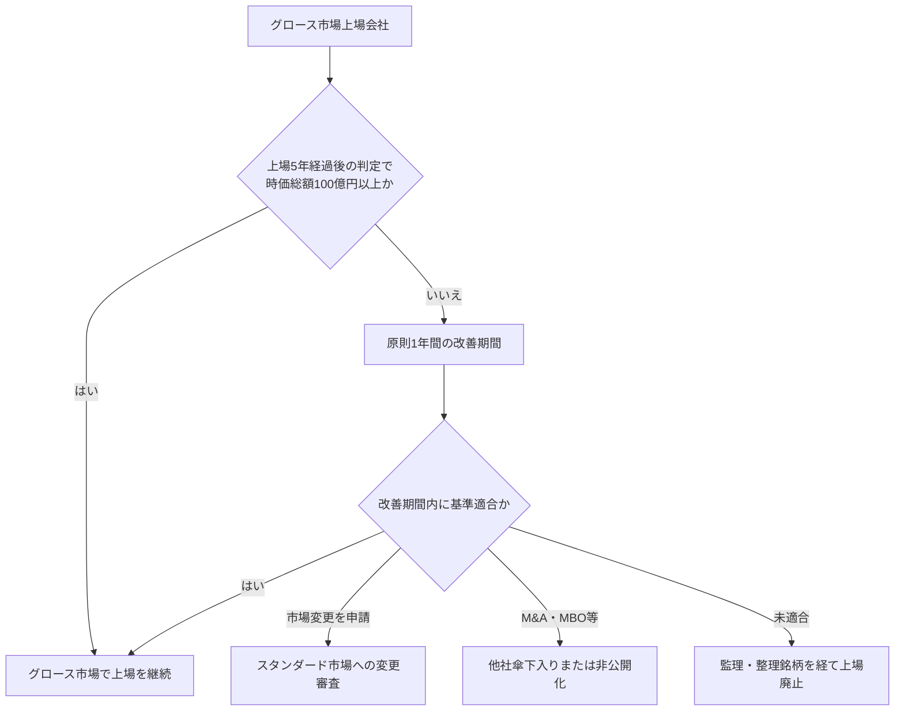

### 1. グロース市場で100億円を目指す

本来の選択肢は、成長戦略を実行し、事業価値と市場評価を高めることである。東証は、過去の成長実績、市場評価、資本コスト、今後の成長投資を分析し、「事業計画及び成長可能性に関する事項」を更新するよう求めている。単に100億円という数値目標を掲げるだけでなく、売上成長、利益率、顧客基盤、研究開発、M&Aなど、企業価値につながる経路を示す必要がある。

### 2. スタンダード市場へ変更する

会社の成長段階や事業特性によっては、スタンダード市場の方が適している場合もある。ただし、市場変更は自動的な「格下げ」ではなく、会社が申請し、スタンダード市場の変更基準について審査を受ける手続である。流通株式時価総額10億円、流通株式比率25%、株主数400人などの要件に加え、コーポレートガバナンス・コードの全原則への対応も必要になる。

2025年の制度見直しでは、成長投資を続ける会社が利益要件だけを理由に市場変更を断念しないよう、グロース市場からスタンダード市場への変更基準も手当てされた。実際の申請時には、その時点の最新規則を確認する必要がある。

### 3. M&Aや非公開化を選ぶ

他社との統合や事業会社による買収は、会社の技術、人材、顧客基盤をより大きな事業基盤に組み込む選択肢となる。創業者やプライベート・エクイティによるMBOで非公開化し、上場市場の短期的な評価から離れて再成長を目指す場合もある。

東証は制度見直しの目的として、機関投資家が投資できる規模への早期成長だけでなく、企業間M&Aや起業家の次の創業を促すことも明示している。M&Aは基準未達企業への罰ではなく、事業価値を別の形で実現する選択肢の一つとして位置づけられている。

## 移行時の特例

2030年3月1日以後の最初の事業年度末日に基準未達となった会社は、原則として1年間の改善期間に入る。ただし、その基準日から3か月以内に開示する適合計画で、**2031年3月1日以後最初に到来する事業年度末日を超える計画期間**を設定した会社は、その計画期限まで上場廃止が猶予される。

この特例は、2030年の一斉適用による急激な退出を避けながら、会社に具体的な期限と計画の開示を求める仕組みである。期限の定めのない猶予ではない。会社は計画期間、施策、進捗を市場に示し、その期限までに基準適合を実現する必要がある。

## 2025年から2030年までに何を準備するか

制度の施行までには数年あるが、時価総額は短期間に直接管理できる数字ではない。売上高、利益、成長率、資本政策、投資家の信頼が積み重なった結果として形成される。このため、準備は次の順序で進めるのが現実的である。

1. **現状を分析する。** 上場後の売上成長、利益率、時価総額、売買高、資本調達の成果を当初計画と比較する。
2. **100億円に至る事業上の道筋を作る。** 売上成長率、利益率、必要投資、資金調達、M&Aの前提を明示する。
3. **代替案を同時に検討する。** スタンダード市場への変更、資本提携、事業売却、M&A、非公開化について、検討を始める条件を決めておく。
4. **開示を更新する。** 「事業計画及び成長可能性に関する事項」を、過去計画との差異分析とともに更新する。
5. **取締役会で定期的に見直す。** 株価の短期変動ではなく、事業価値の形成と市場評価のずれを継続して議論する。

## グロース市場IRへの示唆

1. **100億円を株価目標として単独で掲げない。** 時価総額は市場評価の結果である。売上、利益、キャッシュフロー、成長投資、希薄化を含む事業上の経路を示す。
2. **判定方法を正確に理解する。** 事業年度末日前3か月の平均株価を使うため、期末日の終値だけで適否は決まらない。
3. **新規上場基準と上場維持基準を混同しない。** 「100億円未満ではIPOできない」という説明は誤りである。
4. **市場変更を早めに検討する。** スタンダード市場への変更には審査があり、申請準備やコード対応に時間がかかる。改善期間の末日まで待たない。
5. **2030年の特例を恒久的な猶予と考えない。** 適合計画には期限が必要であり、その期限までに進捗と結果を示す責任が生じる。

## 出典・参考資料

- JPX「グロース市場の上場維持基準の見直し等について」（2025年9月26日） https://www.jpx.co.jp/news/1020/20250926-01.html
- JPX「グロース市場の機能発揮に向けた対応」 https://www.jpx.co.jp/equities/follow-up/03.html
- JPX「上場維持基準（グロース市場）」 https://www.jpx.co.jp/equities/listing/continue/outline/03.html
- JPX「時価総額――上場維持基準の詳細」 https://www.jpx.co.jp/equities/listing/continue/details/04.html
- JPX「よくあるご質問（株式・上場会社）――グロース市場の上場維持基準の見直し」 https://www.jpx.co.jp/faq/stock_listed_company.html
- 経済産業省「企業買収における行動指針」（2023年8月） https://www.meti.go.jp/press/2023/08/20230831003/20230831003.html
- 経済産業省「公正なM&Aの在り方に関する指針」（2019年6月） https://www.meti.go.jp/press/2019/06/20190628003/20190628003.html

## 関連記事

- **3.1――4区分から3区分へ**：グロース市場が設けられた市場再編の全体像。
- **3.2――流通株式比率**：グロースとスタンダードの上場維持基準に共通する指標。
- **3.3――経過措置終了後の上場維持ルール**：改善期間、市場変更、上場廃止までの手続。
- **3.4――TOPIX改革**：市場区分とは別に、流動性で指数銘柄を選ぶ仕組み。
- **5.4――未承諾買収をどう扱うか**：M&Aを検討する際の取締役会の行動原則。
- **5.3――上場子会社と系列の見直し**：上場を続ける意義と少数株主保護を検討する視点。

---

# テーマ4：資本効率革命

---

## PBR1倍割れをどう読むか――東証要請の本当の狙い

**SOURCE URL:** https://jpinv.com/governance/capital-efficiency/4.1-march-2023-request-anatomy/

**記事要約**

2023年3月31日、東京証券取引所はプライム市場・スタンダード市場の全上場会社に対し、「資本コストや株価を意識した経営」の実現に向けた継続的な対応を要請した。PBR1倍の達成を義務づけた制度ではない。自社の資本コストと資本収益性を把握し、市場評価を取締役会で分析し、改善計画を開示・実行し、投資家との対話を踏まえて更新することを求めたものである。PBRは目標そのものではなく、収益性、成長期待、リスクに対する市場評価を映す指標として読む必要がある。

**本文**

> **要点**
> - 東証の要請は**規則上の義務ではない**。一方で、プライム市場・スタンダード市場の全上場会社を対象とし、取締役会と経営陣による継続的な対応を求めている。
> - 東証はPBR1倍超を一律の目標としていない。求めているのは、資本コスト、資本収益性、市場評価を分析し、企業価値向上のための具体策を実行・更新することである。
> - 自社株買いや増配も選択肢だが、それだけで対応を終えることは想定されていない。研究開発、人的資本、設備投資、事業ポートフォリオ、バランスシートを一体で見直す必要がある。

---

## 2023年3月31日の東証要請

東証は2023年3月31日、プライム市場・スタンダード市場の全上場会社に「資本コストや株価を意識した経営の実現に向けた対応」を要請した。正式な規則改正ではなく、違反に対する罰則もない。東証自身も「規則上の義務付けを行うものではない」と明記している。

それでも、この要請は企業実務に大きな影響を与えた。理由は、対象をPBR1倍割れ企業に限定せず、両市場の全社としたことにある。株価水準が高い会社であっても、資本コストと資本収益性を把握し、市場評価を取締役会で検討し、改善に向けた取組みを継続することが求められた。

東証が示した流れは、次の三つに集約できる。

1. **現状を分析する。** 自社の資本コスト、資本収益性、PBRなどの市場評価を把握し、取締役会で分析・評価する。
2. **改善策を策定し、開示・実行する。** 資本収益性の改善や成長期待の向上につながる計画を具体化し、投資家に示す。
3. **対話を踏まえて更新する。** 一度公表して終わりにせず、進捗と投資家の意見を踏まえて取組みを見直す。

## なぜPBR1倍割れが注目されたのか

要請の背景には、日本企業のPBRとROEの低さがあった。東証の資料では、プライム市場でもPBR1倍割れ企業が約半数を占め、ROE8%未満の会社も多いことが示されていた。

PBRは、株式時価総額を自己資本簿価で割った指標である。1倍を下回る状態は、単純に「会社を解散した方が価値が高い」と断定できるものではない。簿価には含まれない無形資産や、資産売却時の税・費用もあるからだ。それでも、将来の収益力や資本配分に対して市場が慎重な評価をしている可能性を示す重要な手掛かりにはなる。

PBR1倍割れを見たとき、取締役会が問うべきなのは「どうすれば株価を1倍まで上げられるか」ではない。より具体的には、次の問いである。

- 現在のROEは株主資本コストを上回っているか。
- その水準は一時的か、持続可能か。
- 収益性が低い事業や遊休資産はどこにあるか。
- 成長投資が将来のキャッシュフローにつながると市場に伝わっているか。
- 株主還元と成長投資の配分は、企業価値の観点から妥当か。

## PBRを分解して考える

PBRを考える際によく使われるのが、次の恒等式である。

> **PBR = ROE × PER**
>
> 株価／1株当たり純資産 ＝（1株当たり利益／1株当たり純資産）×（株価／1株当たり利益）

この式から、PBRが低い理由は大きく二つに分けられる。現在の収益性を表すROEが低いか、将来の利益成長や持続性に対する市場評価を表すPERが低いか、またはその両方である。

ただし、**PBR1倍超とROEが株主資本コストを上回ることは、無条件に成り立つ恒等式ではない**。残余利益モデルでは、将来にわたってROEが株主資本コストを上回ると市場が期待すればPBRは1倍を上回りやすく、下回ると期待すれば1倍を割りやすい。実際の株価には成長率、事業リスク、会計上の簿価、非事業資産なども影響する。

したがって、エクイティ・スプレッド（ROE－株主資本コスト）は有力な診断指標ではあるが、PBRを機械的に決める唯一の変数ではない。開示では、式を単純化しすぎず、自社の事業構造と将来計画に結びつける必要がある。

## 東証が求める継続的な取組み

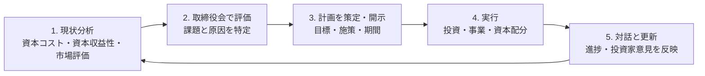

この一連の取組みで重要なのは、開示が目的ではないことである。開示は、取締役会での分析、事業現場での実行、投資家との対話を外部から確認できるようにする手段である。

東証は、研究開発、人的資本、設備投資、事業ポートフォリオの見直しを具体例として挙げている。バランスシートを分析した結果、自社株買いや増配が有効と判断されることもあるが、株主還元だけの一過性の対応ではなく、資本コストを上回る資本収益性を継続して実現する抜本的な取組みを期待している。

## 要請が定めていないもの

### PBR1倍の達成期限

要請は「何年までにPBR1倍を超えること」とは定めていない。PBRは市場が決めるため、会社が直接管理できる目標ではない。会社が管理すべきなのは、収益性、成長投資、事業ポートフォリオ、資本構成、開示と対話である。

### 一律のROE目標

ROE8%は伊藤レポートで示された重要な目安だが、東証要請が全社に義務づけた水準ではない。事業リスクや資本構成が異なれば、株主資本コストも異なる。各社が自社の資本コストを合理的に見積もり、それを上回る収益性を目指すことが基本となる。

### 一律の配当性向や自己株式取得額

東証は配当性向や自己株式取得額の数値基準を設けていない。還元は、成長投資や財務健全性と比較したうえで決める資本配分の一項目である。

### 開示の一律期限

開始時期について具体的な期限はなく、「できる限り速やかな対応」が求められた。その後、開示企業一覧表が月次公表され、「検討中」の掲載期間も6か月に限られるようになったため、実務上は継続的な更新が必要になっている。

## 要請が実務に定着した理由

東証は2024年1月から、要請に基づく開示を行った会社の一覧表を毎月公表している。2025年からは「検討中」の掲載期間を6か月に限定し、2026年からはコーポレート・ガバナンス報告書の開示内容も一覧上で確認できるようにした。

さらに、好事例だけでなく、「投資者の目線とギャップのある事例」や、課題解決に向けた企業の取組み事例も公表している。これにより、会社は「開示したか」だけでなく、「投資家が読んで理解できる内容か」「公表した計画を実行・更新しているか」で比較されるようになった。

2026年4月には要請が更新され、経営資源の適切な配分が改めて中心課題に据えられた。2026年8月には、投資家が「取組みの進展が見られる」と評価した企業の一覧も公表された。東証の役割は、数値目標を強制することではなく、企業と投資家が比較・対話できる共通の土台を整える方向へ発展している。

## IR担当者への示唆

1. **PBRを単独の目標にしない。** PBRの変化を、ROE、成長期待、リスク、資本構成に分けて説明する。
2. **資本コストの見積りを取締役会の議論につなげる。** 計算だけを財務部門に置かず、投資判断、撤退判断、還元方針にどう使ったかを示す。
3. **開示は進捗報告として更新する。** 初回資料を毎年転載せず、目標との差、実行した施策、投資家との対話を踏まえた変更点を明記する。
4. **株主還元を成長投資と同じ表で示す。** 配当、自社株買い、研究開発、設備投資、M&A、人的資本を一つの資本配分方針として説明する。
5. **東証の最新資料を基準に点検する。** 2023年の要請だけでなく、2025年の事例集、2026年の要請更新と投資家アンケートまで確認する。

## 出典・参考資料

- JPX「資本コストや株価を意識した経営の実現に向けた対応等に関するお願いについて」（2023年3月31日） https://www.jpx.co.jp/news/1020/20230331-01.html
- JPX「資本コストや株価を意識した経営の実現に向けた対応（プライム・スタンダード市場）」 https://www.jpx.co.jp/equities/follow-up/02.html
- JPX「『資本コストや株価を意識した経営』に関する『投資者の目線とギャップのある事例』等の公表について」（2024年11月21日） https://www.jpx.co.jp/news/1020/20241121-01.html
- JPX「『資本コストや株価を意識した経営』に関する要請のアップデートについて」（2026年4月28日） https://www.jpx.co.jp/news/1020/20260428-01.html
- 経済産業省「伊藤レポート」 https://www.meti.go.jp/policy/economy/keiei_innovation/kigyoukaikei/itoreport.html

## 関連記事

- **1.1――「ROE8%」が改革の基準になった理由**
- **2.2――2018年改訂――資本コストがコードに明記された転機**
- **3.1――4区分から3区分へ――2022年4月の市場再編**
- **4.2――WACC・ROIC・エクイティ・スプレッド――資本コスト経営の基本用語**
- **4.3――東証の開示企業一覧――公表が生む規律**
- **4.4――資本コスト開示で避けたい7つの落とし穴**
- **4.5――開示から実行へ――2026年4月の要請更新**

---

## WACC・ROIC・エクイティ・スプレッド――資本コスト経営の基本用語

**SOURCE URL:** https://jpinv.com/governance/capital-efficiency/4.2-cost-of-capital-vocabulary/

**記事要約**

資本コストを意識した経営では、似た言葉を正確に使い分ける必要がある。株主資本コストとWACC、ROEとROIC、エクイティ・スプレッドとROICスプレッドは、それぞれ比較する相手と使う場面が異なる。本稿では、取締役会、経営企画、IRが共通言語として押さえるべき用語と数式を整理する。重要なのは、指標を掲げることではなく、自社の事業判断、投資基準、資本配分、開示にどう使っているかを説明することである。

**本文**

> **要点**
> - **ROEは株主資本コストと、ROICはWACCと比べる。** 比較する指標を取り違えると、価値創造の判断もずれる。
> - 資本コストに万人共通の正解はない。計算方法、前提、参照期間、感応度を説明できることが重要である。
> - PBRや株価は結果として表れる市場評価であり、経営が直接動かすべきなのは収益性、成長、投下資本、リスク、資本配分である。

---

## なぜ用語を正確に使う必要があるのか

「資本効率を高める」「資本コストを意識する」という表現だけでは、実務上の意味が定まらない。会社全体の株主リターンを見ているのか、事業ごとの投下資本利益率を見ているのか、負債を含む資本コストを指しているのかで、使う数値も意思決定も変わる。

東証が求めているのは、難しい金融用語を増やすことではない。自社の資本コストと資本収益性を的確に把握し、それを投資、撤退、M&A、株主還元、事業ポートフォリオの判断に使うことである。IR資料では、用語と数式を示したうえで、経営判断とのつながりを説明する必要がある。

## 基本用語一覧

| 用語 | 一般的な式 | 何を測るか | 主な比較対象 |
| --- | --- | --- | --- |
| **株主資本コスト** | CAPMでは `rE = rf + β × ERP` | 株主が負担するリスクに見合う要求収益率 | ROE、株主還元、株式価値評価 |
| **負債コスト** | 実効金利。WACCでは通常税引後に調整 | 借入金・社債などの資金調達コスト | 投資判断、資本構成 |
| **WACC** | `(E/V)×rE + (D/V)×rD×(1−税率)` | 株式と有利子負債を合わせた加重平均資本コスト | ROIC、事業投資、企業価値評価 |
| **ROE** | 当期純利益÷平均自己資本 | 株主資本に対して最終利益をどれだけ生んだか | 株主資本コスト |
| **ROIC** | NOPAT÷投下資本 | 事業に投じた資本から税引後営業利益をどれだけ生んだか | WACC |
| **エクイティ・スプレッド** | ROE－株主資本コスト | 株主資本に対する超過収益率 | 0を上回るか |
| **ROICスプレッド** | ROIC－WACC | 投下資本に対する超過収益率 | 0を上回るか |
| **残余利益・経済利益** | `(ROE−rE)×自己資本` または `(ROIC−WACC)×投下資本` | 超過収益を率ではなく金額で捉える | 事業・期間別の価値創造額 |
| **CROIC** | 会社ごとの定義による | キャッシュフローを用いた投下資本収益性 | WACCなど |
| **PBR分解** | `PBR = ROE × PER` | PBRを現在の収益性と市場評価に分ける | 同業比較、原因分析 |

## 株主資本コストとWACC

株主資本コストは、株主が負う事業リスクと財務リスクに対して期待する収益率である。実務ではCAPMを用いることが多い。

> **株主資本コスト（CAPM）**
>
> `rE = リスクフリーレート + β × 株式リスクプレミアム`

どの国債利回りを使うか、ベータを何年・何頻度で推計するか、株式リスクプレミアムをどう置くかで結果は変わる。このため、会社が一つの数値だけを示しても、投資家が同じ前提を採用するとは限らない。数値の根拠とレンジ、感応度を示す方が実務的である。

WACCは、株主資本コストと負債コストを、株式と有利子負債の構成比で加重平均したものだ。税引後負債コストを用いるのは、支払利息に税効果があるためである。

> **WACC**
>
> `WACC = (E/V)×rE + (D/V)×rD×(1−t)`

ここでEは株式価値、Dは有利子負債、VはE+D、tは実効税率である。市場価値を使うか簿価を使うか、現金を投下資本からどう控除するかなど、会社ごとに定義差が出る。開示では、計算結果だけでなく定義を明記する必要がある。

## ROEとROICは何が違うのか

ROEは、会社全体として株主資本から最終利益をどれだけ生み出したかを見る。利益率、資産回転率、財務レバレッジに分解できる。

> **ROEのデュポン分解**
>
> `ROE = 売上高純利益率 × 総資産回転率 × 財務レバレッジ`

ROEは株主にとって重要だが、借入れを増やしても上昇し得る。したがって、ROEだけでは事業そのものの収益性と財務レバレッジの効果を分けにくい。

ROICは、負債と株主資本の双方から事業に投じられた資本に対し、本業からどれだけ税引後営業利益を生んだかを見る。事業部やセグメントごとの資本効率を管理するのに向いている。

> **ROICの代表的な形**
>
> `ROIC = NOPAT ÷ 投下資本`

ただし、NOPATや投下資本の定義は統一されていない。のれん、リース負債、余剰現金、持分法投資を含めるかどうかで数値が変わる。会社独自のROICを使う場合は、計算式と調整項目を明記し、期間を通じて一貫させることが必要である。

## スプレッドで価値創造を捉える

資本収益率は、単独の高さよりも資本コストとの差で見る方が意味を持つ。

- **エクイティ・スプレッド = ROE－株主資本コスト**
- **ROICスプレッド = ROIC－WACC**

スプレッドがプラスなら、資本提供者が求める水準を上回る収益を生んでいる。マイナスなら、利益を計上していても、そのリスクに見合う収益を上げていない可能性がある。

さらに、スプレッドに資本額を掛けると、残余利益または経済利益として価値創造額を金額で示せる。率が高くても投下資本が小さければ金額効果は限られ、率がわずかでも大きな資本に適用されれば企業価値への影響は大きい。事業ポートフォリオの比較では、率と金額を併用するのが有効である。

## PBRと残余利益モデル

`PBR = ROE × PER` は会計上の恒等式であり、PBRが低い理由をROEとPERに分ける出発点になる。

残余利益モデルでは、株式価値は現在の自己資本簿価と、将来の残余利益の現在価値の合計として表される。

> `株式価値 = 現在の自己資本簿価 + 将来の残余利益の現在価値`
>
> `残余利益 = (ROE－株主資本コスト) × 期首自己資本`

この考え方から、市場が将来にわたり正のエクイティ・スプレッドを期待すればPBRは1倍を上回りやすく、負のスプレッドを見込めば1倍を下回りやすい。ただし、実際のPBRには成長率、リスク、会計上認識されない無形資産、非事業資産なども影響するため、単純な一対一対応ではない。

## CROICを使うときの注意

CROICは、ROICの分子に営業キャッシュフローやフリーキャッシュフローを用いる指標として使われる。しかし、標準化された唯一の定義はない。維持投資を控除するか、運転資本変動を平準化するか、M&Aをどう扱うかで数値は大きく変わる。

CROICを開示する場合は、次の三点を必ず示す。

1. 分子に用いたキャッシュフローの定義。
2. 分母に用いた投下資本の定義。
3. 一時的な運転資本変動や大型投資をどう扱ったか。

独自指標は、定義が明確で、同じ方法を継続して使い、法定指標との橋渡しができて初めて有用になる。

## 指標を経営にどう組み込むか

優れた開示には、指標の一覧よりも、意思決定とのつながりがある。

- 新規投資は、どのWACCまたはハードルレートで審査するか。
- 既存事業は、ROICがWACCを下回ったときにどのような改善・撤退判断を行うか。
- M&Aでは、買収価格、のれん、統合後のROICをどう評価するか。
- 株主還元は、成長投資機会と財務余力をどう比較して決めるか。
- 中期経営計画では、ROEやROICの改善を利益率、資産回転、投下資本にどう分解するか。

ROICツリーは、このつながりを現場まで落とし込む方法の一つである。ROICを利益率と投下資本回転率に分け、さらに価格、製品構成、原価、在庫、売掛金、固定資産など日常業務の指標へ分解する。重要なのは図を掲載することではなく、各部門の行動と企業価値を結びつけることである。

## IR担当者への示唆

1. **ROEとROICの比較相手を明記する。** ROEは株主資本コスト、ROICはWACCと比べる。
2. **資本コストは点ではなく前提つきのレンジで説明する。** rf、β、ERP、負債コスト、税率、資本構成を開示できるようにする。
3. **独自指標の定義を固定する。** ROICやCROICの計算式を資料ごとに変えない。
4. **会社全体と事業別の指標をつなぐ。** 連結ROEだけでなく、セグメント別ROICと改善策を示す。
5. **指標を意思決定の実績で裏づける。** 目標値だけでなく、投資、撤退、M&A、還元にどう使ったかを説明する。

## 出典・参考資料

- JPX「資本コストや株価を意識した経営の実現に向けた対応（プライム・スタンダード市場）」 https://www.jpx.co.jp/equities/follow-up/02.html
- JPX「『資本コストや株価を意識した経営』に関する『投資者の目線とギャップのある事例』等の公表について」 https://www.jpx.co.jp/news/1020/20241121-01.html
- JPX「第7回企業価値向上表彰の表彰会社の決定について」（ROICを経営管理に活用した事例） https://www.jpx.co.jp/news/1024/nlsgeu000003s94a-att/20190128_Release_jp.pdf
- 経済産業省「伊藤レポート」 https://www.meti.go.jp/policy/economy/keiei_innovation/kigyoukaikei/itoreport.html
- 経済産業省「伊藤レポート3.0（SX版）」 https://www.meti.go.jp/policy/economy/keiei_innovation/kigyoukaikei/ito_review.html

## 関連記事

- **1.1――「ROE8%」が改革の基準になった理由**
- **4.1――PBR1倍割れをどう読むか**
- **4.3――東証の開示企業一覧――公表が生む規律**
- **4.4――資本コスト開示で避けたい7つの落とし穴**
- **4.5――開示から実行へ――2026年4月の要請更新**

---

## 東証の開示企業一覧――公表が生む規律

**SOURCE URL:** https://jpinv.com/governance/capital-efficiency/4.3-the-disclosure-list/

**記事要約**

東証は「資本コストや株価を意識した経営」を規則で強制する代わりに、対応状況を公表する仕組みを整えた。2024年1月に始まった開示企業一覧表は、各社のコーポレート・ガバナンス報告書をもとに、「開示済」「検討中」などの状況を月次で示す。2025年には「検討中」を6か月までとし、2026年には各社の開示内容も一覧上で確認できるようになった。リスト自体は質を採点しないが、比較と対話の入口を提供することで、継続的な開示更新を促している。

**本文**

> **要点**
> - 東証は2024年1月から、プライム市場・スタンダード市場の会社を対象に、要請への対応状況を示す**開示企業一覧表**を毎月公表している。
> - 2025年1月以降、「検討中」として一覧に載れるのは原則6か月までとなった。開示を更新した日や、機関投資家からの連絡を希望するかどうかも表示される。
> - 2026年1月以降は、コーポレート・ガバナンス報告書に記載された各社の開示内容も一覧上で確認できる。参加の有無だけでなく、中身の比較がしやすくなった。

---

## なぜ一覧表を公表するのか

2023年3月の要請は、規則上の義務ではない。東証が各社の計画を審査して合否をつけたり、PBRやROEの数値目標を達成できない会社に罰金を科したりする制度でもない。

そこで東証が採ったのが、対応状況を市場参加者に見えるようにする方法である。会社が何を開示しているかを一覧化すれば、投資家は同業他社を横並びで比較できる。会社側も、自社だけが対応を先送りしていないか、初回開示後に更新が止まっていないかを確認できる。

この仕組みでは、東証自身が開示の優劣を一行ずつ採点する必要はない。公表された情報をもとに、投資家が対話、議決権行使、投資判断を行う。その比較可能性が、会社に開示と実行の改善を促す。

## 一覧表の変遷

| 時期 | 主な変更 |
| --- | --- |
| **2023年3月31日** | プライム・スタンダード全社に要請を公表 |
| **2023年10月** | 開示企業一覧表を公表する方針を予告 |
| **2024年1月** | 初回の一覧表を公表。以後、原則として毎月15日を目途に更新 |
| **2025年1月** | 更新日、機関投資家からの連絡希望、「検討中」の6か月上限を導入 |
| **2026年1月** | CG報告書における各社の開示内容を一覧表に掲載 |
| **2026年8月** | 投資家アンケートをもとに「取組みの進展が見られる企業」の一覧を公表 |

一覧表は、各月末時点で直近に提出されたコーポレート・ガバナンス報告書をもとに作成される。2026年7月末時点の一覧は8月14日に公表されている。このように、最新状況は常に更新されるため、記事中の社数よりも東証の現行ファイルを確認する方が確実である。

## 現在の分類方法

各社は、CG報告書の「資本コストや株価を意識した経営の実現に向けた対応」欄で、開示内容を選択する。

| 一覧上の扱い | CG報告書での選択 | 意味 |
| --- | --- | --- |
| **開示済** | 「取組みの開示（初回）」または「取組みの開示（アップデート）」 | 取組みまたはその更新を開示している |
| **検討中** | 「検討状況の開示」 | 具体的な取組みの開示に向けて検討している。掲載は原則6か月まで |
| **一覧外** | 上記に該当しない | 一覧表上、開示済・検討中として確認できない |

「開示済」は、内容が十分であるという認定ではない。数行の抽象的な説明でも、所定の形で開示されれば一覧上は開示済となり得る。反対に、詳細な資料を公表していても、CG報告書の参照先や選択項目が適切でなければ一覧に正しく反映されない場合がある。

IR担当者は、資料を作るだけでなく、CG報告書と一覧表の表示が一致しているかまで確認する必要がある。

## 6か月ルールの意味

当初の「検討中」は、会社が十分な分析を行う時間を確保するための中間状態だった。しかし、期限がなければ、検討中のまま具体的な開示を先送りできる。

東証は2025年1月から、検討中として一覧に掲載する期間を6か月に限定した。これは、6か月以内に必ずPBRを改善するという意味ではない。会社が少なくとも、現状分析、課題、今後の検討方針を具体的な開示へ進めることを期待したものだ。

検討に時間がかかる場合でも、何を分析しているのか、取締役会でいつ議論したのか、いつまでに次の開示を行うのかを示す方が、単に「検討中」と記すよりも投資家の理解を得やすい。

## 一覧表で確認できること

一覧表には、会社名、証券コード、市場区分、業種、開示状況、初回開示日、更新日などが掲載される。2025年以降は、機関投資家からの連絡を希望する会社も確認できる。2026年以降は、CG報告書に記載された開示内容へのアクセスもしやすくなった。

実務では、次の三点を見るとよい。

### 1. 初回開示日と更新日の間隔

初回開示後に更新がない会社は、一度資料を作って対応を止めている可能性がある。中期経営計画、資本政策、事業ポートフォリオが変われば、資本コストに関する開示も見直す必要がある。

### 2. 同業他社との違い

同じ業種・規模の会社でも、資本コストの数値、ROIC管理、事業別の改善策、株主還元方針の具体性には差がある。一覧表は比較対象を見つける入口として使える。

### 3. 「開示済」の中身

状態だけで判断せず、実際の記載を読む。資本コストの根拠、現状分析、目標、施策、進捗、対話を踏まえた更新がそろっているかを確認する。

## 一覧表を補う資料

東証は一覧表だけでなく、開示の質を考えるための資料を継続的に公表している。

- **投資家の視点を踏まえたポイント**：投資家が何を重視しているかを整理。
- **事例集（プライム・スタンダード）**：実際の開示から参考事例を紹介。
- **投資者の目線とギャップのある事例**：抽象的な説明、PBR目標の単独提示、株主還元への偏りなどを整理。
- **課題解決に向けた企業の取組み事例集**：開示文言ではなく、社内でどう課題を解決したかを紹介。
- **2026年の企業・投資家アンケート**：対話の課題と、投資家が進展を評価する会社を可視化。

一覧表が「誰が開示しているか」を示すのに対し、これらの資料は「何が伝わる開示か」「どのような実行が評価されるか」を示す。両方を合わせて読む必要がある。

## 公表による規律の強みと限界

公表方式の強みは、全市場参加者が同じ情報を使えることにある。行政処分を待たず、同業比較、投資家対話、社内説明にすぐ使える。開示が進むほど、未開示や更新停止が目立ちやすくなる。

一方で、一覧表に載ること自体が目的化する危険もある。状態区分は開示の質や実行成果を保証しない。数字を示していても、前提が不明であったり、目標と施策がつながっていなかったりすれば、投資家の評価は高まらない。

したがって、一覧表は合格者名簿ではなく、対話の出発点と捉えるのが適切である。

## IR担当者への示唆

1. **毎月の一覧表で自社の表示を確認する。** 状態、初回開示日、更新日、リンク先に誤りがないかを見る。
2. **「検討中」は6か月以内に次の段階へ進める。** 社内では5か月程度を期限として、CG報告書更新まで含めて管理する。
3. **初回開示後の更新方針を決める。** 少なくとも年1回、中計や資本政策の変更時には随時更新する。
4. **同業10～20社を比較する。** 状態だけでなく、資本コストの根拠、目標、施策、進捗の具体性を比べる。
5. **一覧掲載を成果とみなさない。** 投資家との対話と経営の実行に使われて初めて、開示の意味が生まれる。

## 出典・参考資料

- JPX「資本コストや株価を意識した経営の実現に向けた対応（プライム・スタンダード市場）」 https://www.jpx.co.jp/equities/follow-up/02.html
- JPX「開示企業一覧表の見直しについて」（2024年9月27日） https://www.jpx.co.jp/news/1020/20240927-01.html
- JPX「開示企業一覧表の見直しについて」（2025年9月26日） https://www.jpx.co.jp/news/1020/20250926-02.html
- JPX「『資本コストや株価を意識した経営』に関する『投資者の目線とギャップのある事例』等の公表について」 https://www.jpx.co.jp/news/1020/20241121-01.html
- JPX「『資本コストや株価を意識した経営』に関する要請のアップデートについて」 https://www.jpx.co.jp/news/1020/20260428-01.html

## 関連記事

- **3.3――経過措置終了後の上場維持ルール**
- **4.1――PBR1倍割れをどう読むか**
- **4.2――WACC・ROIC・エクイティ・スプレッド**
- **4.4――資本コスト開示で避けたい7つの落とし穴**
- **4.5――開示から実行へ――2026年4月の要請更新**
- **5.1――日英同時開示は始まりにすぎない**

---

## 資本コスト開示で避けたい7つの落とし穴

**SOURCE URL:** https://jpinv.com/governance/capital-efficiency/4.4-seven-sins-misalignment/

**記事要約**

東証は2024年11月、上場会社の取組みを投資家がどう読んでいるかを「投資者の目線とギャップのある事例」として整理した。公式資料が示すのは、分析・評価、取組みの検討・開示、対話・アップデートの3段階にまたがる10の典型例である。本稿では、その内容をIR実務で使いやすい7つの確認項目に組み替え、自社の開示を点検する方法を示す。

**本文**

## 要点

- 東証は**2024年11月21日**、「投資者の目線とギャップのある事例」を公表した。対象は、①分析・評価、②取組みの検討・開示、③対話・アップデートの3段階に分かれる計10項目である。
- 問題は、数字が少ないことだけではない。自社の見方だけで現状を評価する、目指すバランスシートを決めない、施策を列挙するだけで因果関係を示さない、投資家との対話を次の判断に反映しない、といった一連の弱さが問われている。
- 以下の「7つの落とし穴」は、本講座が東証の10項目を実務上の点検順序に沿って再整理したものである。東証自身が7分類を示しているわけではない。

---

## 「好事例をまねる」前に、ずれを点検する

好事例集は、完成度の高い開示がどのような姿かを知るうえで役に立つ。しかし、他社の指標や図表をそのまま移しても、自社の課題と結びついていなければ説得力は生まれない。先に行うべきなのは、自社の分析や説明が投資家の問題意識とどこでずれているかを見つけることである。

東証の資料は、この点検を3段階で行う。

1. **分析・評価**――資本コスト、資本収益性、市場評価、バランスシートをどう捉えているか。
2. **取組みの検討・開示**――課題に対して、目標、資本配分、事業ポートフォリオ、役員報酬をどう設計し、どう説明しているか。
3. **対話・アップデート**――投資家との対話に応じ、その内容を開示や施策の見直しに反映しているか。

2025年12月に改訂されたポイント・事例集は、国内外の延べ400社超の投資家との意見交換を踏まえている。したがって、ここに挙げられた論点は、抽象的な模範論ではなく、投資家が実際の開示を読んだときに感じる違和感を整理したものと考えるのがよい。

---

## 7つの落とし穴

| # | 落とし穴 | 開示に表れやすい兆候 | 見直すべき方向 |
| --- | --- | --- | --- |
| **1** | **自社の物差しだけで現状を評価する** | 同業平均を上回っていることだけで十分と判断する。株主資本コストの根拠や市場評価とのずれを検討していない。 | 投資家との対話、事業リスク、株主構成、市場で求められる収益率も踏まえ、複数の角度から現状を評価する。 |
| **2** | **PBRやROEの表面だけを見る** | PBR1倍割れやROE低迷を指摘するだけで、収益性、成長期待、資産効率、情報の非対称性などの要因を分解していない。 | ROE、ROIC、利益率、資産回転率、事業別採算、市場との認識差まで掘り下げる。 |
| **3** | **目指すバランスシートと資本配分を決めない** | 現預金、政策保有株式、有利子負債、成長投資、株主還元を個別に説明するだけで、全体としてどの姿を目指すかが見えない。 | 必要資金、リスク耐性、投資機会、負債余力を踏まえ、目指す資本構成と資金配分の優先順位を示す。 |
| **4** | **目標を先に置き、課題とのつながりを示さない** | 「ROE10%」「PBR1倍超」などの数字はあるが、なぜその水準なのか、何を変えて達成するのかが分からない。 | 現状分析から目標までの論理をつなぎ、利益率、資産効率、事業構成、資本政策などの具体策に分解する。 |
| **5** | **不採算事業と経営者の動機付けに踏み込まない** | すべての事業を成長させる前提で、不採算事業の縮小・撤退・売却を検討していない。役員報酬も単年度業績に偏る。 | 事業ごとの資本収益性を点検し、再建・追加投資・売却・撤退を判断する。報酬制度も中長期の企業価値と整合させる。 |
| **6** | **施策を並べるだけで、因果関係を示さない** | DX、人的資本、M&A、自社株買いなどを列挙するが、どの課題をどう改善し、どの指標に効くのかが示されない。 | 「課題→施策→KPI→期待する効果→検証時期」の順で説明する。 |
| **7** | **対話を実施しても、経営判断を更新しない** | 面談回数だけを開示する、合理的な理由なく対話を断る、対話で得た論点を翌年の計画や開示に反映しない。 | 対話で寄せられた主な論点、取締役会での検討、変更した施策や見送った理由まで開示する。 |

---

## 落とし穴1――自社の物差しだけで現状を評価する

資本コストは、会社が都合よく決める社内基準ではない。事業リスクや市場環境を踏まえ、資金提供者が求める収益率を会社側が推定するものである。このため、算定式を示しただけでは十分とは限らない。投資家が認識する水準と大きく異なる場合には、なぜ差が生じるのかを説明する必要がある。

また、同業平均を上回っていることも、それだけでは結論にならない。投資家は業種内だけでなく、他業種や海外企業も含めて投資先を選ぶ。業界全体の収益性が低ければ、「同業並み」は資本コストを上回る根拠にならない。

開示では、資本コストの数値またはレンジに加え、主な前提、投資家との対話で得た認識、自社が考える市場評価とのずれを示すとよい。東証は一律の正解値を示していない。重要なのは、会社の推定が検証可能であり、投資家の見方と向き合っていることである。

---

## 落とし穴2――PBRやROEの表面だけを見る

PBR1倍割れを確認して「市場評価が低い」と書くだけでは、分析とはいえない。ROEが資本コストを下回っているのか、成長の持続性に疑問を持たれているのか、過剰資産が収益性を押し下げているのか、事業内容が伝わっていないのかによって、必要な対応は異なる。

ROE目標も同じである。たとえば、次の分解を使えば、どの経営課題を動かす必要があるかが見える。

> **ROE = 売上高純利益率 × 総資産回転率 × 財務レバレッジ**

事業別にはROICとWACCの比較が有効である。会社全体のROEが改善していても、資本コストを下回る事業が残っていれば、ポートフォリオの課題は解消していない。市場評価の説明では、数字の水準よりも、数字を生んでいる構造を示すことが重要になる。

---

## 落とし穴3――目指すバランスシートを決めない

現預金を多く持つ理由、政策保有株式を残す理由、有利子負債を増やさない理由を個別に説明しても、それらを合計したバランスシートが会社の戦略に適しているかは分からない。投資家が知りたいのは、事業リスクと成長機会を踏まえた必要資金の水準、そのうえで余剰となる資金をどこに配分するかである。

自社株買いや増配は、分析の結果として適切な場合がある。ただし、それだけを東証要請への回答にすると、事業の競争力や将来の利益成長をどう高めるかが抜け落ちる。研究開発、人的資本、設備投資、M&A、負債返済、株主還元を同じ表の中で比較し、優先順位と判断基準を示す必要がある。

---

## 落とし穴4――目標を先に置き、達成経路を示さない

「2027年度にROE10%」「PBR1倍以上」といった数値だけでは、投資家は計画の実現性を判断できない。PBRは市場が付ける評価であり、経営陣が直接決められる指標ではない。ROEも、利益率の改善、資産の圧縮、財務レバレッジの変更では意味が異なる。

目標は、現状分析から導かれていなければならない。たとえば、低採算事業の再編で利益率を上げるのか、運転資本を減らして資産回転率を高めるのか、余剰資本を返すのかを分けて示す。各施策に期限と責任主体を置き、実績が計画から外れたときの見直し方針まで示せば、目標は単なる宣言から経営管理の道具に変わる。

---

## 落とし穴5――不採算事業と役員報酬に踏み込まない

資本効率を高めるうえで最も難しいのは、利益が出ていない事業をどう扱うかである。改善の余地があるなら再建し、より適した保有者がいるなら売却し、将来も資本コストを上回る見通しが立たないなら撤退する。すべての事業を維持したまま全体目標だけを掲げても、経営資源の配分は変わらない。

同時に、経営陣の評価制度も確認が必要である。単年度の売上高や営業利益だけに連動する報酬は、資産を積み増して規模を拡大する動機になりやすい。ROIC、ROE、TSR、事業ポートフォリオの進捗などを中長期の報酬にどう反映するかを示せば、計画を実行する仕組みまで説明できる。

---

## 落とし穴6――施策を並べるだけで終える

次のような文章は、一見すると取組みが多い。しかし、何を解決するのかが分からない。

> 「成長投資、DX、人的資本投資、M&A、株主還元を通じて企業価値を高めます。」

必要なのは施策の数ではなく、因果関係である。たとえば、「A事業の低い資産回転率がROICを押し下げているため、在庫日数をX日からY日に短縮し、2027年度までにROICをZ%へ引き上げる」と書けば、課題、行動、指標、期限が一続きになる。

中期経営計画を東証要請への回答として使うこと自体に問題はない。ただし、中計の既存ページを示すだけではなく、資本コストとの関係、取締役会の分析、投資家との対話を踏まえた見直しが読み取れるようにする必要がある。

---

## 落とし穴7――対話が経営判断につながらない

面談回数や参加者数を開示しても、対話の成果は分からない。投資家がどの論点を提起し、経営陣や取締役会がどう検討し、何を変えたのかが重要である。

また、未公表の重要事実を伝えられないことと、投資家との対話そのものを断ることは別の問題である。合理的な理由なく面談に応じない、社外取締役への面談要請を一律に拒む、といった姿勢は、対話を重視するコードや東証要請の趣旨と合わない。

開示の更新では、前年から変わった箇所を明示するとよい。目標を変更したなら理由を示す。施策を見送ったなら、投資家の提案を検討したうえで見送った理由を説明する。対話に従うことではなく、対話を判断材料として使ったことを示すのが目的である。

---

## 90秒でできる自己点検

1. 資本コストの根拠を、投資家との認識差も含めて説明できるか。
2. PBR、ROE、ROICの水準を、事業や財務の要因に分解しているか。
3. 目指すバランスシートと資金配分の優先順位が示されているか。
4. 目標と具体策の間に、検証できる因果関係があるか。
5. 資本コストを下回る事業について、再建・追加投資・売却・撤退の判断を示しているか。
6. 施策の列挙ではなく、「課題→施策→KPI→期限」の順で説明しているか。
7. 投資家との対話を受けて、開示または経営判断を更新した事例があるか。

一つでも答えに詰まる項目があれば、そこが次の改訂箇所である。点数を付けることより、取締役会で具体的な問いに置き換えることの方が重要だ。

---

## IRにとっての含意

1. **東証の10項目を公表前の確認表にする。** IR資料、中期経営計画、コーポレート・ガバナンス報告書を別々に点検せず、同じ論理で読めるかを確認する。
2. **資本コストの数値だけを争点にしない。** 数値の根拠、市場との認識差、その差をどう対話で検証したかまで一組で説明する。
3. **取締役会の議論を開示につなげる。** IR部門だけで文章を整えるのではなく、分析、目標、事業ポートフォリオ、資本配分が取締役会の判断として承認されていることを確認する。
4. **毎年、同じ文章を出さない。** 実績、対話、環境変化を踏まえ、何を維持し、何を変えたかが分かる更新にする。
5. **好事例は構成を学び、数字は借りない。** 他社のWACCやROIC目標を移すのではなく、「課題から施策までをどうつないでいるか」を参考にする。

---

## 出典・参考資料

- 東京証券取引所「『資本コストや株価を意識した経営』に関する『投資者の目線とギャップのある事例』等の公表について」（2024年11月21日）: https://www.jpx.co.jp/news/1020/20241121-01.html
- 東京証券取引所「資本コストや株価を意識した経営の実現に向けた対応（プライム・スタンダード市場）」: https://www.jpx.co.jp/equities/follow-up/02.html
- 東京証券取引所「『資本コストや株価を意識した経営』のポイントと事例のアップデートの概要」（2024年）: https://www.jpx.co.jp/equities/follow-up/nlsgeu000006gevo-att/mklp77000000k4tq.pdf
- 東京証券取引所「『資本コストや株価を意識した経営』に関する『課題解決に向けた企業の取組み事例』等の公表について」（2025年12月26日）: https://www.jpx.co.jp/news/1020/20251226-01.html
- 東京証券取引所「ポイント・事例集の使い方ガイド」（2025年）: https://www.jpx.co.jp/equities/follow-up/jr4eth0000004vj2-att/t13vrt000000dlhw.pdf
- 東京証券取引所「『取組みの進展が見られる企業』等に関する機関投資家アンケートの結果について」（2026年8月12日）: https://www.jpx.co.jp/corporate/news/news-releases/1020/20260812-01.html

---

## 関連記事

- **テーマ4.1**――[PBR1倍割れをどう読むか――東証要請の本当の狙い](/governance/)
- **テーマ4.2**――[WACC・ROIC・エクイティ・スプレッド――資本コスト経営の基本用語](/governance/)
- **テーマ4.3**――[東証の開示企業一覧――公表が生む規律](/governance/)
- **テーマ4.5**――[開示から実行へ――2026年4月の要請更新](/governance/)
- **テーマ5.2**――[政策保有株式の最終局面――銘柄ごとの検証と開示](/governance/)

---

## 開示から実行へ――2026年4月の要請更新

**SOURCE URL:** https://jpinv.com/governance/capital-efficiency/4.5-action-plan-2-update/

**記事要約**

東京証券取引所は2026年4月28日、「資本コストや株価を意識した経営」に関する要請を更新した。新たな中心課題は「経営資源の適切な配分」である。初回開示の有無を問う段階から、成長投資、事業ポートフォリオ、バランスシート、株主還元を一体で考え、実行と進捗を示す段階へ移った。本稿では、更新の位置付けと、IR開示で何を変えるべきかを整理する。

**本文**

## 要点

- **2026年4月28日**、東証は「『資本コストや株価を意識した経営』に関する要請のアップデート」を公表した。公式資料の中心語は**「経営資源の適切な配分」**である。
- 2023年の要請は撤回されていない。資本コストと資本収益性を把握し、取締役会で分析し、計画を開示し、投資家との対話を踏まえて更新するという基本の流れはそのまま続く。
- 変わったのは、評価の重心である。開示したかどうかだけでなく、成長投資、事業ポートフォリオ、保有資産、負債、株主還元をどう組み合わせ、企業価値向上につなげたかが問われるようになった。

---

## 2023年の要請から、2026年の更新へ

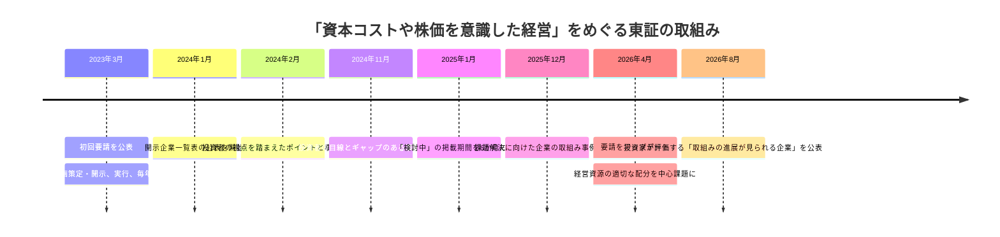

2023年の初回要請は、まず取締役会が資本コスト、資本収益性、市場評価を経営課題として扱うことを求めた。その後、東証は開示企業一覧表、好事例、投資家の目線とずれる事例、課題解決の過程を示す事例集を順に加えた。

2026年4月の更新は、この仕組みを別制度に置き換えるものではない。開示を出発点としながら、経営資源の配分が実際に変わったか、その結果が数値と説明に表れているかへと、焦点を一段深めたものである。

東証の正式名称は、**「『資本コストや株価を意識した経営』に関する要請のアップデート」**である。第27回フォローアップ会議では「4年目の取組み」として議論され、従来の要請を土台に、実行段階で重視すべき点が整理された。

---

## 更新の中心――経営資源の適切な配分

東証が改めて示したのは、資本コストを上回る収益性を継続して生むために、経営資源をどこへ配分するかという問いである。対象は現金だけではない。人材、研究開発、設備、知的財産、M&A、事業ポートフォリオ、負債、保有資産、株主還元を含む。

重要なのは、成長投資と株主還元を単純な二者択一にしないことである。資本コストを上回る収益が見込める投資には資金を配分し、見込めない投資は見直す。そのうえで、事業に必要な資金を超える部分について、負債返済や株主還元を検討する。どの選択肢も、価値創造への寄与を同じ基準で比較する必要がある。

東証の要請ページは、自社株買いや増配が有効な場合もあるとしつつ、**それだけの対応や一過性の対応を期待するものではない**と明記している。したがって、株主還元を増やした事実だけでは、経営資源の配分を見直した説明にはならない。

---

## 実行段階で問われる5つの論点

### 1. 過去に掲げた目標への進捗

2023年から2025年に開示したROE、ROIC、政策保有株式、キャッシュ配分などの目標に対し、実績がどう進んだかを示す。未達なら、原因を分析し、計画を維持するのか、修正するのかを説明する。目標を新しい数字に置き換えるだけでは、継続的な検証にならない。

### 2. 成長投資の判断基準

研究開発、人的資本、設備投資、M&A、無形資産への投資について、金額だけでなく、どの競争優位を強め、どの収益指標に結びつくかを示す。投資しない領域、撤退する領域も同時に示すことで、選択と集中の実態が伝わる。

### 3. 事業ポートフォリオの見直し

各事業について、資本コストを上回る収益性を将来にわたり実現できるかを評価する。見通しが立たない場合には、再建、追加投資、他社との提携、売却、撤退などを比較する。「全事業を成長させる」という説明では、資本配分の優先順位が分からない。

### 4. バランスシートの最適化

現預金、政策保有株式、遊休資産、不動産、投資有価証券、有利子負債を、貸借対照表の両側から点検する。必要な現金水準や負債余力を定量的に検討し、保有する理由を企業価値との関係で説明する。

### 5. 投資家との対話を反映した更新

投資家の意見をそのまま採用することが求められているわけではない。どの論点を取締役会で検討し、何を変更し、何を変更しなかったか、その理由を示すことが重要である。対話が経営判断にどう使われたかが、更新の質を左右する。

---

## 「実行」を示す開示の組み立て方

2026年以降の開示は、次の5章で構成すると読みやすい。

| 章 | 開示する内容 |
| --- | --- |
| **1. 現状と進捗** | 資本コスト、ROE・ROIC、市場評価、過去目標と実績、差異分析 |
| **2. 経営資源の配分方針** | 成長投資、M&A、人的資本、研究開発、設備投資、負債、株主還元の優先順位 |
| **3. 事業ポートフォリオ** | 事業別ROIC、資本コストを下回る事業への対応、売却・撤退・再投資の判断 |
| **4. バランスシート** | 必要現金、政策保有株式、非中核資産、負債余力、目指す資本構成 |
| **5. 対話と次の見直し** | 投資家からの主な論点、取締役会の検討、変更点、次回更新時期 |

この構成の利点は、施策を並べるのではなく、現状認識から判断、実行、検証までを一つの流れで示せることにある。コーポレート・ガバナンス報告書には要点を置き、詳細を中期経営計画や専用ページにリンクする方法も使える。

---

## 最初から完成形を求めているわけではない

2026年8月に東証が公表した機関投資家アンケートでは、まだ開示に踏み出せていない企業に対する「第一歩」も整理された。そこで多かった意見は、最初から精緻な数値目標や完成した行動計画を求めるものではない。

まず必要なのは、

1. 資本コスト、ROE・ROIC、市場評価を分析し、**経営者としての現状認識**を示すこと。
2. 改善の方向性と、経営トップの**取組む意思**を示すこと。

である。

これは、更新後の期待が一律に高度な財務モデルを求めているわけではないことを示す。重要なのは、会社が課題を認識し、取締役会で議論を始め、次の検討時期を明らかにすることだ。その後、対話と実行を通じて精度を上げていけばよい。

---

## 2026年8月に加わった「進展」の可視化

東証は2026年、国内外の機関投資家に対し、「取組みの進展が見られる企業」を尋ねるアンケートを実施し、企業名と評価コメントを公表した。これにより、開示の有無だけでなく、投資家が実際に進展を認めた企業も可視化されるようになった。

開示企業一覧表が「取組みに着手したか」を示すのに対し、この新しい一覧は「取組みが前へ進んでいると投資家が評価したか」を示す。両者は公式な格付けではないが、IR実務では自社と同業他社の進捗を比較する材料になる。

同じ2026年の投資家アンケートでは、成長投資の意思決定、事業ポートフォリオの抜本的な見直し、保有資産の最適化、取締役会の実効性、対話と開示の継続性などが、今後さらに改善を期待する論点として挙げられた。更新の焦点が、単なる開示量ではなく経営そのものに移ったことが分かる。

---

## IRにとっての含意

1. **2023年以降の約束を一覧にする。** ROE、ROIC、投資額、政策保有株式、還元方針など、過去に公表した目標と実績を一つの表にまとめ、未達項目を消さずに説明する。
2. **資本配分を一枚の図で示す。** 成長投資、M&A、人的資本、研究開発、設備投資、負債返済、株主還元を同じ期間・同じ単位で示し、優先順位を説明する。
3. **事業別の判断を曖昧にしない。** 資本コストを下回る事業について、改善期限と判断基準を置く。再建、提携、売却、撤退のどこまで検討しているかを取締役会と共有する。
4. **バランスシートの目標像を言葉にする。** 必要現金、適正な負債、政策保有株式、非中核資産の方針を別々に書くのではなく、目指す資本構成として統合する。
5. **更新理由を開示する。** 前年から変えた指標や施策には、実績、事業環境、投資家との対話のどれが理由だったかを添える。

---

## 出典・参考資料

- 東京証券取引所「『資本コストや株価を意識した経営』に関する要請のアップデートについて」（2026年4月28日）: https://www.jpx.co.jp/news/1020/20260428-01.html
- 東京証券取引所「資本コストや株価を意識した経営の実現に向けた対応（プライム・スタンダード市場）」: https://www.jpx.co.jp/equities/follow-up/02.html
- 東京証券取引所「市場区分の見直しに関するフォローアップ会議」（第27回以降を含む）: https://www.jpx.co.jp/equities/follow-up/
- 東京証券取引所「『資本コストや株価を意識した経営』に関する『課題解決に向けた企業の取組み事例』等の公表について」（2025年12月26日）: https://www.jpx.co.jp/news/1020/20251226-01.html
- 東京証券取引所「『取組みの進展が見られる企業』等に関する機関投資家アンケートの結果について」（2026年8月12日）: https://www.jpx.co.jp/corporate/news/news-releases/1020/20260812-01.html
- 東京証券取引所「『取組みの進展が見られる企業』等に関する機関投資家アンケートの結果について」（資料、2026年）: https://www.jpx.co.jp/equities/follow-up/nlsgeu000006gevo-att/t13vrt000001rh2n.pdf
- 東京証券取引所「『資本コストや株価を意識した経営』に関する『投資者の目線とギャップのある事例』等の公表について」（2024年11月21日）: https://www.jpx.co.jp/news/1020/20241121-01.html

---

## 関連記事

- **テーマ4.1**――[PBR1倍割れをどう読むか――東証要請の本当の狙い](/governance/)
- **テーマ4.2**――[WACC・ROIC・エクイティ・スプレッド――資本コスト経営の基本用語](/governance/)
- **テーマ4.3**――[東証の開示企業一覧――公表が生む規律](/governance/)
- **テーマ4.4**――[資本コスト開示で避けたい7つの落とし穴](/governance/)
- **テーマ5.2**――[政策保有株式の最終局面――銘柄ごとの検証と開示](/governance/)
- **テーマ5.3**――[豊田自動織機の非公開化が示したもの――上場会社のグループ再編と少数株主保護](/governance/)

---

# テーマ5：現在の論点

---

## 日英同時開示は始まりにすぎない――2025年4月の義務化

**SOURCE URL:** https://jpinv.com/governance/frontier/5.1-english-disclosure-mandate/

**記事要約**

2025年4月1日、プライム市場上場会社には、決算情報と適時開示情報を原則として日本語と同時に英語でも開示することが義務付けられた。ただし、すべての資料を全文対訳する制度ではない。東証は一部または概要による英文開示を認める一方、日本語資料に複数の開示事項を含めた場合は、その重要事項を英語でも漏れなく伝えることを求めている。本稿では、対象資料、同時開示の考え方、例外的な取扱い、実務体制の整え方を整理する。

**本文**

> **要点**
> - 2025年4月1日から、プライム市場上場会社には、**決算情報と適時開示情報の英文開示**が義務付けられた。制度の中心は、英語版を日本語版と原則同時に公表することにある。
> - 決算短信だけでなく、決算内容を投資家に分かりやすく伝えるための決算補足説明資料も対象になり得る。ただし、すべての資料を全文翻訳する必要はなく、**一部または概要の開示**でもよい。
> - 緊急の発生事実など、英語版を待つことで日本語の適時開示が遅れる場合は、日本語を優先する。そのうえで、原則として同日中、遅くとも翌営業日の立会開始までに英語版を出す。

## 何が義務になったのか

東証は2025年4月1日、プライム市場上場会社に対する英文開示のルールを改めた。従来から、コーポレートガバナンス・コードは重要情報の英文開示を求めていたが、これは原則主義の「遵守か、説明か」に基づく期待事項だった。2025年4月からは、決算情報と適時開示情報について、上場規則上の義務となった。

対象を整理すると、次のようになる。

| 資料 | 2025年4月以降の扱い | 実務上の注意 |
| --- | --- | --- |
| 決算短信・四半期決算短信 | 英文開示が必要 | 日本語版の全文対訳でなくてもよい |
| 決算補足説明資料・四半期決算補足説明資料 | 決算内容を伝えるために作成する場合は対象 | 決算短信のサマリーと補足資料を組み合わせる方法も可 |
| 適時開示情報 | 英文開示が必要 | 一部・概要でもよいが、日本語版に含まれる開示事項を英語版で落としてはならない |
| PR情報 | 任意 | 適時開示に該当しないため義務の対象外 |
| 株主総会招集通知、コーポレート・ガバナンス報告書などの縦覧書類 | 任意 | 英文開示を進めることは望ましいが、2025年4月の義務の対象ではない |
| 有価証券報告書 | 2025年4月の東証ルールの対象外 | 法定開示として別制度で扱われる |

ここで大切なのは、対象資料の名前だけで判断しないことだ。例えば、会社が決算短信とは別に決算補足説明資料を作り、そちらで重要な業績要因を説明しているなら、その資料も決算情報を投資家に伝える一部となる。日本語の短信だけを英語にして、重要な説明を補足資料に残したままにすれば、海外投資家には肝心な情報が届かない。

## 「同時」の意味

制度は、英語版を日本語版と**原則として同時**に開示することを求めている。英訳を翌日や数日後に掲載する従来型の運用では足りない。

もっとも、適時開示では迅速性が最優先される。事故、災害、サイバー事案、訴訟、急な業績修正など、日本語の開示内容が直前まで固まらないこともある。英語版の完成を待つことで日本語の開示が遅れる場合、東証は日本語を先に出すことを認めている。その場合は、日本語版の開示後、原則として同日中に英語版を公表する。平日夜間に日本語版を開示し、19時までの英文開示が難しいときは、翌営業日の立会開始である午前9時までが目安になる。

したがって、「同時開示」とは、どのような事情があっても二つのファイルを秒単位で同時に送信するという意味ではない。通常時には同時公表を基本とし、緊急時には日本語の迅速な開示を優先したうえで、英語版を最短で追いかける制度である。

## 全文対訳でなくてもよい――ただし、情報は落とさない

東証は、決算情報について、すべての資料や各資料の全文を英語にする必要はないとしている。決算短信だけを英語で出す方法も、短信のサマリー情報と決算補足説明資料を組み合わせる方法も認められる。

適時開示についても、一部または概要でよい。どの程度の詳しさが必要かは一律に定められていない。最低限、**いつ、何が決定または発生したのか**を海外投資家が把握できる内容が必要であり、詳細について日本語版を参照させることもできる。

ただし、要約できることと、重要事項を省略できることは別である。日本語の一つの資料に複数の開示項目が含まれている場合、英語版でもすべての開示項目を扱わなければならない。例えば、決算短信の中で減損損失の発生も開示しているなら、英語の短信または別の英文資料で、その減損損失についても伝える必要がある。

実務では、英文開示を次の三層に分けると運用しやすい。

1. **事実の把握に必要な情報**――決定日、発生日、取引相手、金額、業績への影響、今後の予定。
2. **投資判断に必要な説明**――背景、戦略上の意味、主要な前提、リスク、資本政策への影響。
3. **日本語版にしかない補足情報**――細かな法令引用、国内固有の手続説明、定型的な注意書き。

義務対応として最低限必要なのは第1層だが、決算や大型M&Aのように投資家との対話を左右する資料では、第2層まで英語で用意した方がよい。第3層をどこまで訳すかは、資料の性質と海外株主の構成に応じて判断する。

## 義務化後も、対象外資料の英文開示は進んでいる

2024年12月末時点の東証調査では、プライム市場上場会社の99.0%が何らかの英文開示を行っていた。資料別では、決算短信93.8%、IR説明会資料76.4%、適時開示資料59.2%だった。義務化後の2025年12月末調査では、対象外であるIR説明会資料の英文開示率も87.1%、株主総会招集通知も94.9%まで上昇した。

この数字が示すのは、2025年4月のルールが「義務化された二種類の資料だけを訳せばよい」という制度ではないことだ。プライム市場は海外投資家との対話を前提にする市場であり、決算情報と適時開示情報は入口にすぎない。中期経営計画、資本配分方針、取締役会構成、サステナビリティ情報など、企業価値の判断に直結する資料をどこまで英語で提供するかは、引き続き各社のIR戦略に委ねられている。

## 実務フローをどう組み直すか

日英同時開示を安定して回すには、英訳を日本語版完成後の作業にしないことが重要である。次の流れで、日英を同じ開示工程に組み込む。

| 段階 | 日本語・英語を一体で進めるための実務 |
| --- | --- |
| 起案 | 開示項目、数値、固有名詞、重要メッセージを日英共通の構成表に置く |
| 翻訳 | 定型表現、勘定科目、役職名、M&A用語を社内用語集で統一する |
| 確認 | 数値、日付、単位、否定表現、将来見通しの条件を日英横断で照合する |
| 承認 | 日本語版と英語版を同じ承認者・同じ締切で回す |
| 公表 | TDnetへの登録時刻と、自社サイトへの掲載時刻をそろえる |
| 事後点検 | JPX English Disclosure GATEや東証上場会社情報サービスで掲載状況を確認する |

緊急開示用には、平時の決算フローとは別の簡易手順を用意しておく。誰が英文の要点を起案するか、どの範囲なら社内承認だけで出せるか、外部翻訳会社が対応できない時間帯にどうするかを決めておけば、日本語の開示を遅らせずに済む。

## IR担当者が押さえるべき含意

1. **同時開示を、翻訳業務ではなく開示統制として設計する。** 日本語版が固まってから英訳を始める工程では、通常時でも遅れが生じる。起案、数値確認、法務確認、承認を日英共通にする。
2. **「一部・概要でよい」を、情報省略の免許にしない。** 日本語版の重要な開示項目を英語版で落とすことは認められない。要約するなら、何を残し、何を日本語参照とするかを明文化する。
3. **緊急時の日本語優先ルールをあらかじめ決める。** 例外は使ってよい。ただし、誰が例外適用を判断し、英語版をいつまでに出すかを記録する。
4. **義務対象外の資料も、投資家の重要度で優先順位を付ける。** 通期決算説明資料、中期経営計画、資本コスト開示、重要なガバナンス変更は、任意でも英語化の優先度が高い。
5. **JPXの様式例、日英対訳集、実践ハンドブックを標準資料にする。** 独自訳を毎回作るより、公式の用語と様式を基礎にした方が、速さと一貫性を両立できる。

## 出典・参考資料

- 東証「プライム市場における英文開示の拡充に向けた上場制度の整備の概要」: https://faq.jpx.co.jp/disclo/tse/web/knowledge8540.html
- 東証FAQ「決算情報については、どのような書類が英文開示の義務化の対象となりますか」: https://faq.jpx.co.jp/disclo/tse/web/knowledge8598.html
- 東証FAQ「適時開示情報の一部・概要は、どの程度の水準まで認められますか」: https://faq.jpx.co.jp/disclo/tse/web/knowledge8615.html
- 東証FAQ「すべての適時開示について、必ず日英同時開示が求められますか」: https://faq.jpx.co.jp/disclo/tse/web/knowledge8617.html
- 東証FAQ「PR情報や縦覧書類も英文開示が必要ですか」: https://faq.jpx.co.jp/disclo/tse/web/knowledge8614.html
- 東証「英文開示実施状況調査結果（2024年12月末時点）」: https://www.jpx.co.jp/corporate/news/news-releases/0060/20250122-01.html
- 東証「英文開示実施状況調査集計レポート（2025年12月末時点）」: https://www.jpx.co.jp/corporate/news/news-releases/0060/20260126-04.html
- JPX English Disclosure GATE: https://www.jpx.co.jp/equities/listed-co/disclosure-gate/
- JPX 英文開示様式例: https://www.jpx.co.jp/equities/listed-co/disclosure-gate/form/
- JPX 日英対訳集: https://www.jpx.co.jp/equities/listed-co/disclosure-gate/term/index.html

---

**本テーマの次の記事:** [5.2 政策保有株式の最終局面――銘柄ごとの検証と開示](/governance/)

**他テーマの関連記事:**
- [2.3 2021年改訂――プライム市場・サステナビリティ・多様性](/governance/)
- [3.1 4区分から3区分へ――2022年4月の市場再編](/governance/)
- [4.3 東証の開示企業一覧――公表が生む規律](/governance/)
- [5.5 SSBJ基準の実務――段階適用と準備の要点](/governance/)

---
## 政策保有株式の最終局面――銘柄ごとの検証と開示

**SOURCE URL:** https://jpinv.com/governance/frontier/5.2-cross-shareholdings-end-game/

**記事要約**

政策保有株式をめぐる制度は、「保有方針を説明する」段階から、銘柄ごとの経済合理性、議決権行使、売却を妨げない取引慣行まで検証する段階へ進んだ。2025年には、政策保有目的から純投資目的へ変更した後も保有を続ける株式について、過去5事業年度の変更内容と今後の保有・売却方針を有価証券報告書で開示する制度も始まった。本稿では、コーポレートガバナンス・コード、法定開示、上場維持基準という三つの制度をつなげて読む。

**本文**

> **要点**
> - 政策保有株式の規律は、**コーポレートガバナンス・コード、有価証券報告書、東証の流通株式ルール**という三つの層から成る。
> - 2026年改訂版コードの原則1-4は、縮減を含む保有方針、銘柄ごとの検証、議決権行使基準に加え、政策保有株主による売却を妨げないこと、経済合理性のない取引を続けないことを求めている。
> - 2025年3月期以降の有価証券報告書では、政策保有目的から純投資目的へ変更した株式についても、変更年度、理由、変更後の保有・売却方針を追跡して開示する。

## 現在の制度は三層でできている

政策保有株式の開示を読むときは、一つの文書だけを見てはいけない。会社の方針と取締役会の検証はコーポレートガバナンス・コード、銘柄別の保有状況は有価証券報告書、上場維持への影響は東証の流通株式ルールに現れる。

| 制度 | 主な文書 | 何を問うか |
| --- | --- | --- |
| 原則主義のガバナンス規律 | コーポレート・ガバナンス報告書 | なぜ保有するのか。縮減方針はあるか。取締役会はどう検証し、どう議決権を行使するか |
| 法定開示 | 有価証券報告書 | どの銘柄を何株、いくらで保有しているか。保有目的、定量的効果、増減理由は何か |
| 上場維持基準 | 流通株式比率・流通株式時価総額 | 銀行、保険会社、事業法人などの保有が流通株式から除かれた結果、必要な流動性を確保できるか |

三つの制度は、同じ方向を向いている。政策保有を直ちに禁止するのではなく、保有の合理性を毎年説明させ、経済合理性のない関係を縮減し、残った保有についても市場流動性の面からコストを負わせる仕組みである。

## 2026年改訂版コードの原則1-4

2026年7月に確定したコーポレートガバナンス・コードは、政策保有株式について、実務上の確認点を四つに整理した。

1. **縮減を含む保有方針と、銘柄ごとの検証。** 取締役会は毎年、個別銘柄について、保有目的、便益、リスクが資本コストに見合うかを検証し、その内容を開示する。
2. **議決権行使基準。** 取引関係があるから自動的に会社提案へ賛成するのではなく、企業価値と株主共同の利益に照らした具体的な基準を持つ。
3. **売却を妨げない。** 自社株を政策保有している取引先が売却を申し入れた際、取引縮減を示唆するなどして売却を妨げてはならない。
4. **不合理な取引を続けない。** 政策保有株主との間で、経済合理性を十分に検証しないまま、会社や株主共同の利益を損なう取引を継続してはならない。

この構成により、政策保有の論点は「保有してよいか」だけではなくなった。保有させている側の会社が売却を妨げていないか、株式保有と商取引が不適切に結び付いていないかまでが、ガバナンスの問題となる。

## 有価証券報告書では銘柄ごとに説明する

法定開示では、政策保有株式を一定数以上持つ会社に対し、銘柄別の株式数、貸借対照表計上額、保有目的、定量的な保有効果、当期の増減理由などを記載することが求められる。制度改正により、個別開示の対象銘柄数は拡大してきた。

実務上、最も弱い記載は「取引関係の維持・強化のため」という一文で終わるものだ。取引関係があることは事実の説明であって、資本を拘束する理由の説明ではない。少なくとも、次の項目を一つの流れで示す必要がある。

| 確認項目 | 開示で示す内容 |
| --- | --- |
| 保有目的 | 具体的にどの事業、取引、共同開発、供給関係に結び付くのか |
| 経済的便益 | 便益をどう測定したか。売上や調達だけでなく、資本コストとの比較をどう行ったか |
| リスク | 株価変動、集中、取引先依存、レピュテーション、流動性への影響 |
| 取締役会の判断 | 継続、縮減、売却のどれを選び、いつ再検討するか |
| 議決権行使 | 会社提案に自動賛成せず、どの基準で判断するか |

「便益を数値化することが困難」と書く場合でも、そこで説明を終えてはいけない。どのような資料を取締役会に示し、どの代替指標で検証し、何をもって保有継続を判断したのかを記す必要がある。

## 「純投資目的への変更」で終わらせない

政策保有株式を純投資目的へ区分変更し、そのまま長期間保有し続ける会社が増えたことで、新たな問題が生じた。名称だけを「純投資」に変えても、実質が取引関係の維持であれば、政策保有から外れたとは言えない。

このため、2025年1月の内閣府令改正により、当期を含む最近5事業年度以内に政策保有目的から純投資目的へ変更し、期末時点でも保有している株式について、次の事項を開示することになった。

- 銘柄
- 株式数
- 貸借対照表計上額
- 保有目的を変更した年度
- 変更理由
- 変更後の保有または売却に関する方針

改正後の規定は、2025年3月31日以後に終了する事業年度の有価証券報告書等から適用されている。純投資目的に移した後も、いつまで保有するのか、どの価格・条件で売却を検討するのか、なぜ現在も保有しているのかが問われる。

## 2026年度レビューが示した弱点

金融庁の有価証券報告書レビューでは、政策保有株式について、次のような記載が重点的に確認されている。

- 銘柄ごとの保有目的が抽象的で、会社固有の関係が分からない。
- 「安定株主の確保」といった実質的な目的を記載していない。
- 取締役会での検証内容と、実際の保有継続・増加との関係が説明されていない。
- 純投資目的へ変更した理由や、変更後の売却方針が明確でない。

ここから分かるのは、制度が書式の充足から、記載内容と実際の行動の整合性を見る段階へ移ったということだ。縮減方針を掲げながら保有額が増えているなら、株価上昇によるものか、追加取得によるものかを分けて説明しなければならない。売却方針を掲げながら何年も保有を続けるなら、売却条件と進捗を示す必要がある。

## 取締役会で使える銘柄別検証表

実務では、政策保有株式を一括して審議するのではなく、少なくとも重要銘柄について、次のような表を取締役会に提出するとよい。

| 項目 | 内容 |
| --- | --- |
| 銘柄・保有額 | 株式数、時価、簿価、自己資本に占める割合 |
| 保有の経緯 | 取得時期、当初の目的、相手先との関係 |
| 現在の便益 | 具体的な事業上の便益と、その測定方法 |
| 資本コストとの比較 | 受取配当、含み損益、取引便益を含む評価と前提 |
| リスク | 株価下落、集中、売却可能性、取引関係への影響 |
| 議決権行使 | 前年度の重要議案と判断理由 |
| 結論 | 継続、段階縮減、売却のいずれか |
| 実行時期 | 次回見直し日、売却の目安、相手方との協議状況 |

この表の目的は、精緻な一点の数字を作ることではない。取締役会が「関係が長いから持つ」という判断から離れ、同じ基準で各銘柄を比較できるようにすることである。

## IR担当者が押さえるべき含意

1. **コーポレート・ガバナンス報告書と有価証券報告書を同じデータから作る。** 方針と実績が別部署で作られると、縮減方針と銘柄別記載が食い違う。
2. **保有先ではなく、保有させている側としての行動も点検する。** 取引先が自社株の売却を希望したとき、取引条件や発注を材料に圧力をかけてはならない。
3. **純投資目的への変更後も追跡する。** 区分変更は出口ではない。売却方針、保有期間、実際の売却実績まで開示できるようにする。
4. **流通株式比率と一体で管理する。** 政策保有株式の縮減は、保有会社側の資本効率だけでなく、発行会社側の流動性と上場維持にも影響する。
5. **売却実績だけでなく、残る銘柄の理由を説明する。** 縮減が進むほど、最後に残る銘柄には高い説明責任が生じる。

## 出典・参考資料

- 金融庁・東証「コーポレートガバナンス・コード（2026年改訂版）の確定について」: https://www.fsa.go.jp/singi/follow-up/index.html
- 金融庁「政策保有株式の開示に関する内閣府令等の改正」（2025年1月31日）: https://www.fsa.go.jp/news/r6/sonota/20250131-2/20250131-2.html
- 金融庁「有価証券報告書レビュー及び大量保有報告書等のレビューについて（令和8年度）」: https://www.fsa.go.jp/news/r7/sonota/20260327.html
- 金融庁「記述情報の開示の好事例集2025」: https://www.fsa.go.jp/news/r6/singi/20250203.html
- 金融庁「企業内容等の開示に関する内閣府令の改正について」（政策保有株式の個別開示拡充）: https://www.fsa.go.jp/access/30/187.pdf
- JPX「コーポレート・ガバナンス」: https://www.jpx.co.jp/equities/listing/cg/index.html
- JPX「流通株式――上場維持基準の詳細」: https://www.jpx.co.jp/equities/listing/continue/details/02.html

---

**本テーマの前の記事:** [5.1 日英同時開示は始まりにすぎない――2025年4月の義務化](/governance/)

**本テーマの次の記事:** [5.3 豊田自動織機の非公開化が示したもの――上場会社のグループ再編と少数株主保護](/governance/)

**他テーマの関連記事:**
- [1.2 メインバンク後の空白を、誰が埋めたのか](/governance/)
- [2.2 2018年改訂――資本コストがコードに明記された転機](/governance/)
- [3.2 流通株式比率――政策保有株式の縮減を促した仕組み](/governance/)
- [4.5 開示から実行へ――2026年4月の要請更新](/governance/)

---
## 豊田自動織機の非公開化が示したもの――上場会社のグループ再編と少数株主保護

**SOURCE URL:** https://jpinv.com/governance/frontier/5.3-listed-subsidiaries/

**記事要約**

豊田自動織機の非公開化は、トヨタグループの資本関係を組み替え、豊田自動織機とトヨタ自動車、デンソー、アイシン、豊田通商の持ち合いを解消する大型取引となった。2025年6月の公表後、公開買付価格や日程は見直され、2026年3月に1株20,600円でTOBが成立。6月1日に上場廃止となった。本稿では、この取引を「系列の終わり」と単純化せず、上場会社を含むグループ再編、価格形成、少数株主保護の観点から読む。

**本文**

> **要点**
> - 豊田自動織機株式への公開買付けは、2026年1月15日から3月23日まで行われ、**1株20,600円**で成立した。公開買付け後の所有割合は63.60%、同社株式は2026年6月1日に上場廃止となった。
> - 取引に伴い、豊田自動織機とトヨタ自動車、アイシン、デンソー、豊田通商の間の株式持ち合いは解消された。一方、トヨタ自動車は議決権を持たない優先株で資本参加する設計となった。
> - この案件が示したのは、上場を維持する便益と、非公開化によって得られる意思決定の速さを、少数株主にとって公正な価格と手続の下で比較する必要があるということだ。

## 取引の経過

豊田自動織機の非公開化は、2025年6月3日に公表された。トヨタ不動産を中心に新たな持株会社を設け、トヨタ自動車などトヨタグループ各社も取引に参加する構想だった。その後、公開買付けの開始条件や価格は見直され、2026年にTOBが実施された。

| 日付 | 主な出来事 |
| --- | --- |
| 2025年6月3日 | 豊田自動織機の非公開化方針を公表。トヨタグループ各社が取引に参画し、持ち合い解消を予定 |
| 2026年1月15日 | トヨタアセット準備によるTOB開始 |
| 2026年3月6日 | 公開買付条件を最終見直し |
| 2026年3月23日 | TOB終了 |
| 2026年3月24日 | TOB成立を公表。応募株式数191,087,116株、公開買付け後の所有割合63.60% |
| 2026年3月30日 | 決済開始 |
| 2026年5月12日 | 臨時株主総会で株式併合等を決議 |
| 2026年6月1日 | 東証プライム市場および名証プレミア市場で上場廃止 |
| 2026年6月3日 | 株式併合の効力発生 |

最終的な公開買付価格は1株20,600円だった。公開買付けに応募しなかった株主についても、その後の株式併合によるスクイーズアウトで、原則として同じ価格を基礎に金銭が交付された。

## 資本関係はどう変わったか

取引の特徴は、単に一社を上場廃止にするだけでなく、グループ内の株式持ち合いを同時に整理した点にある。トヨタ自動車、アイシン、デンソー、豊田通商は保有する豊田自動織機株式を売却し、豊田自動織機側もこれら四社の株式を自己株式公開買付けなどにより整理する設計とされた。

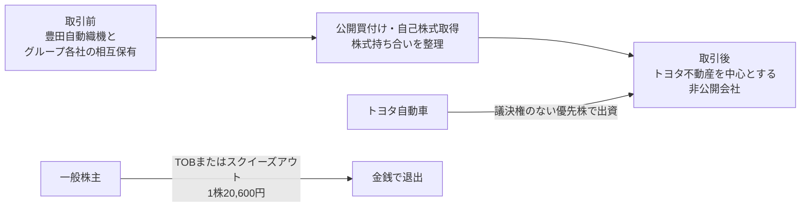

この再編によって、豊田自動織機と四社の持ち合いは解消された。ただし、資本関係が完全になくなったわけではない。トヨタ自動車は議決権を持たない優先株で出資し、トヨタグループとの事業連携はむしろ深める方針である。したがって、この案件を「系列構造が消滅した」と読むのは正確ではない。**相互保有を整理しながら、事業上の連携を別の資本設計で続ける再編**と見るべきだ。

## なぜ非公開化だったのか

会社側は、2026年に創業100年を迎えるなか、物流ソリューションや自動化、電動化などへの中長期投資を進めるには、非公開化による迅速な意思決定が有効だと説明した。四半期ごとの業績期待に過度に左右されず、トヨタグループ各社との連携を深め、成長投資を実行するという論理である。

この説明には合理性がある一方、上場会社を非公開化する際には、常にもう一つの問いが残る。**その成長の果実を、現在の少数株主が公正な価格で受け取れているか**という問いだ。非公開化後に大きな価値向上が見込まれるなら、その期待を公開買付価格にどこまで反映したかが重要になる。

## この案件を読む四つの視点

### 1. 上場維持の便益を継続的に検証する

グループ内に上場会社があること自体が問題なのではない。独立した資金調達、株式報酬、人材獲得、取引先からの信用、経営規律など、上場には固有の便益がある。一方で、親会社・主要株主との利益相反、意思決定の遅さ、少数株主保護のコストも生じる。

取締役会が検討すべきなのは、「昔から上場しているから維持する」ことではなく、上場を続ける便益が現在もコストを上回るかである。経済産業省のグループ・ガバナンス・システムに関する実務指針も、上場子会社等を持つ親会社に対し、上場維持の合理性を継続的に点検するよう求めている。

### 2. 価格の見直しは、手続が動いている証拠でもある

大型の非公開化では、最初の提案価格が最終価格になるとは限らない。特別委員会、第三者算定機関、株主からの意見、市場価格の推移、買収者との交渉を通じて条件が変わることがある。

価格が変更されたこと自体を、直ちに当初提案の失敗と読むべきではない。重要なのは、独立した立場から価格と条件を検討する仕組みがあり、交渉結果と判断理由が株主に開示されているかである。

### 3. 「グループの最適化」と「少数株主の利益」を分けて考える

グループ全体にとって望ましい再編が、対象会社の少数株主にとっても自動的に望ましいとは限らない。シナジーの帰属、将来の成長余地、保有資産の価値、政策保有株式の含み益などを、対象会社単独の価値として検討する必要がある。

このため、支配株主や主要な関係会社が関与する取引では、独立社外取締役を中心とする特別委員会が重要になる。特別委員会は、取引を成立させるための形式ではなく、対象会社と一般株主の立場から条件を交渉するための主体である。

### 4. 持ち合い解消と事業関係の継続は両立する

この案件は、株式を持ち合わなければ協力できないという前提を崩した。持ち合いを解消しても、共同開発、供給契約、技術連携、優先株など、別の契約と資本設計で協力関係を続けることはできる。

政策保有株式を説明する会社にとって、この点は重い。単に「取引関係の維持に必要」と述べるだけでは、なぜ契約や業務提携では足りず、普通株を保有し続ける必要があるのかという問いに答えられない。

## IR担当者が押さえるべき含意

1. **自社がグループ上場会社を持つ、または主要株主のいる上場会社であるなら、上場維持の便益を文書化する。** 資金調達、ブランド、人材、取引、経営規律の便益を具体化する。
2. **非公開化の検討が始まる前に、利益相反管理の手順を決める。** 特別委員会の構成、外部助言者の選定、情報管理、価格交渉の権限を平時から整理する。
3. **グループ全体のシナジーと、対象会社の単独価値を分けて説明する。** 少数株主が手放す価値を、グループ論だけで包み込まない。
4. **政策保有株式の代替手段を検討する。** 業務提携、長期契約、共同研究、優先株など、普通株の相互保有を使わずに関係を維持できないかを点検する。
5. **一つの案件を日本企業全体の結論にしない。** 豊田自動織機の非公開化は重要な先例だが、各社の上場維持判断は、事業、資本、株主構成によって異なる。

## 出典・参考資料

- 豊田自動織機「当社株式の非公開化（上場廃止）に関するお知らせ」: https://www.toyota-shokki.co.jp/investors/notice/
- 豊田自動織機「公開買付けの結果、及び非公開化に関するよくあるご質問」: https://www.toyota-shokki.co.jp/investors/delist-faq/
- トヨタ自動車ほか「豊田自動織機の非公開化で連携加速」（2025年6月3日）: https://global.toyota/jp/newsroom/corporate/42882869.html
- トヨタ不動産「公開買付条件の変更」（2026年3月6日）: https://www.toyotafudosan.com/news/20260306/
- JPX「上場廃止銘柄一覧（株式）」: https://www.jpx.co.jp/listing/stocks/delisted/
- 経済産業省「グループ・ガバナンス・システムに関する実務指針」: https://www.meti.go.jp/press/2019/06/20190628003/20190628003.html
- 経済産業省「公正なM&Aの在り方に関する指針」: https://www.meti.go.jp/policy/economy/keiei_innovation/keizaihousei/pdf/fairma-guidelines.pdf

---

**本テーマの前の記事:** [5.2 政策保有株式の最終局面――銘柄ごとの検証と開示](/governance/)

**本テーマの次の記事:** [5.4 未承諾買収をどう扱うか――2023年「企業買収における行動指針」](/governance/)

**他テーマの関連記事:**
- [1.2 メインバンク後の空白を、誰が埋めたのか](/governance/)
- [2.5 コードと指針――役割の違いと読み分け方](/governance/)
- [3.2 流通株式比率――政策保有株式の縮減を促した仕組み](/governance/)
- [5.2 政策保有株式の最終局面――銘柄ごとの検証と開示](/governance/)

---
## 未承諾買収をどう扱うか――2023年「企業買収における行動指針」

**SOURCE URL:** https://jpinv.com/governance/frontier/5.4-mbo-takeover-guidelines/

**記事要約**

経済産業省が2023年に公表した「企業買収における行動指針」は、経営陣の同意を得ていない買収提案も、提案内容と手続に即して検討するという考え方を明確にした。指針は、企業価値・株主共同の利益、株主意思、透明性という三原則を掲げ、取締役会に対して、真摯な提案を経営陣の好みだけで退けず、独立した検討と十分な情報提供を行うよう求める。2026年には、研究会が実務上の論点を「ポイント・Q&A」として整理した。

**本文**

> **要点**
> - 2023年指針は、未承諾買収を一律に有害とみなしていない。取締役会は、具体的な提案が企業価値と株主共同の利益に資するかを、正面から検討する必要がある。
> - 指針の三原則は、**企業価値・株主共同の利益の原則、株主意思の原則、透明性の原則**である。
> - 最終的に買収提案を受け入れるかどうかは株主の判断に委ねられる場面が多い。取締役会の役割は、比較可能な情報を整え、必要な交渉を行い、判断理由を説明することにある。

## 「敵対的」という言葉から離れる

従来、日本では、経営陣の同意を得ていない買収を「敵対的買収」と呼び、それだけで望ましくない取引であるかのように扱う傾向があった。しかし、経営陣にとって敵対的であることと、株主や会社にとって不利益であることは同じではない。

そこで2023年指針は、感情を伴う「敵対的」という表現よりも、対象会社の取締役会の同意を得ていない**未承諾買収**という事実に即した捉え方を採る。未承諾であっても、価格、資金の確実性、事業計画、従業員や取引先への影響、買収後の経営方針を検討した結果、企業価値を高める提案である可能性はある。反対に、友好的に始まった提案でも、条件が不公正なら株主にとって望ましくない。

## 三つの原則

| 原則 | 意味 |
| --- | --- |
| **企業価値・株主共同の利益の原則** | 買収の是非は、会社の持続的な企業価値と株主全体の利益に資するかで判断する |
| **株主意思の原則** | 会社の支配権に関わる判断では、合理的な情報と時間を与えられた株主の意思を尊重する |
| **透明性の原則** | 買収者と対象会社の双方が、株主の判断に必要な情報を適切に開示する |

三つの原則は、買収を促進するためのものでも、防衛策を否定するためのものでもない。買収者、対象会社取締役会、株主の役割を整理し、公正な判断過程をつくるための基準である。

## 取締役会は何をすべきか

未承諾の買収提案を受けた取締役会の実務は、次の流れで考えると分かりやすい。

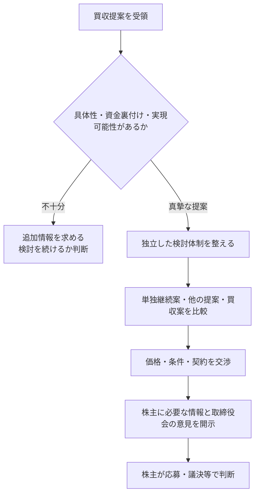

### 1. 真摯な提案かを見極める

提案価格だけでなく、資金調達の裏付け、買収後の事業計画、必要な許認可、取引完了の条件、買収者の実績を確認する。具体性の乏しい打診に、直ちに全社的な対応をする必要はない。一方、実現可能性のある提案を、経営陣の意向だけで無視することも適切ではない。

### 2. 独立した検討体制を整える

経営陣が買収によって地位を失う可能性がある場合、判断には利益相反が生じる。独立社外取締役を中心に検討し、必要に応じて特別委員会を設置する。特別委員会の要否は取引の性質によって異なるが、経営陣の利害が強いほど、独立した主体が価格交渉と判断に関与する必要性は高い。

### 3. 代替案と比較する

買収案は、現状維持との二択ではない。単独での中期計画、資本政策の変更、事業売却、他の買収者からの提案などと比較する。対象会社が「自社の計画の方が優れている」と主張するなら、計画の前提、実行可能性、時間軸を株主が比較できる形で示さなければならない。

### 4. 条件を交渉する

取締役会は、賛成か反対かを表明するだけではない。価格、買付期間、前提条件、従業員・取引先への対応、情報提供、契約上の拘束などについて、会社と株主にとってよりよい条件を求めて交渉する。

### 5. 株主に判断材料を出す

株主が判断するには、買収者の提案だけでなく、対象会社取締役会の分析、独立委員会の意見、価値算定の考え方、代替案が必要である。取締役会が反対する場合は、「企業文化に合わない」「長期志向ではない」といった抽象論では足りない。どの条件が企業価値を損なうのかを説明する。

## 2026年の「ポイント・Q&A」

経済産業省は2026年、公正な買収の在り方に関する研究会を再開し、2023年指針の考え方を実務に当てはめるための「ポイント・Q&A」を取りまとめた。新しい指針に置き換えたのではなく、2023年指針が引き続き妥当であることを確認しつつ、提案の検討、株主意思の確認、複数提案の比較などについて解釈を補ったものである。

実務上は、次の点が重要になる。

- 取締役会は、提案を受けた事実だけで直ちに公表するとは限らないが、株主判断に重要な段階に至れば適時・適切な開示が必要になる。
- 複数の提案がある場合、価格だけでなく、条件、実現可能性、時間、事業への影響を同じ基準で比較する。
- 買収者から情報を求められた場合、機密保持や競争上の懸念を考慮しつつ、提案を評価するための合理的な情報提供を検討する。
- 株主意思を確認する方法は一つではない。TOBへの応募、株主総会の議決、買収防衛策の発動に関する意思確認など、取引の形に応じて判断する。

## 買収防衛策はどう位置付けられるか

2023年指針は、買収防衛策を全面的に否定していない。ただし、防衛策は経営陣の保身のためではなく、株主が判断するための情報と時間を確保し、企業価値・株主共同の利益を守るために用いられるべきだとする。

防衛策を導入・発動する場合には、次の点が問われる。

1. 対象となる買収者や行為が明確か。
2. 必要性と相当性があるか。
3. 独立社外取締役が実質的に関与したか。
4. 株主意思を確認する仕組みがあるか。
5. 買収者に過度な不利益を与えず、競争提案を不当に排除していないか。

時間を稼ぐために無期限の情報要求を続けたり、買収者だけに達成困難な条件を課したりすれば、透明性と相当性を欠く。防衛策は「買収を止める仕組み」ではなく、「株主が十分な情報で判断できる場を整える仕組み」として設計する必要がある。

## IR担当者が押さえるべき含意

1. **未承諾提案を受けたときの連絡網を平時に作る。** CEO、取締役会議長、独立社外取締役、法務、IR、外部弁護士、FAの役割を決めておく。
2. **単独継続案を常に説明できる状態にする。** 買収提案が来てから急いで作った中期計画は説得力を欠く。資本コスト、事業ポートフォリオ、資本配分を日頃から明確にする。
3. **「友好的か、敵対的か」ではなく、条件と手続で評価する。** 経営陣との関係性を、株主への説明の中心にしない。
4. **独立社外取締役への情報提供を早める。** 利益相反が強い案件では、社外取締役が後から承認するだけでは足りない。提案評価と条件交渉の初期から関与させる。
5. **株主向け説明を二つの比較で組み立てる。** 買収案と単独継続案、そして必要に応じて他の提案を、同じ前提と時間軸で比較する。

## 出典・参考資料

- 経済産業省「企業買収における行動指針」（2023年8月31日）: https://www.meti.go.jp/press/2023/08/20230831003/20230831003.html
- 経済産業省「企業買収における行動指針」関連資料一覧: https://www.meti.go.jp/policy/economy/keiei_innovation/keizaihousei/fair-ma-rule/ma-guideline-publications.html
- 経済産業省「公正な買収の在り方に関する研究会」: https://www.meti.go.jp/shingikai/economy/kosei_baishu/index.html
- 経済産業省「公正な買収の在り方に関する研究会の再開について」（2026年2月3日）: https://www.meti.go.jp/press/2025/02/20260203001/20260203001.html
- 経済産業省「『企業買収における行動指針』のポイント・Q&A」（2026年7月30日）: https://www.meti.go.jp/press/2026/07/20260730002.html
- 経済産業省「公正なM&Aの在り方に関する指針」: https://www.meti.go.jp/policy/economy/keiei_innovation/keizaihousei/pdf/fairma-guidelines.pdf

---

**本テーマの前の記事:** [5.3 豊田自動織機の非公開化が示したもの――上場会社のグループ再編と少数株主保護](/governance/)

**本テーマの次の記事:** [5.5 SSBJ基準の実務――段階適用と準備の要点](/governance/)

**他テーマの関連記事:**
- [2.5 コードと指針――役割の違いと読み分け方](/governance/)
- [4.5 開示から実行へ――2026年4月の要請更新](/governance/)
- [5.3 豊田自動織機の非公開化が示したもの](/governance/)
- [5.7 スチュワードシップ・コード第三次改訂後の協働対話](/governance/)

---
## SSBJ基準の実務――段階適用と準備の要点

**SOURCE URL:** https://jpinv.com/governance/frontier/5.5-ssbj-sustainability/

**記事要約**

SSBJは2025年3月に日本のサステナビリティ開示基準を公表し、2026年3月に改正した。金融庁は2026年2月、プライム市場上場会社のうち5事業年度平均時価総額1兆円以上の会社に、SSBJ基準に従った有価証券報告書での開示を段階的に義務付ける制度を確定した。平均時価総額3兆円以上は2027年3月期から、1兆円以上は2028年3月期から適用される。本稿では、基準の構成、適用時期、二段階開示、Scope 3の取扱い、保証制度の準備を整理する。

**本文**

> **要点**
> - SSBJ基準は、**「サステナビリティ開示基準の適用」「一般開示基準」「気候関連開示基準」**の三本で構成される。2025年3月5日に公表され、2026年3月13日に改正された。
> - プライム市場上場会社のうち、5事業年度平均時価総額が3兆円以上の会社は2027年3月期から、1兆円以上の会社は2028年3月期から、SSBJ基準に従う法定開示が必要になる。
> - 適用初年度と翌年度には、一定の情報を後から訂正報告書で追加する**二段階開示**が認められる。Scope 3排出量には、推論過程と社内手続を具体的に開示した場合のセーフハーバーも設けられた。

## SSBJ基準は何でできているか

サステナビリティ基準委員会（SSBJ）が公表した基準は、次の三本で構成される。

| 基準 | 主な役割 |
| --- | --- |
| **サステナビリティ開示基準の適用** | 報告企業、適用範囲、重要性、比較情報、表示、経過措置など、基準全体に共通する事項を定める |
| **一般開示基準** | サステナビリティ関連のリスクと機会について、ガバナンス、戦略、リスク管理、指標・目標を開示する枠組みを定める |
| **気候関連開示基準** | 気候関連のリスクと機会、シナリオ分析、温室効果ガス排出量、移行計画、目標などを定める |

三本はいずれも2025年3月5日に公表され、2026年3月13日に改正された。さらに2026年6月には、温対法のSHK制度で測定・報告する温室効果ガス排出量を気候関連開示に用いる場合の実務対応基準が公表された。

SSBJ基準は、ISSBのIFRS S1・S2との整合を重視しているが、日本の法制度や実務に合わせた差異もある。海外でISSB準拠の報告を行っている会社でも、日本の有価証券報告書にそのまま転記すれば足りるとは限らない。SSBJ基準の要求事項と、金融庁の開示府令による追加記載を分けて確認する必要がある。

## 誰に、いつから適用されるか

2026年2月に確定した内閣府令は、東証プライム市場上場会社のうち、**平均時価総額が1兆円以上**の会社にSSBJ基準を義務付ける。平均時価総額は、対象年度の前年度末と、その前4事業年度末の時価総額の平均で判定する。

| 対象会社 | 適用開始 |
| --- | --- |
| 2026年3月期末を基準とした平均時価総額が**3兆円以上** | 2027年3月31日以後に終了する事業年度の有価証券報告書等 |
| 平均時価総額が**1兆円以上** | 2028年3月31日以後に終了する事業年度の有価証券報告書等 |
| 平均時価総額が1兆円未満 | 現行の内閣府令ではSSBJ基準による義務適用の対象外 |

上場後5事業年度が経過していない会社は、経過した事業年度の各期末時価総額の平均で判定する。

[要確認: 平均時価総額5,000億円以上1兆円未満のプライム市場上場会社については、金融審議会の中間整理で2029年3月期からの適用が基本案として示されたが、2026年8月時点で当該層の適用開始は内閣府令上まだ確定していない。]

## 有価証券報告書には何を書くか

対象会社は、有価証券報告書の「サステナビリティに関する考え方及び取組」に、SSBJ基準に従った情報を記載する。加えて、開示府令は次の事項も求める。

- SSBJ基準に準拠している旨
- 二段階開示や基準上の経過措置を利用している場合、その適用状況
- 将来情報の見積りや前提に用いた推論過程
- Scope 3温室効果ガス排出量の算定方法、前提、推論過程
- 将来情報やScope 3情報を作成・確認する社内の開示手続
- 半期報告書で確定値を示す場合、前年度の見積値との差異

ここで重要なのは、サステナビリティ部門だけで作る任意報告書ではなくなることだ。有価証券報告書に入る以上、財務報告と同じ開示統制、取締役会の監督、監査役等の確認、経営者の責任が伴う。

## 二段階開示

適用初年度とその翌年度については、SSBJ基準に従って記載すべき情報の一部を有価証券報告書の提出時点で記載せず、翌期の半期報告書の提出期限までに訂正報告書を提出して補うことができる。

この二段階開示は、情報収集に時間がかかるScope 3や海外子会社データに対応するための経過的な仕組みである。提出期限を先延ばしにする制度ではない。初回の有価証券報告書には、何を二段階開示とするのか、どのような理由で後日追加するのかを明確にし、訂正報告書までの工程を管理する必要がある。

実務では、次の三分類が有効である。

1. **有価証券報告書提出時に確定できる情報**――ガバナンス体制、戦略、主要リスク、目標、Scope 1・2など。
2. **合理的な見積りで開示する情報**――将来見通し、シナリオ分析、データ未確定の排出量。
3. **二段階開示で後日補う情報**――海外子会社やバリューチェーンからの回収に時間を要し、提出時点で合理的な値を作れないもの。

## Scope 3のセーフハーバー

Scope 3排出量は、取引先や顧客のデータ、業界平均、推計係数などに依存するため、後から数値が変わりやすい。金融庁は、差異が生じる要因、推論過程、社内の開示手続を一般に合理的と考えられる範囲で具体的に記載していれば、結果として数値に差異が生じても、直ちに虚偽記載等の責任を負うものではないという考え方を明示した。

セーフハーバーは、粗い数値を無条件に許す制度ではない。むしろ、**どのデータを使い、何を推計し、誰が確認したかを説明すること**が前提である。IR担当者にとっては、算定値そのものだけでなく、算定プロセスを開示できる状態にすることが重要になる。

## 保証制度はどこまで決まっているか

サステナビリティ情報の保証については、金融審議会で、限定的保証を段階的に導入する方向が示されている。平均時価総額3兆円以上の会社については、SSBJ基準の適用開始から1年後となる2028年3月期からの保証開始を軸に検討が進んでいる。初期には、Scope 1・2排出量とガバナンス・リスク管理など、対象を限定する案が示されている。

[要確認: 2026年8月時点では、保証業務の担い手、登録・監督、保証範囲の拡大時期など、制度の全体は法令として最終確定していない。最新の金融審議会資料と法令改正を確認する必要がある。]

したがって、会社は保証制度の確定を待つべきではない。第三者が検証できる証憑、データの責任者、変更履歴、連結範囲、見積りの承認手続を、開示初年度から整えておく必要がある。

## 準備を五つの作業に分ける

| 作業 | 具体的な確認 |
| --- | --- |
| 適用判定 | 5事業年度平均時価総額を毎期計算し、適用年度を確定する |
| 差異分析 | 現行の統合報告書、TCFD開示、CDP回答とSSBJ要求事項を照合する |
| データ整備 | Scope 1・2・3、財務影響、移行計画、目標のデータ所有者を決める |
| 開示統制 | 算定、レビュー、経営承認、取締役会監督、訂正の手順を文書化する |
| 保証対応 | 証憑、システム権限、監査証跡、外部保証人との事前対話を整える |

とくに難しいのは、サステナビリティ情報と財務諸表の接続である。気候リスクを重要と説明しながら、減損テスト、耐用年数、引当金、設備投資計画に反映していなければ、投資家は整合性を問う。サステナビリティ開示を独立した報告作業にせず、事業計画と会計判断に結び付ける必要がある。

## IR担当者が押さえるべき含意

1. **まず適用年度を確定する。** 単年度の時価総額ではなく、5事業年度平均で判定する。経理、法務、IRで共通の計算表を持つ。
2. **SSBJ基準と開示府令を別々に確認する。** 基準への準拠だけでは、有価証券報告書の追加記載を満たさない場合がある。
3. **二段階開示は、計画的な経過措置として使う。** 毎年同じ情報を後回しにする運用にしない。初年度からデータ回収の恒久化計画を示す。
4. **Scope 3は数字よりプロセスを固める。** データ源、推計方法、判断、承認、変更履歴を説明できれば、数値の不確実性を適切に伝えられる。
5. **保証を見据えて証跡を残す。** 任意開示の時代に使っていた手作業の表計算だけでは足りない。財務報告に近い内部統制をつくる。

## 出典・参考資料

- SSBJ「サステナビリティ開示基準」: https://www.ssb-j.jp/jp/ssbj_standards.html
- SSBJ「サステナビリティ開示基準の公表」（2025年3月5日）: https://www.ssb-j.jp/jp/ssbj_standards/2025-0305.html
- SSBJ「適用にあたっての関連情報」: https://www.ssb-j.jp/jp/ssbj_standards/reference.html
- SSBJ「ハンドブック」: https://www.ssb-j.jp/jp/related_information/handbooks/fundamental.html
- 金融庁「開示府令等の改正及びパブリックコメントの結果」（2026年2月20日）: https://www.fsa.go.jp/news/r7/shouken/20260220/20260220.html
- 金融庁「サステナビリティ情報の開示に関する情報」: https://www.fsa.go.jp/policy/kaiji/sustainability-kaiji.html
- 金融庁「サステナビリティ情報の開示と保証のあり方に関するワーキング・グループ」: https://www.fsa.go.jp/singi/singi_kinyu/sustainability_disclose_wg/

---

**本テーマの前の記事:** [5.4 未承諾買収をどう扱うか――2023年「企業買収における行動指針」](/governance/)

**本テーマの次の記事:** [5.6 「2030年30%」を実現するには――女性役員候補をどう育てるか](/governance/)

**他テーマの関連記事:**
- [2.3 2021年改訂――プライム市場・サステナビリティ・多様性](/governance/)
- [4.2 WACC・ROIC・エクイティ・スプレッド――資本コスト経営の基本用語](/governance/)
- [5.1 日英同時開示は始まりにすぎない――2025年4月の義務化](/governance/)
- [5.6 「2030年30%」を実現するには――女性役員候補をどう育てるか](/governance/)

---
## 「2030年30%」を実現するには――女性役員候補をどう育てるか

**SOURCE URL:** https://jpinv.com/governance/frontier/5.6-board-diversity-30-by-30/

**記事要約**

東証プライム市場上場会社には、2030年までに女性役員比率30%以上を目指すことが「望まれる事項」として示されている。2025年の女性役員比率は17.7%まで上昇し、女性役員が一人もいない会社は2.5%まで減った。一方、係長相当職24.4%、課長相当職15.9%、部長相当職9.8%という管理職層の構成をみると、社内から将来の役員候補を継続的に生み出す基盤はなお細い。本稿では、目標の法的位置付け、数字の読み方、候補者層を育てる実務を整理する。

**本文**

> **要点**
> - 「2030年までに女性役員比率30%以上」は、法定クオータではない。2023年10月から、東証の企業行動規範における**望まれる事項**として位置付けられている。
> - 2025年、プライム市場上場会社の女性役員比率は17.7%、女性役員が一人もいない会社は2.5%となった。
> - 問題は取締役候補の最終選考だけではない。女性比率は係長相当職24.4%、課長相当職15.9%、部長相当職9.8%と上位職ほど低く、役員候補となる層を中長期で厚くする必要がある。

## 30%目標の位置付け

政府は「女性版骨太の方針2023」で、プライム市場上場会社について次の目標を掲げた。

- 2025年を目途に、女性役員を一人以上選任する。
- 2030年までに、女性役員比率30%以上を目指す。
- 目標達成に向けた行動計画の策定を推奨する。

東証は2023年10月10日、これらを有価証券上場規程の企業行動規範にある「望まれる事項」として取り込んだ。したがって、30%は法律上の強制割当でも、未達なら直ちに上場廃止となる数値でもない。しかし、プライム市場に期待される行動として公表されており、投資家は取締役会構成と候補者育成を評価する際の基準として使う。

「役員」の定義にも注意が必要である。政府の集計には、取締役、監査役、執行役に加え、各社が目標の対象に含めた一定の執行役員等が含まれる場合がある。自社の目標を開示するときは、分子と分母に誰を含めるのかを明記しなければ、他社比較ができない。

## 2025年の現在地

| 指標 | 現状 | 2030年の目標 |
| --- | --- | --- |
| プライム市場上場会社の女性役員比率 | **17.7%**（2025年） | **30%以上** |
| 女性役員が一人もいないプライム会社 | **2.5%**（2025年） | 一人以上の選任を定着させる |
| 全上場会社の女性役員比率 | **14.0%**（2025年） | 20% |
| 女性役員目標と行動計画をともに策定する上場会社 | **5.9%**（2025年） | 30% |

女性役員が一人もいない会社を減らす段階は、かなり進んだ。次の課題は、一人を選任して終わるのではなく、取締役会全体の構成を変え、30%へ近づけることだ。

例えば、取締役会が10人なら女性3人、12人なら4人が30%以上となる。任期が1年で毎年改選する会社でも、候補者探索、本人の準備、社内外の調整には時間がかかる。2030年の定時株主総会から逆算すれば、2026年から2028年にかけて、複数年の選任計画を具体化する必要がある。

## 本当の課題は、候補者層の厚み

役員候補は、突然生まれない。内部昇進を重視する会社では、部長、執行役員、事業責任者、海外拠点責任者、CFO候補など、経営経験を積む機会が役員候補の母集団をつくる。

2024年の民間企業における女性比率は、係長相当職24.4%、課長相当職15.9%、部長相当職9.8%だった。職位が上がるほど比率が下がっており、社内候補だけで短期間に30%を達成しようとすると、特定の少数者に社外取締役や委員会の役割が集中する可能性がある。

この課題は、採用人数だけでは解決しない。誰に収益責任を持たせるか、海外経験を与えるか、M&Aや事業再編を任せるか、経営会議に参加させるかという**経験の配分**が重要である。

## 取締役会の多様性と社内の人材戦略をつなぐ

2026年改訂版コーポレートガバナンス・コードは、多様性をジェンダーだけでなく、国際性、経歴（中途採用を含む）、年齢、文化的背景などを含むものとして捉えている。また、2026年2月の開示府令改正により、有価証券報告書では、連結ベースの企業戦略と関連付けた人材戦略、従業員給与等の決定方針、平均給与の増減など、人的資本開示も拡充された。

このため、女性役員比率を独立した数値目標として扱うより、次の一本の流れで示す方が説得力がある。

1. 会社の戦略に必要な取締役会の知識・経験を定義する。
2. 現在の取締役会で不足する経験をスキルマトリックスで特定する。
3. 社内の女性管理職・執行役員候補に、必要な経験を与える。
4. 社内だけで不足する場合は、社外候補を計画的に探索する。
5. 毎年、取締役会構成と候補者育成の進捗を開示する。

女性であることだけを理由に候補者を選ぶのではない。会社の戦略に必要な能力を持つ候補者を広く探し、その探索と育成の過程で、従来見落とされていた女性人材へのアクセスを広げるのである。

## 行動計画に入れるべき項目

| 項目 | 開示・運用の例 |
| --- | --- |
| 現在地 | 女性役員比率、女性管理職比率、各職位の人数、定義 |
| 目標 | 2030年の役員比率だけでなく、2027年・2028年の中間目標 |
| 取締役会の改選計画 | 任期満了、退任予定、取締役会の適正規模との関係 |
| 社内候補の育成 | 事業責任、海外、財務、デジタル、M&Aなどの経験付与 |
| 社外候補の探索 | 候補者データベース、サーチ会社、他業界人材の活用 |
| 環境整備 | 長時間労働、転勤、育児・介護、再登用、柔軟な勤務制度 |
| 監督 | 指名委員会と取締役会が、年何回、どの指標を確認するか |

とくに重要なのは、中間目標である。「2030年に30%」だけでは、2029年まで先送りできてしまう。2027年、2028年の取締役候補者名簿と、各候補が不足する経験をどう補うかまで落とし込む必要がある。

## よくある三つの誤り

### 1. 社外取締役だけで数字を作る

社外取締役の登用は重要だが、社内の執行側が変わらなければ、経営人材の多様化は進まない。社内取締役、執行役員、事業責任者の構成も同時に見る。

### 2. 管理職比率と役員比率を同じものとして扱う

役員比率は取締役会構成の指標、管理職比率は人材育成の指標である。時間軸も母集団も違う。両方を開示し、どうつながるかを説明する。

### 3. 「適任者がいない」で終える

適任者がいないなら、なぜいないのかを分析する。採用、配属、評価、転勤、育児との両立、重要ポストへの登用のどこで候補者が減っているかを示し、是正策を設ける。

## IR担当者が押さえるべき含意

1. **30%目標の分母と対象役職を明記する。** 政府統計と自社開示で定義が違う場合、その差を説明する。
2. **2030年から逆算した改選表を作る。** 取締役の任期、退任、増減員を反映し、各年の必要候補者数を示す。
3. **女性管理職比率を、役員候補の先行指標として扱う。** とくに部長、執行役員、事業責任者の数と経験を追う。
4. **指名委員会の役割を開示する。** 候補者探索、育成計画、外部サーチ、進捗確認にどう関与するかを具体化する。
5. **数値だけでなく、経験の配分を説明する。** 重要事業、海外、財務、デジタル、M&Aを誰に任せているかが、候補者層の実態を示す。

## 出典・参考資料

- 内閣府男女共同参画局「女性役員情報サイト」: https://www.gender.go.jp/policy/mieruka/company/yakuin.html
- 内閣府「女性活躍・男女共同参画の重点方針2023」関連解説: https://www.gender.go.jp/public/kyodosankaku/2023/202402/202402_02.html
- 内閣府「共同参画 2026年5月号」: https://www.gender.go.jp/public/kyodosankaku/2026/202605/202605_02.html
- 内閣府「令和8年版男女共同参画白書」: https://www.gender.go.jp/about_danjo/whitepaper/r08/zentai/html/honpen/b1_s01_04.html
- 金融庁・東証「コーポレートガバナンス・コード（2026年改訂版）」: https://www.fsa.go.jp/singi/follow-up/index.html
- 金融庁「人的資本開示を含む開示府令等の改正」（2026年2月20日）: https://www.fsa.go.jp/news/r7/shouken/20260220/20260220.html

---

**本テーマの前の記事:** [5.5 SSBJ基準の実務――段階適用と準備の要点](/governance/)

**本テーマの次の記事:** [5.7 スチュワードシップ・コード第三次改訂後の協働対話](/governance/)

**他テーマの関連記事:**
- [2.3 2021年改訂――プライム市場・サステナビリティ・多様性](/governance/)
- [2.4 コーポレート・ガバナンス報告書を15分で読む方法](/governance/)
- [5.5 SSBJ基準の実務――段階適用と準備の要点](/governance/)
- [5.8 次の制度改正を読む――ガバナンス関連会議・研究会の全体像](/governance/)

---
## スチュワードシップ・コード第三次改訂後の協働対話

**SOURCE URL:** https://jpinv.com/governance/frontier/5.7-activism-engagement-2025/

**記事要約**

金融庁は2025年6月、日本版スチュワードシップ・コードの第三次改訂版を確定した。改訂の中心は、実質株主の透明性を高めることと、複数の機関投資家による協働対話を建設的な対話の手段として位置付けることにある。さらに、2024年の金融商品取引法改正を受け、共同保有者や重要提案行為等の解釈が整理され、2026年5月から適用された。本稿では、発行会社が協働対話をどう受け止め、どのような社内手順を整えるべきかを解説する。

**本文**

> **要点**
> - 2025年6月の第三次改訂は、**実質株主の透明性**と**協働対話**を主要論点とした。既存の署名機関には、2025年末までに改訂版への対応方針を更新することが求められた。
> - 複数投資家が同じ会社と対話することが、直ちに金融商品取引法上の共同保有者になることを意味するわけではない。合意の継続性、共同して重要提案行為等を行う目的など、具体的な関係で判断される。
> - 発行会社は、協働対話を一律に拒むのではなく、参加者、目的、議題、権限、情報管理を確認したうえで、通常の株主対話として受け止める体制を整える必要がある。

## 第三次改訂で何が変わったか

日本版スチュワードシップ・コードは2014年の策定後、2017年、2020年、2025年に改訂された。第三次改訂では、対話の実効性を高めるため、二つの論点が前面に出た。

### 1. 実質株主の透明性

株主名簿に記載される名義株主と、投資判断・議決権行使を行う実質株主が異なる場合、発行会社は誰と対話すべきか分からないことがある。改訂版は、投資先企業から保有状況の説明を求められた場合にどう対応するかについて、機関投資家が方針を公表することを促した。

これは、会社がすべての投資家の詳細を無条件で把握できる制度ではない。カストディ、信託、運用委託などの構造を踏まえ、建設的な対話に必要な範囲で、誰が投資判断を担い、誰が議決権行使方針を決めるのかを明らかにする方向である。

### 2. 協働対話

一社の投資家だけでは企業に十分な問題意識を伝えにくい場合、複数の機関投資家が共通の論点について共同で対話することがある。第三次改訂は、協働対話を、状況に応じて有効なスチュワードシップ活動になり得るものとして明確に位置付けた。

協働対話は、アクティビストだけの手法ではない。長期運用会社、年金、ESG投資家などが、気候変動、取締役会の実効性、政策保有株式、資本配分といった共通課題について意見を伝える場合にも使われる。

## 大量保有報告制度との関係

機関投資家が協働対話をためらってきた理由の一つに、複数投資家が「共同保有者」とみなされ、大量保有報告制度上の合算や報告義務が生じるのではないかという懸念があった。

2024年の金融商品取引法改正と、その後の政令・内閣府令・Q&Aの整理により、協働対話と共同保有者の関係が明確化された。制度は2026年5月1日から適用されている。

| 論点 | 実務上の考え方 |
| --- | --- |
| 同じ会議に出席した | それだけで直ちに共同保有者になるわけではない |
| 共通の問題意識を伝えた | 継続的な合意や共同で重要提案行為等を行う目的がなければ、直ちに共同保有とは限らない |
| 議決権行使を共同で約束した | 合意内容と継続性によっては共同保有者に該当し得る |
| 経営支配に重要な変更を共同で求める | 「重要提案行為等」に該当するかを個別に確認する必要がある |

したがって、協働対話が自由になったと単純化するのも、すべて共同保有になると恐れるのも正しくない。投資家側は、対話の目的、合意の有無、議決権行使の独立性を記録する必要がある。発行会社側も、法的な分類を自ら決めつけるのではなく、対話の実態を確認すべきである。

## 発行会社はどう受け止めるか

協働対話の申し入れを受けたら、次の五点を確認する。

1. **参加者。** どの運用会社、アセットオーナー、助言者が参加するのか。
2. **目的。** 情報収集、意見交換、特定の改善要請、株主提案の検討など、何を目的としているか。
3. **議題。** 資本配分、取締役会、気候、政策保有株式など、具体的な論点は何か。
4. **権限。** 参加者は各機関を代表して発言するのか。議決権行使判断は各社が独立して行うのか。
5. **情報管理。** 未公表の重要事実を扱わないこと、会議記録の扱い、参加者間の共有範囲をどうするか。

これらを確認したうえで、通常の投資家対話と同じように、会社側の出席者と回答方針を決める。議題が取締役会の構成やCEO後継者計画であれば、IRと経営陣だけでなく、取締役会議長や筆頭独立社外取締役の参加を検討する。資本配分や事業ポートフォリオであれば、CFOや経営企画が中心になる。

## 実質株主からの照会に備える

第三次改訂は投資家側の方針開示を促すものだが、発行会社側にも準備が必要である。株主判明調査を外部業者に任せるだけでなく、次の情報を社内で一元管理する。

- 株主名簿上の名義
- 判明している実質株主と運用担当者
- 保有方針、投資期間、議決権行使方針
- 過去の面談、質問、要望、会社の回答
- 協働対話への参加履歴
- 大量保有報告書、変更報告書、議決権行使結果との整合

投資家が保有状況の説明に応じない場合でも、直ちに対話を拒絶するべきではない。法令、契約、顧客守秘義務などの制約があり得る。会社が本当に必要とする情報――対話主体、投資判断者、議決権行使者――を絞って尋ねる方がよい。

## 対話の質を落とさないための原則

協働対話では、参加者が増えるほど会話が一般論に流れやすい。発行会社は、次の三つを意識する。

### 同じ資料を読み上げない

決算説明資料の再説明だけでは、協働対話の意味がない。投資家がなぜ共同でその論点を選んだのかを聞き、会社の判断と投資家の懸念がどこでずれているかを特定する。

### 未公表情報を個別に渡さない

複数投資家が参加しても、選択的開示のリスクは変わらない。未公表の業績、M&A、資本政策、取締役人事などは共有しない。必要な情報は適時開示や公表資料で市場全体に出す。

### 回答を取締役会につなぐ

重要な指摘は、面談記録に留めず、取締役会または所管委員会へ報告する。会社が採用しなかった意見についても、理由を説明できるようにする。対話は投資家の要望に従う場ではなく、取締役会の判断材料を増やす場である。

## IR担当者が押さえるべき含意

1. **協働対話の窓口を一本化する。** 申し入れの受付、参加者確認、社内配布、記録、回答の責任者を決める。
2. **一律拒否もしなければ、無条件受入れもしない。** 目的、議題、参加者、情報管理を確認したうえで、適切な出席者を選ぶ。
3. **共同保有者かどうかを、会議形式だけで判断しない。** 合意内容、継続性、議決権行使、重要提案行為等の目的で決まる。
4. **実質株主情報を対話履歴と結び付ける。** 名寄せした株主名簿を作るだけでなく、誰がどの論点に関心を持つかを記録する。
5. **対話結果を取締役会へ戻す。** どの意見を採用し、どの意見を採用しなかったか、その理由を次回の開示や面談で説明する。

## 出典・参考資料

- 金融庁「スチュワードシップ・コード（第三次改訂版）の確定について」（2025年6月26日）: https://www.fsa.go.jp/news/r6/singi/20250626.html
- 金融庁「スチュワードシップ・コードに関する有識者検討会」: https://www.fsa.go.jp/singi/stewardship/index.html
- 金融庁「スチュワードシップ・コード改訂案の公表」（2025年3月21日）: https://www.fsa.go.jp/news/r6/singi/20250321-3.html
- 金融庁「大量保有報告制度における『重要提案行為等』『共同保有者』に関する法令・Q&A等の整理」: https://www.fsa.go.jp/news/r7/shouken/20250826.html
- 金融庁「スチュワードシップ活動の実質化に向けた取組」: https://www.fsa.go.jp/policy/pjlamc/20260724/01.pdf
- 金融庁「機関投資家の協働対話をめぐる法的論点」: https://www.fsa.go.jp/access/r5/246.html

---

**本テーマの前の記事:** [5.6 「2030年30%」を実現するには――女性役員候補をどう育てるか](/governance/)

**本テーマの次の記事:** [5.8 次の制度改正を読む――ガバナンス関連会議・研究会の全体像](/governance/)

**他テーマの関連記事:**
- [1.4 投資家側を変えたスチュワードシップ・コード](/governance/)
- [2.4 コーポレート・ガバナンス報告書を15分で読む方法](/governance/)
- [4.5 開示から実行へ――2026年4月の要請更新](/governance/)
- [5.4 未承諾買収をどう扱うか](/governance/)

---
## 次の制度改正を読む――ガバナンス関連会議・研究会の全体像

**SOURCE URL:** https://jpinv.com/governance/frontier/5.8-working-groups-landscape/

**記事要約**

日本のガバナンス制度は、金融庁、東証、経済産業省、法務省、SSBJがそれぞれ所管する会議・研究会を通じて形成される。2026年にはコーポレートガバナンス・コード改訂が完了し、SSBJ基準の法定適用や買収指針の実務整理も進んだ。一方、サステナビリティ保証、会社法制、法定開示の見直しなどは引き続き検討中である。本稿では、すでに結論が出た制度と、これから追うべき検討を分け、IR担当者のための実務地図として整理する。

**本文**

> **要点**
> - 制度動向を追うときは、**改訂が完了した会議、実施状況を点検する会議、現在も制度設計を行う会議**を分ける。
> - 2026年7月、コーポレートガバナンス・コード改訂は確定し、東証で適用が始まった。したがって、改訂有識者会議を「今後のルールを作る会議」として追う段階は終わっている。
> - 今後の重要論点は、サステナビリティ保証、会社法制、法定開示、東証の市場区分・資本コスト施策、買収実務の定着である。

## まず、三つの状態に分ける

政策会議の一覧は、数を増やすほど分かりにくくなる。実務では、各会議を次の三つに分類するとよい。

1. **制度改正を終えた会議。** 最終文書や法令が出ており、会社側は実装段階にある。
2. **実施状況を点検する会議。** 新しい条文を作るより、既存制度が実質的に機能しているかを確認する。
3. **制度設計を続ける会議。** 中間整理、公開草案、法案など、今後の義務を生む可能性がある。

2026年8月時点の主要な流れは、次のとおりである。

| 政策の流れ | 所管 | 現在の状態 | 直近の成果 | 次に確認すること |
| --- | --- | --- | --- | --- |
| コーポレートガバナンス・コード改訂 | 金融庁・東証 | **完了・実装** | 2026年7月21日に改訂版確定、東証で適用開始 | 自社CG報告書、取締役会運営、政策保有、人材戦略への反映 |
| 両コードのフォローアップ | 金融庁・東証 | **実施状況の点検** | アクション・プログラム2025 | 改訂コードとスチュワードシップ実務の定着状況 |
| 市場区分・資本コスト・グロース市場 | 東証 | **継続的な点検・運用** | 資本コスト要請の更新、グロース市場の新基準、TOPIX改革 | 開示の質、実行、上場維持、指数移行 |
| 法定開示制度 | 金融庁・金融審議会 | **制度設計中** | 有価証券報告書、人的資本、サステナビリティ開示の改正 | 総会前開示、英文開示、記述情報の追加見直し |
| サステナビリティ開示・保証 | 金融庁・金融審議会 | **開示は一部確定、保証は検討継続** | SSBJ基準の段階適用を法制化 | 保証対象、開始時期、保証業務の担い手と監督 |
| 買収実務 | 経済産業省 | **指針確定・実務整理** | 2023年指針、2026年「ポイント・Q&A」 | 市場実務、裁判例、TOB制度との接続 |
| 会社法制 | 法務省・法制審議会 | **制度設計中** | 会社法制部会で中間試案を検討 | 実質株主、株主総会、株式制度、企業統治の法改正 |
| SSBJ基準開発 | SSBJ | **基準保守・実務支援** | 2025年基準、2026年改正、実務対応基準 | 実務解説、ISSB改訂への対応、追加テーマ基準 |

## 1. 2026年コーポレートガバナンス・コード改訂――すでに実装段階

コーポレートガバナンス・コードの改訂に関する有識者会議は、翁百合氏を座長として2025年10月から議論を行い、2026年4月に改訂案を公表した。パブリックコメントを経て、2026年7月21日に改訂版が確定した。東証も同日、改訂コードの適用を開始した。

したがって、IR担当者が今読むべきなのは、会議の将来予測ではなく、次の文書である。

- 2026年改訂版コード本文
- 改訂前からの変更点
- 改訂の趣旨と概要
- パブリックコメントへの回答
- 取締役会の機能強化に関する事例集2026

改訂の内容をCG報告書に反映するだけでなく、取締役会資料、指名・報酬委員会、政策保有株式の検証、人材戦略、成長投資の監督まで見直す必要がある。

## 2. フォローアップ会議――制度の「実質」を見る

金融庁と東証の「スチュワードシップ・コード及びコーポレートガバナンス・コードのフォローアップ会議」は、2015年以降、両コードの実施状況を確認し、意見書やアクション・プログラムを公表してきた。

直近の正式なアクション・プログラムは2025年版である。2026年改訂コードが確定した後は、条文をさらに増やすことより、取締役会が成長投資や経営資源配分を実質的に監督しているか、投資家との対話が意思決定に反映されているかが焦点になる。

会議資料を読む際は、会社名の挙がる好事例だけでなく、課題として整理された項目を見る。そこに、翌年の東証資料、金融庁レビュー、次回改訂の種が現れる。

## 3. 東証の市場区分フォローアップ――上場後の行動を変える

東証の「市場区分の見直しに関するフォローアップ会議」は、市場再編後の上場維持基準、資本コストや株価を意識した経営、英文開示、グロース市場、指数改革などを扱う。

この会議の特徴は、法律を作らずに上場会社の行動を変える点にある。要請、公表リスト、事例集、上場維持基準、段階的移行を組み合わせる。IR担当者は、ニュースリリースだけでなく、会議資料と東証の「今後の対応」を合わせて読むべきである。

## 4. 金融審議会の情報開示ワーキング・グループ――有価証券報告書の次を作る

情報開示ワーキング・グループは、法定開示の制度設計を担う。2026年にも会合が続き、有価証券報告書、半期報告書、株主総会前開示、人的資本、政策保有株式、英文情報などの課題を扱っている。

この会議の資料が重要なのは、最終的に内閣府令や開示様式へ落ちる可能性があるからだ。コードの議論が原則を示すのに対し、情報開示WGは、誰が、いつ、どの様式で、何を記載するかを具体化する。

## 5. サステナビリティ情報の開示・保証WG――次の焦点は保証

SSBJ基準の法定適用については、2026年2月の内閣府令改正で、平均時価総額3兆円以上、1兆円以上のプライム会社の適用時期が確定した。一方、保証制度は検討が続いている。

今後確認すべき論点は、限定的保証の対象、開始年度、Scope 3の扱い、保証業務の担い手、品質管理、監督制度である。対象会社は制度確定を待たず、証憑と内部統制を整える必要がある。

## 6. 経済産業省の公正な買収の在り方に関する研究会――指針から実務へ

研究会は2026年に再開され、2023年「企業買収における行動指針」のポイントとQ&Aを2026年7月に公表した。現時点では、2023年指針を別の指針に置き換えたのではなく、実務上の疑問を整理した段階である。

IR・法務担当者は、今後の会議予定を予想するより、2023年指針と2026年Q&Aを自社の買収対応手順へ落とし込むべきである。未承諾提案の受付、特別委員会、情報開示、株主意思の確認を平時に設計する。

## 7. 法制審議会会社法制部会――会社法の土台を見直す

法務省の会社法制部会は2025年4月に第1回会合を開き、その後も審議を続けている。株主総会、株式、実質株主、企業統治など、会社法の基礎に関わる論点が対象となる。

会社法改正は、コードや東証要請より時間がかかる一方、成立すれば全株式会社に法的効果を持つ。中間試案、パブリックコメント、要綱案、法案という順に進むため、IR担当者は法務部門と役割を分け、株主との対話や総会運営に影響する論点を早めに把握する。

## 8. SSBJ――基準を公表した後も追う

SSBJは2025年に三本の基準を公表し、2026年に改正と実務対応基準を出した。基準設定主体の仕事は、公表で終わらない。ISSB基準の変更、国内法令との接続、実務上の質問、業種別の課題に応じて、参考情報、ハンドブック、実務対応基準を追加する。

対象会社は、金融庁の法令ページだけでなく、SSBJの基準ページ、議事概要、公開草案も追う必要がある。

## 制度ができるまでの読み方

日本のガバナンス制度は、概ね次の順で具体化する。

1. 政府方針やアクション・プログラムで課題が示される。
2. 有識者会議、研究会、ワーキング・グループで論点が整理される。
3. 中間整理、報告書、指針案、公開草案が公表される。
4. パブリックコメントを経て、コード、指針、内閣府令、東証規則が確定する。
5. FAQ、記載例、好事例、レビュー結果によって実務上の期待が具体化する。

最も早いシグナルは会議資料だが、会社が対応を確定すべきなのは最終文書である。検討段階の案を「決まったルール」として社内に伝えない。一方で、最終決定を待ってからデータや人材を整え始めると間に合わない。**制度の確度と準備の可逆性を分けて管理する**ことが重要だ。

## IR部門の月次確認表

| 頻度 | 確認するページ | 目的 |
| --- | --- | --- |
| 月次 | JPX「市場区分の見直しに関するフォローアップ会議」 | 資本コスト、上場維持、英文開示、グロース市場の更新 |
| 会合時 | 金融庁フォローアップ会議 | コード運用、対話、政策保有、取締役会の課題 |
| 会合時 | 金融審議会 情報開示WG | 有価証券報告書・半期報告書の制度改正 |
| 会合時 | サステナビリティ開示・保証WG | SSBJ適用と保証制度 |
| 四半期 | 経済産業省の企業統治・買収関連研究会 | 買収、グループガバナンス、取締役会実務 |
| 四半期 | 法制審議会会社法制部会 | 株主総会、実質株主、会社法改正 |
| 月次 | SSBJ基準・公開草案ページ | 基準改正、実務対応、解説資料 |

## IR担当者が押さえるべき含意

1. **「検討中」「確定」「施行済み」を資料ごとに明記する。** 社内説明で将来案と現行義務を混同しない。
2. **2026年改訂コードは、予測対象ではなく実装対象である。** 最新本文に照らし、CG報告書と取締役会実務を更新する。
3. **会議名より、成果物の法的性質を見る。** 意見書、指針、コード、内閣府令、東証規則では効力が違う。
4. **会議資料を先行指標に、最終文書を実行基準にする。** 早く準備しつつ、未確定事項に過剰投資しない。
5. **IR、法務、経理、サステナビリティ、人事で一つの制度台帳を持つ。** 同じ改正が複数部署の開示と取締役会運営にまたがるためである。

## 出典・参考資料

- 金融庁「スチュワードシップ・コード及びコーポレートガバナンス・コードのフォローアップ会議」: https://www.fsa.go.jp/singi/follow-up/index.html
- 金融庁「コーポレートガバナンス改革の実質化に向けたアクション・プログラム2025」: https://www.fsa.go.jp/news/r6/singi/20250630-1.html
- 金融庁・東証「コーポレートガバナンス・コード（2026年改訂版）」: https://www.fsa.go.jp/singi/follow-up/index.html
- 東証「改訂コーポレートガバナンス・コードの公表」（2026年7月21日）: https://www.jpx.co.jp/corporate/news/news-releases/1020/20260721-01.html
- 東証「市場区分の見直しに関するフォローアップ会議」: https://www.jpx.co.jp/equities/follow-up/
- 金融庁「金融審議会 情報開示ワーキング・グループ」: https://www.fsa.go.jp/singi/singi_kinyu/disclosure_wg/
- 金融庁「サステナビリティ情報の開示・保証のあり方に関するワーキング・グループ」: https://www.fsa.go.jp/singi/singi_kinyu/sustainability_disclose_wg/
- 経済産業省「公正な買収の在り方に関する研究会」: https://www.meti.go.jp/shingikai/economy/kosei_baishu/index.html
- 法務省「法制審議会会社法制部会」: https://www.moj.go.jp/shingi1/housei02_index.html
- SSBJ「サステナビリティ開示基準」: https://www.ssb-j.jp/jp/ssbj_standards.html

---

**本カリキュラムの次:** [IRツールボックス――JPX・金融庁・経済産業省・SSBJの一次資料を探す](/governance/toolbox/)

**本テーマの関連記事:**
- [5.1 日英同時開示は始まりにすぎない――2025年4月の義務化](/governance/)
- [5.2 政策保有株式の最終局面――銘柄ごとの検証と開示](/governance/)
- [5.3 豊田自動織機の非公開化が示したもの](/governance/)
- [5.4 未承諾買収をどう扱うか](/governance/)
- [5.5 SSBJ基準の実務――段階適用と準備の要点](/governance/)
- [5.6 「2030年30%」を実現するには](/governance/)
- [5.7 スチュワードシップ・コード第三次改訂後の協働対話](/governance/)

**他テーマの関連記事:**
- [2.5 コードと指針――役割の違いと読み分け方](/governance/)
- [4.5 開示から実行へ――2026年4月の要請更新](/governance/)
